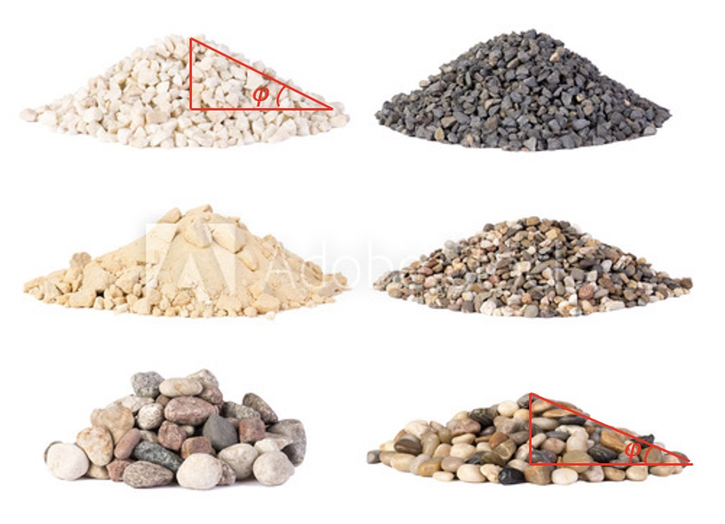

# Exercises: design an experiment to measure internal friction angle 

## Introduction

Angle of internal friction ($\phi$) is a measure of the ability of a unit of rock or soil to withstand a shear stress. It is the angle measured between the normal force and resultant force, that is attained when failure just occurs in response to a shearing stress. As discussed in the module 3.1 of the course, this parameter ($\phi$), combined with the cohesion strength ($C$), can predict whether a material is going to facture under certain stress conditions, a relationship known as the Coulomb-Mohr facture criterion. Based on this criterion, one can derive an important formula shown blow that describes the angle of internal friction and the orientation of the fracture ($\theta$):

$$
\phi = 45 ^\circ - \theta/2
$$

For example, most rocks have $\phi$ values of about 30&deg;, so the angle between $\sigma_1$ and the fracture of $\theta$ is also about 30&deg;. Thus, Andersonian normal and reverse faults (i.e., different direction of $\sigma_1$) dip at about 60&deg; and 30&deg;, respectively.	

Like many other mechanical properties of a material, this angle is also depended on the temperature, pressure, saturated conditions etc. The value of the angle of internal friction can be determined in the laboratory by the *Direct Shear Test* or the *Triaxial Stress Test*.

*Angle of repose of various gravel, stones and pebbles. [Image Source](https://stock.adobe.com/au/images/piles-of-various-gravel-stones-and-pebbels-isolated-on-white-background/210412352)*

## Exercise

In this exercise, you are going to select any granular material that you have to hand and design an experiment to measure the angle of repose for that material. In your own "lab", this angle of internal friction can be approximated by the angle of repose: materials placed in a pile to attain a conical shape with slopes (see Figure). 

There are many materials can be used to conduct this experiment, such as sugar, salt and flour in your kitchen, or soils, sands, pebbles in your yard. You can also surprise us by being creative! 

## Background

First of all, watch this video for some ideas about what we are going to ask you to do.

<iframe width="560" height="315" src="https://www.youtube.com/embed/7UM5R-oMBHc" title="Angle of Repose Experiments" frameborder="0" allow="accelerometer; autoplay; clipboard-write; encrypted-media; gyroscope; picture-in-picture" allowfullscreen></iframe>

---

The video below shows the kind of experiment that any of us can try at home - pouring a granular material onto a board and measuring (recording / photographing) the pile as it forms and varying the parameters of the experiment a little to understand what controls the measured values. 

<iframe width="560" height="315" src="https://www.youtube.com/embed/SIkRUv39SoI" title="Angle of Repose Demonstration" frameborder="0" allow="accelerometer; autoplay; clipboard-write; encrypted-media; gyroscope; picture-in-picture" allowfullscreen></iframe>

This [website](http://www.geotechdata.info/parameter/angle-of-friction) provides reference values of this angle for some common materials so that it can be used as a benchmark of your experiment. But as mentioned earlier, many other physical conditions such as temperature, humidity, water saturation etc can largely affect this property, thus these reported values can be different from yours by a bit. 

---

Note that some materials have *cohesion* which is what happens when there is still a bond between particles at zero confining pressure. If, for example, you use flour, you would need to sift it to make a pile. Materials that are left lying around will often start to develop cohesion as the particles cement together. If the materials are agitaged then they usually can be poured and will "freeze" to a slope with the angle of repose. The video of dry sand avalanching at the beach is an example of this:

<iframe width="560" height="315" src="https://www.youtube.com/embed/sOOPTZw7FcE" title="Angle of Repose at the Beach" frameborder="0" allow="accelerometer; autoplay; clipboard-write; encrypted-media; gyroscope; picture-in-picture" allowfullscreen></iframe>

## Assessment

 Perform a simple set of experiments to demonstrate that granular materials usually pour to form a cone with an angle that is a property of the material itself. You should repeat the experiment for at least two different materials. 
 
   1. Explain how you photograph / video the material so that you can measure the angle.
   2. How many times do you need to do this to demonstrate that the angle is the same each time ?  **Hint:** *if you have multiple materials, how many times do you need to do this to show that the angles are actually different ?*
   3. Verify that the angle is approximately independent of factors such as the size of the pile, the speed that the particles land ?
   
Write a very short experimental report (certainly no more than 2 pages) that introduces the topic, explains the materials you used (and why you chose them), the set-up of the experiment and how the measurements are made. Show your results in a table and estimate the errors. Discuss your results in comparison to the published values 

## Reference
Fossen, H. (2011). Structural geology. Cambridge university press.

Keaton J.R. (2017) Angle of Internal Friction. In: Bobrowsky P., Marker B. (eds) Encyclopedia of Engineering Geology. *Encyclopedia of Earth Sciences Series*. Springer, Cham. https://doi.org/10.1007/978-3-319-12127-7\_16-1.

