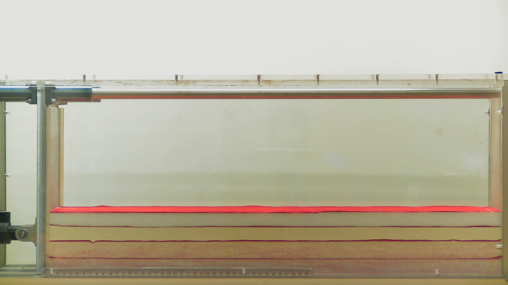
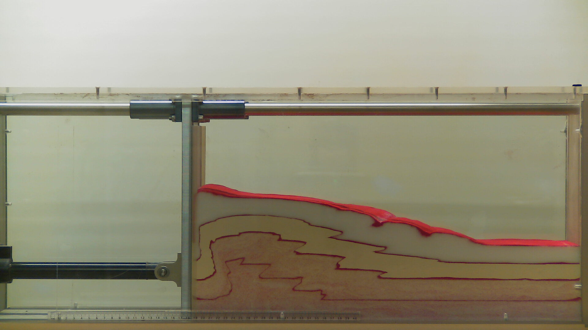

# Exercises: Build your own Mountain belt
## Analogue Sandbox in Compression.

The following exercice is based on Sandra McLaren teaching at The University of Melbourne.

## Introduction

Physical modeling of folding and faulting have been performed since the early days of Structural Geology.
The traditional way of performing analogue experiments is by filling a box with materials such as clay, sand, plaster, silicone putty, honey etc. and
to apply extension or contraction at the boundaries. Ideally the model geometry and physical properties of the material should be scaled proportionally.
The kinematics of the model should also be similar to the natural example, with comparable rates of deformation and mechanical properties.

It practice, it is impossible to scale all the parameters appropriately and some sort of compromises must be found.

**For a small physical model to realistically reproduce a natural example, we need to scale down the geometries and properties of the materials as best as we can.**

Analogue experiments remain extremely useful to understand the processes and their interaction. They allow us to develop our understanding of tectonic deformation mechanism and style observed in
natural systems.

In this practical we will run our own analogue modelling experiment to explore the controls on the structure and development of fold and thrust belts (the foreland of orogenic systems)

## Learning outcomes

At the completion of this practical you should:

- Have developed skills in the design and management of experiments, including formulating hypotheses
- Be able to document experimental methods and results in a laboratory report
- Understand the major controls on fold and thrust belt evolution
- Understand the geometry of structures formed in fold and thrust belts

## Generic Skills

This practical exercise will help you develop skills in:

- Effective communication including written report writing
- Critical thinking and the conceptualization of complex and abstract ideas
- Problem-solving in new and unfamiliar tasks
- Effective collaboration team-work

Only one sandbox is available so you will have to work as a team and make sure that everyone has an understanding of the different steps involved.
The sandbox is a plexiglass-sided box with a motor-driven indenter at one end. Our experiment involves driving the indenter into the premade layers and observing and
documenting how the layers of sand deform. As noted above, the experiment simulates the style of tectonic deformation we might observe in orogenic systems.

You will need:

- Rulers: metre rules provided and smaller rulers also required
- Protractor
- Plain paper for sketching
- Your phone for taking photos or recording video: A webcam on a tripod will be provided.

## Points to consider

- As you advance the indenter, does the sand shorten and thicken uniformly or is the
deformation localised (partitioned) along discrete planes?
- How much deformation is required before the first fault forms? What is the dip of
that fault?
- Where do the new faults develop?
- Do the fault angles change during the experiment? If so, do they get steeper or
shallower?
- Observe and describe the surface of the model as the deformation proceeds. Is it
smooth or lumpy? If there are surface features, can you explain them in terms of the
deformation observed in cross-section? What else happens to modify the surface?
- How does the width of the deformed zone change with time? How is the deformation
partitioned at any particular time?
- Calculate the overall shortening for the experiment
- Plot the number of faults vs the indenter displacement
- What areas of the model are likely to be affected by ongoing deformation? Consider
this for a land-use scenario, mitigating natural hazards from earthquakes in active
fold and thrust belts
- How do you think the ongoing deformation might change the geomorphology of the
region?
- How well did the results match up with your predictions about (1) the factors that
control the deformation and (2) the geometry of the structures that developed.

## Exercise

1. Formulate hypotheses about the factors that may control deformation within your
sandbox. Use your theoretical knowledge of crustal deformation to inform your
answers.

2. Note the composition of the layers in your sandbox

3. Make predictions about the geometry of the structures you might expect to observe.
You might want to provide sketches and also consider how the geometry might
change with time. Remember to indicate the position of the indenter and its sense of
movement.

4. Measure and record the pre-deformational dimensions of the material within the
sandbox. Use the ruler provided on the base of the box to provide a reference
throughout your experiment.

5. Begin the deformation experiment! Note that you will need to carefully control the
speed of the indenter. Work slowly to begin with to see how the motor responds, it
can be a bit touchy, it might seem to be going really slow, but then a small change
makes it go really quite fast!

6. Observe carefully the changes in the model as your experiment proceeds. You might
want to time the experiment. You can stop and start the indenter at any time. This is
useful for pausing the experiment to make measurements or sketches at key stages.

7. At key intervals sketch the geometry of the model and make observations, such as
those listed in the table below. You may also want to record other details, such as the
orientation of fold axial surfaces – you can measure these accurately with a
protractor.

8. Photograph your model at key intervals. Your group should also piece these photos
together to make a video of your experiment; timelapse on your phone works well

9. Do not overcontract your sandbox. The motor should automatically stop when you
reach the maximum contraction but please observe closely just in case.

| Displacement of indenter (cm) | Length of model (cm) | Maximum wedge thickness (cm) | # of faults | # of folds | Dip of faults |
| ----------------------------- | -------------------- | ---------------------------- | ----------- | ---------- | ------------- |
|                               |                      |                              |             |            |               |