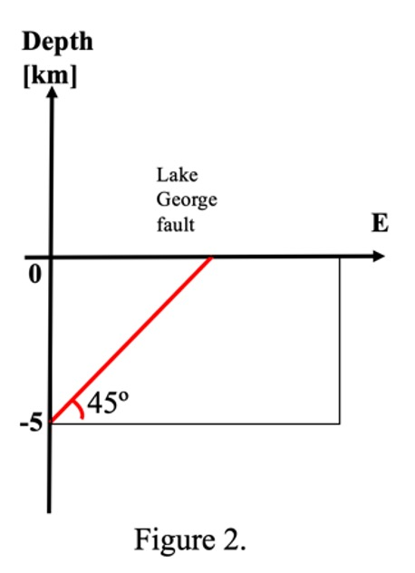

# Exercises: Stress Analysis

Knowing the stress state of our Earth is helpful in many ways. In this exercise, we will compute the stress along a plane given a stress tensor, predict whether a certain plane is going to fracture with the tool of Mohr circle and discuss what type of faults will develop under one specific stress state.

::::{admonition} 5.1 Lithostatic and hydrostatic stress

Consider a tall rectangular of rock above a point at 6 km depth (z) in the crust. This rectangle has a base of 5 km in length (l) and 2 km in width (w). What are the corresponding lithostatic stress at this point? Let’s assume that rock column has an averaged density of 2.5 g/$cm^3$ and the gravitational acceleration value at that point is 9.85 m/$s^2$. What is the hydrostatic stress if replacing that rock with a water column (do not worry about the empty house)? What geological processes could potentially reduce the stress at that point?

Note: convert all the measurements in the same units before doing the math. 
::::

---

::::{admonition} 5.2 Traction vector along a plane

Lake George is flanked to the west by the Lake George Fault, which is a west-dipping fault and is thought to have formed about 3.93 Ma ago. Dr. Trevor Allen from Geoscience Australia (GA) described the Lake George Fault as “one of Australia’s most active fault lines” in his recent [ABC talk](https://www.abc.net.au/radionational/programs/ockhamsrazor/earthquakes-in-australia-mythbusting/13494950?fbclid=IwAR1TIbrIahvU046e5jILWz-fAEnwBdAMgLQgcPn62mJ9EX5KXuqLqbJRXS8). Imagine GA shows you a W-E cross section of this fault from one of their early surveys in the region, and it shows the fault has a dipping angle of 45&deg; and extends to 5 km depth. GA also provided you a stress tensor along this section as described below. 

$$
\mathbf{\sigma} =
\begin{bmatrix}
 -45 & -8 \\
 -8 & -15 
\end{bmatrix} \textrm{MPa}
$$ 

As a structural geologist, you are asked by the GA for the following questions. What type of this fault could be based on this stress tensor if assuming Anderson’s theory of faulting? What is the stress acting across that fault plane (as a vector)? What are the corresponding normal and shear stress along the plane, respectively? 
Note: unit vector is a vector of a unit length and can be normal to the fault plane or along the fault plane. 

 ::::

---

::::{admonition} 5.3 Mohr circle application

RSES researchers along with scientists from GA successfully completed a drilling program in the Lake George during December 2020 and collected a continuous core sample down to about 130 m depth. Some of these samples are sent to a lab for mechanical property assessments. Imagine you are given a Mohr circle from this mechanical lab describing one state of a Triaxial compression experiment conducted upon a sandstone section of this core. Based on this Mohr circle, describe this stress state in a full tensor form. What is the differential stress and mean stress of this state? What are the shear and normal stress for a plane dip at 30&deg; angle within that rock sample? What about a plane of a dipping angle of 60&deg;? Discuss which of the two dipping planes is more likely to fracture.
Note: The auxiliary lines in green divide the upper portion of the circle into six equal parts. Deviatoric stress equals the radius of the Mohr circle. Also, an error of 5 MPa when reading the values from the figure is expected based on the resolution. 

 ::::

---

::::{admonition} 5.4 The Coulomb-Mohr failure criteria

Following question 3, the same mechanical lab also provided you the cohesive strength (C) and the internal friction angle ($\varphi$) data of the sandstone samples, which are 10 MPa and 45&deg; respectively. Assuming the data associated with the Mohr circle in question 3 is correct, are there any problems with the cohesive strength (C) and the internal friction angle ($\varphi$) values they provided? Why or why not? 
Note: normally you need to convert the angles in degree to radius when doing trigonometric function calculations. But this depends on what type of calculators you use. 

 ::::
