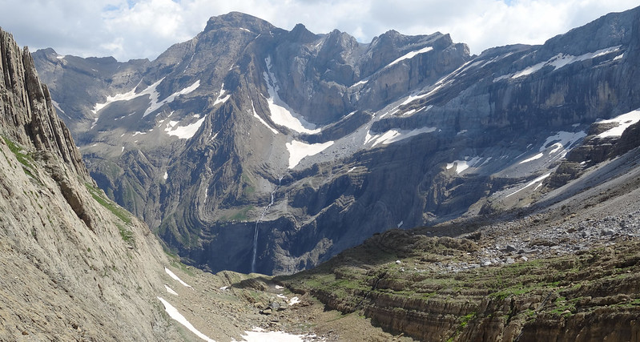
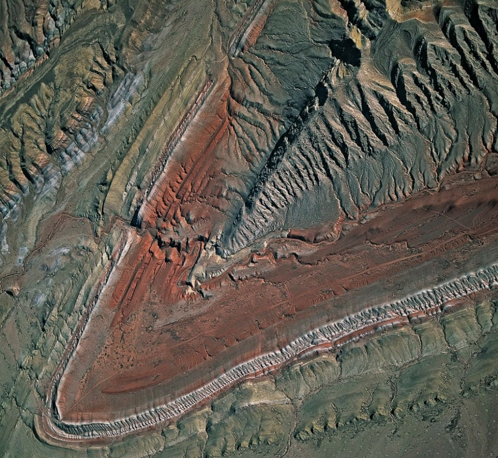

# EMSC 3002

## Introduction to Structural Geology & Tectonics

  - **Louis Moresi** (convenor)
  - Romain Beucher (lecturer)
  - Chengxin Jiang (lecturer)
  - Stephen Cox (curriculum advisor)

Australian National University

_**NB:** the course materials provided by the authors are open source under a creative commons licence. 
We acknowledge the contribution of the community in providing other materials and we endeavour to 
provide the correct attribution and citation. Please contact louis.moresi@anu.edu.au for updates and 
corrections._

<--o-->

## Resources

  <!-- .element style="float: right" width="25%" -->

  This [online book](https://anu-rses-education.github.io/EMSC-3002/FrontPage.html)
with lecture materials and lecture notes. This is a live document and we can update this
to fix bugs and add material. You can create feedback for the pages. The original 
"source code" for the slides etc is also available 

 - [EMSC3002/6030](https://wattlecourses.anu.edu.au/course/view.php?id=34828) on Wattle
 - [EMSC3002](https://programsandcourses.anu.edu.au/2021/course/EMSC3002) on programs & courses

 

<--v-->

## Resources

 <!-- .element style="display:block; margin-left:auto; margin-right:auto; width:75%" -->

 

All of the slides for this course are available online and you can access the presentations as part of the online book. 
The slides are in a 2D stack that have follow-on (sometimes more advanced material) below the regular flow of the presentation. 

You are more than welcome to read slides in advance. They are not entirely self-explanatory but we don't try to be cryptic either !

<--o-->

## What is "Structural Geology" ?

 <!-- .element style="width:33%; float:right; margin:30px" -->

**Structural geology** is the study of the three-dimensional distribution of rock units with respect to their deformational histories. The primary goal of structural geology is to use measurements of present-day rock geometries to uncover information about the history of deformation (strain) in the rocks, and ultimately, to understand the stress field that resulted in the observed strain and geometries. 

This understanding of the dynamics of the stress field can be linked to important events in the geologic past; a common goal is to understand the structural evolution of a particular area with respect to regionally widespread patterns of rock deformation (e.g., mountain building, rifting) due to plate tectonics.

Read more on [Wikipedia](https://en.wikipedia.org/wiki/Structural_geology).

<--o-->

## What does "Tectonics" mean ?

 <!-- .element style="width:33%; float:right; margin:30px" -->

**Tectonics** (from Latin *tectonicus;* from Ancient Greek *τεκτονικός (tektonikos)* 'pertaining to building') are the processes that control the structure and properties of the Earth's crust and its evolution through time. These include the processes of mountain building, the growth and behavior of the strong, old cores of continents known as cratons, and the ways in which the relatively rigid plates that constitute the Earth's outer shell interact with each other. Tectonics also provide a framework for understanding the earthquake and volcanic belts that directly affect much of the global population.

Tectonic studies are important as guides for economic geologists searching for fossil fuels and ore deposits of metallic and nonmetallic resources. An understanding of tectonic principles is essential to geomorphologists to explain erosion patterns and other Earth surface features.

Read more on [Wikipedia](https://en.wikipedia.org/wiki/Tectonics).

<--o-->

## Learning Outcomes

This course is designed to develop an advanced understanding of deformation processes and structures produced by displacement and deformation in the Earth's lithosphere at scales ranging from the tectonic plate scale, down to the crystal lattice scale. Emphasis is placed on understanding 

  1. Geodynamic processes controlling plate motions and crustal deformation.
  2. Geometry and structures produced by complex crustal deformation histories involving contractional, extensional and wrench regimes 

  3.  Factors influencing strength and mechanical behaviour of the crust and  mantle lithosphere

  4. Deformation processes controlling the microstructural evolution of rocks

  5. Deformational controls on crustal-scale fluid flow and applications to understanding ore genesis and earthquake processes

<--v-->

## Learning Outcomes

  - Recognise, map and interpret the geological structure of deformed continental regimes, from mildly deformed upper crustal regimes to complexly deformed, deeper crustal regimes.
  - Interpret the relative timing of formation of structures, the kinematics of deformation, and progressive deformation histories.
  - Predict the geometry and location of structures at depth or in areas of poor outcrop.
  - Apply an understanding of structural geology in sustainable mining and basin management.

<--o-->

## Lecturers

   <!-- .element style="width:20%; float:right; margin-top:150px" -->

**Louis Moresi**

I am a professor of geophysics / geodynamics and I am interested in understanding the evolution of the deep Earth over geological time, how this evolution is recorded in the superficial geological record,and how to build computation modelling tools to simulate the Earth. 

The tools of my trade are computational programs and numerical algorithms. I am a strong supporter of open source code so my publications will also find links to repositories where the source code is available with examples of how to reproduce peer-reviewed benchmarks and published results.

For more information my work and some blog posts see [https://www.geo-down-under.org.au/author/louis](https://www.geo-down-under.org.au/author/louis/)

<--v-->

## Lecturers

   <!-- .element style="width:20%; float:right; margin-top:150px" -->

**Romain Beucher**

I am a Research Fellow in the Computational Geodynamics Group. Before that I was a Postdoctoral Research Associate at The University of Melbourne.

I received my PhD in Geology / Geophysics from the University of Grenoble, France where I worked on the tectonic evolution of the Alpine mountain belt. I moved to Scotland in 2010 to work on the uplift of the South African plateau, then to Norway in 2013 to learn Computational Geodynamics.

My current research interest includes the study of interactions between tectonics and erosion at continent scale for which I use a wide range of numerical and analytical techniques.

<--v-->

## Lecturers

   <!-- .element style="width:20%; float:right; margin-top:150px" -->

**Chengxin Jiang**

I am a seismologist broadly interested in tectonic, magmatic and near surface geological processes, and I address these problems with seismic tomography, monitoring and numerical modeling tools.  My recent research focus on studying lithosphere deformation of continent and subduction zones by illuminating anisotropic properties of the Earth's interior and monitoring volcanic and groundwater processes with the technique of ambient noise interferometry.

<--o-->

## Assessment (Summary)

There will be 5 short quizzes during the semester that will help you to calibrate your knowledge from the course material for each module and which you can use for revision. The first of these quizzes will be a refresher on plate tectonics which you will be allowed to re-take after an optional tutorial. (20% on these quizzes)

Lab-based assessments will be worth 20% of the course in total. One assessment will be an exercise on interpreting sandbox models that you will be running in the lab. The second will be a mapping exercise.

There will be a poster presentation and final report that together make up 20% of the course assessment.

The final exam will be worth 40% of the course.

*We are, of course, open to some negotiation of the weight of the assessment tasks and their timing where this helps to cement the learning goals.*  **Now is the time to discuss !**

<--o-->

## Practicals

<video autoplay controls width="40%">
    <source src="movies/SandboxDemonstration.m4v"
            type="video/mp4">

    Sorry, your browser doesn't support embedded videos.
</video>

Three hour practicals each week. We are not able to undertake any field trips this year so we will have a number of exercises in virtual mapping and we will be spending some time running and interpreting analogue-geology experiments in the sandbox (above). 

<--o-->

## Course Modules

(See wattle for updates)

 <!-- .element style="width:33%; float:right; margin:30px" -->

### Module i - Global Tectonics

Introduces the concepts of global-scale tectonics, plate motions, the nature of plate boundaries and the geological structures characteristic of large-scale deformation of the crust.

**Louis Moresi** will lead this part of the course in 2021.

<small>

*Dewey, J. F. (1972). PLATE TECTONICS. Scientific American, 226(5), 56–72. https://doi.org/10.1038/scientificamerican0572-56 - a global map of the "Mosaic of Plates [that] forms the Earth's lithosphere or outer shell"*

</small>

<--v-->

## Course Modules

 <!-- .element style="width:33%; float:right; margin:30px" -->

### Module ii - Structures in the Earth

This module aims to develop student intuition and proficiency in 3- and 4-dimensional visualization and thinking and teach the fundamentals of rock deformation using natural examples.

You will be given an overview of the geometry and type of structures produced by complex crustal deformation histories involving contractional, extensional and wrench regimes over a wide range of spatial and temporal scales. You will learn how to recognise structural features using satellite imagery, geological maps and will learn how to construct geological profiles.

**Romain Beucher** will lead this part of the course in 2021.

<--v-->

## Course Modules

 <!-- .element style="width:25%; float:right; margin:30px" -->

### Module iii - Theoretical Underpinnings

In order to understand geological structures in more detail, we need some background understanding of how stresses and strains work, how they are measured, and how you can use these concepts to interpret what you see in the field.

**Chengxin Jiang** will lead this part of the course in 2021.

<small>

*On 24 August 2014 (03:20 local time), a magnitude 6.0 earthquake struck the Napa Valley, California, just south of the city of Napa (population 77,000). This is the first earthquake for which the surface deformation has been measured by ESA’s Sentinel-1 satellite.*
</small>

<--v-->

## Course Modules

 <!-- .element style="width:20%; float:right; margin:30px" -->

### Module iv - Brittle Deformation

When rocks undergo rapid, localised deformation, refer to the process as “brittle deformation”. Typically brittle features in the Earth’s crust are faults and we can understand much about the stress and deformation if we understand faults, their rupture and associated seismic energy release. 

**Chengxin Jiang** will lead this part of the course in 2021.

<small>

*San Andreas Fault as it passes through the Carizzo Plain in Southern California
Nelson Saarni, CC BY-SA 4.0 <https://creativecommons.org/licenses/by-sa/4.0>, via Wikimedia Commons*

</small>

<--v-->

## Course Modules

 <!-- .element style="width:20%; float:right; margin:30px" -->

### Module v - Ductile Deformation

Ductile deformation occurs when rocks are able to accommodate large deformations without fracturing. You will learn how to recognise elements of ductile deformation such as folding, shearing and stretching.

We will see how folds represent important windows into local and regional deformation histories. You will learn how to describe geometry and different styles of folding and will understand how we can use them to derive important information about the type of deformation. You will then learn about structures associated with folding and see how they can be used to map and understand the deformation history.

**Romain Beucher** will lead this part of the course in 2021.
