# EMSC 3002

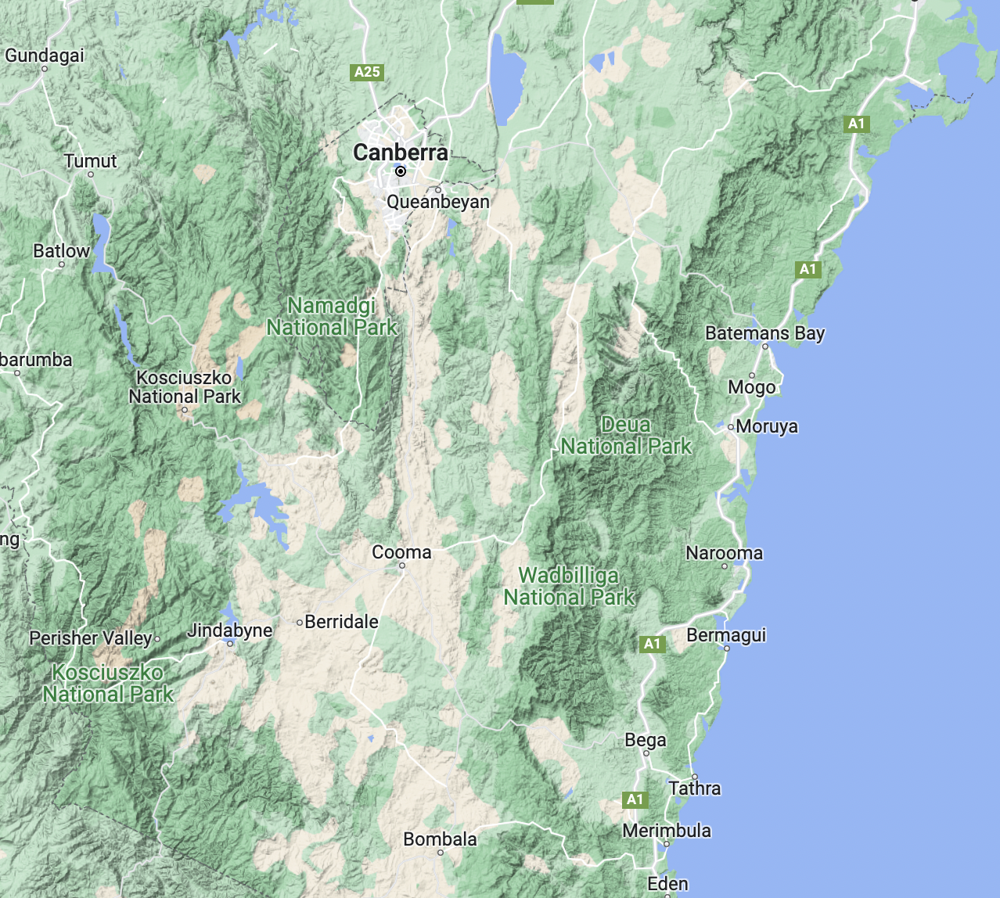 <!-- .element style="float:right; width:40%; margin-left:50px"-->

We would like to acknowledge and celebrate the First Australians on whose lands
we teach and learn.

The ANU campus sits within the lands of the Ngambri and Ngunnawal people
and we extend our respect to their elders past, present and emerging.

We will be learning another story of the same lands, told from beneath, adding to and not
diminishing the traditional knowledge.

<small>Reading these on your own? Press **O** for the overview, and **&darr;** as well as **&rarr;** &mdash; some slides sit below this one. <a href="../lecture-1-introduction/#navigating-the-slides" target="_blank" rel="noopener">How to navigate the slides</a></small>

<--o-->

## Structure and Tectonic Evolution of the Australian Plate

  - **Louis Moresi** (convenor - J2 room 231)
  - **Chengxin Jiang** (lecturer - J2 ground floor)

**Contributing Authors:** Romain Beucher (former lecturer), Stephen Cox (curriculum advisor)

Australian National University

**NB:** the course materials provided by the authors are open source under a creative commons licence.

_We acknowledge the contribution of the community in providing other materials and we endeavour to
provide the correct attribution and citation. Please contact louis.moresi@anu.edu.au for updates and
corrections._

<--o-->

## Resources

  <!-- .element style="float: right" width="25%" -->

  This [online book](https://anu-rses-education.github.io/EMSC-3002/FrontPage.html)
with lecture materials and lecture notes. This is a live document and we can update this
to fix bugs and add material. You can create feedback for the pages. The original
"source code" for the slides etc is also available

- [EMSC3002/6030](https://canvas.anu.edu.au/courses/9989) on Canvas
- [EMSC3002](https://programsandcourses.anu.edu.au/2026/course/EMSC3002) on programs & courses

<--v-->

## Resources

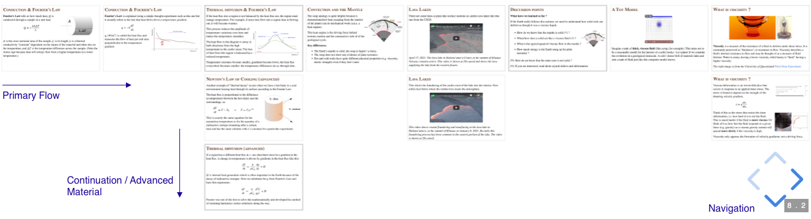 <!-- .element style="display:block; margin-left:auto; margin-right:auto; width:75%" -->

 

All of the slides for this course are available online and you can access the presentations as part of the online book.

The slides are in a 2D stack that have follow-on (sometimes more advanced material) below the regular flow of the presentation.

You are more than welcome to read slides in advance. They are not entirely self-explanatory but we don't try to be cryptic either !

<--o-->

## Pre-Course Survey

 <!-- .element style="float:right; width:28%; margin-left:40px" -->

A short survey to let us know your background, why you are taking the course, and what you are most interested in learning. We will try to steer the project work to accommodate your interests.

[https://forms.cloud.microsoft/r/NXwwPd5CJa?origin=lprLink](https://forms.cloud.microsoft/r/NXwwPd5CJa?origin=lprLink)

<--o-->

## What does "Tectonics" mean ?

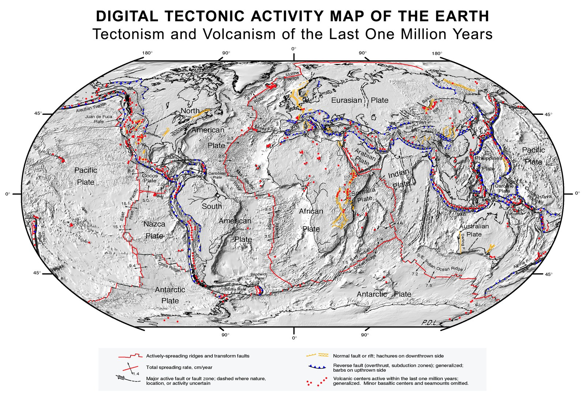 <!-- .element style="width:33%; float:right; margin:30px" -->

**Tectonics** (from Latin *tectonicus;* from Ancient Greek *τεκτονικός (tektonikos)* 'pertaining to building') are the processes that control the structure and properties of the Earth's crust and its evolution through time. These include the processes of mountain building, the growth and behavior of the strong, old cores of continents known as cratons, and the ways in which the relatively rigid plates that constitute the Earth's outer shell interact with each other. Tectonics also provide a framework for understanding the earthquake and volcanic belts that directly affect much of the global population.

Tectonic studies are important as guides for economic geologists searching for fossil fuels and ore deposits of metallic and nonmetallic resources. An understanding of tectonic principles is essential to geomorphologists to explain erosion patterns and other Earth surface features.

Read more on [Wikipedia](https://en.wikipedia.org/wiki/Tectonics).

<--o-->

## What is "Structural Geology" ?

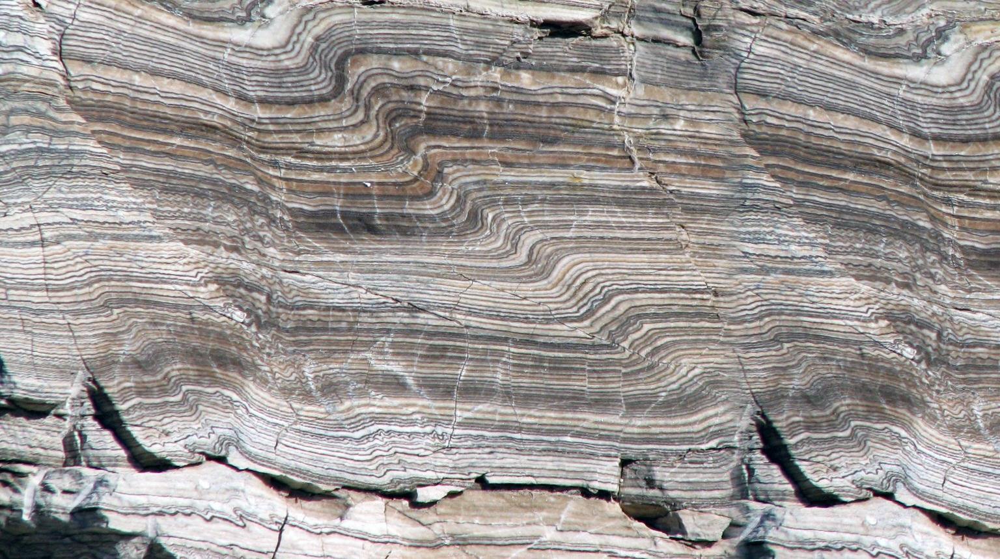 <!-- .element style="width:33%; float:right; margin:30px" -->

**Structural geology** is the study of the three-dimensional distribution of rock units with respect to their deformational histories. The primary goal of structural geology is to use measurements of present-day rock geometries to uncover information about the history of deformation (strain) in the rocks, and ultimately, to understand the stress field that resulted in the observed strain and geometries.

This understanding of the dynamics of the stress field can be linked to important events in the geologic past; a common goal is to understand the structural evolution of a particular area with respect to regionally widespread patterns of rock deformation (e.g., mountain building, rifting) due to plate tectonics.

Read more on [Wikipedia](https://en.wikipedia.org/wiki/Structural_geology).

<--o-->

## What you will learn

This course develops an advanced understanding of the deformation processes and structures produced in the Earth's lithosphere, at scales from the tectonic plate down to the crystal lattice. On completing it, you will be able to:

  1. **Describe** the broad geological history of the Australian plate and place its major structures in their tectonic context.

  2. **Explain** the relationship between plate kinematics, plate tectonic forces and the deformation patterns in the continental crust.

  3. **Evaluate** how observational data collected during laboratory experiments and field work (in person or virtual) supports or refutes theoretical concepts in structural geology and tectonics.

  4. **Predict** the geometry and location of structures at depth or in areas of poor outcrop through the use of geological and geophysical observations.

<--v-->

## What you will learn

  5. **Interpret** the relative timing of formation of structures, the kinematics of deformation, and progressive deformation histories in geological settings and laboratory / computer analogues.

  6. **Synthesise** field observations and theoretical / laboratory-derived concepts to interpret a geological cross section within its tectonic context.

  7. **Independently develop** laboratory analogue experiments that represent archetypal geological structures.

<small>

*EMSC 6030 students only:* **integrate** computational modelling results or an independent literature review with advanced concepts in tectonics and structure.

</small>

<--o-->

## EMSC 3034 v EMSC 3002

*Dynamic Earth: Plates, Plumes and Mantle Convection* deals with global scale dynamics of the Earth as a planet. The focus is on how plate tectonics works as a by-product of mantle convection, and how we use that knowledge to understand the geological record.

*Structural & Tectonic Evolution of the Australian Plate* focuses on the dynamics of the lithosphere and the emergence of geological structure from the forces at work in the crust. We will delve deeply into the mechanical behaviour of the lithosphere and how we can interpret and predict geological structures by knowing something about the energy / force balance.

<--o-->

## Lecturers

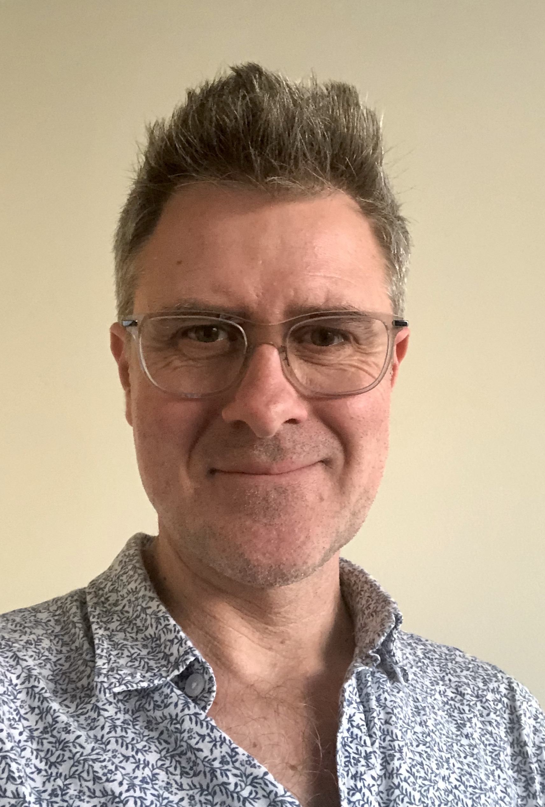   <!-- .element style="width:20%; float:right; margin-top:150px" -->

**Louis Moresi**

I am a professor of geophysics / geodynamics and I am interested in understanding the evolution of the deep Earth over geological time, how this evolution is recorded in the superficial geological record,and how to build computational modelling tools to simulate the Earth.

I also work (and can supervise projects) in planetary science, groundwater models, surface processes (river systems, erosion, deposition), lithospheric dynamics ...

The tools of my trade are computational programs and numerical algorithms. I am a strong supporter of open source code so my publications will also find links to repositories where the source code is available with examples of how to reproduce peer-reviewed benchmarks and published results.

For more information on my work and some blog posts see [https://www.geo-down-under.org.au/author/louis](https://www.geo-down-under.org.au/author/louis/)

<--v-->

## Lecturers

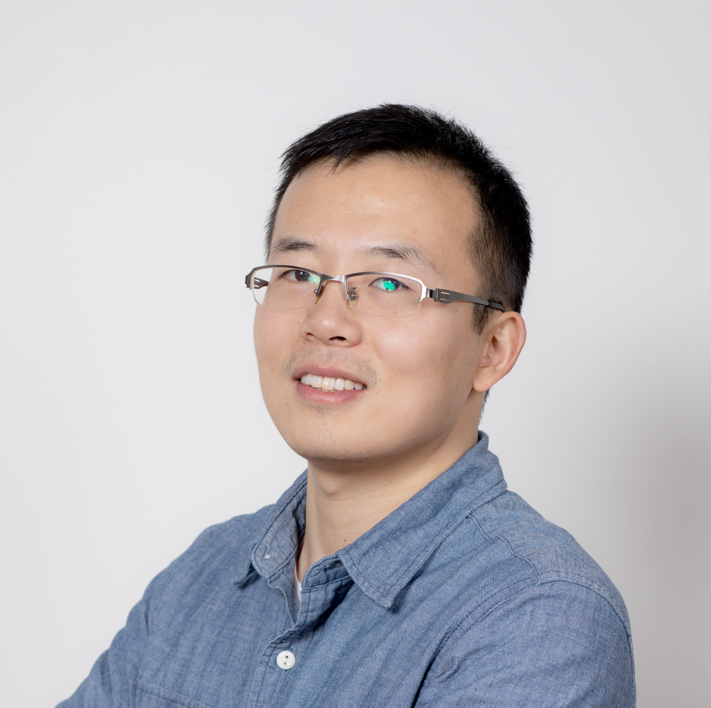   <!-- .element style="width:20%; float:right; margin-top:50px" -->

**Chengxin Jiang**

I am a seismologist broadly interested in tectonic, magmatic and near surface geological processes, and I address these problems with seismic tomography, monitoring and numerical modeling tools.  My recent research focuses on studying lithosphere deformation of continent and subduction zones by illuminating anisotropic properties of the Earth's interior and monitoring volcanic and groundwater processes with the technique of ambient noise interferometry.

<--v-->

## Demonstrators

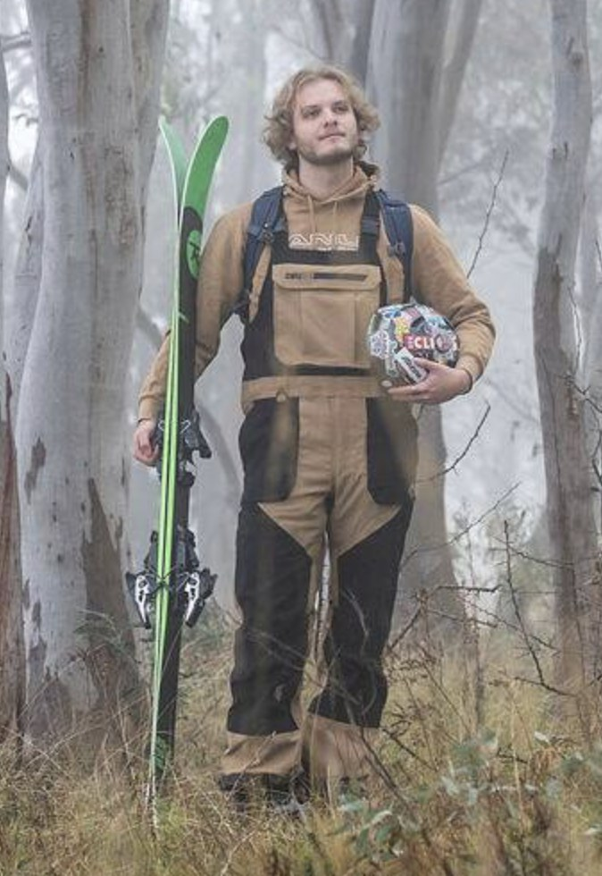   <!-- .element style="width:20%; float:right; margin-top:50px" -->

**Stephan Kashkarov**

<--o-->

## Assessment (Summary)

There will be 5 short quizzes during the semester that will help you to calibrate your knowledge from the course material for each module and which you can use for revision. **(15%)**

Lab-based assessments are worth **40%** of the course in total:

  - interpreting the sandbox models that you run in the lab **(20%)**
  - a mapping exercise (if we are lucky, we can do a "field trip" for this) **(20%)**

There will be a presentation and report that together make up **15%** of the course assessment.

The final exam will be worth **30%** of the course.

*We are, of course, open to some negotiation of the weight of the assessment tasks and their timing where this helps to cement the learning goals.*  **Now is the time to discuss !**

<--o-->

## Practicals

<video autoplay controls width="40%">
    <source src="movies/SandboxDemonstration.m4v"
            type="video/mp4">

    Sorry, your browser doesn't support embedded videos.
</video>

Two hour practicals each week with an associated tutorial (in one 3 hour block). We hope we can run a short, local field trip this year and we will have a number of exercises in virtual mapping to prepare. We will be spending some time running and interpreting analogue-geology experiments in the sandbox (above).

<--o-->

## Using AI in this course

**Use it !**  We are not going to pretend otherwise: AI is part of how scientific work is now done, and when you graduate your should be fluent in using it. What I care about is *what you use it for*.

The distinction I want you to hold on to is this: **use AI to enhance your learning, not to replace your effort.**

Those sound similar and they are not. AI that explains a derivation you are stuck on, argues with your interpretation, or checks whether your reasoning holds up — that is enhancing your learning. AI that produces the interpretation so you do not have to ... that is replacing the effort, and the effort is exactly what helps you learn.

<small>

*The view here is drawn from a longer analysis I have written on AI and university education; ask me if you want the argument in full.*

</small>

<--v-->

## Fluency is now cheap; understanding is hard one

Producing a fluent, well-structured account of a topic used to require having understood it. That correlation is what essays and reports were quietly measuring — and AI has broken it. A confident 2000 words on mantle convection now costs three minutes and that produces no understanding.

What has *not* got cheaper is the thing the fluency used to stand for: knowing the material well enough to survive detailed questioning, knowing what you know and what you do not, and recognising when an answer is wrong.

That is what this course is trying to build in you, and it is why the assessment leans on things that are hard to outsource — interpreting a sandbox model *you* ran, defending a cross-section, a poster you stand next to and answer questions about, and an exam.

<--v-->

## The productivity argument (the real reason)

The graduate who is worth hiring is not the one who avoided AI, nor the one who let it do the work. It is the one whose understanding is deep enough that they can direct AI hard, spot when it is confidently wrong, and stand behind the result.

That person compresses a month of work into a day. But notice the order: the expertise comes first, and AI multiplies it. **If you skip the learning, you have nothing for AI to multiply.**

There is also the awkward matter of accountability. We do not let AI be accountable for anything — no career to lose, no professional body to answer to. When a geologist signs off on a slope, a resource estimate, or a hazard assessment, a *human* carries that. You are training to be the person who **signs off on something and is responsible for that**.

*Driving the course does not prepare a runner for the marathon.*

<--v-->

## So, concretely

**Good use — encouraged:**

  - Ask it to explain something you are stuck on, at whatever depth you need, until you actually get it.
  - Use it as a sparring partner: give it your interpretation and ask it to attack it.
  - Get it to generate practice questions, or to check your reasoning after you have done the work.
  - Use it for the tedious mechanics — code, formatting, figure wrangling — once you know what you want.

**What we do not allow:**

  - Having it produce interpretations, answers or text that you then submit as your own.
  - Avoiding critical thinking. AI will not push back on its own behalf; **refuse to be impressed by fluent text.**
  - Using AI in any assessment task where we state that you are not allowed to use AI (including the final exam) — this is considered academic misconduct. 

If you use AI on assessable work, **say so and say how** — that is normal professional practice and a university requirement.

<--o-->

## Course Modules

(See Canvas for updates)

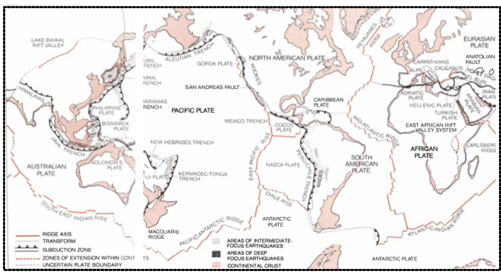 <!-- .element style="width:33%; float:right; margin:30px" -->

### Module i - Global Tectonics

Introduces the concepts of global-scale tectonics, plate motions, the nature of plate boundaries and the geological structures characteristic of large-scale deformation of the crust.

**Louis Moresi** will lead this part of the course.

<small>

*Dewey, J. F. (1972). PLATE TECTONICS. Scientific American, 226(5), 56–72. https://doi.org/10.1038/scientificamerican0572-56 - a global map of the "Mosaic of Plates [that] forms the Earth's lithosphere or outer shell"*

</small>

<--v-->

## Course Modules

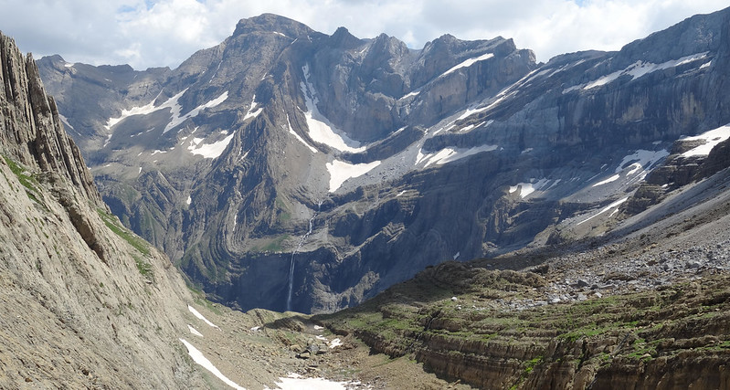 <!-- .element style="width:33%; float:right; margin:30px" -->

### Module ii - Structures in the Earth

This module aims to develop student intuition and proficiency in 3- and 4-dimensional visualization and thinking and teach the fundamentals of rock deformation using natural examples.

You will be given an overview of the geometry and type of structures produced by complex crustal deformation histories involving contractional, extensional and wrench regimes over a wide range of spatial and temporal scales. You will learn how to recognise structural features using satellite imagery, geological maps and will learn how to construct geological profiles.

**Louis Moresi** will lead this part of the course.

<--v-->

## Course Modules

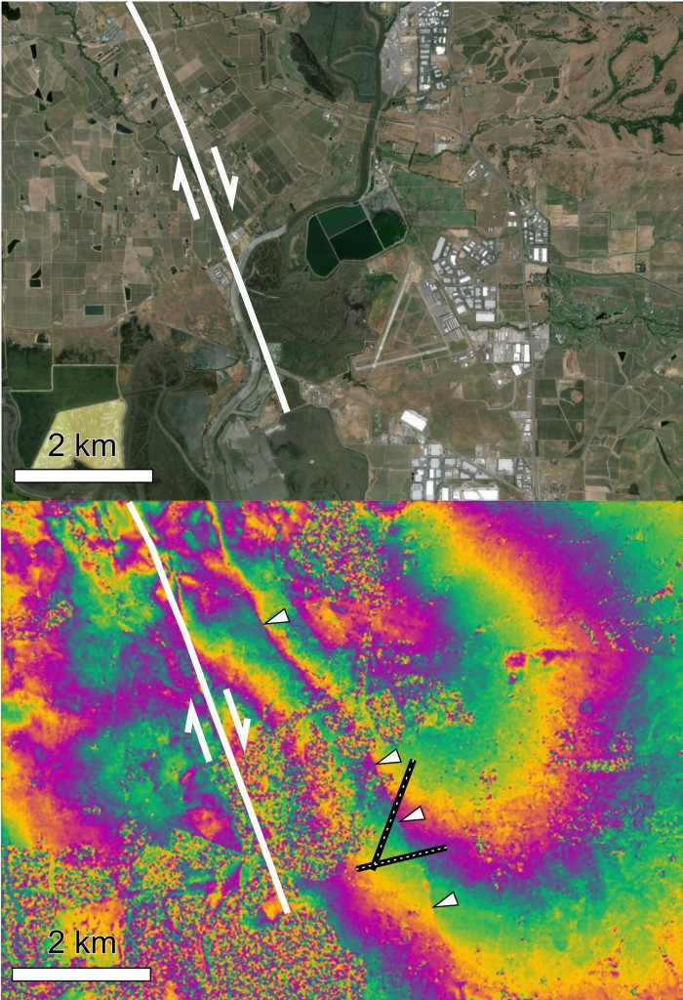 <!-- .element style="width:25%; float:right; margin:30px" -->

### Module iii - Theoretical Underpinnings

In order to understand geological structures in more detail, we need some background understanding of how stresses and strains work, how they are measured, and how you can use these concepts to interpret what you see in the field.

**Louis Moresi** / **Chengxin Jiang**  will share this part of the course.

<small>

*On 24 August 2014 (03:20 local time), a magnitude 6.0 earthquake struck the Napa Valley, California, just south of the city of Napa (population 77,000). This is the first earthquake for which the surface deformation has been measured by ESA’s Sentinel-1 satellite.*
</small>

<--v-->

## Course Modules

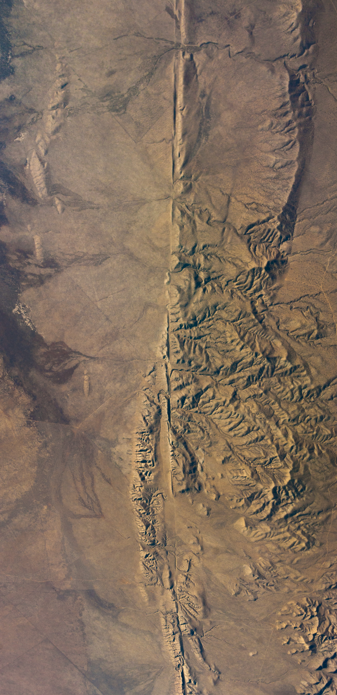 <!-- .element style="width:20%; float:right; margin:30px" -->

### Module iv - Brittle Deformation

When rocks undergo rapid, localised deformation, we refer to the process as “brittle deformation”. Typically brittle features in the Earth’s crust are faults and we can understand much about the stress and deformation if we understand faults, their rupture and associated seismic energy release.

**Chengxin Jiang** will lead this part of the course.

<small>

*San Andreas Fault as it passes through the Carrizo Plain in Southern California
Nelson Saarni, CC BY-SA 4.0 <https://creativecommons.org/licenses/by-sa/4.0>, via Wikimedia Commons*

</small>

<--v-->

## Course Modules

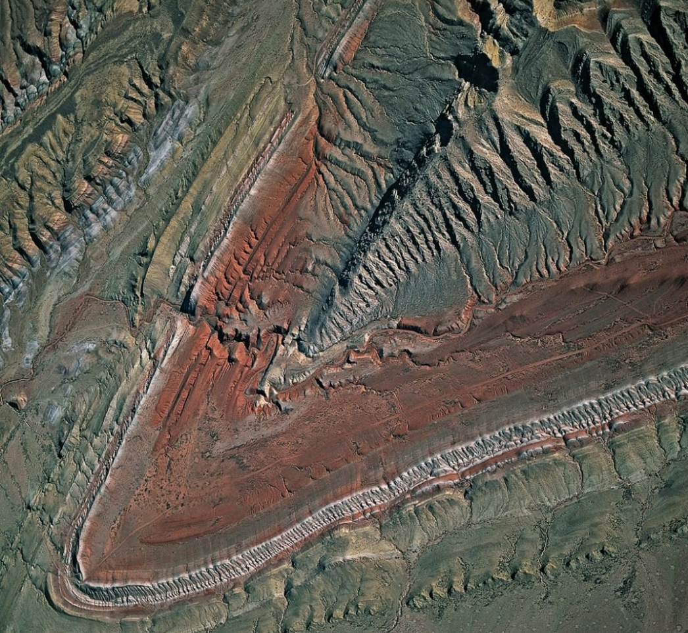 <!-- .element style="width:20%; float:right; margin:30px" -->

### Module v - Ductile Deformation

Ductile deformation occurs when rocks are able to accommodate large deformations without fracturing. You will learn how to recognise elements of ductile deformation such as folding, shearing and stretching.

We will see how folds represent important windows into local and regional deformation histories. You will learn how to describe geometry and different styles of folding and will understand how we can use them to derive important information about the type of deformation. You will then learn about structures associated with folding and see how they can be used to map and understand the deformation history.

**Chengxin Jiang** will lead this part of the course.

<--o-->

## Get involved with the school !

  - You should consider attending seminars (and PhD completions) when they are topics of interest. We will let you know if there are any seminars that are particularly relevant to the course during this semester.

  - Become a class rep !

  - Join the Earth & Marine Science Society: https://www.facebook.com/anuems/

  - Come and talk to us if you have problems (you have access to the school).

<--o-->

## Interested in Honours, Masters, PhD ?

If you have an interest in structural geology, tectonics, geo-mechanics, mantle-convection then you may want to consider choosing a special topic or honours project, or masters topic in this area, or even entry to the PhD program.

We can help you to develop a project and we can also help you find a supervisor in the school (if we are not available).

There are other areas such as groundwater models, seismology, planetary science, and geodynamics which we can also supervise or advise you on.

**Just ask !**
