# EMSC 3002

### Folds and Folding mechanisms

  - Louis Moresi (convenor)
  - Romain Beucher (lecturer)
  - Chengxin Jiang (lecturer)
  - Stephen Cox (curriculum advisor)

Australian National University

_**NB:** the course materials provided by the authors are open source under a creative commons licence. 
We acknowledge the contribution of the community in providing other materials and we endeavour to 
provide the correct attribution and citation. Please contact louis.moresi@anu.edu.au for updates and 
corrections._

---
<!-- .slide: data-background="Lecture-2-Folding-images/The folds of the rocks at position Apoplystra.jpg" -->

---

## Resources

## Intended learning outcomes

Students will be able to:

- **Classify folds** according to fold terminology.
- Understand **Folding Mechanims**
- Find second order folds and cleavage
- Identify **folding and faulting in extensional** regimes
- Identify **folding and faulting in compressional** regimes.

---

## Folds, Why are they important?

Hydrocarbon industry:

- Folds and associated structures can form traps.
- Understanding folds periodicity and geometry is key for the selection of drilling sites.

Mineral Industry:

- Understanding folds structures is important in assessing the extent of ore reserves and the
viability of mines.

---

## Fold Morphology

The conditions of deformation usually vary both in space and time, differences in rock type,
temperature, pressure and strain-rate translates in a wide range of fold geometry or **fold styles**.

Correct interpretation of the variations in fold style is important to reconstruct the
geological history of an area.

---

## Geometric Aspects of folds

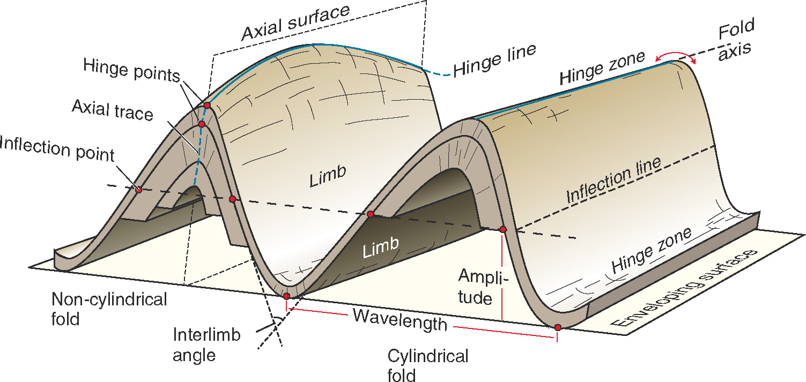 <!-- .element style="float: right" width="60%" -->

**Folds** are usually best studied in section perpendicular to the layering, or
perpendicular to what is defined as the **axial surface**.

Folds are made up of a **hinge** that connects to **limbs**.

The **hinge** may be abrupt but usually the curvature is gradual and define a 
**hinge zone**.

---

## Geometric Aspects of folds

Accurate description of folded structures requires using a specific vocabulary.

Key to compare natural structures across different contexts.

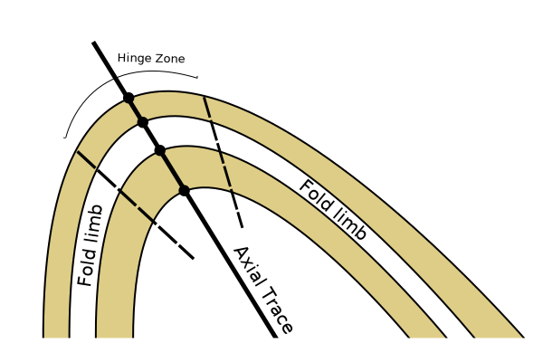

---

## Fold size

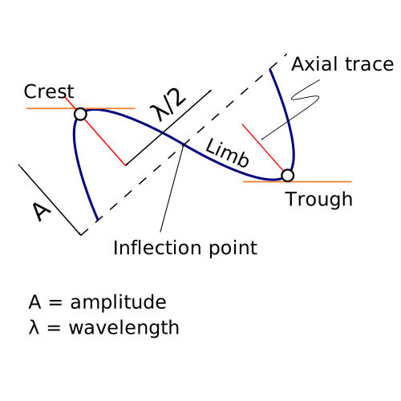 <!-- .element style="float: right" width="60%" -->

---

## Interlimb Angle (fold profile)

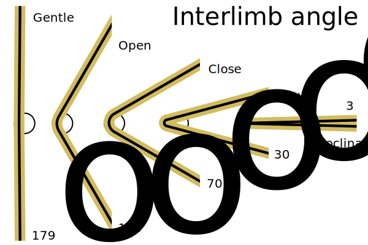

---
<!-- .slide: data-background="Lecture-2-Folding-images/Photo_3_zagros_landsat_7.jpg" -->

---

<!-- .slide: data-background="Lecture-2-Folding-images/Figure_7_Fold-and-Thrust-Belt.png" -->

---

## Geometric Aspects of folds

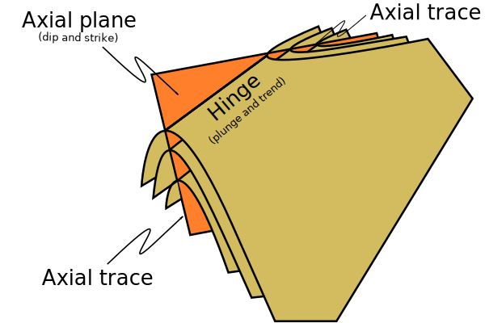

---
## Geometric Aspects of folds

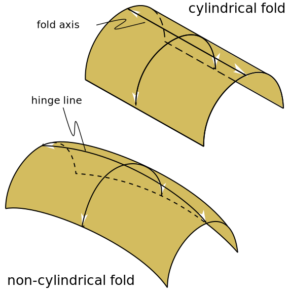

---

## Fold Attitude

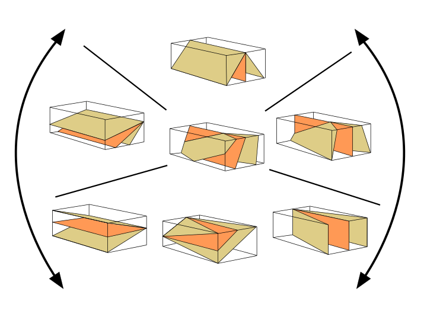

---

## Fold Attitude

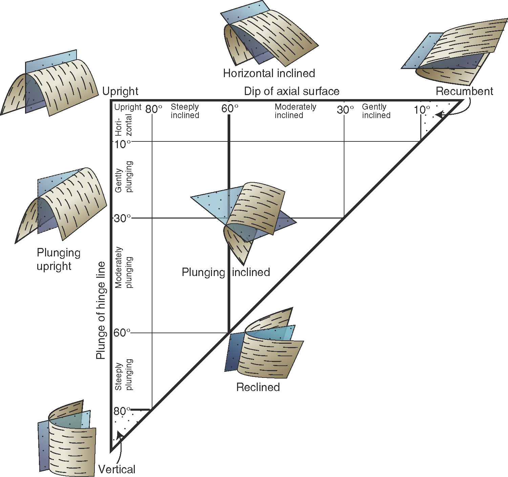

---

## Fold Attitude

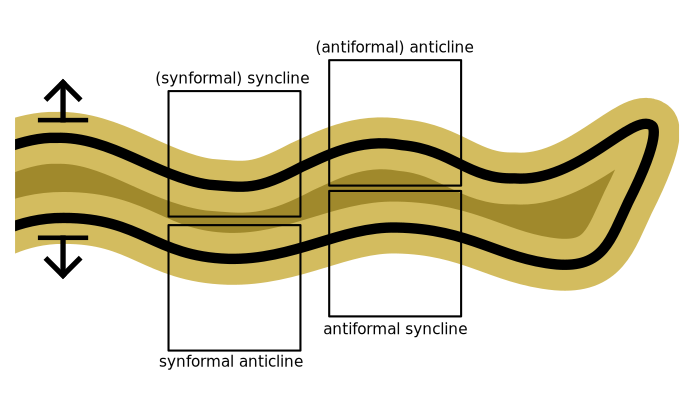

---

## Fold Types

---

## Fold Types

---

## Buckling

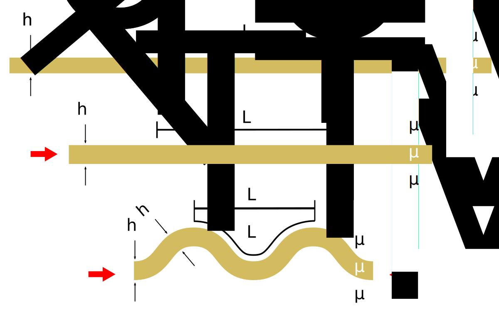

---

## Buckling Folding Mechanisms

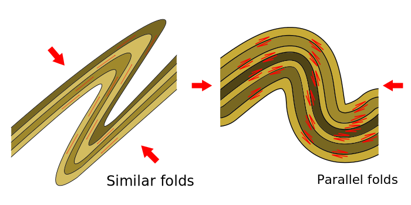

---

## Mechanical Contrast

---

## Thickness and Fold wavelength

 <!-- .element style="float: right" width="50%" -->

Different layer thicknesses and/or rheologies produce different wavelengths of folds.

The geometry of the 2nd and 3rd order of folds show where the large structures are!

---

## Bedding / Cleavage relationships

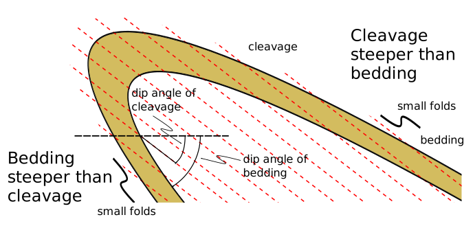 <!-- .element style="float: right" width="50%" -->

---

## Pumpelly's Rule

 <!-- .element style="float: right" width="50%" -->

---
