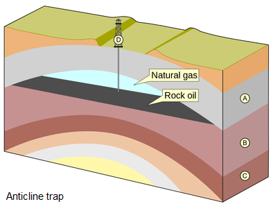
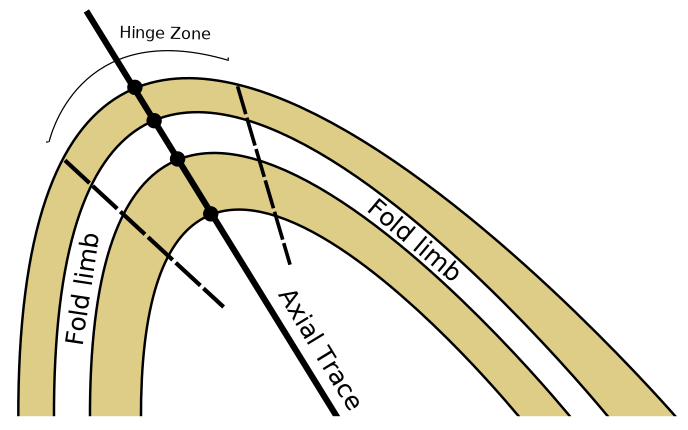
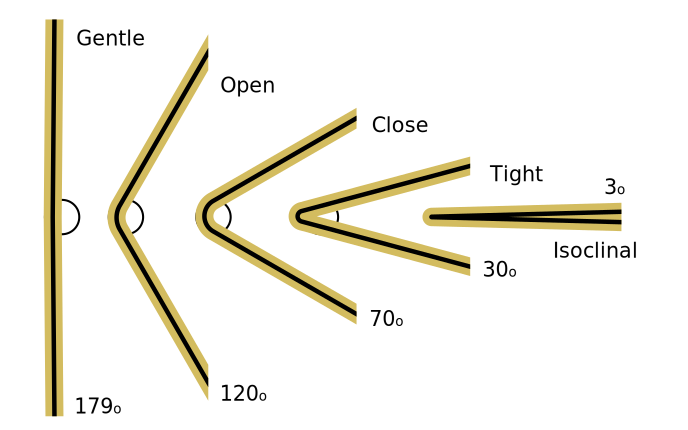
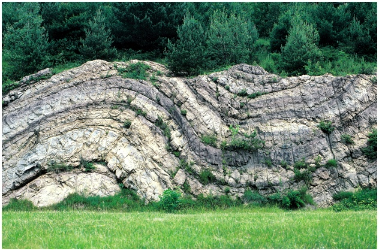
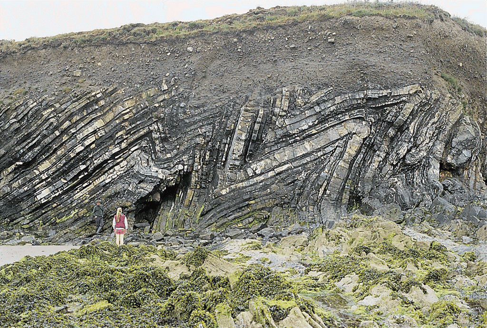
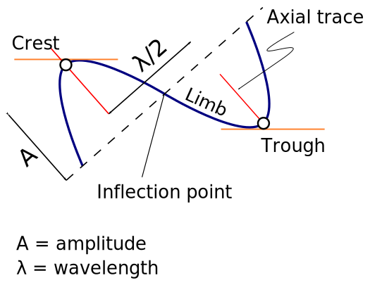
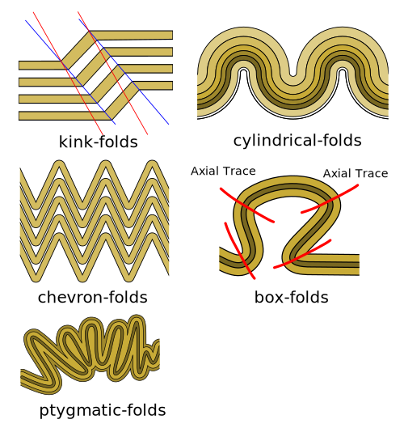
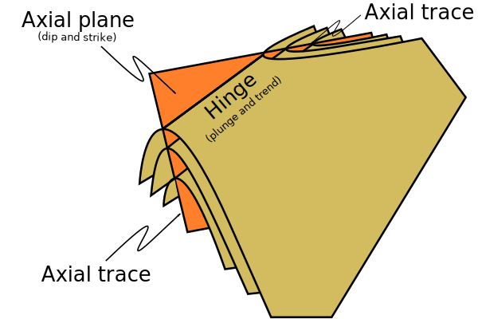
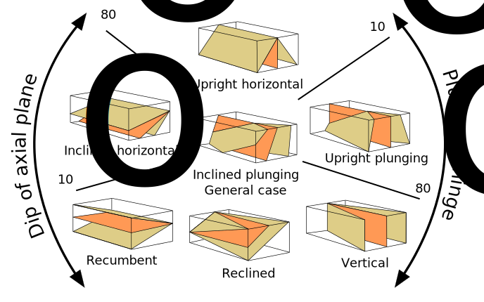

# EMSC 3002

## Fold Geometry 1

  - Louis Moresi (convenor)
  - **Romain Beucher** (lecturer)
  - Chengxin Jiang (lecturer)
  - Stephen Cox (curriculum advisor)

Australian National University

_**NB:** the course materials provided by the authors are open source under a creative commons licence. 
We acknowledge the contribution of the community in providing other materials and we endeavour to 
provide the correct attribution and citation. Please contact louis.moresi@anu.edu.au for updates and 
corrections._

<--o-->
<!-- .slide: data-background="Figures-Fold-Geometry-1/photos/The_folds_of_the_rocks_at_position_Apoplystra.jpg" -->

<--o-->

## Resources

1. **Fossen, H, 2011.** *Structural Geology.* Cambridge University Press, 2nd Edition **Chapter 11**
1. **McClay, K.R. 1991.** *The Mapping of Geological Structures.* John Wiley & Sons.  **Chapter 3**
1. **Park, R.G., 1995.** *Foundations of Structural Geology.* Blackie & Sons Ltd. **Chapter 2**
1. **Davis, G.H. and Reynolds, S.J., 1996.** *Structural Geology of Rocks and Regions.* 2nd Edition, John Wiley & Sons. **Chapter 7**
<!-- 1. **Hatcher, R.D., 1990.** *Structural Geology - Principles, Concepts, and Problems*, 2nd Edition, Prentice-Hall -->
<!-- 1. **Ramsay, J.G. and Huber, M.I. 1983.** *Modern Structural Geology. Volume 1: Strain Analysis.* Academic Press. -->
<!-- 1. **Ramsay, J.G. and Huber, M.I. 1987.** *Modern Structural Geology. Volume 2: Folds and Fractures.* Academic Press. -->

<--o-->

## Intended learning outcomes

Students will be able to:

- Describe and name basic elements of fold geometry
- Use classifications to describe fold styles

<--o-->

## Folds, Why are they important?

Hydrocarbon industry:

- Folds and associated structures can form traps.
- Understanding folds periodicity and geometry is key for the selection of drilling sites.

Mineral Industry:

- Understanding folds structures is important in assessing the extent of ore reserves and the
viability of mines.

 <!-- .element style="float: right" width="90%" -->

<--o-->

## Basic Elements of Fold Morphology

The conditions of deformation usually vary both in space and time, differences in rock type,
temperature, pressure and strain-rate translates in a wide range of fold geometry or **fold styles**.

Correct interpretation of the variations in fold style is important to reconstruct the
geological history of an area.

<--o-->

<!-- .slide: data-background="Figures-Fold-Geometry-1/photos/Folds_near_Commana_in_Brittany_France_2.jpg" -->

<--o-->

## Basic Elements of Fold Morphology

### Observation of folds in section

 <!-- .element style="float: right" width="60%" -->

**Folds** are usually best studied in section perpendicular to the layering, or
perpendicular to what is defined as the **axial surface**.

Folds are made up of a **hinge** that connects to **limbs**.

The **hinge** may be abrupt but usually the curvature is gradual and define a 
**hinge zone**.

<--o-->

## Basic Elements of Fold Morphology

Accurate description of folded structures requires using a specific vocabulary.

Key to compare natural structures across different contexts.

<--o-->

## Fold styles
### Tightness and Angularity (Interlimb angle)

 <!-- .element width="95%" -->

 <!-- .element width="90%" -->

 <!-- .element width="90%" -->

<--o-->

## Fold styles
### Wavelength and Amplitude

The Shape of folds can be compared to mathematical functions.

We use terms such as **amplitude** and **wavelength**.

Folds do not necessarily follow the regularity of simple mathematical function.
Nevertheless, simple harmonic analysis can be applied to describe fold shape.

 <!-- .element style="float: right" width="95%" -->

<--o-->

## Fold styles
### Cylindrical, non-cylindrical

Folds may be cylindrical so that the fold axis or hinges plunges in one direction.

Especially on the large scale the fold may also be non-cylindrical with a fold
axis that plunges in either direction.

 <!-- .element style="float: right" width="95%" -->

<--o-->

## Fold styles

<--o-->

## Geometric Aspects of folds

<!-- .element style="float: left" width="90%" -->

<!-- .element style="float: right" width="95%" -->

<--o-->

<!-- .slide: data-background="Figures-Fold-Geometry-1/photos/Richat structure.jpg" -->

<--o-->

## Fold Attitude

 <!-- .element style="float: center" width="95%" -->

<--o-->

<!-- .slide: data-background="Figures-Fold-Geometry-1/photos/Recumbent_Folds_Anne_Burges_CC.jpg" -->

<--o-->

## Fold Attitude

  <!-- .element style="float: center" width="50%" -->

<--o-->

  <!-- .element style="float: center" width="100%" -->

<--o-->

## Fold Types

A spectrum of hinge shapes exists, from the pointed hinges of kink-bands and
chevron folds to the rounded hinges of concentric folds.

Classification according to the hinge curvature is referred to as bluntness.

 <!-- .element style="float: right" width="95%" -->

<--o-->

<!-- .slide: data-background="Figures-Fold-Geometry-1/photos/Exceptional_folds_during_the_Girls_into_Geoscience_inaugural_Irish_Fieldtrip.jpg" -->
