# EMSC 3002

## Folds and Folding Mechanisms

  - Louis Moresi (convenor)
  - **Romain Beucher** (lecturer)
  - Chengxin Jiang (lecturer)
  - Stephen Cox (curriculum advisor)

Australian National University

_**NB:** the course materials provided by the authors are open source under a creative commons licence. 
We acknowledge the contribution of the community in providing other materials and we endeavour to 
provide the correct attribution and citation. Please contact louis.moresi@anu.edu.au for updates and 
corrections.

<--o-->
<!-- .slide: data-background="Figures-Folds-and-Folding-Mechanisms/photos/Fold_related_to_backsliding_of_Caledonian_nappes_Hardanger.jpg" -->

<--o-->

## Resources

1. **Fossen, H, 2011.** *Structural Geology.* Cambridge University Press, 2nd Edition **Chapter 11**
1. **McClay, K.R. 1991.** *The Mapping of Geological Structures.* John Wiley & Sons.  **Chapter 3**
1. **Park, R.G., 1995.** *Foundations of Structural Geology.* Blackie & Sons Ltd. **Chapter 2**
1. **Davis, G.H. and Reynolds, S.J., 1996.** *Structural Geology of Rocks and Regions.* 2nd Edition, John Wiley & Sons. **Chapter 7**
<!-- 1. **Hatcher, R.D., 1990.** *Structural Geology - Principles, Concepts, and Problems*, 2nd Edition, Prentice-Hall -->
<!-- 1. **Ramsay, J.G. and Huber, M.I. 1983.** *Modern Structural Geology. Volume 1: Strain Analysis.* Academic Press. -->
<!-- 1. **Ramsay, J.G. and Huber, M.I. 1987.** *Modern Structural Geology. Volume 2: Folds and Fractures.* Academic Press. -->

<--o-->

## Intended learning outcomes

Students will be able to:

- **Classify folds** according to fold terminology.
- Understand **Folding Mechanims**
- Find second order folds and cleavage
- Identify **folding and faulting in extensional** regimes
- Identify **folding and faulting in compressional** regimes.

<--o-->
<!-- .slide: data-background="Figures-Folds-and-Folding-Mechanisms/photos/Folds.jpg" -->

<--o-->

## Different ways of forming folds

1. **Buckle folds** 
    - Layer parallel shortening.
    - Internal deformation within layer.
    - Flexural slip folds or Flexural flow mechanisms
1. **Bending folds**
    - At High level in crust above basement faults
1. **Passive folds**
    - Accentuates existing structures at high T.
1. **Shear folds**
    - Rare, found in shear zones.

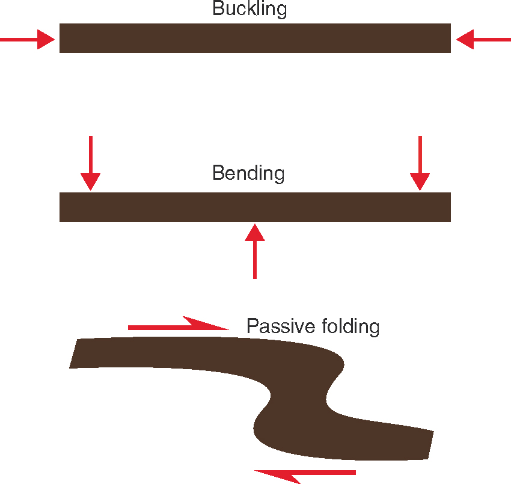 <!-- .element style="float: right" width="95%" -->

<--o-->

## Active Folding or Buckling

Buckling occurs when a competent layer in a less competent matrix is shortened parallel to the length of the layer.

Buckling implies that there is:

1. Layer parallel shortening
1. Viscosity constrast
1. Irregularities on which folds can initiate

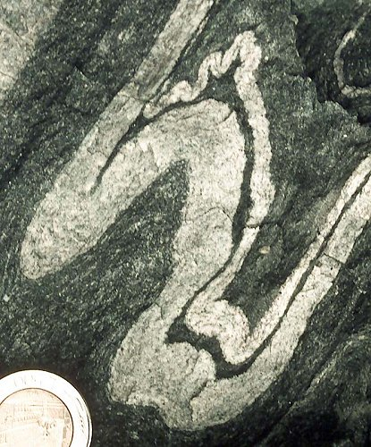 <!-- .element style="float: right" width="90%" -->

<--o-->

## Active Folding or Buckling

Layers with different viscosities

$\mu_1 < \mu_2$

Biot found from experiments...

$\lambda = 2 \pi H_t \sqrt[3]{\frac{\mu_1}{6\mu_2}}$

Fold wavelength depends on layer thickness and viscosity contrast.

 <!-- .element style="float: right" width="90%" -->

<--o-->
<!-- .slide: data-background="Figures-Folds-and-Folding-Mechanisms/photos/Fossen_Chapter11_Buckling.jpg" -->

<--o-->

## Active Folding or Buckling
### Flexural Slip 

- Requires weak coupling between layers
- Slip occurs on bedding planes
- Bed thickness is constant
- No slip at hingee

Slickenlines on folded weak layers and constant bed thickness reveal flexural slip

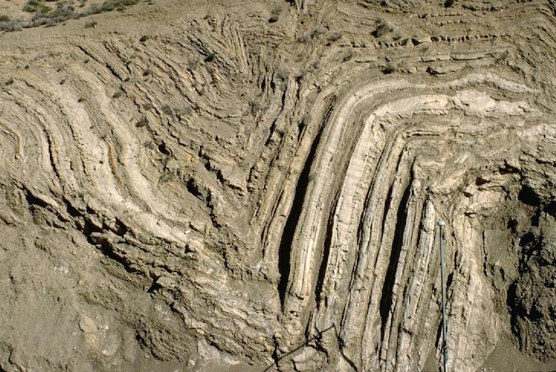 <!-- .element style="float: center" width="80%" -->

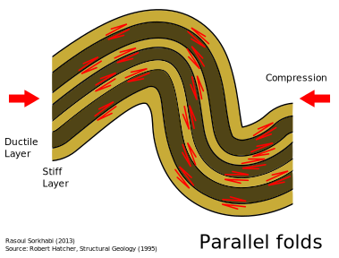 <!-- .element style="float: center" width="90%" -->

<--o-->
## Active Folding or Buckling
### Flexural Flow

- Requires some weak layers
- within layer flow Beds are sheared in limbs
- Thickening in hinge
- No shear at hinge

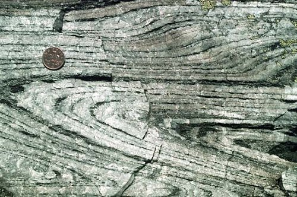 <!-- .element style="float: center" width="95%" -->

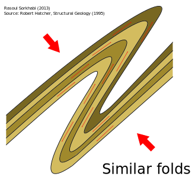 <!-- .element style="float: center" width="95%" -->

<--o-->
<!-- .slide: data-background="Figures-Folds-and-Folding-Mechanisms/photos/Flexural_Flow_similar_folds.jpg" -->

<--o-->
<!-- .slide: data-background="Figures-Folds-and-Folding-Mechanisms/photos/Flexural_Slip_parallel_folds.jpg" -->

<--o-->
### Contrast in behaviour of different beds

 <!-- .element width="95%" -->

<--o-->
## Thickness and Fold wavelength

 <!-- .element style="float: right" width="50%" -->

Different layer thicknesses and/or rheologies produce different wavelengths of folds.

The geometry of the 2nd and 3rd order of folds show where the large structures are!

<--o-->

## Bending

Examples of bending in various settings
- (a) between boudins
- (b) above thrust ramps
- (c) above reactivated faults
- (d) above shallow intrusions or salt diapirs

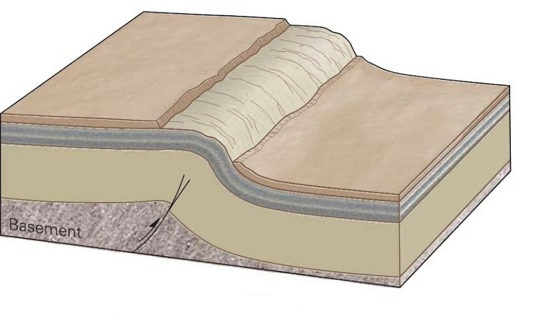 <!-- .element style="float: center" width="95%" -->

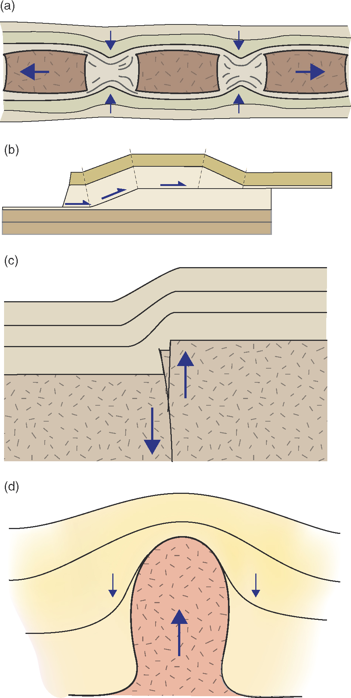 <!-- .element style="float: center" width="90%" -->

<--o-->
<!-- .slide: data-background="Figures-Folds-and-Folding-Mechanisms/photos/Fossen_Passive_Folds_between_boudins.jpg" -->

<--o-->
<!-- .slide: data-background="Figures-Folds-and-Folding-Mechanisms/photos/drag_fold.jpeg" -->

<--o-->
<!-- .slide: data-background="Figures-Folds-and-Folding-Mechanisms/photos/faultbendfoldphotoredo.jpg" -->

<--o-->

## Kinking and Chevron Folding

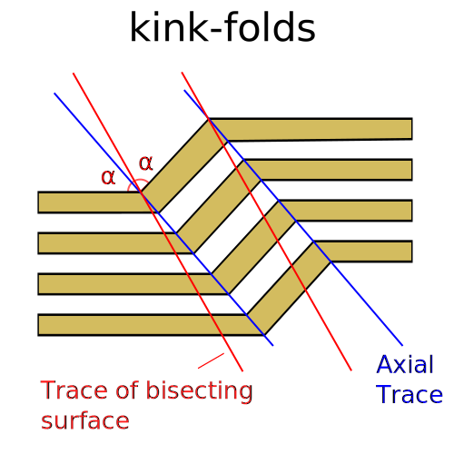 <!-- .element width="50%" -->

<--o-->
<!-- .slide: data-background="Figures-Folds-and-Folding-Mechanisms/photos/kink_fold_Bergen.jpg" -->

<--o-->
<!-- .slide: data-background="Figures-Folds-and-Folding-Mechanisms/photos/Kink_folds_Oman_cherts.jpg" -->

<--o-->

## Bedding / Cleavage relationships

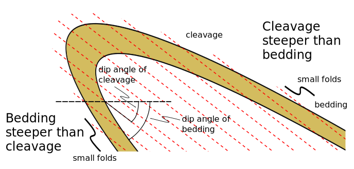 <!-- .element width="90%" -->

<--o-->

## Pumpelly's Rule

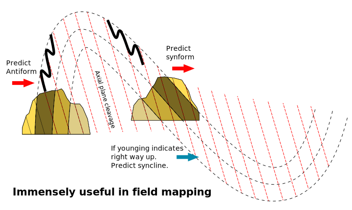  <!-- .element width="90%" -->>

<--o-->

## Folding in Extensional Environment

Listric faults lead to hanging-wall deformation - adaptation folds and drag folds.

Many faults form ramp-flat systems. Incompetent layers (clays, salts) form
the flats, whereas ramps go through competent units.
Detachment faults are large scale flats.

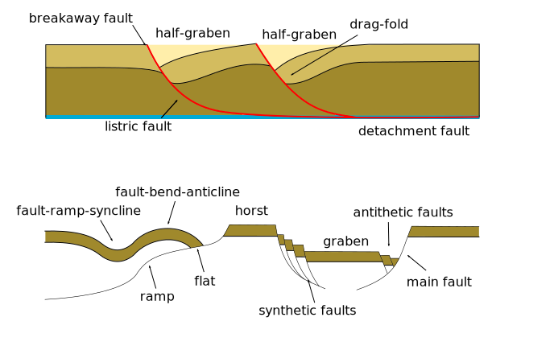 <!-- .element style="float: right" width="95%" -->

<--o-->

## Test

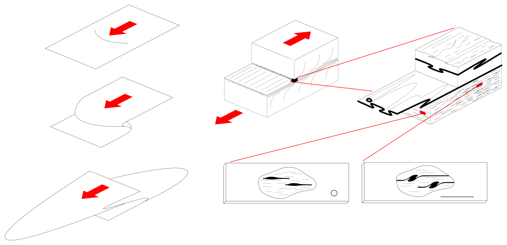 <!-- .element style="float: right" width="95%" -->