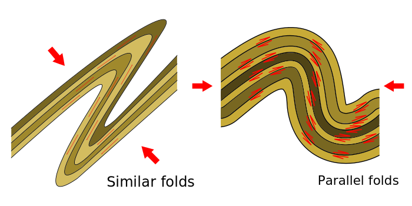

# EMSC 3002

## Fold Geometry 2

  - Louis Moresi (convenor)
  - **Romain Beucher** (lecturer)
  - Chengxin Jiang (lecturer)
  - Stephen Cox (curriculum advisor)

Australian National University

_**NB:** the course materials provided by the authors are open source under a creative commons licence. 
We acknowledge the contribution of the community in providing other materials and we endeavour to 
provide the correct attribution and citation. Please contact louis.moresi@anu.edu.au for updates and 
corrections.

<--o-->

## Resources

1. **Fossen, H, 2011.** *Structural Geology.* Cambridge University Press, 2nd Edition **Chapter 11**
1. **McClay, K.R. 1991.** *The Mapping of Geological Structures.* John Wiley & Sons.  **Chapter 3**
1. **Park, R.G., 1995.** *Foundations of Structural Geology.* Blackie & Sons Ltd. **Chapter 2**
1. **Davis, G.H. and Reynolds, S.J., 1996.** *Structural Geology of Rocks and Regions.* 2nd Edition, John Wiley & Sons. **Chapter 7**
<!-- 1. **Hatcher, R.D., 1990.** *Structural Geology - Principles, Concepts, and Problems*, 2nd Edition, Prentice-Hall -->
<!-- 1. **Ramsay, J.G. and Huber, M.I. 1983.** *Modern Structural Geology. Volume 1: Strain Analysis.* Academic Press. -->
<!-- 1. **Ramsay, J.G. and Huber, M.I. 1987.** *Modern Structural Geology. Volume 2: Folds and Fractures.* Academic Press. -->

<--o-->

## Intended learning outcomes

Students will be able to:

- **Classify folds** according to fold terminology.
- Understand **Folding Mechanims**
- Find second order folds and cleavage
- Identify **folding and faulting in extensional** regimes
- Identify **folding and faulting in compressional** regimes.

<--o-->

## Different ways of forming folds

1. **Buckle folds** 
    - Layer parallel shortening.
    - Internal deformation within layer.
    - Flexural slip folds or Flexural flow mechanisms
1. **Bending folds**
    - At High level in crust above basement faults
1. **Passive folds**
    - Accentuates existing structures at high T.
1. **Shear folds**
    - Rare, found in shear zones.

<--o-->

## Fold formed by buckling

Layers with different viscosities

$\mu_1 < \mu_2$

Biot found from experiments...

$\lambda = 2 \pi H_t \sqrt[3]{\frac{\mu_1}{6\mu_2}}$

Fold wavelength depends on layer thickness and viscosity contrast.

 <!-- .element style="float: right" width="95%" -->

<--o-->

## Buckling Folding Mechanisms 

<--o-->

## Large Similar folds in Salt mine

 <!-- .element style="float: center" width="80%" -->

<--o-->

## Mechanical Contrast

<--o-->

## Thickness and Fold wavelength

 <!-- .element width="90%" -->

<--o-->

## Pumpelly's Rule

  <!-- .element width="90%" -->>

<--o-->

## Folding in Extensional Environment

Listric faults lead to hanging-wall deformation - adaptation folds and drag folds.

Many faults form ramp-flat systems. Incompetent layers (clays, salts) form
the flats, whereas ramps go through competent units.
Detachment faults are large scale flats.

 <!-- .element style="float: right" width="95%" -->

<--o-->
