# EMSC 3002

## Ductile Deformation and Shear zones

- Louis Moresi (convenor)
- **Romain Beucher** (lecturer)
- Chengxin Jiang (lecturer)
- Stephen Cox (curriculum advisor)

Australian National University

_**NB:** the course materials provided by the authors are open source under a creative commons licence. 
We acknowledge the contribution of the community in providing other materials and we endeavour to 
provide the correct attribution and citation. Please contact louis.moresi@anu.edu.au for updates and 
corrections._

<--o-->

## Resources

1. **Fossen, H, 2011.** *Structural Geology.* Cambridge University Press, 2nd Edition **Chapter 11**
1. **McClay, K.R. 1991.** *The Mapping of Geological Structures.* John Wiley & Sons.  **Chapter 3**
1. **Park, R.G., 1995.** *Foundations of Structural Geology.* Blackie & Sons Ltd. **Chapter 2**
1. **Davis, G.H. and Reynolds, S.J., 1996.** *Structural Geology of Rocks and Regions.* 2nd Edition, John Wiley & Sons. **Chapter 7**
<!-- 1. **Hatcher, R.D., 1990.** *Structural Geology - Principles, Concepts, and Problems*, 2nd Edition, Prentice-Hall -->
<!-- 1. **Ramsay, J.G. and Huber, M.I. 1983.** *Modern Structural Geology. Volume 1: Strain Analysis.* Academic Press. -->
<!-- 1. **Ramsay, J.G. and Huber, M.I. 1987.** *Modern Structural Geology. Volume 2: Folds and Fractures.* Academic Press. -->

<--o-->

## Intended learning outcomes

- Understand he concept of shear zones and how they form
- Being able to differentiate between different types of shear zones
- Understand theoretical aspects of plastic shear zones and what information they may contain

<--o-->

## Transition from brittle to ductile beahviour with increasing depth

Gradual Brittle-Ductile transition from faults, which normally form in the upper crust, and ductile shear zones.

The depth of the transition depends on the **temperature gradient** and the **mineralogy** of the crust.
For a granitic crust it normally occurs in the range of 10-15km.

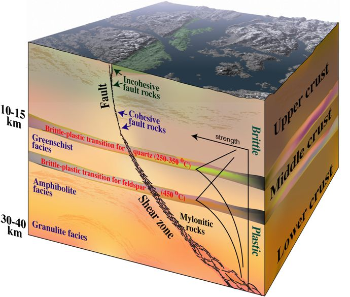 <!-- .element style='float: right' width='90%' -->

<--o-->

## Shear zones

Strain and Shear strain in particular tend to localise into zones or bands.
Shear zones are classic examples of strain localisation.

*A Shear zone is a tabular zone in which strain is notably higher than in the surrounding rock.*

Shear zones occur at almost any scale in any tectonic regime and form at any depth, almost most commonly in the plastic regime.
The definition of shear zone is not restricted to a specific scale.

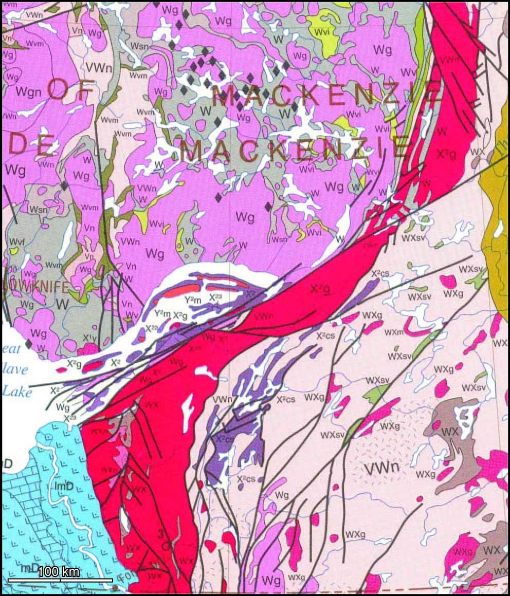 <!-- .element style='float: right' width='90%' -->

<--o-->

## Shear zone: Definition

Strain and Shear strain in particular tend to localise into zones or bands.
Shear zones are classic examples of strain localisation.

*A Shear zone is a tabular zone in which strain is notably higher than in the surrounding rock.*

Shear zones occur at almost any scale in any tectonic regime and form at any depth, almost most commonly in the plastic regime.
The definition of shear zone is not restricted to a specific scale.

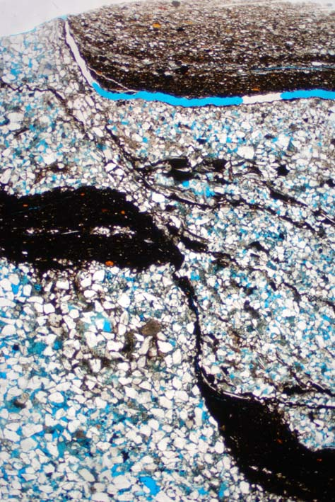 <!-- .element style='float: right' width='90%' -->

<--o-->

## Shear Zone: Definition

Broad definition goes beyond **simple shear** deformation:

- pure shear zones
- subsimple shear zones
- simple shear zones

<--o-->

## Shear Zone: Definition

Broad definition include **faults** and **ductile shear zones**.

**shear zones** have a thickness that is significant relative to their displacement.

<--o-->
## Shear zones: Classification
### According to style or distribution of strain

- Ductile Shear Zones
- Brittle-Ductile Shear zones
- Brittle SHear zones (Fault)

**Ductile shear zones** show a gradual distribution of strain. They show evidence of both plastic and brittle deformation mechanisms
**Faults** or **non-ductile shear zones** are essentially formed by brittle deformation. Faults are a subclass of shear-zones.

Other subclasses can be defined based on the kinematics, mineral deformation mechanisms, metamorphic grade etc.

<--o-->
## Shear zones: Classification
### According to deformation mechanism

- Plastic Shear Zone: Deformation occurs by crystal-plastic mechanisms (e.g. dislocation) and diffusion
- Britle mechanism shear zone: Deformation is dominated by britlle mechanisms (cataclasis, frictional sliding, rigid rotation)

<--o-->
### What do we actually mean by "Ductile" and "Brittle"?

**Ductile** should be used about the style of deformation where passive markers preserve continuity. Ductility is scale dependent.

**Brittle** (**style**) (as opposed to ductile) means that discontinuities form(ed) during deformation. In this usage the term is scale dependent.

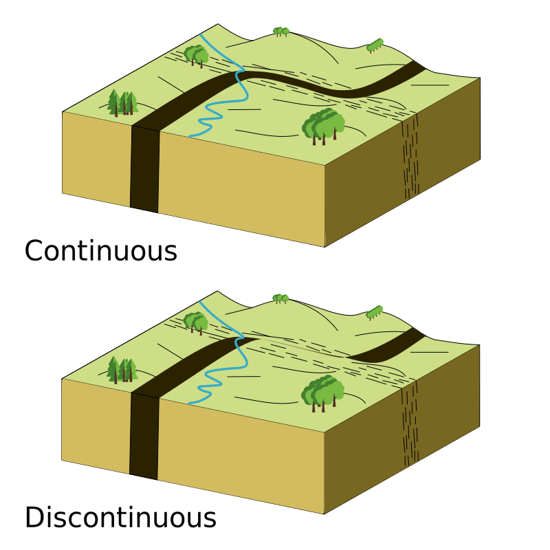 <!-- .element style='float: right' width='90%' -->

<--o-->

### What do we actually mean by "Ductile" and "Brittle"?

**Brittle Mechanisms** is different: it means microscale frictional sliding and grain rolling.

This makes the term **Brittle shear zone** a bit ambiguous unless the meaning of the term "brittle" is specified. The expressions **Brittle-style shear zone** and **Bittle-mechanism shear zone** are unambiguous.

 <!-- .element style='float: right' width='90%' -->

<--o-->

## Shear zones: Classification
### Kinematic classification

- compaction zones
- simple shear zones
- dilation zones

<--o-->

### General Characteristics

- Shear zones are tabular zones of strain localization in the crust
- Shear zones occur on all scales, from thin-section scale to those cutting the entire crust and involving hundreds of km of displacement
- Like faults, Shear zones tend to involve simple shear but could also be influenced by other pure shear
- High strain plastic shear zones develip mylonitic fabrics.
- Shear zones may be reverse, normal, strike-slip or oblique.
- Shear zones tend to have lower dips than faults

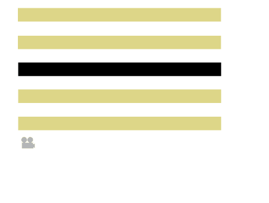 <!-- .element style='float: right' width='90%' -->

<--o-->

### Brittle versus plastic shear zones

Elements within a shear zone can deform plastically and brittely at the same time.

The deformation mechanism depends on temperature, pressure, strain rate, mineralogy, heterogeneities,
amount of fluid available etc. and can vary through space and time.

<--o-->

###  Brittle mechanisms shear zones

- Brittle mechanisms dominate during shearing
- Form at shallow depths (0-10km) in the brittle regime.
- Can show ductile deformation and brittle deformation styles

*mm-wide shear band in sandstone. The shear zone is ductile but deformed by brittle mechanisms (grain rotation and sliding)*

 <!-- .element style='float: right' width='90%' -->

<--o-->

### What Deformation Mechanisms are brittle?

<--o-->

### Plastic Shear zones

- Dominated by plastic (non-frictional) deformation mechanisms
- Ductile, meaning that passive markers can be traced continuously through the zone.
- Form in middle and lower crust.
- In evaporites at shallow depths.
- Can me many km thick.

 <!-- .element style='float: right' width='90%' -->

<--o-->

### What Deformation Mechanisms are plastic?
<--o-->

### Brittle shear zones

Brittle deformation dominates: **cataclasic flow** which involves micro-fracturing, frictional sliding, rigid rotations.
We talk about **brittle** or **frictional shear zones**.

- Markers are displaced by sharp discontinuities
- Form at shallow crustal depths and involve brittle deformation mechanisms
- Faults and fault zones are the most common types of shear zones.
- A single slip surface (fault surface) is not a brittle shear zone because it does not have a thickness.

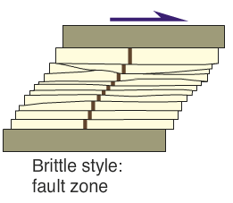 <!-- .element style='float: right' width='90%' -->

<--o-->
<!-- .slide: data-background="Figures-Shear_zones/Photos/ShearZone18.jpg" -->

<--o-->

### Brittle-ductile shear zones

The transition between brittle and plastic deformation can be quite wide. We talk of **brittle-plastic shear zones** which
can include both plastic and brittle deformation.

Markers are affected by sharp discontinuities (slip surfaces). The discontinuities can be related to weak layers or laminae in the
rock (e.g. layers rich in micas in gneiss)

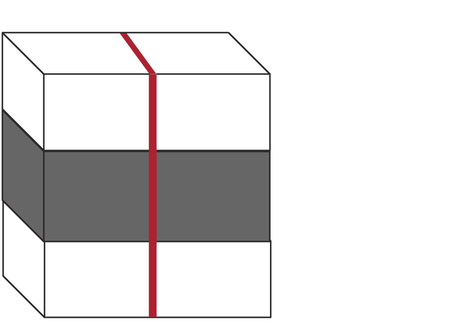 <!-- .element style='float: right' width='90%' -->

<--o-->
### Brittle-ductile shear zones

- The offset of brittle components is comparable to the offset of ductile strain.
- brittle components include Extension fractures, Veins, Slip surfaces
- Some brittle-ductile shear zones involve a combination of plastic and brittle deformation mechanims. Others deform by means of brittle deformation only.

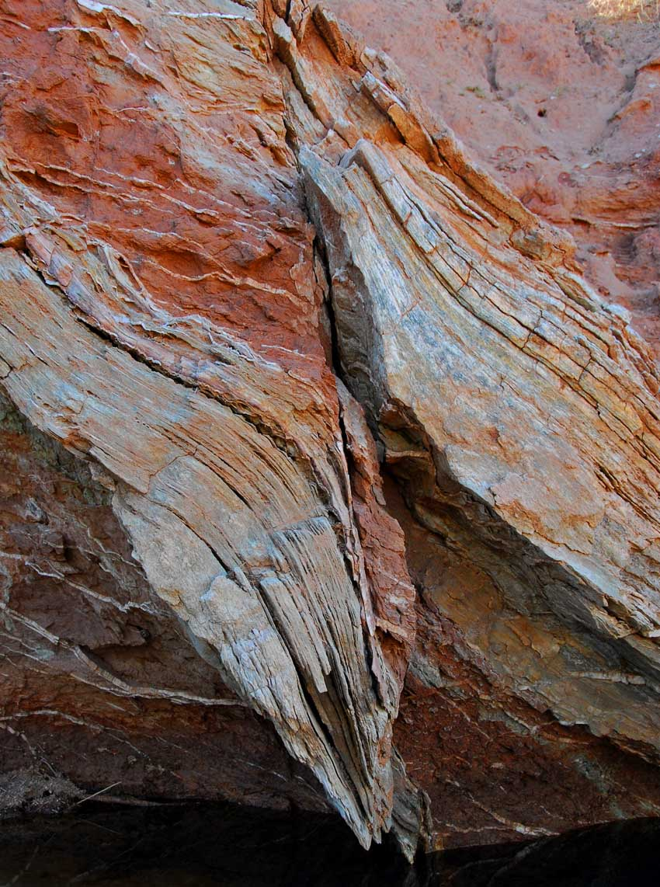 <!-- .element style='float: right' width='90%' -->

<--o-->
### Example of Brittle-ductile shear zones

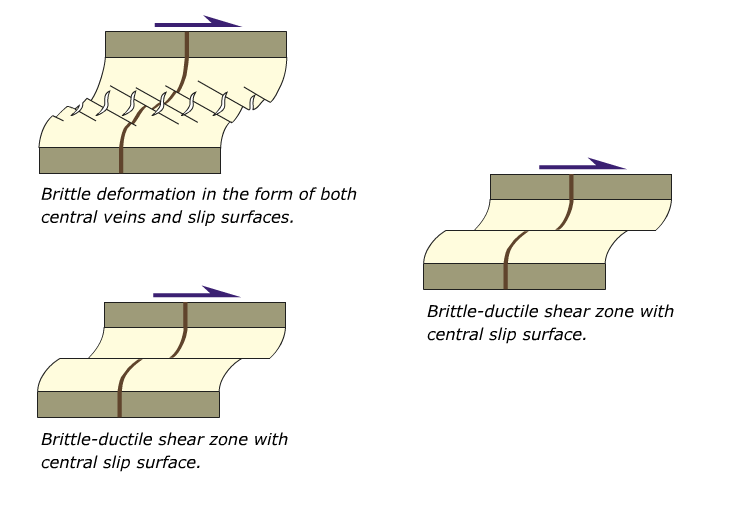 <!-- .element style='float: right' width='90%' -->

<--o-->
### Vein arrays

A special type of Brittle-ductile shear zones

- En-echelon filled fractures
- Dominated by brittle deformation with some plastic mechanisms
- Form near the plastic-brittle transition in the crust

They typically form in the brittle upper crust (3-15km depth)

) <!-- .element style='float: right' width='90%' -->

<--o-->
<!-- .slide: data-background="Figures-Shear_zones/Photos/ShearZone15.jpg" -->

<--o-->
### Ductile shear zones

Ductility is different than plasticity in the sense that it relates to continuity of original markers.
**continuous deformation / strain**: marker layers can be traced through the zone at the mesoscopic scale.

Most plastic shear zone preserve continuity, some brittle shear zones too.
A **ductile shear zone** can deform britelly and plastically.

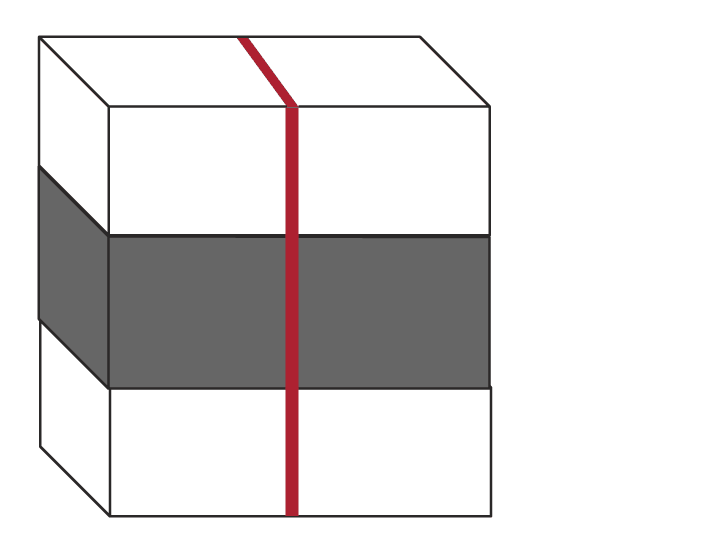 <!-- .element style='float: right' width='90%' -->

<--o-->

### Ductile shear zones

Ductility is different than plasticity in the sense that it relates to continuity of original markers.
**continuous deformation / strain**: marker layers can be traced through the zone at the mesoscopic scale.

Most plastic shear zone preserve continuity, some brittle shear zones too.
A **ductile shear zone** can deform britelly and plastically.

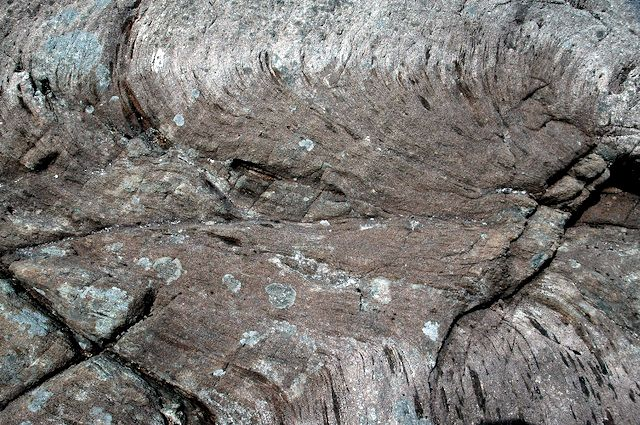 <!-- .element style='float: right' width='90%' -->

<--o-->

### Ductile shear zones

In most cases the deformation is **semi-ductile** as we often observe small sharp discontinuities.

Some shear zones show no continuity at all (heavily fractured zone, breccias).

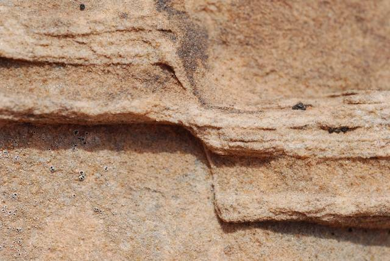 <!-- .element style='float: right' width='90%' -->

<--o-->
<!-- .slide: data-background="Figures-Shear_zones/Photos/ShearZone5.jpg" -->

<--o-->

**Classification: ductility / plasticity domain**

<--o-->

## The ideal plastic shear zone

- Limited by 2 planar boundaries that separate the area deformed from the surrounding rocks.
- Perfectly ductile and involve **simple shear** with or without **compaction / dilation**
- Present a foliation, lineation and evidence of strain variation. 

Ideal plastic shear zones are found in more or less isotropic rocks.

<--o-->

## The ideal plastic shear zone

The **foliation** initiate at a 45 degrees angle to the shear plane, perpendicular to the fastest shortening direction of the strain ellipsoid.
It then rotates as the deformation increases and becomes parallel to the shear plane.

A **stretching lineation** can develop and can be used to determine the X-axis.

<--o-->

## Simple shear zones

- Plane strain deformation with $$W_k = 1$$
- No shortening nor stretching along or normal to the zone
- ISA1 oriented at 45 degrees to the shear plane
- Strain ellipsoid X-axis initiate at 45 degrees to the walls and progressively rotates towards parralelism

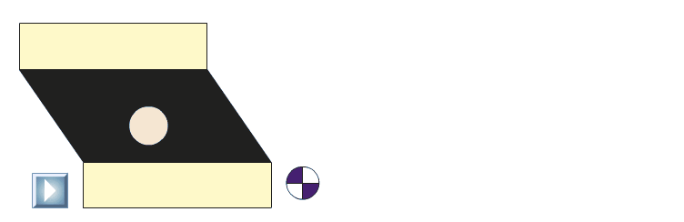 <!-- .element style='float: right' width='70%' -->
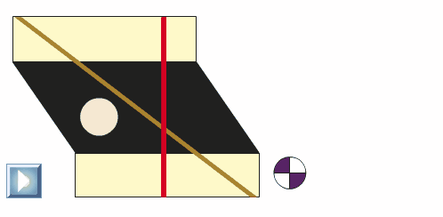 <!-- .element style='float: right' width='70%' -->

<--o-->

## Instantaneous Stretching Axes in Simple Shear zones

- ISA are the directions of maximum, minimum and intermediate stretching experienced by a particle in a shear zone.
The minimum axis can be called the maximum shortening direction, the intermediate axis is zero shortening or extension.
- The ISA max and min are oriented at 45 degrees of the walls throughout the deformation.

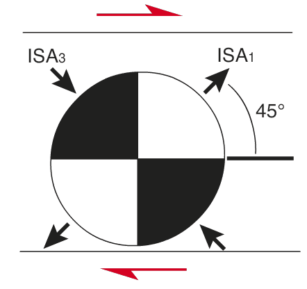 <!-- .element style='float: right' width='90%' -->

<--o-->

## Strain Ellipse orientation in simple shear zones

- The strain ellipsoid can be reduced to an ellipse since no elongation occurs along the intermediate axis.
- As strain accumulates, the strain ellipse rotates so that its long axis approach but never reach parallelism with
the shear direction.
- High strain means lower angle between the shear zone and the flattening X-Y plane.

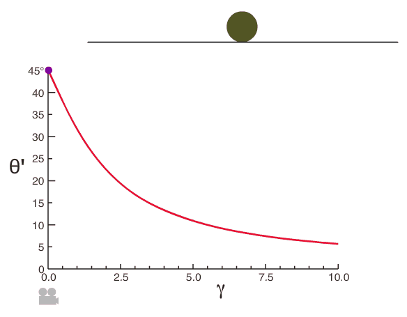 <!-- .element style='float: right' width='90%' -->

<--o-->

## Foliation in simple shear zones

- The foliation approximate the orientation of the X-Y plane.
- The foliation can be treaced through the shear zone and usually appear curved because of higher strain in the central parts.

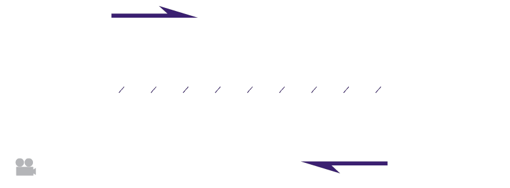 <!-- .element style='float: right' width='90%' -->

<--o-->

## Displacement in simple shear zones

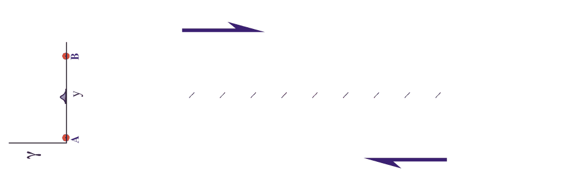 <!-- .element style='float: right' width='90%' -->

<--o-->
## Dilation / Compaction zones

A zone that conpacts by wall-normal displacement is a **compaction zone**

The deformatino is planar and co-axial with zero vorticity.

- Shortening across (not along) the zone
- ISA max normal to the shear zone.
- Long axis of the strain ellipsoid initiate and remain parallel to the walls.
- Passive planar marker that initially made an angle $\alpha$ with the zone obtains a new angle $\alpha'$ that is realted to the dilation through: $$\beta'=cot \beta/(1+\delta)$$

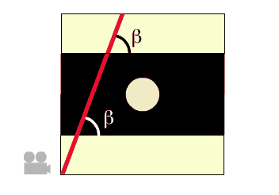 <!-- .element style='float: right' width='90%' -->

<--o-->
## Compactional Shear

Compaction can combine with Simple shear.

The comnpaction conponent will close walls as the zone develops but this will counteracted by general widening of the zone as strain accumulates

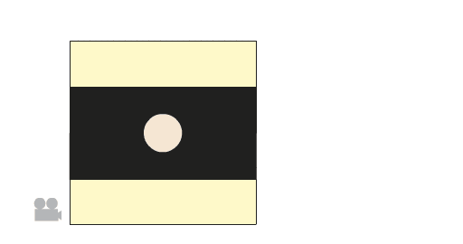 <!-- .element style='float: right' width='90%' -->

<--o-->

## Instantaneous Stretching Axes in Compactional Shear zones

- Compaction Rotates ISA so that ISA max (The direction of fastest strecthing) makes an angle $\theta$ withthe shear plane that is les tham 45 degrees.
- The stronger the compaction, the larger the deviation from 45 degrees.
- For dilational simple shear the angle $\theta$ is larger than 45 degrees.

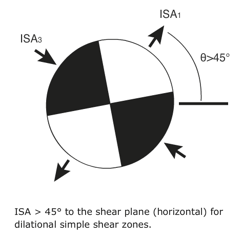 <!-- .element style='float: right' width='90%' -->

<--o-->

## Instantaneous Stretching Axes in Compactional Shear zones

- Compaction Rotates ISA so that ISA max (The direction of fastest strecthing) makes an angle $\theta$ withthe shear plane that is les tham 45 degrees.
- The stronger the compaction, the larger the deviation from 45 degrees.
- For dilational simple shear the angle $\theta$ is larger than 45 degrees.

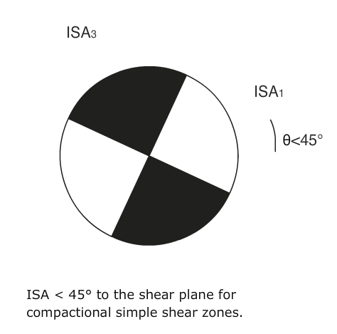 <!-- .element style='float: right' width='90%' -->

<--o-->

## Mylonites

Highly strained rocks in the central part of some plastic shear zones.

Pre-existing structures and textures are totally flattened and transposed and are hard to identify.

<--o-->

## Kinematic indicators

### Asymmetric structures

The (a)symmetry of mylonitic structures can be used to determine the sense of shear and the degree of coaxiality of the deformation.

<--o-->

## Kinematic indicators
### Deflected markers

Rotation of planar marker from an area of low strain to an area of high strain provide very reliable criteria for sense of shear.

<--o-->

## Kinematic indicators
### Mylonitic foliation and shear bands (S-C structures)

The foliation usually trace the XY-plane of the strain ellipsoid.

The foliation (S for shistosity) curves in and out of the C-surfaces (C for 'cisaillement', french for 'shear') and the sense
of deflection reflect the sense of shear of the shear-zone.

It is important to remember that C structures form relatively late and may only reflect the last stage of deformation.

<--o-->

## Kinematic indicators
### Microscale foliation

Mineral aggregates are usually part of the foliation but the main axis of the deformed grain define an oblique foliation.

Result of 2 competing effects:

- strain produced by grain elongation
- dynamic recristallisation

The oblique foliation reflect the last increment of deformation while the foliation integrates the entire deformation history.

Any angle with the foliation indicates that the deformation is non coaxial and can help in determining the degree of non coaxiality.
It can also help to determine the sense of shear.

<--o-->

## Kinematic indicators
### Mica fish

Type of S-C structure

- Tails curve away from the genral orientation
- The asymmetry indicates the sense of shear

<--o-->

## Kinematic indicators
### Foliation fish and foliation boudinage

Parts of strongly foliated mylonite back-rotate with respect to the shear direction and create structures similar to mica-fish.

<--o-->

## Kinematic indicators
### Boudinage

Rotated boudins can be used to determine the sense of shear.

<--o-->

## Kinematic indicators
### Porphyroclastes

Recrystallised material around large mineral can form tails.

Asymmetry highlight non-coaxial deformation with the final shape being a function of Wk.

<--o-->

## Kinematic indicators
### Folds and cleavage

Asymmetric folds and associated cleavages within the shear zone can give the sense of shear.

The mylonitic foliation is often folded.

Pre-existing structures (eg dikes)

<--o-->

## Kinematic indicators
### Quarter structures

Association of contraction and extension structures around tectonic lenses.

<--o-->

## Kinematic indicators
### Crystallographic orientation

Mesure of C-axis orientation of quartz grains.

Asymmetry with respect to foliation gives sense of shear.

<--o-->

## Kinematic indicators
### Tiling of objects

Require large densities of crystals. Common in porphyritic magmatic rocks.

<--o-->

## Kinematic indicators
### Shear transfer structures

<--o-->

## Kinematic indicators
### Micro-faulted mineral grains

<--o-->

## Kinematic indicators
### Fiber and veins

Orientation of extensional veins indicate the sense of shear.
Fibers are usually more reliable.
If the deformation is non-coaxial, the veins rotate and become sygmoide that can be used to determine the sense of shear.
