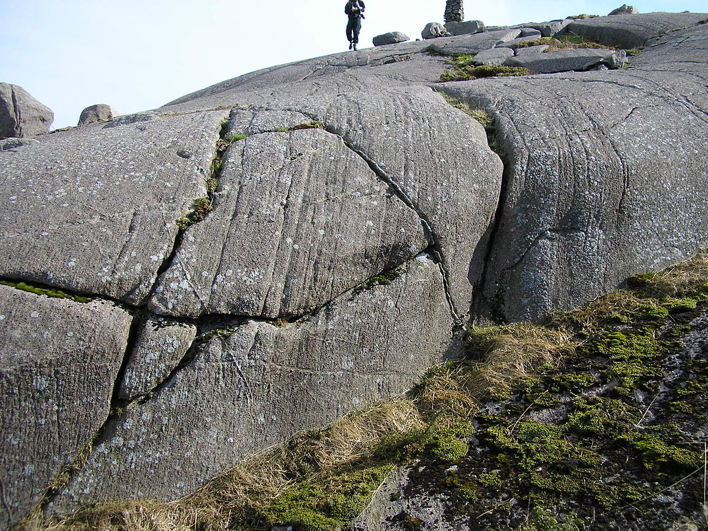
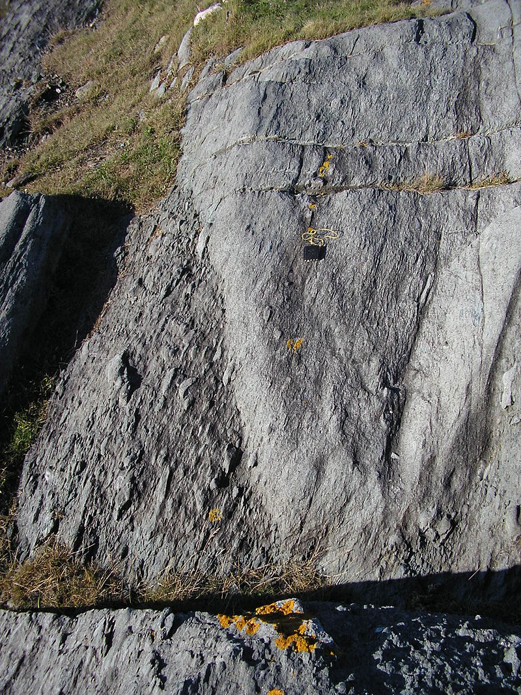
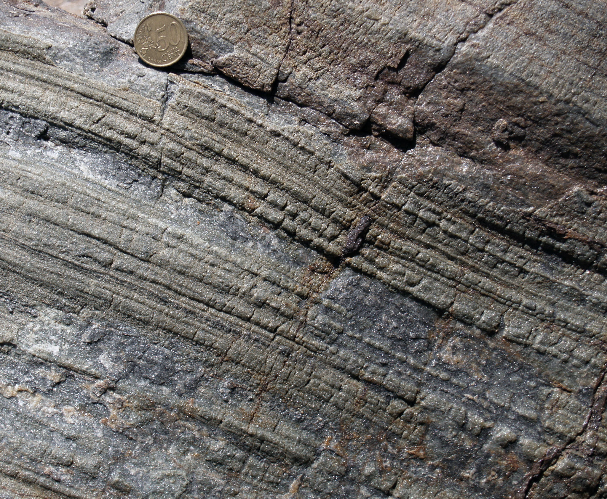
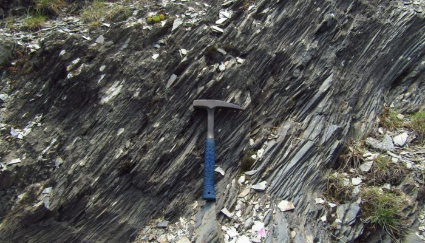
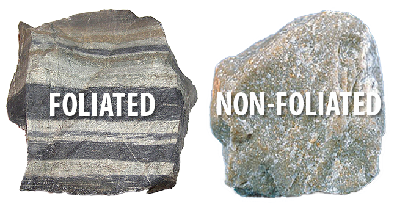

# EMSC 3002

# Structures Associated with Folding
## Relationships between folds and foliation

  - Louis Moresi (convenor)
  - **Romain Beucher** (lecturer)
  - Chengxin Jiang (lecturer)
  - Stephen Cox (curriculum advisor)

Australian National University

_**NB:** the course materials provided by the authors are open source under a creative commons licence. 
We acknowledge the contribution of the community in providing other materials and we endeavour to 
provide the correct attribution and citation. Please contact louis.moresi@anu.edu.au for updates and 
corrections._

<--o-->

## Resources

1. **Fossen, H, 2011.** *Structural Geology.* Cambridge University Press, 2nd Edition **Chapter 12**
1. **McClay, K.R. 1991.** *The Mapping of Geological Structures.* John Wiley & Sons.  **Chapter 4**
1. **Park, R.G., 1995.** *Foundations of Structural Geology.* Blackie & Sons Ltd. **Chapter 3**
1. **Davis, G.H. and Reynolds, S.J., 1996.** *Structural Geology of Rocks and Regions.* 2nd Edition, John Wiley & Sons. **Chapter 8**
<!-- 1. **Hatcher, R.D., 1990.** *Structural Geology - Principles, Concepts, and Problems*, 2nd Edition, Prentice-Hall -->
<!-- 1. **Ramsay, J.G. and Huber, M.I. 1983.** *Modern Structural Geology. Volume 1: Strain Analysis.* Academic Press. -->
<!-- 1. **Ramsay, J.G. and Huber, M.I. 1987.** *Modern Structural Geology. Volume 2: Folds and Fractures.* Academic Press. -->

<--o-->

## Intended learning outcomes

<--o-->

## Definition: Fabric

The term **fabric** is used to describe penetrative and distributive components of rock masses.

A fabric is built of minerals and mineral aggregates  with a *preferred orientation* that
*penetrate the rock* at the *microscopic to centimeter scale*

The distance between the elements is typically less than 10cm which excludes sets of faults and
small shear zones as fabric elements.

*Primary fabric in anorthosite intrusion, Rogaland, Norway* source: #/media/File:Primary_fabric_Jibbeheia.JPG)

 <!-- .element style="float: right" width="95%" -->

<--o-->
<!-- .slide: data-background="Figures-Structures-Associated-with-Folding-1/Photos/Wikipedia_1280px-Primary_fabric_Jibbeheia.jpeg" -->

<--o-->

**Primary fabrics** are acquired during the formation of the rock (sedimentary or magmatic fabrics).
They need to be accounted for when considering the deformation history of a rock.
Any fabric that does not result from the deformation of a rock.

Metamorphic rocks typically show **strong fabrics** and are often referred as **Tectonites**.
**L-Tectonites** show Linear fabrics while **S-Tectonites** have Planar fabrics.

*Deformed waterlain volcanic sediments. Primary fabric (bedding) shown by abrupt change in clast size, secondary fabric shown by penetrative S-fabric, cleavage, in fine-grained rock, and by shape fabric in deformed volcanic clasts. Cape Forchu, Nova Scotia.* source: #/media/File:Primary_and_secondary_fabrics.JPG)

 <!-- .element style="float: right" width="90%" -->

<--o-->
<!-- .slide: data-background="Figures-Structures-Associated-with-Folding-1/Photos/Wikipedia_800px-Primary_and_secondary_fabrics.jpeg" -->

<--o-->

### Linear, Planar and Random fabrics

- **Linear Fabric**: Elongated elements with preferred orientation
- **Planar Fabric**: Tabular or platy elements with common orientation. The faric does not
need to be planar in a mathematical sense. It can be affected by folding and wrap around
stronger elements.
- **Random Fabric**: No preferred orientation. Undeformed sedimentary rocks, igneous rocks.

 <!-- .element style="float: right" width="90%" -->

*Stretching Lineation in amphibolite (Cap de Creus) Jordi Carreras Planells*

<--o-->
<!-- .slide: data-background="Figures-Structures-Associated-with-Folding-1/Photos/Hornblende_Lineations.jpeg" -->
<!-- Hornblende lineation in orthogneiss.  Big Silver Creek., Harrison Lake, BC. [49.696595,-121.816864]> -->

<--o-->

### Linear, Planar and Random fabrics

- **Linear Fabric**: Elongated elements with preferred orientation
- **Planar Fabric**: Tabular or platy elements with common orientation. The faric does not
need to be planar in a mathematical sense. It can be affected by folding and wrap around
stronger elements.
- **Random Fabric**: No preferred orientation. Undeformed sedimentary rocks, igneous rocks.

 <!-- .element style="float: right" width="90%" -->

*Jurassic slate in La Grave (Hautes-Alpes, France). These rocks easily split along foliation surfaces that dip towards the left of the image. Don’t believe me? Try to hammer them! Photo © Samuele Papeschi* source: 

<--o-->

## Definition: Foliation

**Foliation** (lat: *folium*, leaf)

Any forming-fabric *planar* or *curviplanar* structure in a metamorphic rock.

A foliation may bed defined by zone of different grain size, flattened objects,
recrystallized tabular grains with a uniform orientation, platy mineral arranged into
millimeter thick domains, densely distributed and cohesive micro-fractures, micro-folds (crenulations).

A foliated rock is by definition *cohesive* but may break preferentially along the foliation.

 <!-- .element style="float: right" width="90%" -->

<--o-->

## Definition: Foliation

 <!-- .element style="float: right" width="90%" -->

<--o-->

### Primary foliation vs Secondary foliation

Geologists usually prefer to reserve the term foliation for plane structures formed by
*tectonic strain*. However, the term is also used for primary sedimentary bedding and magmatic
layering. 

We often distinguish between **Primary foliation** which includes bedding, flow banding lavas and
magmatic layering, and **Secondary foliation** for products of stress and strain. 

**Secondary foliation** is a **Tectonic foliation**. A planar structure formed by tectonic processes.
It includes **cleavages**, **shistosity** and **mylonitic foliations**.

<--o-->

## Definition: Cleavage

The term **cleavage** describe the ability of a rock to split, or cleave, into more or less parallel surfaces.

**cleavage** is a subgroup of **foliations** (not all foliated rocks split preferentially along the foliation).

**cleavage** is found in very-low grade metamorphism and in micaceous gneisses or shists in the form of late-stage crenulation.

Do not confuse with crystallographic cleavage which is the tendency of minerals to break along crystallographic planes).

<--o-->

## Shorthand nomenclature

We use the designation **$S_n$** for foliations, with the **$n$** subscript indicating relative age ($S_0$, $S_1$, $S_2$ etc.)

**$S_0$** referred to the primary foliation, e.g the bedding for a sedimentary rock.

As folds and foliations are often related we associate **$S_1$**, **$S_2$**, **$S_3$**... to generations of folds **$F_1$**, **$F_2$**, **$F_3$**...

We can also refer to deformation phases as **$D_1$**, **$D_2$**, **$D_3$**...
<--o-->

## Cleavage development

**cleavage** is the low-temperature type of **foliation** and is best developed in rocks with abundant platy minerals (philosilicates)

Temperature increases with crustal depth and as it increases so is the mobility of minerals and the potential for recrystallisation.
Cleavage usually develops at temperature below 350-370C. At higher temperature we see **Shistosity** and **Mylonite foliations**.

<--o-->

### Lithology

Lithology is important as different minerals react differently to temperature.

Philosilicates are important and facilitate cleavage development. 

In calcareous rocks, which are generally poor in philosilicates, cleavage is controlled by the mobility of carbonate and the development of 
stylolites.

<--o-->

### Development of Secondary foliations: compaction cleavage

Non-tectonic cleavage and thus often regarded as S_0.

Compaction results in reorientation of mineral grains and collapse of pore space. It usually accentuate and rework the primary foliation S_0.

A clay or claystone will then results in a shale with **compaction cleavage**

<--o-->

#### Pressure solution

Pressure solution or Wet diffusion can occur.

Very common in carbonates where quartz or carbonates are dissolved and result in concentration of residual minerals.
This also happens in clay and claystone where the dissolution of quartz results in concentration of clay minerals.

The seams are **stylolites** and the foliation can be called a **stylolite cleavage** or a **pressure solution cleavage**.

<--o-->

#### Pressure solution

Minerals diffuse away, perpendicular to the direction of sigma 1,  through a very thin film of fluid along
the grain boundaries and precipitates in pressure shadows of larger and/or more rigid grains or are simply trnsported out of the rocks.

Very significant amount of material is lost through **pressure solution**. This presents interesting consequences in terms of
thermodynamics and fluid flow though the crust.

<--o-->

### Development of Secondary foliations: early tectonic development

Rock (e.g. sedimentary rock) exposed to tectonic stress that leads to progressive shortening of sedimentary beds.

Typical of foreland regions of orogenic belts.

In limestones and sandstones, the first foliation to form is a pressure solution cleavage, typically stylolithic.

<--o-->

### Development of Secondary foliations: early tectonic development

If $$\sigma 1$$ is horizontal, this result in a S_1 cleavage that is at high angle with S_0.

When S_0 and S_1 are equally marked, we can obtain a **pencil cleavage**: the rock will fracture along both S_0 and S_1 along
pencil shaped fragments.

**Pencil cleavage* can also occur because of change in the regional stress field.

<--o-->

### Development of Secondary foliations: early tectonic development

If the tectonic shortening persist, S_1 eventually dominates the structure and texture of the rock.
We obtain a **slate**, a **slaty cleavage**.

The metamorphism is low. We are at the very beginning of recristallisation of clay minerals. 
Cleavage forms through grain rotation, growth of minerals with a preferred direction, and most importantly
**pressure solution**  of the most solvent minerals in the rock at the microscopic scale. 

We can thus observe **domainal cleavage** with **Quartz-Feldspar (QF) Domain** and
**philosilicates (M) Domain**.

<--o-->

### Development of Secondary foliations: early tectonic development

Early tectonic **Domainal cleavage** are often **Disjunction cleavage** which means they
cut across than rather crenulates (folds) preexisting cleavage.

<--o-->

### Development of Secondary foliations: greenshist facies, from cleavage to shistosity

New philosilicates grow at the expense of clay minerals in shales and slates (**philitic cleavage**)

New micas grow larger (visible in hand sample) with new basal planes more or less perpendicular to the Z-axis of the strain ellipsoid and more or
less perpendicular to sigma 1.

We have a more pronunced development of the QF and M domains as the wet dissolution or **pressure solution**
becomes more efficient.

Foliation is no longer a cleavage but a shistosity. The rock is a **shist**.

<--o-->

### Development of Secondary foliations: greenshist facies, from cleavage to shistosity

While wet diffusion (pressure solution) governs cleavage formation, crystal plastic deformation mecanisms become
more important during the formation of shistosity.
 
<--o-->

#### Secondary tectonic cleavage

A preexisting foliation can be affected by a later cleavage (S2 or higher), as a result of reorientation of the
stress field for example.

The existing foliation is overprinted, generally via folding. We obtain a **crenulation cleavage**

A series of microfolds, < 1cm with parallel axial surfaces.

Depending on the angle between the existing foliation and the stress orientation, the crenulation will be symmetric or asymmetric.

<--o-->

## Relationships between cleavage and folds

### Axial planar cleavage

Cleavage develops more or less along the axial plane of folds.
**axial planar** cleavage are an important link between tectonic foliation and folds in deformed rocks.

<--o-->

### Axial planar cleavage

Cleavage shows a fairly consistent orientation across folds.
This is extremely useful when mapping a region.

<--o-->

### Cleavage refraction

**cleavage refraction** can be observed across layers of contrasting viscosities or competences.

<--o-->

### Transected folds

Sometimes, there is difference between the orientations of cleavages and the axial plane, even when cleavage and folds are
genetically related and in absence of cleavage refraction.

**transecting cleavage** describe a cleavage that intersects the axial surface and the fold hinge.

The folds are referred to as **transected folds**.

Interpretated as the result of transpressive regime, where folds and cleavage rotates and where there is
a slight time difference between the formation of folds and cleavages.
They can also form during co-axial deformation when the ISA rotates.

<--o-->

## Relationships between cleavage and strain

Most cleavage approximate the XY plane of the stress ellipsoid.

Pressure solution is largely responsible for the oblates strain ellipsoids and the large
volume loss associated with cleavage formation.

Compaction in sediment, which generally occurs at low-temperature and shallow depth can involves a 30-40%
reduction in volume. Pressure solution in limestone can accommodate up to 70% shortening.

<--o-->

## Relationships between cleavage and strain

Cleavage and foliations are not always the result of coaxial shortening.

Non-coaxial shearing can result in the development of shear zones that look similar to axial planar cleavage.

