# EMSC 3002

## Structures Associated with Folding: Lineations and Boudinage

  - Louis Moresi (convenor)
  - **Romain Beucher** (lecturer)
  - Chengxin Jiang (lecturer)
  - Stephen Cox (curriculum advisor)

Australian National University

_**NB:** the course materials provided by the authors are open source under a creative commons licence. 
We acknowledge the contribution of the community in providing other materials and we endeavour to 
provide the correct attribution and citation. Please contact louis.moresi@anu.edu.au for updates and 
corrections._

<--o-->

## Resources

1. **Fossen, H, 2011.** *Structural Geology.* Cambridge University Press, 2nd Edition **Chapter 11**
1. **McClay, K.R. 1991.** *The Mapping of Geological Structures.* John Wiley & Sons.  **Chapter 3**
1. **Park, R.G., 1995.** *Foundations of Structural Geology.* Blackie & Sons Ltd. **Chapter 2**
1. **Davis, G.H. and Reynolds, S.J., 1996.** *Structural Geology of Rocks and Regions.* 2nd Edition, John Wiley & Sons. **Chapter 7**
<!-- 1. **Hatcher, R.D., 1990.** *Structural Geology - Principles, Concepts, and Problems*, 2nd Edition, Prentice-Hall -->
<!-- 1. **Ramsay, J.G. and Huber, M.I. 1983.** *Modern Structural Geology. Volume 1: Strain Analysis.* Academic Press. -->
<!-- 1. **Ramsay, J.G. and Huber, M.I. 1987.** *Modern Structural Geology. Volume 2: Folds and Fractures.* Academic Press. -->

<--o-->

## Intended learning outcomes

<--o-->

### Introduction

A *lineation* is a fabric element in which one dimension is significantly larger than the other two.

- Very common in Metamorphic Rocks
- Closely associated with strain and transport or shear direction and in
such useful to determine paleostresses orientations and kinematics.

Different types of lineations, different origins and implications for the history of deformation

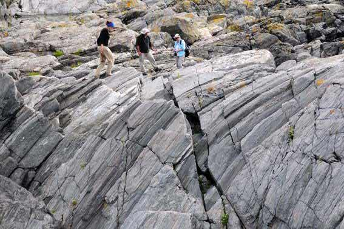 <!-- .element style='float: right' width='90%' -->

<--o-->
<!-- .slide: data-background="Figures-Structures-Associated-with-Folding-3/Photos/Lineations1.jpg" -->

<--o-->
#### Primary or non-tectonic lineations

Can occur in both deformed and non-deformed rocks.

examples:

- Flow lineations and columns in basalts and magmatic rocks.
- Alignements of non spherical pebbles, fossils etc.

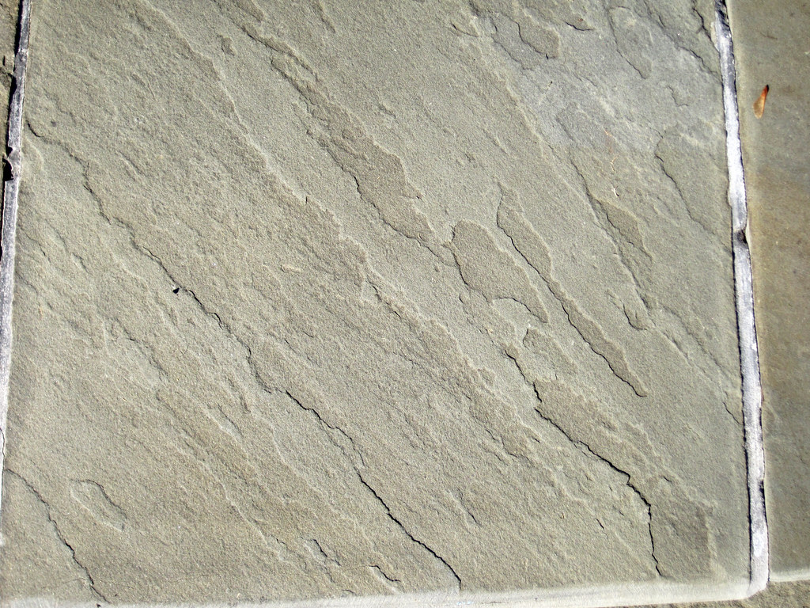 <!-- .element style='float: right' width='90%' -->

<--o-->

#### Tectonic lineations

Linear structures resulting from the deformation of a rock under tectonic stresses.

- **Penetrative lineation**: build-up a linear fabric or **L-Fabric**
- **Surface lineation**: Restricted to a surface (e.g. *Slikenslides*)
- **Geometric lineation**: fold axes, intersection lineations

<--o-->
### Tectonic lineations
#### Processes

There exist a range of processes that can result in the formation of tectonic lineations:

- Rotation
- Crystallisation
- Plastic strain
- Fracture

<--o-->
### Tectonic lineations

#### Processes: Rotation

Rigid minerals can rotate without deforming.

Rotation is most efficient if the strain is constrictional.
It also depends on the original orientation of the object relative to the
stress orientations.

Example: Rotation of amphibole mineral in amphibole-mica schists.

Stiff minerals rotates while the matrix deforms plastically.

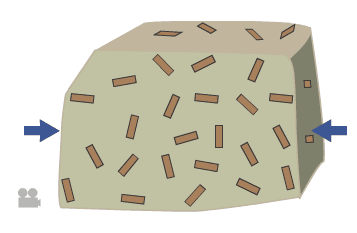 <!-- .element style='float: right' width='100%' -->

<--o-->
### Tectonic lineations

#### Processes: Rotation

Note that relatively high strain is required to rotate minerals of various lengths and shapes into
parallelism. You should always consider the possibility of recrystallization.

Rotations of minerals in a partial melt is possible (during solidification for example).
Tectonic strain and strain related to the emplacemnent of a pluton can produce linear fabrics

 <!-- .element style='float: right' width='100%' -->

<--o-->
### Tectonic lineations

#### Processes: Crystallization

As metamorphic conditions evolve (pressure, temperature, fluids), some minerals become unstable and
new ones crystallize.

If the new mineral are elongated (e.g. pyroxene, tourmaline) and grow in a preferred direction they can define a
mineral lineation.

Growth can be directed by the external stress field and/or existing fabric in the rock.

*Growth of Amhibole during metamorphism, producing a mineral lineation*

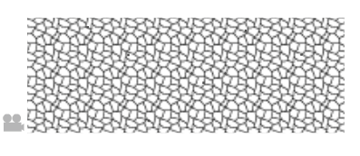 <!-- .element style='float: right' width='100%' -->

<--o-->
### Tectonic lineations

#### Processes: Crystallization

The resulting L-structure is sometimes called **nematoblastic**.

How do we distinguish between crystallization and rotation?

Rotation commonly involves some deformation of the grain.
Rotation is unlikely to achieve perfect parallelism.

*Prismatic mineral without preferred orientation form by static growth, syntectonic growth can produce lineations*

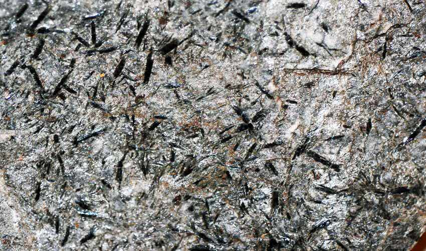 <!-- .element style='float: right' width='100%' -->

<--o-->
### Tectonic lineations

#### Processes: Plastic Strain

**Plastic change in shape**

Strain results from plastic deformation. It may involve:

- diffusion
- dissolution (wet diffusion, pressure solution)
- dislocation migration

Plastic strain can create or accentuate mineral lineations.

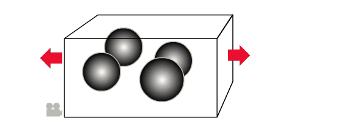 <!-- .element style='float: right' width='90%' -->

<--o-->
### Tectonic lineations

#### Processes: Plastic Strain

**Plastic change in shape**

Spherical objects will be turned into elongated objects.
If there are many objects we can end up with a linear fabric.

Constrictional strains give the most pronounced linear shapes while flattening
strains do not produce strong linear fabrics.

Lineation of this type are called **stretching lineations**.
The stretching direction defines the lineation direction.

 <!-- .element style='float: right' width='90%' -->

<--o-->

#### Lineations related to plastic deformation

**Penetrative lineations** are typically found in rocks that deformed in the plastic regime.

- **L-Tectonites**: Lineations form the dominant fabric (X>>Y>>Z)
- **LS-Tectonites**: Combination of foliations and penetrative lineations (Very common)
- **S-Tectonites**: no or very little linear fabric.

<--o-->

### Tectonic lineations

#### Processes: Fracture

**Brittle change in shape**

Fractures may give objects more linear shapes.

This can happened when minerals are fractured and pulled apart (i.e. boudinaged)

Outcrop-scale boudinage tends to transform planar layers into elongated objects.
Occurs at micro- and macroscopic scales.

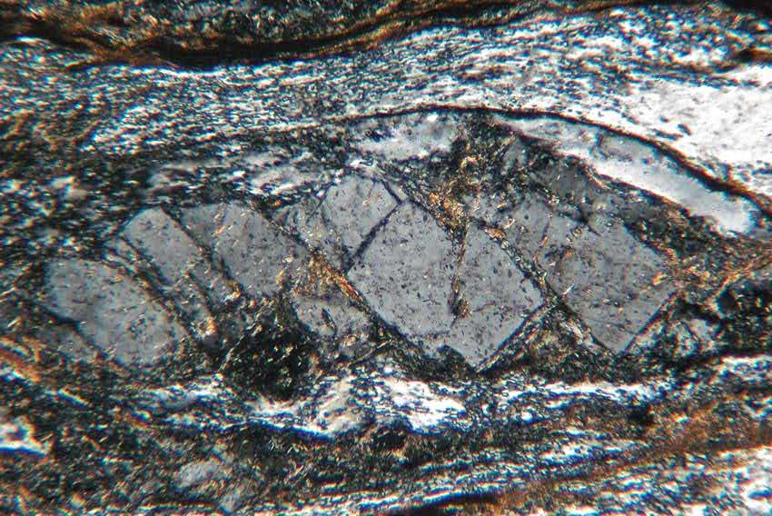 <!-- .element style='float: right' width='90%' -->

<--o-->

### Tectonic lineations

#### Processes: Fracture

**Brittle change in shape**

Fractures may give objects more linear shapes.

This can happened when minerals are fractured and pulled apart (i.e. boudinaged)

Outcrop-scale boudinage tends to transform planar layers into elongated objects.
Occurs at micro- and macroscopic scales.

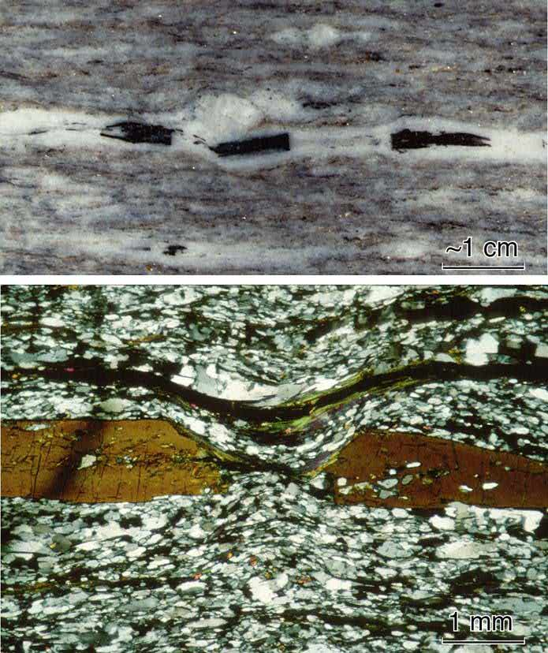 <!-- .element style='float: right' width='80%' -->

<--o-->
<!-- .slide: data-background="Figures-Structures-Associated-with-Folding-3/Photos/Lineations3.jpg" -->

<--o-->
#### Penetrative lineations

##### Stretching lineations

**Stretching lineations**: stretching of minerals into a penetrative stretching lineation form the most common type of lineation in deformed
rocks.

Mineral can grow well-aligned fibrous elements in the direction of stretching or perpendicular to opening walls that define a
**mineral fiber lineation**

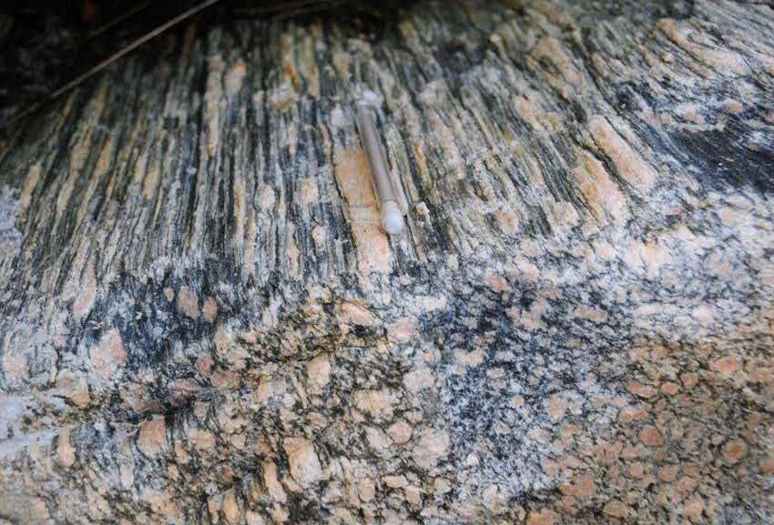 <!-- .element style='float: right' width='90%' -->

<--o-->
<!-- .slide: data-background="Figures-Structures-Associated-with-Folding-3/Photos/Lineations5.jpg" -->

<--o-->
#### Penetrative lineations

##### Mineral lineations

Minerals and mineral aggregates can form a linear fabric via recrystallisation, dissolution / precipitation or rigid rotation.

Cataclasis (crushing) of minerals can also lead to the formation of linerations (example in shear-zones).

*Mineral lineation in granitic gneiss defined by elongated feldspar grains. The lineation is also a stretching lineation.*

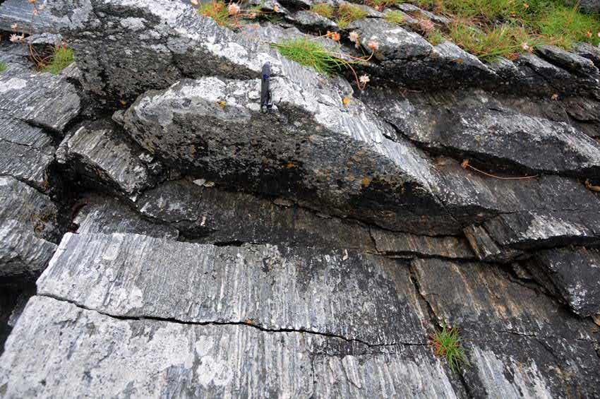 <!-- .element style='float: right' width='90%' -->

<--o-->

### Geometric lineations

#### Fold Axes and Crenulation lineation

Fold axes are theoretical or geometric lines rather than actual physical objects.

High densities of parallel fold axis can constitue a fabric and create a **crenulation lineation**.

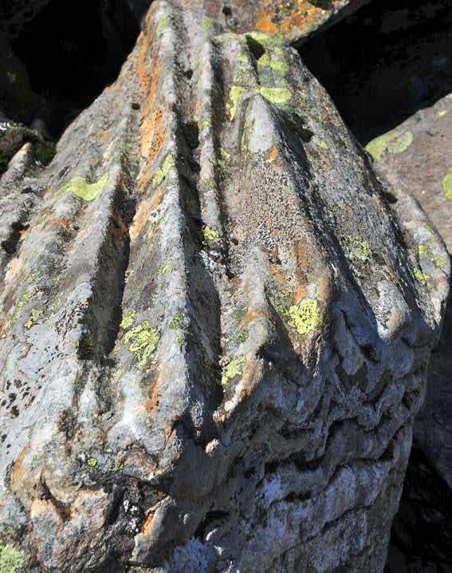 <!-- .element style='float: right' width='70%' -->

<--o-->

### Surface lineations

#### Intersection lineation

Intersection of planar structures in deformed rocks can define an **intersection lineation**.

When the first tectonic cleavage (S1) intersect the bedding (S0), the resulting lineation (L1) can
be observed on the bedding planes.

**Intersection lineations** can also results from the intersection of two tectonic foliations/cleavages.

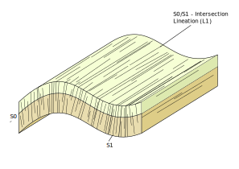 <!-- .element style='float: right' width='90%' -->

<--o-->

### Surface lineations

#### Intersection lineation

*Stereoplot showing bedding orinetation in green and cleavage of the fold to the left.
The intersection lineation is the point of interesection between $S_0$ and the cleavage (square)*

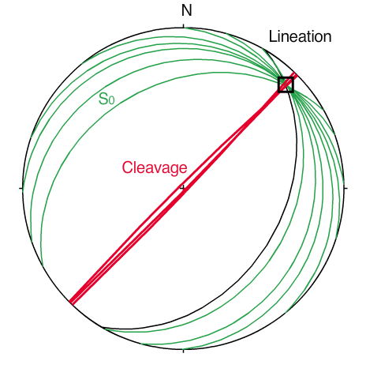 <!-- .element style='float: right' width='90%' -->

<--o-->

### Surface lineations

#### Mullions

**Mullions** are linear deformation structures at interfaces where there is a significant viscosity contrast.

e.g. in metamorphic rocks, at the boundary between Quartzite and Phyllite or Micashist.

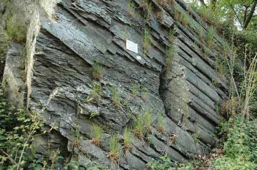 <!-- .element style='float: right' width='90%' -->

<--o-->
<!-- .slide: data-background="Figures-Structures-Associated-with-Folding-3/Photos/Lineations11.jpg" -->

<--o-->

### Surface lineations

#### Mullions

**Mullions** are linear deformation structures at interfaces where there is a significant viscosity contrast.

e.g. in metamorphic rocks, at the boundary between Quartzite and Phyllite or Micashist.

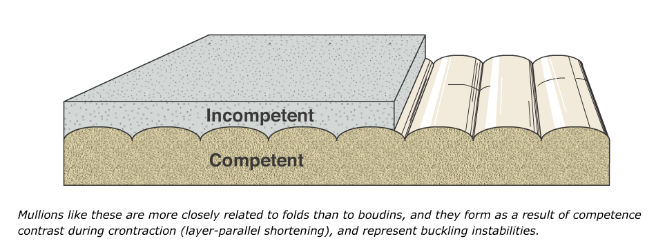 <!-- .element style='float: right' width='90%' -->

<--o-->

### Surface lineations

#### Slickenlines

Occur on fracture surfaces

There are two types of slickenlines: **striations** which are formed by abrasion and **slip fiber lineations** formed by
fibrous growth.

Hard objects and asperities can carve linear tracks known as **fault grooves**

*Slickenlines (striae) on sandstone, near Moab, Utah. Credit Haakon Fossen*

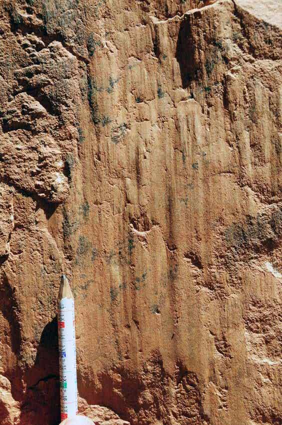) <!-- .element style='float: right' width='70%' -->

<--o-->
<!-- .slide: data-background="Figures-Structures-Associated-with-Folding-3/Photos/Lineations15.jpg" -->

<--o-->

### Surface lineations

#### Slickenlines

In some fractures minerals grow as vein opens. The minerals tend to have an elongated shape and a fibrous aspect.

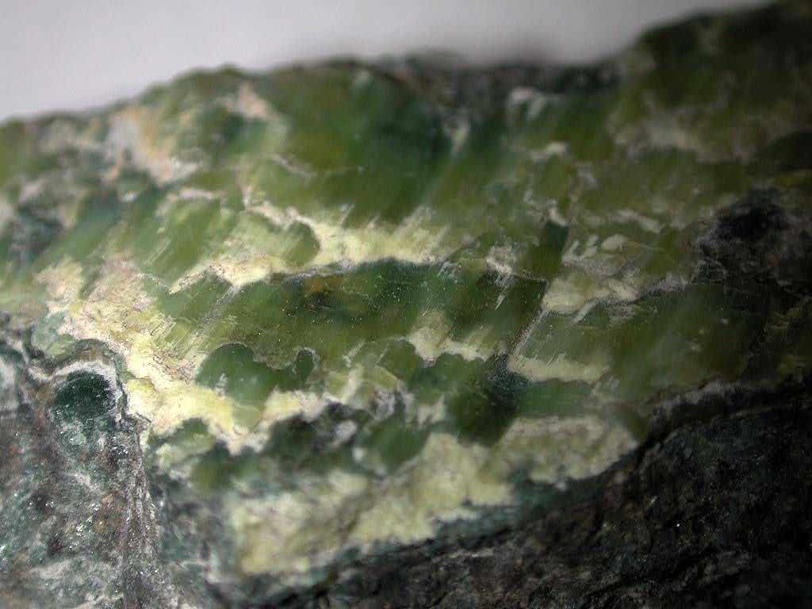) <!-- .element style='float: right' width='90%' -->

<--o-->
<!-- .slide: data-background="Figures-Structures-Associated-with-Folding-3/Photos/Lineations17.jpg" -->

<--o-->

### Surface lineations

#### Corrugations

Many slip surfaces show a cylindrical curviplanar geometry that mimics corrugated roofing.

Corrugations form a surface lineation parallel to the striations.

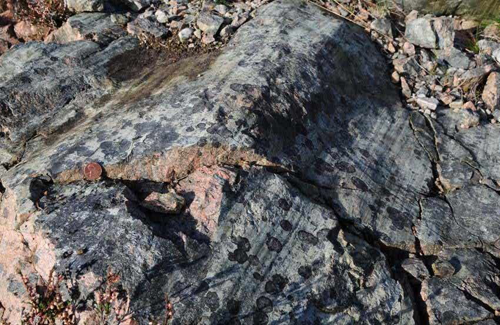) <!-- .element style='float: right' width='90%' -->

<--o-->
<!-- .slide: data-background="Figures-Structures-Associated-with-Folding-3/Photos/Lineations20.jpg" -->

<--o-->

### Surface lineations

#### Corrugations

Many slip surfaces show a cylindrical curviplanar geometry that mimics corrugated roofing.

Corrugations form a surface lineation parallel to the striations.

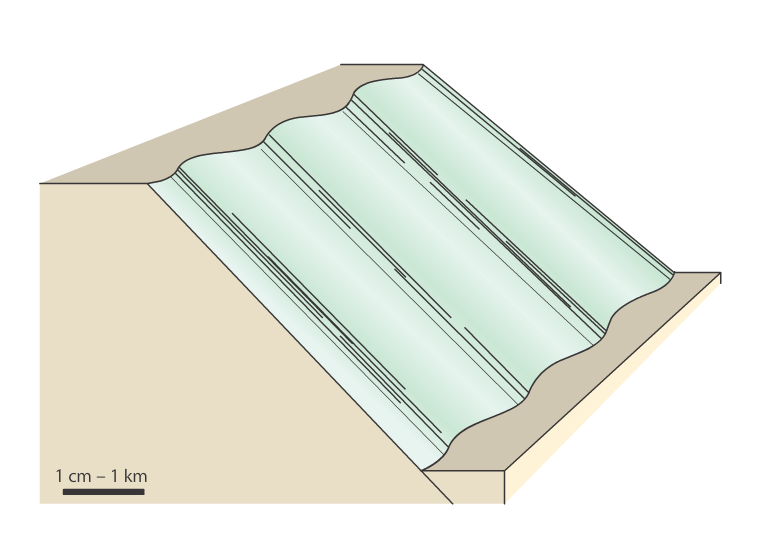) <!-- .element style='float: right' width='90%' -->

<--o-->

### Folded lineations

Lineations are commonly folded.

This can happened in two ways:

- During progressive deformation in a shear zone.
- During a later phase of deformation, unrelated to the formation of the lineation.

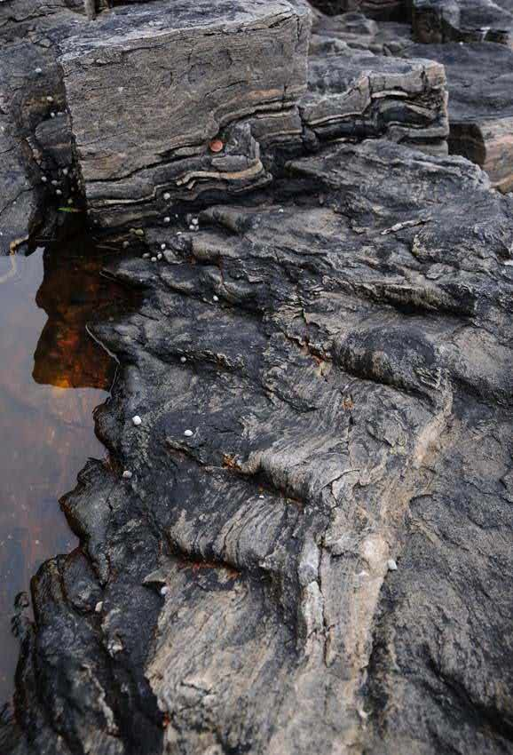) <!-- .element style='float: right' width='70%' -->

<--o-->
### Lineations and strain

Penetrative lineations that form as a result of strain or through rigid rotation of minerals, represent the
direction of maximum finite extension (The X-axis of the strain ellispoid).

Simple shear deformation produces a lineation that is oblique to the shear zone.

Pure shear deformation produces a lineation that remains parallel to the deformation zone.

 <!-- .element style='float: right' width='70%' -->
 <!-- .element style='float: right' width='70%' -->

<--o-->

### Lineations and strain

#### Boudinage

Boudins are competent rock layers that have been stretched into segments.
As they are commonly much longer in one direction, they can define a lineation.

Lineations formed by boudinage form along Y. i.e. perpendicula to X.

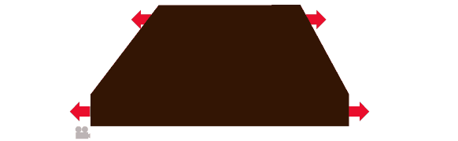 <!-- .element style='float: right' width='70%' -->

<--o-->

### Lineations and strain

#### Surface lineations

Surface lineations have a much more indirect relationship with strain since they are bound by the fracture surface on which they occur.

**Slickenlines**, **striae** and other lineartions associated with faults are parallel to the direction of movement but do not
reveal the sense of shear which need to be determined via observation of other markers.

The exception is fiber linearions on extension fractures where the fibers tend to be parallel to X (direction of opening)

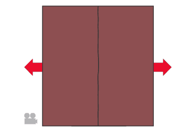 <!-- .element style='float: right' width='90%' -->

<--o-->

### Map scale patterns

Lineations have been used to interpet strain and movement pattern related to orogeny.

*Stretching lineations map related to the Caledonian orogeny in S Norway. The lineations are generally intrepretated as the direction of thrusting*

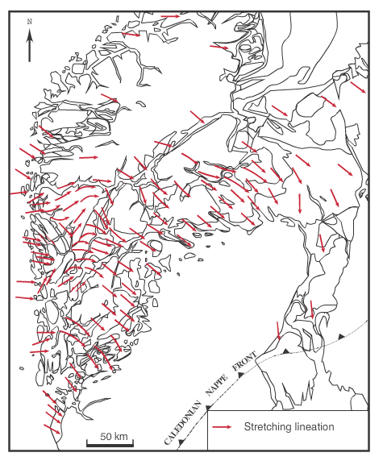) <!-- .element style='float: right' width='90%' -->

<--o-->

## Conclusions

- Lineationsa re linear structures in rocks.
- They may be **penetrative** or confined to **surface**
- **Geometric lineations** are theoretical lines such as fold axes
- **Tectonic lineations** occur as a result of tectonic deformation
- Stretching of objects form **stretching lineations**
- Rotation of elongated minerals can create a lineation.
- Crystallization of new minerals in a preferred direction can create a lineation.
- Lineations, particularly stretching lineations are very useful for regional tectonic analysis.
