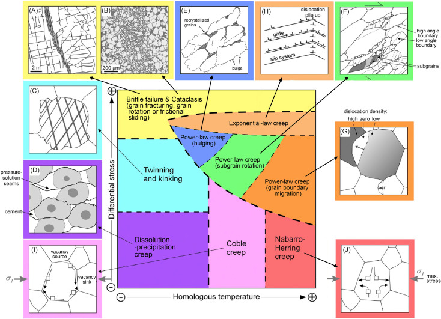

# EMSC 3002

### An Introduction to Structural Geology and Tectonics

  - **Louis Moresi** (convenor)
  - Romain Beucher (lecturer)
  - Chengxin Jiang (lecturer)
  - Stephen Cox (curriculum advisor)

Australian National University

_**NB:** the course materials provided by the authors are open source under a creative commons licence. 
We acknowledge the contribution of the community in providing other materials and we endeavour to 
provide the correct attribution and citation. Please contact louis.moresi@anu.edu.au for updates and 
corrections._

<--o-->

## Resources

  <!-- .element style="float: right" width="25%" -->

  [Online book](https://anu-rses-education.github.io/EMSC-3002/FrontPage.html)
with lecture materials, practicals and live computational examples.

  Wattle (when available), Programs and Courses  

  [Source code](https://github.com/underworld-geodynamics-cloud/self-managing-jupyterhub)

 
<--o-->

## Learning Outcomes for this module

What you will learn about global tectonics.

 - The relationship between plate motions and plate boundary structures
 - The difference between continental and oceanic deformation
 - How mantle convection drives the plates
 - Background on stresses, strains, rheology
 - Background on deformation style and observations

We will not be covering

 - Details of mantle circulation (Geodynamics)
 - Stress / strain tensors (see Module iii)
 - Quantitative analysis of deformation in 3D

<--o-->

## The Earth in Cross Section

 

 

This image is drawn approximately to scale 

  - The **core** is roughly 1/2 the radius (1/8 volume) and the **inner core** is roughly 1/2 the radius of the core  

  - Most of the Earth (by volume) is the mantle - the *lower mantle* is below 670km  

  - The **oceanic lithosphere** is no more than about 100-150km thick and the **continental lithosphere** can be up to 400km (maybe) thick in cratonic areas  

  - The **continental crust** is a few tens of km thick (exaggerated in the diagram) but the **oceanic crust** is nearly always about 6-7 km thick ... too thin to show !

<--v-->

## The Earth in Cross Section

 

 

The circulation currents in the *solid mantle* move at a few cm/yr and plate motions are 
part of the overall circulation. 

Mantle Plumes are also part of the overall circulation but much smaller than the slabs because 
they are cylindrical rather than sheets. 

Flow in the mantle is broad scale - small structures induce broad flow. 

On a global scale, movement is slow and viscous, especially in the deep mantle. 

<--o-->

## Thickness of the Lithosphere

 <!-- .element style="display:block; margin-left:auto; margin-right:auto; width:60%" -->

This map shows the lithospheric thickness coloured as though it refers to temperature (thin lithosphere is in warm colours, thick is in cool colours) which does have some physical relevance. The greyscale is topography.

<--v-->

## Thickness of the Continental Lithosphere

 <!-- .element style="display:block; margin-left:auto; margin-right:auto; width:60%" -->

A similar map that *contours* the thickest parts of the lithosphere (scale is in km) and leaves out the oceans altogether. 

<--v-->

## Relative thickness of Crust and Lithosphere

 <!-- .element style="display:block; margin-left:auto; margin-right:auto; width:60%" -->

This map shows the relative thickness of the crust and the lithosphere (thick crust is dark). You can immediately see how important the mechanical structure of the lithosphere is when it comes to the response to geological stresses. *The coloured dots are earthquake hypocentres coloured by depth and mostly show where the slabs are located.*

<--o-->

## Rock Deformation Map

 <!-- .element style="display:block; margin-left:auto; margin-right:auto; width:50%" -->

Rock deformation map that shows how temperature and the magnitude of the differential stress (shear stress compared to confining pressure) influence how rocks deform.

<small>

Gomez-Rivas, E., Butler, R. W. H., Healy, D., & Alsop, I. (2020). From hot to cold - The temperature dependence on rock deformation processes: An introduction. Journal of Structural Geology, 132, 103977. https://doi.org/10/gk6kn4

</small>
<--o--> 

<--o-->

## New Slide

With nothing much 

<--o-->

<--o-->

