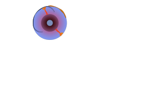

# EMSC 3002

### An Introduction to Structural Geology and Tectonics

  - **Louis Moresi** (convenor)
  - Romain Beucher (lecturer)
  - Chengxin Jiang (lecturer)
  - Stephen Cox (curriculum advisor)

Australian National University

_**NB:** the course materials provided by the authors are open source under a creative commons licence. 
We acknowledge the contribution of the community in providing other materials and we endeavour to 
provide the correct attribution and citation. Please contact louis.moresi@anu.edu.au for updates and 
corrections._

<--o-->

## Resources

  <!-- .element style="float: right" width="25%" -->

<div  style="width:50%">

  [Online book](https://anu-rses-education.github.io/EMSC-3002/FrontPage.html)
with lecture materials, practicals and live computational examples.

  Wattle (when available), Programs and Courses  

  [Source code](https://github.com/underworld-geodynamics-cloud/self-managing-jupyterhub)
</div> 
<--o-->

## Learning Outcomes

What you will learn about global tectonics.

 - one
 - two 
 - three

What you will not learn

 - Mantle convection / driving forces of plates
 - 


<--o-->

## The Earth in Cross Section

 <!-- .element style="height:500px; float:right" -->

</br>

This image is drawn approximately to scale 

<--o-->

## Image v2 

For full control on the image, including the ability to use `reveal.js` 
container sizing etc, you can use `html`


```html

```

That is all

<--o--> 

<--o-->


## New Slide

With nothing much 

<--o-->

## Image v3


 <!-- .element style="float: right" width="40%" -->


<--o-->

