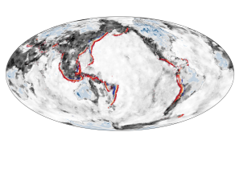

# EMSC 3002

## Module 1.1 - Global Deformation Patterns

  - **Louis Moresi** (convenor)
  - Romain Beucher (lecturer)
  - Chengxin Jiang (lecturer)
  - Stephen Cox (curriculum advisor)

Australian National University

_**NB:** the course materials provided by the authors are open source under a creative commons licence. 
We acknowledge the contribution of the community in providing other materials and we endeavour to 
provide the correct attribution and citation. Please contact louis.moresi@anu.edu.au for updates and 
corrections._

<--o-->

## Resources

  <!-- .element style="float: right" width="25%" -->

  [Online book](https://anu-rses-education.github.io/EMSC-3002/FrontPage.html)
with lecture materials, practicals and live computational examples.

  Wattle (when available), Programs and Courses  

  [Source code](https://github.com/underworld-geodynamics-cloud/self-managing-jupyterhub)

 

We will be revising and building upon second year structural / tectonics materials (e.g. EMSC2023). Some material will be 
quite familiar but we provide background reading to help revise important topics.

<--o-->

## Learning Outcomes for this module

What you will learn about global tectonics.

 - The global datasets that we use to understand tectonic processes
 - The relationship between plate motions and plate boundary structures
 - The difference between continental and oceanic deformation
 - How mantle convection drives the plates
 - Background on stresses, strains, rheology
 - Background on deformation style and observations

<--o-->

## The Earth in Cross Section

 

 

This image is drawn approximately to scale 

  - The **core** is roughly 1/2 the radius (1/8 volume) and the **inner core** is roughly 1/2 the radius of the core  

  - Most of the Earth (by volume) is the mantle - the *lower mantle* is below 670km  

  - The **oceanic lithosphere** is no more than about 100-150km thick and the **continental lithosphere** can be up to 400km (maybe) thick in cratonic areas  

  - The **continental crust** is a few tens of km thick (exaggerated in the diagram) but the **oceanic crust** is nearly always about 6-7 km thick ... too thin to show !

<--v-->

## The Earth in Cross Section

 

 

The circulation currents in the *solid mantle* move at a few cm/yr and plate motions are 
part of the overall circulation. 

Mantle Plumes are also part of the overall circulation but much smaller than the slabs because 
they are cylindrical rather than sheets. 

Flow in the mantle is broad scale - small structures induce broad flow. 

On a global scale, movement is slow and viscous, especially in the deep mantle. 

<--o-->

## Thickness of the Lithosphere

 <!-- .element style="display:block; margin-left:auto; margin-right:auto; width:60%" -->

This map shows the lithospheric thickness coloured as though it refers to temperature (thin lithosphere is in warm colours, thick is in cool colours) which does have some physical relevance. The greyscale is topography.

<--v-->

## Thickness of the Continental Lithosphere

 <!-- .element style="display:block; margin-left:auto; margin-right:auto; width:60%" -->

A similar map that *contours* the thickest parts of the lithosphere (scale is in km) and leaves out the oceans altogether. 

<--v-->

## Relative thickness of Crust and Lithosphere

 <!-- .element style="display:block; margin-left:auto; margin-right:auto; width:60%" -->

This map shows the relative thickness of the crust and the lithosphere (thick crust is dark). You can immediately see how important the mechanical structure of the lithosphere is when it comes to the response to geological stresses. *The coloured dots are earthquake hypocentres coloured by depth and mostly show where the slabs are located.*

<--o-->

## Global Stress 

 <!-- .element style="float:right; margin-top:50px;margin-bottom:50px; width:50%; margin-left:50px" -->

The World Stress Map (WSM) 2016 displays the contemporary crustal stress orientation in the upper 40 km based on the WSM database release 2016. Lines show the orientation of maximum horizontal stress. The colours indicate whether stresses are:

  - Normal faulting 
  - Strike slip 
  - Thrust faulting

So, already, we can see that the state of stress and deformation style are closely linked. Note that the **magnitude** of the stress is not part of this map.

<--v-->

## Global Seismicity

The magnitude of the stress is related to the rate of seismic energy release because this is a measure of those places which are under enough stress for the lithosphere to "break".

<video autoplay controls width="75%">
    <source src="movies/GlobalEQCumulative.m4v"
            type="video/mp4">

    Sorry, your browser doesn't support embedded videos.
</video>

Usually this takes the form of a fault that already exists sliding because the shear stresses are large compared to the confining pressure.

<--v-->

## Global Strain rate

 <!-- .element style="float:right; margin-top:50px;margin-bottom:50px; width:50%; margin-left:50px" -->

<!-- .element stoyle="width:60%" -->

The strain rate is a measure of how fast deformation is taking place. Strain rate is a measure of the rate of change of length (units are $s^{-1}$) *and* it is a tensor: there are multiple components that represent normal and shear strains. The measure shown here is an average (the second invariant).

The rate of deformation is related to two things: the stress applied and the strength of the material. 

<small>

Kreemer, C., Blewitt, G., & Klein, E. C. (2014). A geodetic plate motion and Global Strain Rate Model. Geochemistry, Geophysics, Geosystems, 15(10), 3849–3889. https://doi.org/10/f6p92p

</small>

<--v-->

## Global Volcanism

 <!-- .element style="width:60%" -->

Volcanic activity is distributed similarly to that of seismicity and mostly occurs at convergent and divergent plate boundaries. There is also a significant level of intra-plate volcanism. Magma pathways within the crust are influenced by the stress field and we can analyse volcanic structures to determine the ambient stress field at the time they were formed.

<small>

Make your own map from the NOAA natural hazards interactive web page: [https://maps.ngdc.noaa.gov/viewers/hazards](https://maps.ngdc.noaa.gov/viewers/hazards/?layers=3)

</small>

<--o-->

## Global Plate Motions

 <!-- .element style="width:60%" -->

Volcanic activity is distributed similarly to that of seismicity and mostly occurs at convergent and divergent plate boundaries. There is also a significant level of intra-plate volcanism. Magma pathways within the crust are influenced by the stress field and we can analyse volcanic structures to determine the ambient stress field at the time they were formed.

<small>

Make your own map from the NOAA natural hazards interactive web page: [https://maps.ngdc.noaa.gov/viewers/hazards](https://maps.ngdc.noaa.gov/viewers/hazards/?layers=3)

</small>

<--o-->

## Plate Boundaries

The regions of highest strain rate at the surface of the Earth are the plate boundaries. 

<--o-->

## Plate Boundary Types

<--o-->

## Divergent Boundaries & Kinematics

<--o-->

## Transform Boundaries & Kinematics

<--o-->

## Convergent Boundaries & Kinematics

note: Google Earth examples + diagrams ... 

<--o-->

## Plate Deformation v. Continental Deformation

<--o-->