# EMSC 3002

## Module 1.1a - The Australian Plate

  - **Louis Moresi** (convenor)
  - Chengxin Jiang (lecturer)
  - Romain Beucher (former lecturer)
  - Stephen Cox (curriculum advisor)

Australian National University

_**NB:** the course materials provided by the authors are open source under a creative commons licence.  We acknowledge the contribution of the community in providing other materials and we endeavour to provide the correct attribution and citation. Please contact louis.moresi@anu.edu.au for updates and corrections._

<--o-->

## About this section

<!-- DRAFT SKELETON — N3 in migration/CONTENT-MAP.md §7. Every figure slot is a
     TODO with its public data source named. This deck is the *base layer* that
     the Australian examples in every other module refer back to. -->

This course is about the *structure and tectonic evolution of the Australian plate* — so before we go any further we should meet the plate itself: its boundaries, the continent it carries, the **names of the pieces**, **when they came together**, and **which datasets** reveal the structure beneath the surface.

This short section follows on directly from the global picture in 1.1, and it is a reference you will come back to throughout the course. Each later module uses Australian examples that sit somewhere on the maps you see here.

<--o-->

## What you will learn in this module

- The **Australian (Indo-Australian) plate** — its boundaries, and why every type of plate boundary matters to our story.
- The **major building blocks** of the Australian continent — cratons, orogens, basins — and their names.
- **When the pieces came together**: the assembly of Australia from the Archean to the present day.
- Where Australia sat in **plate reconstructions** through geological time.
- The key **continental datasets** — Moho depth, sediment thickness, lithospheric thickness, potential fields, stress and seismicity — what they show and where to find them.
- How to use these together to **interpret a structure** in its lithospheric context.

<--o-->

## The Australian Plate

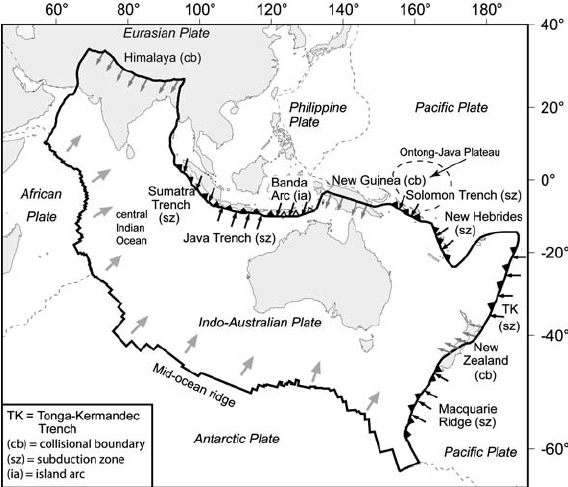 <!-- .element style="float:right; width:45%; margin-left:30px;" -->

The **Indo-Australian plate** was born from the break-up of Gondwana. Strictly it is a composite: the **Australian**, **Indian** and **Capricorn** plates, separated by broad zones of *diffuse* deformation rather than sharp boundaries — a useful early warning that "rigid plate" is an idealisation.

The Australian portion carries the continent, its wide continental shelves, and a great deal of ocean floor. The continent itself is entirely surrounded by boundary zones that are *active in different ways* — which is exactly what makes it such a good natural laboratory for this course.

<small>

Plate boundaries and the forces acting on them: large grey arrows — ridge push; small grey arrows — resisting continent–continent collision; black arrows — slab pull. Solid triangles show subduction direction; open triangles the Banda Arc. Modified after Reynolds et al. (2003).

</small>

<--v-->

## A tour of the boundaries

 <!-- .element style="float:right; width:40%; margin-left:30px;" -->

Travelling around the plate edge, we meet **every type of plate boundary** — each with features that return later in the course:

- **South & west** — the **Southeast Indian Ridge** and its fracture zones: divergence, the young rifted southern margin (and its conjugate, Antarctica).
- **North-west** — the **Sunda–Java trench**: ocean–continent subduction.
- **North** — the **Banda Arc and New Guinea**: arc–continent *collision in progress* — the messy, diffuse end-game of subduction.
- **North-east & east** — Solomons, Vanuatu, **Tonga–Kermadec**: the fastest subduction on Earth.
- **South-east** — New Zealand: the **Alpine Fault**, a transform on land linking opposing subduction systems — with enough convergence across it to build the Southern Alps (the map calls it collisional; it is both).

The forces generated at *all* of these edges are transmitted into the plate interior — they load the Australian stress field we saw in 1.1 and will quantify in 1.3, and they explain why a "stable" continent still has earthquakes.

<small>

→ Boundary-by-boundary detail follows in [1.2 — Plate Boundaries](Module-i-GlobalTectonics-2.reveal.html); the stresses they impose are the subject of [1.3](Module-i-GlobalTectonics-3.reveal.html).

</small>

<--o-->

## The names of things

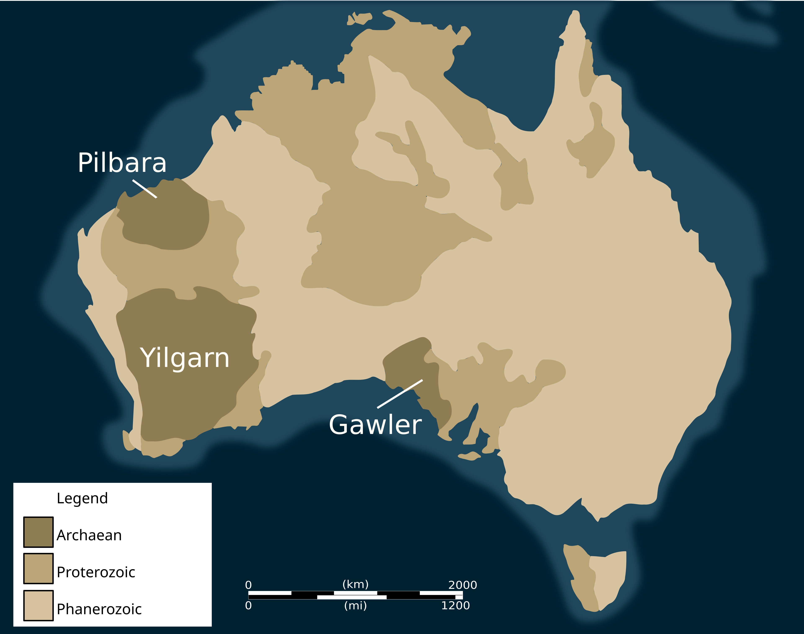 <!-- .element style="display:block; margin-left:auto; margin-right:auto; width:47%" -->

Three ages of crust, and the continent gets **younger eastwards**: Archaean nuclei in the west and south, Proterozoic around them, Phanerozoic in the east.

<small>

Base map: Woudloper, Wikimedia Commons, CC BY 4.0.

</small>

<--v-->

## The names of things

The continent divides into three broad crustal super-provinces:

- **West Australian Craton** — the Archean **Yilgarn** and **Pilbara** cratons, joined by the Capricorn Orogen.
- **North Australian Craton** — Kimberley, Arunta, Mount Isa, Tennant Creek …
- **South Australian Craton** — the **Gawler Craton**, Curnamona Province.

East of these, the Phanerozoic **Tasmanides** (Delamerian, Lachlan, Thomson, Mossman, New England orogens) — the accreted eastern third of the continent.

<small>

The boundary zone is often drawn as the **"Tasman Line"** — useful shorthand, actively debated in detail. *(Next slide.)*

</small>

<--v-->

## The Tasman Line

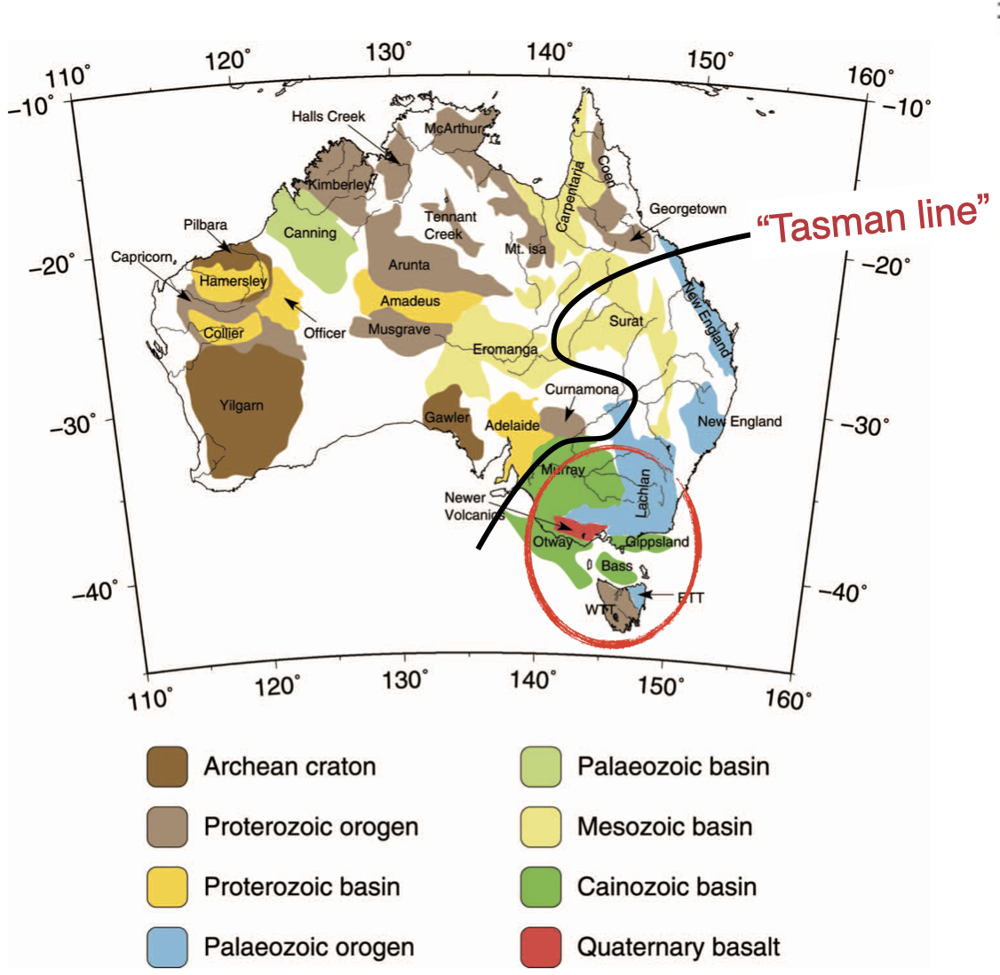 <!-- .element style="display:block; margin-left:auto; margin-right:auto; width:47%" -->

The name for the boundary between **Precambrian Australia** in the west and the **Phanerozoic Tasmanides** in the east — here drawn across a map of the named provinces. Everything west of it is craton and Proterozoic orogen; everything east is Palaeozoic orogen and younger basin.

It is one of the most-used terms in Australian geology — and one of the least agreed. Note the quotation marks.

<--v-->

## …and here is the same boundary, undrawn

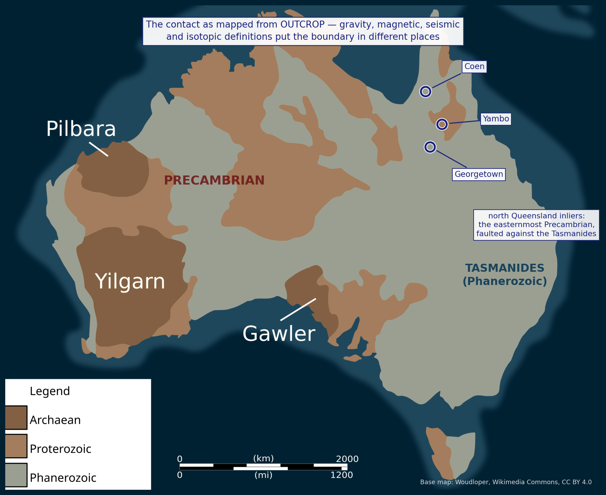 <!-- .element style="display:block; margin-left:auto; margin-right:auto; width:48%" -->

The same continent with the two domains shaded and **no line drawn at all** — because the position depends entirely on which dataset you ask.

<--v-->

## …is not a line

Draw it from **outcrop** and you get one answer. Draw it from **gravity**, from **magnetic** lineaments, from **seismic** structure, or from **isotopic** signatures in granites, and you get others — separated by hundreds of kilometres, and not always in the same order.

Direen & Crawford (2003) compared the published definitions, found them **mutually inconsistent**, and suggested the concept be abandoned: what the data show is a **protracted Neoproterozoic-to-Carboniferous history**, producing a broad zone with several different boundaries in it, rather than a single structure.

Some of those geophysical signatures reach **deeper than 75 km** — well below the Moho — so whatever it is, part of it is a *lithospheric* feature, not just a line on a geological map.

<small>

Direen, N.G. & Crawford, A.J. (2003), *Australian Journal of Earth Sciences* **50**, 491–502.

</small>

<--v-->

## Why we still use the term

Because the *first-order* observation behind it is real and important: **Australia gets younger eastwards**, and the change is not gradual — the eastern third of the continent was built by accretion onto a Precambrian core.

So use "Tasman Line" the way you would use "the tree line": a real transition, worth naming, with no single position.

*Watch for it in the datasets that follow — Moho depth, lithospheric thickness, magnetics and gravity each show the transition, and each shows it somewhere slightly different. That disagreement is the evidence, not noise.*

<small>

→ Drawn on a named-province map, with the zircon-age and tomographic evidence beside it, in the [continental accretion lecture](Module-i-Accretion-draft.reveal.html).

</small>

<--o-->

## When the pieces came together

<!-- TODO figure: assembly timeline / cartoon sequence. Candidate basis:
     published reconstructions (e.g. Cawood & Korsch 2008; Myers et al. 1996). -->

| Era | What happened |
|---|---|
| **Archean** (> 2.5 Ga) | Yilgarn, Pilbara, Gawler nuclei form |
| **Paleo–Mesoproterozoic** | Cratons sutured: Capricorn, Albany–Fraser, Musgrave, Arunta orogens — Australia assembles inside **Nuna / Rodinia** |
| **Neoproterozoic** | Rodinia break-up; rifted margin faces the Pacific |
| **Paleozoic** | The **Tasmanides** accrete along the Gondwana margin — Delamerian → Lachlan → New England |
| **Mesozoic** | Gondwana break-up; rifted southern & western margins form |
| **Cenozoic** | Rapid northward drift; collision with the Banda Arc / PNG begins at the northern margin |

Intraplate reactivation continues today: Petermann and Alice Springs orogens record Paleozoic *intracontinental* mountain building — and the modern stress field (Module 1.3) still reactivates these structures.

<--v-->

## Two bursts, not a steady drip

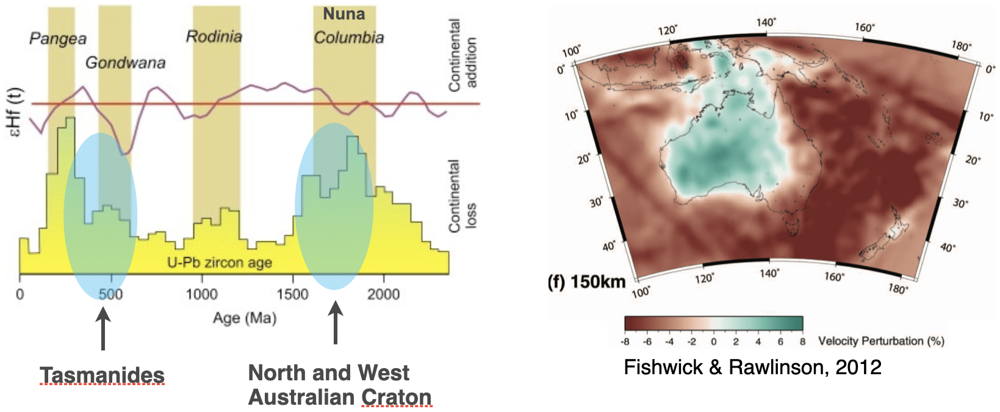 <!-- .element style="display:block; margin-left:auto; margin-right:auto; width:76%" -->

That table reads like a continuous process. It was not. Date enough zircons and the continent's growth arrives in **two pulses**:

- **~1900–1700 Ma** — the North and West Australian cratons assemble, inside **Nuna / Columbia**
- **~500 Ma onwards** — the **Tasmanides** accrete onto the eastern margin

Between and after them, comparatively little new crust. The gaps matter as much as the peaks: continental growth is **episodic**, and the pulses line up with the supercontinent cycle you just saw.

<small>

→ Developed with the zircon-age evidence, seismic tomography and the province map in the [continental accretion lecture](Module-i-Accretion-draft.reveal.html).

</small>

<--o-->

## Australia through time — plate reconstructions

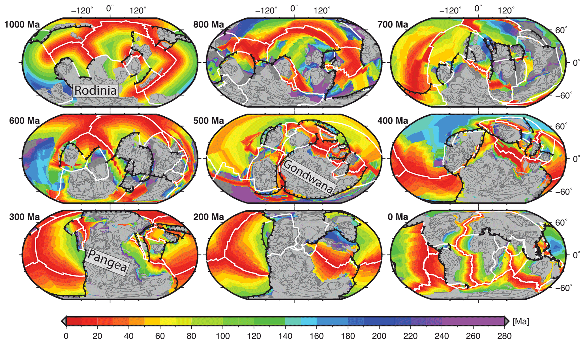 <!-- .element style="display:block; margin-left:auto; margin-right:auto; width:72%" -->

One billion years, in nine frames: **Rodinia → Gondwana → Pangea → now**. Grey is continental crust; colour is the age of the ocean floor.

- Australia's position through time comes from **plate reconstructions** — palaeomagnetism, ocean-floor magnetic anomalies (Module 1.2), and geological piercing points.
- Explore this yourself with **GPlates** (EarthByte, University of Sydney) — the same tool used in the plate-kinematics exercise.

<small>

Müller et al. (2022), *Solid Earth* **13**, 1127–1159, [doi:10.5194/se-13-1127-2022](https://doi.org/10.5194/se-13-1127-2022) — Fig. 9, CC BY 4.0. The model is **SEEM1000**.

</small>

<--v-->

## The plate is not the continent

Look at the colour bar on that figure: it stops at **280 Ma**.

That is not an artistic choice. **No ocean floor anywhere on Earth is older than about 280 Ma** — it is made at ridges and destroyed at trenches, so the plate is continuously recycled. The grey continents in the same frames are up to **3.5 billion years** old.

So the two halves of this course's title are objects with very different lifespans:

- the **Australian plate** — mostly ocean floor, none of it very old, with the boundaries and stresses of Modules 1.2 and 1.3;
- the **Australian continent** — an assembly of ancient pieces that has survived every one of those supercontinent cycles, and is the subject of the rest of this deck.

*The plate is what Australia is riding on. The continent is what it is carrying.*

<--v-->

## Where the reconstruction runs out

One billion years sounds like deep time, but it is only the **last quarter or so of Earth history**. The oldest frame on the previous slide is 1000 Ma; the Pilbara and Yilgarn cratons were already ancient by then.

Before ~1 Ga we cannot draw plate boundaries with any confidence — there is no ocean floor left to reconstruct from, and the palaeomagnetic record thins out. What we have instead is the **rock record inside the cratons themselves**.

*Which is where we go next: the oldest pieces of Australia, and what they tell us about an Earth that may not have worked the way it does now.*

<small>

→ The subduction–accretion story that built the eastern margin is taken up in the *continental accretion* lecture.

</small>

<--o-->

## Greenstone belts: the Archaean rock record

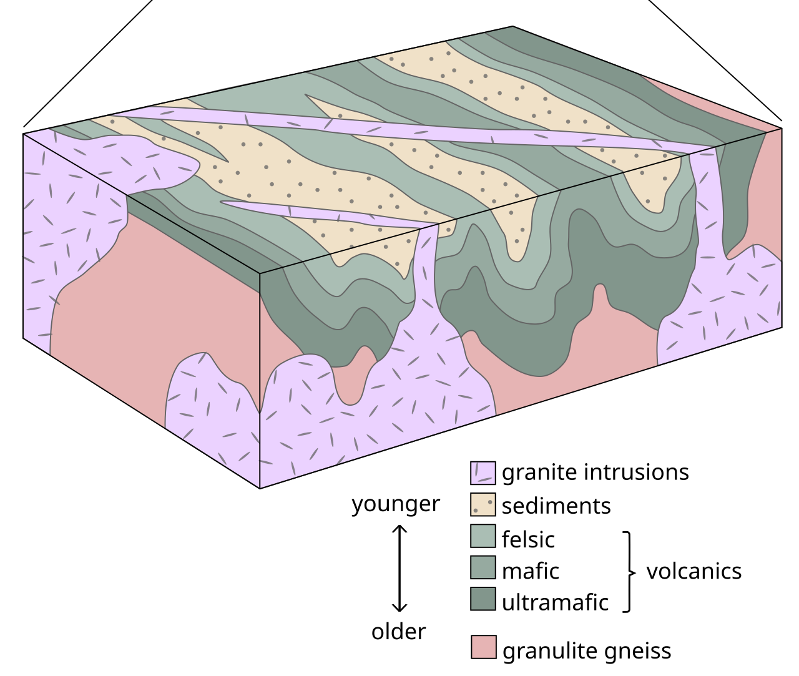 <!-- .element style="display:block; margin-left:auto; margin-right:auto; width:52%" -->

Archaean crust has a recipe of its own: **granite domes** with **keels of greenstone** hanging between them — piles of mafic and ultramafic volcanics (including *komatiites*, which need mantle far hotter than today's), capped by sediments, and squeezed down between rising granite.

*Australia has two of the world's best-preserved examples, and they do not look like each other.*

<small>

Woudloper, Wikimedia Commons, CC BY-SA 4.0.

</small>

<--v-->

## Pilbara: domes and keels

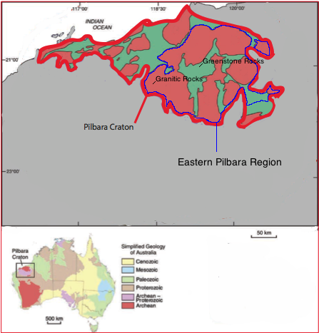

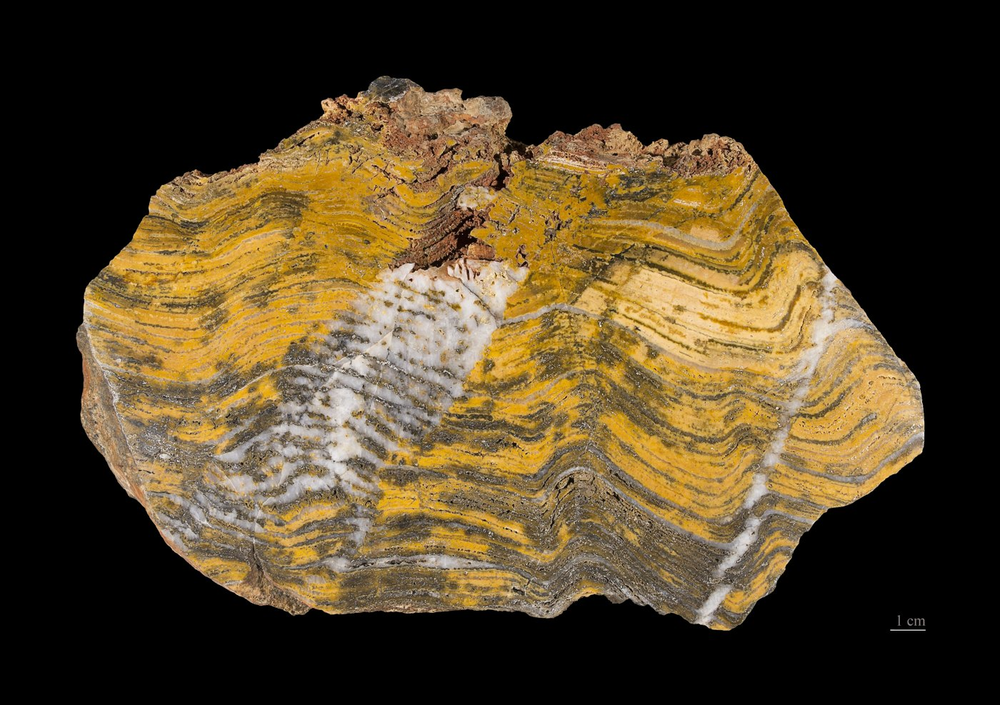

**~3.5–2.9 Ga.** Great ovoid granite domes 35–120 km across, with greenstone draped in the synclines between them — a pattern you can read straight off the map. There is no obvious grain, no line of belts: it looks like a **vertical** system, dense greenstone sinking while lighter granite rose.

The **Strelley Pool** stromatolites here are ~3.4 Ga — among the oldest convincing evidence of life on Earth.

<small>

Map: Ebuhyo1, Wikimedia Commons, CC BY-SA 3.0. Stromatolite: Didier Descouens, CC BY-SA 4.0.

</small>

<--v-->

## Yilgarn: belts, shears and gold

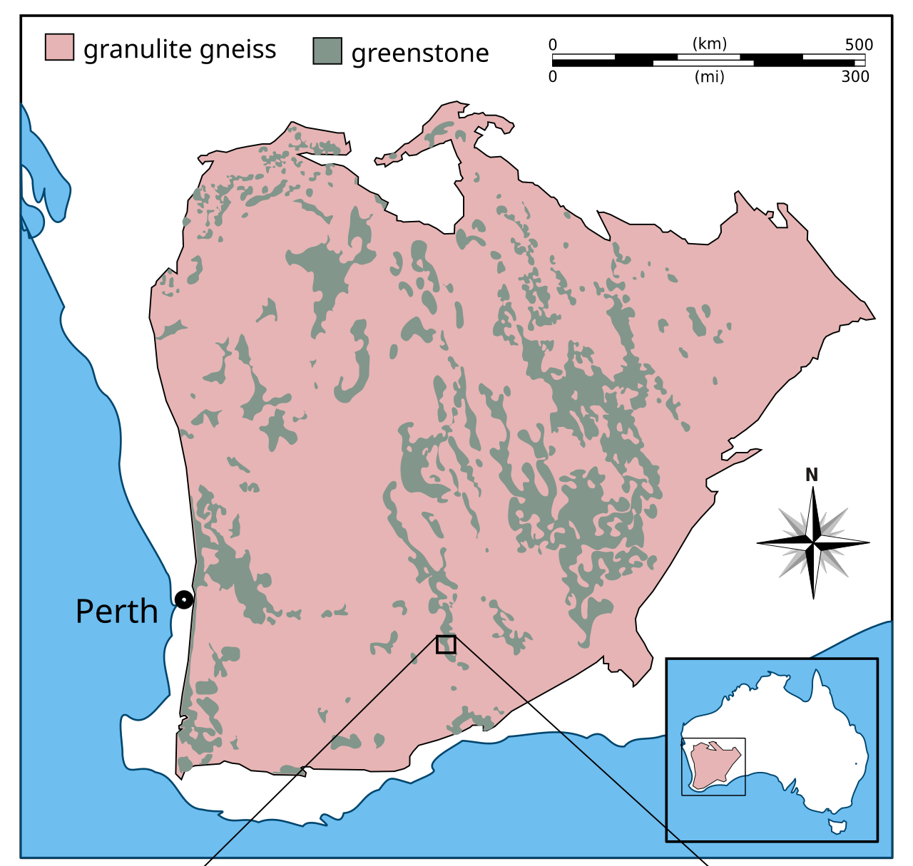 <!-- .element style="display:block; margin-left:auto; margin-right:auto; width:40%" -->

**Mostly ~2.9–2.6 Ga** — several hundred million years younger. Now the greenstones are **long, narrow, parallel belts**, separated by granite and bounded by big crustal shear zones. That is a **horizontal** grain: terranes swept together and welded side by side, much more like modern accretionary tectonics.

Those same shear zones are the plumbing that made the **Eastern Goldfields** — Kalgoorlie sits in a greenstone belt.

<small>

Woudloper, Wikimedia Commons, CC BY-SA 4.0.

</small>

<--v-->

## Two cratons, two kinds of Earth?

| | **Pilbara** | **Yilgarn** |
|---|---|---|
| Age | ~3.5–2.9 Ga | mostly ~2.9–2.6 Ga |
| Map pattern | ovoid domes, greenstone keels | long parallel belts |
| Structure | steep, no consistent grain | strong grain, crustal shear zones |
| Read as | **vertical** tectonics — sinking greenstone, rising granite | **horizontal** tectonics — terranes accreted |

The Pilbara is the older of the two, and the more alien. The usual reading is that the Archaean Earth was hotter, its lithosphere weaker, and that it could not sustain rigid plates the way it does now — so the crust overturned in place instead of sliding sideways.

**When did plate tectonics start?** These two cratons sit on either side of the argument, and the honest answer is that it is unresolved. Estimates range from >3.5 Ga to <1 Ga.

*This matters for the rest of the course: everything from Module 1.2 onwards assumes rigid plates with narrow boundaries. That assumption has a start date, and the Pilbara may be older than it.*

<--o-->

## What the crust is worth

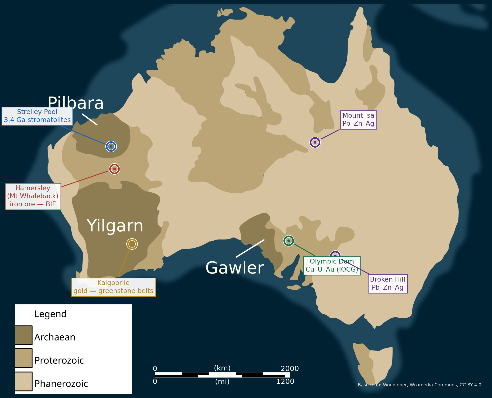 <!-- .element style="display:block; margin-left:auto; margin-right:auto; width:56%" -->

Australia's mineral wealth is not scattered at random — **each deposit belongs to a piece of crust and a moment in its history**:

- **Kalgoorlie** gold — the Yilgarn greenstone belts and their shear zones
- **Hamersley** iron — banded iron formation laid down on the Pilbara as the oceans *first* became oxygenated
- **Olympic Dam** Cu–U–Au — Gawler Craton margin <small>(you will meet it again in Module 3, as a borehole stress measurement)</small>
- **Mount Isa**, **Broken Hill** Pb–Zn–Ag — Proterozoic basins and their deformation

*Ask of any deposit the same four questions as any structure: which piece, when did it form, what is underneath, what is happening now.*

<--o-->

## Datasets: Moho depth

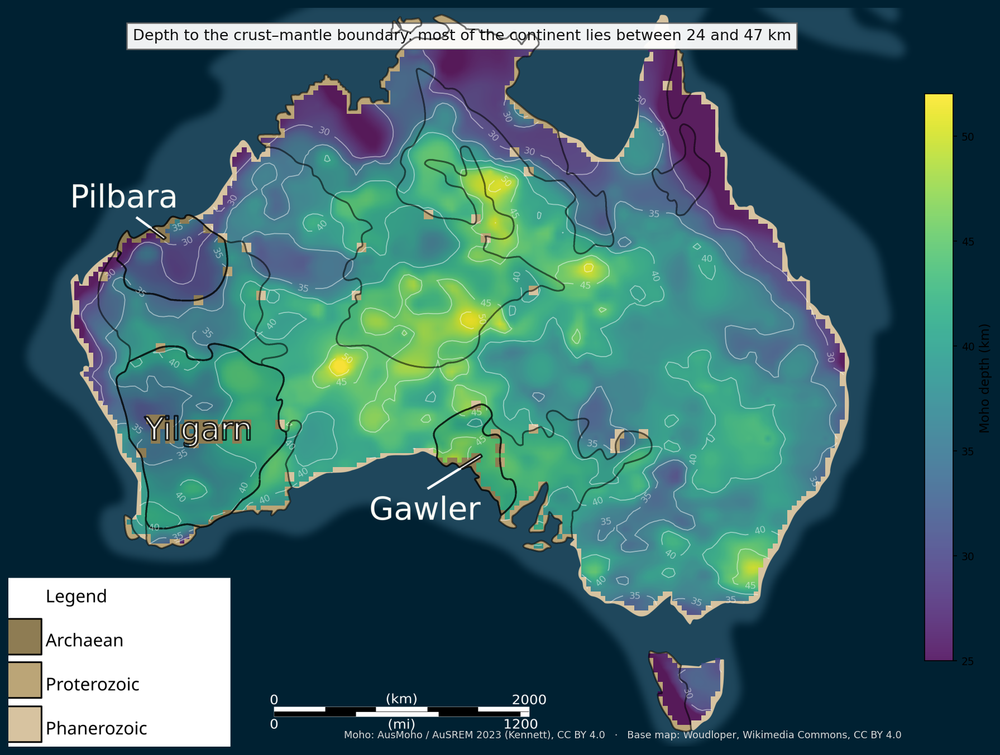 <!-- .element style="display:block; margin-left:auto; margin-right:auto; width:56%" -->

- **AusMoho / AuSREM** — continent-wide Moho-depth model from decades of seismic refraction, reflection and receiver-function data.
- Most of the continent lies between **~24 and ~47 km**, median **38 km**; the thickest crust is in **central Australia**, under the Proterozoic orogens, not under the Archaean cratons.
- Reading it: sharp Moho steps often coincide with province boundaries — the sutures of the assembly story above. The black outlines are the Archaean cores and the Precambrian edge.

<small>

AusMoho / AuSREM 2023, Kennett (2019), [doi:10.25911/5cf751c17b3d4](https://doi.org/10.25911/5cf751c17b3d4), CC BY 4.0 — 0.25° grid, masked to land and re-plotted by `tools/figures/australia_moho.py`.

</small>

<--o-->

## Datasets: lithospheric thickness (LAB)

<!-- TODO figure: LAB depth. CHECKED 2026-08-10 and still open:
     AusPass publishes AusMoho as an open 0.25-deg grid (now plotted on
     the Moho slide) but NO lithospheric-thickness / LAB product. The
     AuSREM mantle model is there as a 150 MB tarball with no licence
     stated on the index — worth chasing with RSES, since re-plotting it
     would match the Moho, stress and seismicity figures exactly.
     Meanwhile the Fishwick & Rawlinson (2012) tomography already sits in
     the accretion deck; it is AJES and not openly licensed, so link to
     that slide rather than copying the image here. -->

- **AusLAMP** (magnetotellurics) and seismic tomography image the **lithosphere–asthenosphere boundary**.
- Cratonic Australia has some of the **thickest lithosphere on Earth** (> 200 km); the eastern Tasmanides are much thinner (~100 km or less).
- This thick/thin contrast controls where heat, magmatism and deformation localise — and echoes the Tasman Line.

<small>

→ Seen as seismic tomography at 150 km depth in the [continental accretion lecture](Module-i-Accretion-draft.reveal.html): cool, fast, thick lithosphere under the west and centre; warm, slow, thin under the Tasmanides.

</small>

<small>

↩ You saw the global version of this map in [Module 1.1 — thickness of the lithosphere](Module-i-GlobalTectonics-1.reveal.html).

</small>

<--o-->

## Datasets: sediment thickness & basins

<!-- TODO figure: depth to basement. CHECKED 2026-08-10: OZ SEEBASE is a
     Frogtech COMMERCIAL product — do not assume it is reusable; only a
     derived public version would be. Better open routes to try, in
     order: GA's sediment-thickness / basin-depth grids via eCat (GA
     content is generally CC BY 4.0), or the global GlobSed grid
     (Straume et al. 2019, via NOAA/NCEI) which is coarse but open and
     would re-plot on the shared base map like the Moho figure. -->

- **OZ SEEBASE** and GA basin studies map **depth to basement** — the thickness of the sedimentary cover.
- Major basins: **Canning, Amadeus, Officer, Cooper–Eromanga, Great Artesian, Otway–Gippsland** (rifted southern margin), **North West Shelf**.
- Reading it: basins record the *subsidence* half of the tectonic story — rifting, sag, foreland loading — and host the resources (and the hydrogen prospects) we return to in Module 4.

<--o-->

## Datasets: potential fields, stress & seismicity

<!-- TODO figure: gravity anomaly grid (GA). Stress and seismicity are now
     built from public databases by tools/figures/; TMI is linked, not
     repeated, per the note below. -->

- **Magnetics (TMI)** — the structural X-ray of the covered continent. <small>↩ First shown in [Module 2.1](Module-ii-Lecture-1-Structural-Geology-And-Crustal-Deformation.reveal.html).</small>
- **Gravity** — density structure; craton edges and thick basins stand out.
- **Stress** — the Australian stress field. <small>↩ [Module 1.1 & 1.3](Module-i-GlobalTectonics-3.reveal.html).</small>
- **Seismicity & neotectonics** — intraplate earthquakes concentrate in the Flinders, SW seismic zone, SE highlands — *where stress meets inherited structure*.

*The next two slides show the last two, measured.*

<--v-->

## Where the earthquakes are

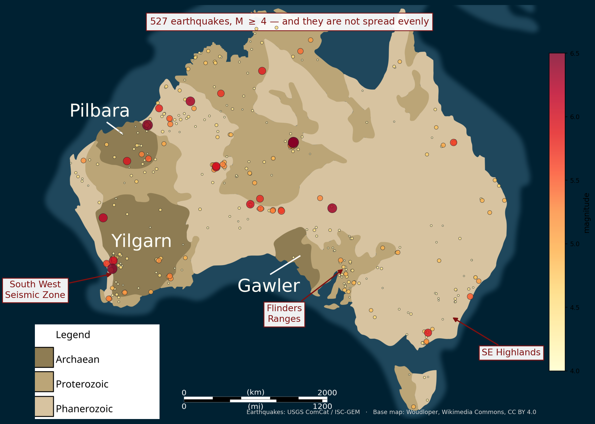 <!-- .element style="display:block; margin-left:auto; margin-right:auto; width:56%" -->

Australia is an **intraplate** continent — thousands of kilometres from the nearest plate boundary — and yet it has earthquakes, up to **M 6.7**. They are not spread evenly: they cluster in the **South West Seismic Zone**, the **Flinders Ranges**, the **SE Highlands**, and around **Tennant Creek**.

Compare this with the province map. The clusters are not where the crust is youngest, or oldest — they are where old structure is favourably oriented in the modern stress field.

<small>

Earthquakes M ≥ 4 from the USGS ComCat / ISC-GEM catalogue, filtered to onshore Australia. Built by `tools/figures/australia_seismicity.py`.

</small>

<--v-->

## The stress field that drives them

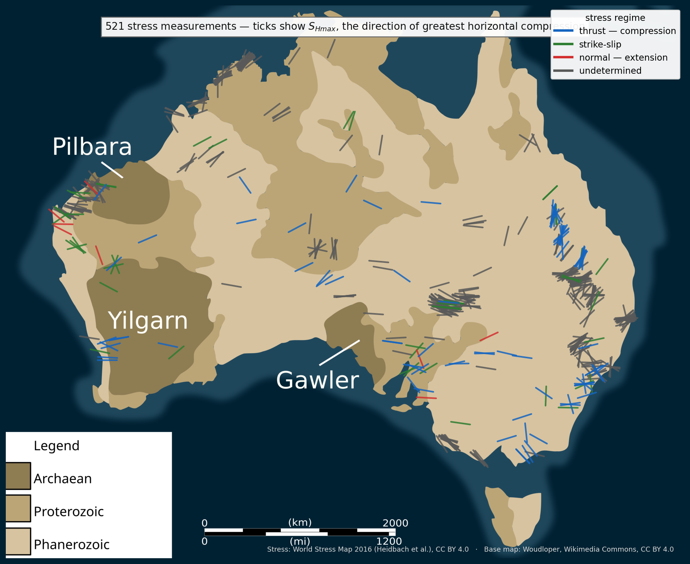 <!-- .element style="display:block; margin-left:auto; margin-right:auto; width:56%" -->

Every tick is a measurement of $S_{Hmax}$ — the direction of greatest horizontal compression. Two things to take from it:

- Australia is **in compression**. Of the measurements where the regime could be determined, **95% are thrust or strike-slip** — only 8 of 146 are extensional. For a continent nowhere near a collision, that is remarkable.
- $S_{Hmax}$ **swings across the continent** rather than pointing one way — roughly E–W in the west, rotating through NE–SW in the east.

Neither is caused by anything local. Both are the far-field consequence of the forces on the plate's *boundaries* — which is exactly the argument of [Module 1.3](Module-i-GlobalTectonics-3.reveal.html).

<small>

World Stress Map 2016 (Heidbach et al., GFZ, doi:10.5880/WSM.2016.001, CC BY 4.0), quality A–C only. Built by `tools/figures/australia_stress.py`.

</small>

<--o-->

## Putting it together: reading one structure

<!-- TODO worked example — pick ONE and show it in every dataset above.
     Strong candidates: Lake George fault (ties to the Module 3 stress
     exercise + Module 4 fault-zone lecture) or the Flinders Ranges
     (ties to Module 5 folding + neotectonic reactivation). -->

For any Australian structure, ask:

1. **Which piece is it in?** (province / orogen — the names)
2. **When did that piece form, and when did it last move?** (assembly history)
3. **What do the datasets show beneath it?** (Moho, LAB, basement depth, magnetics, gravity)
4. **What is the modern loading?** (stress field, seismicity)

*Worked example to be added here — Lake George fault or Flinders Ranges.*

<--o-->

## Where this thread runs through the course

This deck is the base layer. The Australian examples in each module sit on it:

- **Module 1** — stress field, WA M5.6 earthquake, lithospheric maps
- **Module 2** — TMI magnetics; <!-- TODO --> contractional / extensional Australian examples to come
- **Module 3** — Olympic Dam stress measurement; Lake George fault exercise
- **Module 4** — Kangaroo Island joints; Canberra faults; Lake George Fault Zone; Mansfield 2021 earthquake; hydrogen fault-modelling application
- **Module 5** — Ruby Gap mylonites; <!-- TODO --> Flinders folding example to come

<small>

Datasets & portals: GA Portal (portal.ga.gov.au) · AusMoho/AuSREM (ANU) · AusLAMP (GA/AuScope) · OZ SEEBASE · Australian Stress Map · GPlates (EarthByte)

</small>
