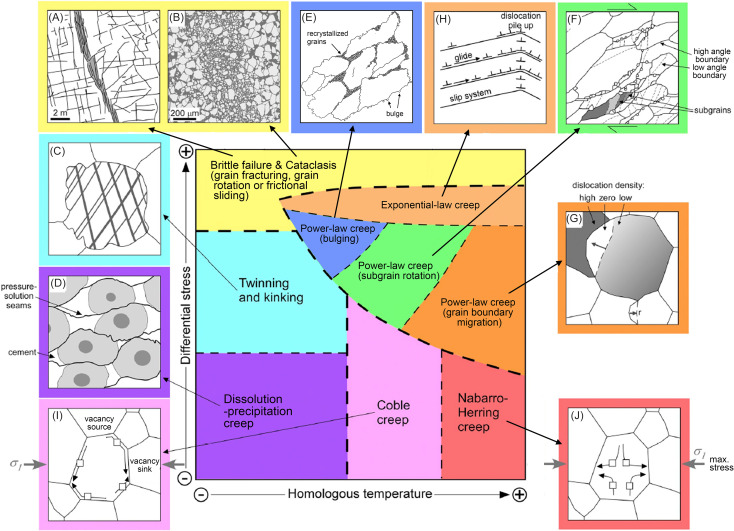
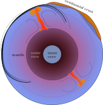
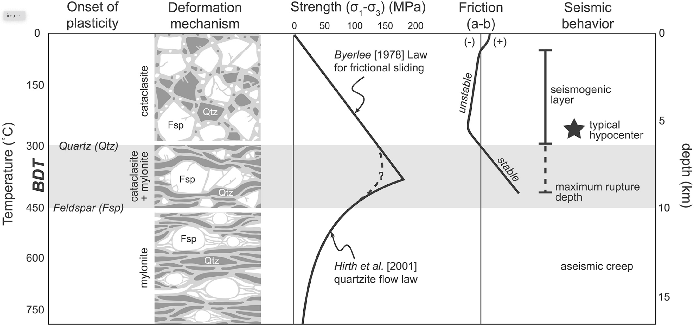
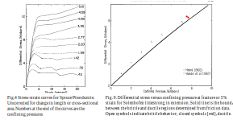

# EMSC 3002

## Module 1.2 - Stress and Strain

  - **Louis Moresi** (convenor)
  - Romain Beucher (lecturer)
  - Chengxin Jiang (lecturer)
  - Stephen Cox (curriculum advisor)

Australian National University

_**NB:** the course materials provided by the authors are open source under a creative commons licence. 
We acknowledge the contribution of the community in providing other materials and we endeavour to 
provide the correct attribution and citation. Please contact louis.moresi@anu.edu.au for updates and 
corrections._

<--o-->

## Global Stress 

 <!-- .element style="float:right; margin-top:50px;margin-bottom:50px; width:50%; margin-left:50px" -->

The World Stress Map (WSM) 2016 displays the contemporary crustal stress orientation in the upper 40 km based on the WSM database release 2016. Lines show the orientation of maximum horizontal stress. The colours indicate whether stresses are:

  - Normal faulting 
  - Strike slip 
  - Thrust faulting

So, already, we can see that the state of stress and deformation style are closely linked. Note that the **magnitude** of the stress is not part of this map.

<--v-->

## Global Seismicity

The magnitude of the stress is related to the rate of seismic energy release because this is a measure of those places which are under enough stress for the lithosphere to "break".

<video autoplay controls width="75%">
    <source src="movies/GlobalEQCumulative.m4v"
            type="video/mp4">

    Sorry, your browser doesn't support embedded videos.
</video>

Usually this takes the form of a fault that already exists sliding because the shear stresses are large compared to the confining pressure.

<--v-->

## Global Strain rate

 <!-- .element style="float:right; margin-top:50px;margin-bottom:50px; width:50%; margin-left:50px" -->

<!-- .element stoyle="width:60%" -->

The strain rate is a measure of how fast deformation is taking place. Strain rate is a measure of the rate of change of length (units are $s^{-1}$) *and* it is a tensor: there are multiple components that represent normal and shear strains. The measure shown here is an average (the second invariant).

The rate of deformation is related to two things: the stress applied and the strength of the material. 

<small>

Kreemer, C., Blewitt, G., & Klein, E. C. (2014). A geodetic plate motion and Global Strain Rate Model. Geochemistry, Geophysics, Geosystems, 15(10), 3849–3889. https://doi.org/10/f6p92p

</small>

<--o-->

## Rock Deformation Map

 <!-- .element style="display:block; margin-left:auto; margin-right:auto; width:50%" -->

Rock deformation map that shows how temperature and the magnitude of the differential stress (shear stress compared to confining pressure) influence how rocks deform.

<small>

Gomez-Rivas, E., Butler, R. W. H., Healy, D., & Alsop, I. (2020). From hot to cold - The temperature dependence on rock deformation processes: An introduction. Journal of Structural Geology, 132, 103977. https://doi.org/10/gk6kn4

</small>

<--v-->

## Rock Deformation Map

 <!-- .element style="margin-right:5px; height:300px" -->
       <!-- .element style="margin-left:5px;  height:300px" -->

We expect to see far more "creep" dominated deformation in the deep (high pressure, high temperature) parts of the planet and more fracture dominated deformation in the shallow (cooler, lower pressure) parts of the lithosphere. 

<--o--> 

## The Brittle-Ductile Transition 

Pressure and temperature increasing with depth lead to a well defined increase in
strength with depth initially (pressure effect, fault strength) 
followed by a loss of strength at depth due to increasing temperature promoting creep.

 <!-- .element style="width:66%" -->

<small>

Nevitt, J. M., Warren, J. M., & Pollard, D. D. (2017). Testing constitutive equations for brittle‐ductile deformation associated with faulting in granitic rock. Journal of Geophysical Research: Solid Earth, 122(8), 6269–6293. https://doi.org/10/gbxsbc

</small>

<--v-->

## The Brittle-Ductile Transition 

The classic work on the deformation of crustal rocks is Byerlee's paper of 1968. *"... at low confining presure, many rocks are brittle. That is, when differential stress is suffiently high, a fault is formed and, after faulting, the compressive stress is decreased. At high confining pressure, the same rocks may be ductile."* 

 <!-- .element style="width:66%" -->

<small>

Byerlee, J. D. (1968). Brittle-ductile transition in rocks. Journal of Geophysical Research, 73(14), 4741–4750. https://doi.org/10/dtqwmx

</small>

<--o-->

## The Mohr Circle