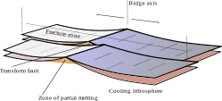

# EMSC 3002

## Module 1.2 - Plate Boundaries

  - **Louis Moresi** (convenor)
  - Romain Beucher (lecturer)
  - Chengxin Jiang (lecturer)
  - Stephen Cox (curriculum advisor)

Australian National University

_**NB:** the course materials provided by the authors are open source under a creative commons licence.  We acknowledge the contribution of the community in providing other materials and we endeavour to provide the correct attribution and citation. Please contact louis.moresi@anu.edu.au for updates and corrections._

<--o-->

## Plate Boundaries

The regions of highest strain rate at the surface of the Earth are the plate boundaries. 

 <!-- .element style="width:66%;" -->

The styles and patterns of deformation are very dependent on the orientation of the stresses that are acting at the boundary which is not recorded in this map.

<--o-->

## Plate Boundary Types 

There are three categories of plate boundaries and they are clearly identifiable and distinct:

  - Divergent boundaries where the crust pulls apart and new crust is formed. 
  - Convergent boundaries where the lithosphere and oceanic crust is destroyed
  - Strike-slip boundaries where lateral motion neither creates nor destroys crust

The Earth naturally seems to separate out these different types of boundaries - at least in the oceanic lithosphere. 

**This observation is really quite remarkable, don't you agree ?**

<--o-->

## Plate Boundary Map

 <!-- .element style="width:66%;" -->

This map includes diagrams of the physical processes that are happening at the smaller scale at each type of plate boundary. 

<small>
World Map of Plate Boundaries, Bonnie Magura (Portland Public Schools) and Chris Hedeen (Oregon City High School) from https://serc.carleton.edu/ANGLE/educational_materials/activities/204690.html
</small>

<--v-->

## Plate Boundary Map

 <!-- .element style="width:66%;" -->

The "definitive" map of the plate boundaries is the one from Peter Bird (2003) which identifies (and digitises) the plate boundary segments and categorises them. It even continues into the continental regions where plate boundaries are questionable at best.

<small>

Bird, P. (2003). An updated digital model of plate boundaries: UPDATED MODEL OF PLATE BOUNDARIES. Geochemistry, Geophysics, Geosystems, 4(3). https://doi.org/10/br2s86

</small>

<--o-->

## Divergent Boundaries: Morphology

   <!-- .element style="width:55%;" -->

The divergent boundaries largely form the global mid-ocean ridge system. This well-known map by Marie Tharp and her colleagues, identified those features as one of the most prominent geological features of the entire planet that had previously been unknown.

<small>

Hand-painted rendition of Heezen-Tharp 1977 ‘World ocean floor’ map, by Heinrich Berann.  Library of Congress, Geography and Map Division, CC BY-ND. See [this article](https://theconversation.com/marie-tharp-pioneered-mapping-the-bottom-of-the-ocean-6-decades-ago-scientists-are-still-learning-about-earths-last-frontier-142451) for some background. 

</small>

<--v-->

## Divergent Boundaries: Morphology

 <!-- .element style="width:66%" -->

Close up view of the Juan de Fuca ridge system showing the rifting morphology

<small>

Canales, J. P., R. S. Detrick, S. M.Carbotte, G. M. Kent, J. B. Diebold, A. J. Harding, J. Babcock, M. R. Nedimović, and E. van Ark (2005), Upper crustal structure and axial topography at intermediate-spreading ridges: seismic constraints from the Southern Juan de Fuca Ridge, J. Geophys. Res., B12104, doi:12110.11029/12005JB003630.

</small>

<--o-->

## Divergent Boundaries: Kinematics

 

<small>

Image derived from Vine (1968)

</small>

The morphology and bathymetry information comes to life when combined with 
the magnetic intensity maps of the mid-ocean ridge system. 

 <!-- .element style="width:70%;" -->

Chaotic magnetic reversal patterns combined with "steady" spreading produces a symmetric stripe-pattern
that reflects the aging of the sea floor.

<--o-->

 

## Divergent Boundaries: Earthquakes

The focal mechanisms for earthquakes at mid-oceans ridges are indicative of normal faulting.

However, at fast spreading ridges, the high temperatures appear to suppress the normal faulting events. 

   

*If you need a refresher on earthquake focal mechanisms, **track down** to see some more slides.*

<--v-->

## Focal Mechanisms 1

 

The focal mechanism for an earthquake tells you how the ground moved during an event. For earthquakes on 
faults (and assuming that they are small enough to consider to be a point at teleseismic distance), the pattern cuts space into 4 segments defined by the fault plane and a second, orthogonally crossing plane (auxilliary plane).

When the seismic signal arrives, the first motion will either be towards or away from the source. 

*We can demonstrate that easily in a lecture room !*

<small>

Diagrams: [wikipedia (Mike Norton)](https://en.wikipedia.org/wiki/Focal_mechanism)

</small>

<--v-->

## Focal Mechanisms 2

 

The "beachball" mechanism immediately tells you the orientation of the fault / slip although there is an ambiguity between the slip / auxilliary planes and the sense of slip. 

This is a representation of a tensor quantity known as the **moment tensor** for the event which contains information about the slip magnitude and orientation. 

Here we are assuming a double-couple mechanism (which assumes no volume change) and this is a simplification of observed moment tensors.

<small>

Diagrams: [wikipedia (Mike Norton)](https://en.wikipedia.org/wiki/Focal_mechanism)

</small>

<--v-->

## Focal Mechanisms 3

 

We would ideally treat the focal mechanism as an unknown to be solved by predicting the waveforms of the seismic signals recorded at various instruments distributed around the event. 

Alternatively, first motions are plotted on a sterographic projection, differentiated by whether the ground moved up or down (the "first motion"), and two orthogonal great circles are drawn to separate the up and down motions into 4 quadrants. Black is used for the compressional or up quadrants.  

The beach ball is assumed to reflect the orientations of the stresses that drive the slip.  
These principal stresses are shown with the P, T, and N points, which represent three orthogonal vectors. 

<small>

Diagrams: [wikipedia (Mike Norton)](https://en.wikipedia.org/wiki/Focal_mechanism)

</small>

<--v-->

## Focal Mechanisms ... confusing terminology

This table shows you the problem:

 <!-- .element style="height:600px; float:right; margin-left:30px;" -->

Terminology   | Abbreviation  | Representation
------------- | ------------- | ---------
Compressional Motion | $\mathbf{C}$ (or $\color{red}{\mathbf{P}}$)  |  Dark Shading
Tensional Motion     | $\color{red}{\mathbf{T}}$                    |  Light / White Shading
Pressure Axis              |  $\color{red}{\mathbf{P}}$      |  A point in the *light* region
Tensional Axis             |  $\color{red}{\mathbf{T}}$    |  A point in the *dark* region
Neutral Axis               |  $\color{black}{\mathbf{N}}$    | Where the planes cross and $\perp$ to **P** and **T**
Maximum principal stress   |  $\sigma_1$ |  A point in the *light* region
Intermediate principal stress | $\sigma_2$   | $\perp$ to $\sigma_1$ and $\sigma_3$
Minimum principal stress  | $\sigma_3$                      |  A point in the *dark* region

$\sigma_1$ and **P** are usually similar, so are $\sigma_3$ and **T**, $\sigma_2$ and **N**
but they are not expected to align exactly because faults do not form at / align to 45$^\circ$ to the principal stresses.

<--o-->

## Divergent Boundaries: Summary 

 <!-- .element style="width:66%" -->

The cross section of a ridge showing four important factors: 

  1. The sense of movement, perpendicularly away from the ridge axis
  1. Topography that becomes deeper away from the ridge
  1. A partial melt zone that is tapped to form the ocean crust close to the axis
  1. Age of crust formation and depth correlated (square root of age relationship)

<--o-->

## Transform Boundaries: Morphology / Distribution

 <!-- .element style="width:75%" -->

As we already saw, transform boundaries in the ocean are often found offsetting mid-ocean ridges and they
leave scars across the ocean floor that are no longer active as *plate boundaries*. 

<small>

Hensen, C., Duarte, J. C., Vannucchi, P., Mazzini, A., Lever, M. A., Terrinha, P., et al. (2019). Marine Transform Faults and Fracture Zones: A Joint Perspective Integrating Seismicity, Fluid Flow and Life. Frontiers in Earth Science, 7, 39. https://doi.org/10/ghs2k4

</small>
<--v-->

## Transform Boundaries: Morphology

 

**Location:** East Pacific Rise, Pacific ocean

**Lat:** 7° N; **Lon:** 103° to 104° W

**Scale (width):** 160 km 
**Data:** Shipboard multibeam bathymetry data

**Description:** Looking north along the East Pacific Rise toward the west coast of Mexico. The North American plate is to the right (east) of the rise. The Pacific plate is to the left (west). 
Shipboard multibeam bathymetry provides this closeup 3D view of the ocean floor. The seafloor seems out of focus in areas where there is no high-resolution bathymetry data available.

**Credit:** [GeoMappApp](http://www.geomapapp.org/gallery/Midoceanridgesgallery.html)

<--v-->

## Transform Boundaries: Morphology

 

**Location:** East Pacific Rise, Pacific ocean

**Lat:** 9°-11° N; **Lon:** 104° W

**Scale (width):** 250 km 
**Data:** Shipboard multibeam bathymetry data

**Description:** Perspective view looking north along the East Pacific Rise toward a prominent transform fault running to the east. The North American plate is to the right (east) of the rise. The Pacific plate is to the left (west). 

**Credit:** [GeoMappApp](http://www.geomapapp.org/gallery/Midoceanridgesgallery.html)

<--o-->

## Tranform Boundary: Earthquakes

 <!-- .element style="width:50%" -->

Map of the equatorial Mid-Atlantic Ridge, showing the Romanche and Chain transform faults and bathymetry.

The depth of seismic slip on oceanic transform faults is controlled by temperature and is limited by the ,600 8C isotherm. The focal mechanisms of earthquakes of the two transform faults show impressive consistency, indicating that the faults are highly planar.

<small>

Abercrombie, R. E., & Ekström, G. (2001). Earthquake slip on oceanic transform faults. Nature, 410(6824), 74–77. https://doi.org/10/c8ptph

</small>

<--o-->

## Transform Boundary: Kinematics

 <!-- .element style="height:350px; margin-right:50px" -->
 <!-- .element style="height:350px; " -->

Planform of MOR with offset shows the relative motions of the two types of boundary. The tranform faults are small circles about the Euler pole that separates the plates and they are *orthogonal* to the spreading centres. 

<--v-->

## Transform Boundary: Fracture Zone Formation

 <!-- .element style="height:350px; " -->

The age of the oceanic crust changes across a transform fault which means that there is a difference
in the depth on either side as well. This is also true of the fracture zone where there is an age offset even though either side of the fracture zone is the same plate.

<--o-->

## Partitioning of Plate Motions 

 <!-- .element style="width:40%;float:right; margin-left:50px;" -->

There are times when plate motion and the plate boundary orientation are not consistent with the simple picture we painted of the kinematics. This happens in the Gulf of California.

For example, here is what happens when a transform fault is subject to some extensional motion. 

It becomes a *"leaky transform"* which is actually a staircase structure of transform faults and short lengths of spreading.

<small>

National Parks Service, modified from “Earth: Portrait of a Planet, by S. Marshak, 2001, W. W. Norton & Comp., New York. See [Plate Tectonics & Our National Parks](https://www.nps.gov/subjects/geology/plate-tectonics.htm).

</small>

<--o-->

## Convergent Boundaries & Kinematics

Convergent boundaries in the oceanic setting are the subduction zones or trenches where the oceanic lithosphere is recycled into the mantle. 

 <!-- .element style="width:60%;" -->

The geometry of transforms and ridges is very strongly related to the direction of plate motion. If you look closely, though, this map shows that the planform of a subduction zones is not as tightly linked to the plate motion. 

<--v-->

## Convergent Boundaries & Kinematics

 <!-- .element style="width:66%;" -->

This map might be clearer: the trenches are **curved** (and the volcanoes are found as chains or island **arcs**). The plate motion vector has to be oblique to the trench at most points along its length. 

<--v-->

## Slab Rollback

It is more complicated than just this. When we consider the relationship between plate boundary motion and plate motion at trenches, we have to account for **trench rollback**

 <!-- .element style="width:75%;" -->

Although the motion of the two plates is the same, the motion into the mantle is very different and this is important at convergent margins where the slab and the mantle interact strongly. *It is important to know that this is possible when reconstructing plate motions.*

<small>

Image from [Bruce Railsback, UGA](https://geology.uga.edu/directory/people/bruce-railsback)

</small>

<--v-->

## Slab Rollback

 <!-- .element style="width:75%;" -->

This map tries to put all the information together for subduction zones: plate motions, rollback rates and the convergence rate. The most obvious thing about this map is that it is not a simple pattern.

<--o-->

## Subduction Zone Structure

Subduction zones, though they are plate boundaries are inherently 3D structures. 

 <!-- .element style="width:66%;" -->

Here we can see bathymetry from arc to trench to outer-rise superimposed on a cartoon to show what lies under the surface. This is the Tonga-Kermadec subduction zone and you can see where a sea-mount chain is being subducted.

<--v-->

## Subduction Zone Structure

 <!-- .element style="width:75%;" -->

This is the Juan de Fuca plate subducting under Cascadia drawn to show the scale of the mantle 
lithosphere relative to the surface geology.

<--v-->

## Subduction Zones in 3D

 <!-- .element style="width:75%;" -->

The Slab 2.0 global model of subduction zone geometry.

<small>

Hayes, G. P., Moore, G. L., Portner, D. E., Hearne, M., Flamme, H., Furtney, M., & Smoczyk, G. M. (2018). Slab2, a comprehensive subduction zone geometry model. Science, 362(6410), 58–61. https://doi.org/10/gd4q9n

</small>

<--o-->

## Subduction Zone Nomenclature

 <!-- .element style="width:75%;" -->

The mechanics of a subduction zone is dominated by the bending of the two plates during the locked phase of the megathrust zone and the unbending when the megathrust fails. 

<small>

Image credit: [Wikipedia](https://commons.wikimedia.org/wiki/File:Cross-section_of_a_subduction_zone_and_back-arc_basin.jpg)

</small>

<--o-->

## Subduction zone stresses

The slab is a continuation of the oceanic lithosphere that is bent at the trench and then straightens again in the mantle. The bending is driven by the weight of the slab, mantle stresses, and the contact with the over-riding plate (the megathrust).

 <!-- .element style="width:40%" -->

The lithosphere is stretched in the outer part of a bend and compressed in the inner part. 

<--v-->

## Subduction zone stresses

This leads the formation of an *outer rise* where normal faults are often seen, despite the overall convergent environment.

 <!-- .element style="width:66%" -->

Here the normal faults are clearly visible in the downgoing plate at the Marianas trench. 

<--v-->

## Subduction zone stresses

These normal faults act as fluid conduits into the crust.

 <!-- .element style="width:66%" -->

This mechanically-driven hydration of the oceanic crust needs to be considered when trying to understand the global fluid cycle of material into trenches and into the base of the arc. This may also influence the seismicity in the slab.

<--o-->

## Plate Bending / Unbending Stresses

 <!-- .element style="width:50%;float:right;margin-left:50px;" -->

 

The stress state of the downgoing plate is related to bending strains *(elastic)* or strain-rates *(viscous)*. The balance between viscous and elastic behaviour is not well understood and probabably varies within the slab (e.g. effects of temperature, faulting).

If the deformation is elastic then the shape completely determines the stresses (Hooke's law).

The diagram on the right shows this: the elastic stresses in a slab that bends, then unbends, vanish in the region where the slab straightens out.

<--v-->

## Plate Bending / Unbending Stresses

 <!-- .element style="width:66%;" -->

If the slab is *viscous*, the change of shape is associated with stress and a very different set of
stresses is predicted. 

<small>

Sandiford, Dan, 2019 (PhD Thesis, University of Melbourne)

</small>
<--v-->

## Plate Bending / Unbending Stresses

 <!-- .element style="width:66%;" -->

This is a computational model that predicts the stresses due to slab bending and also the formation / propagation of faults.

<small>

Sandiford, Dan, 2019 (PhD Thesis, University of Melbourne)

</small>

<--o-->

## Stresses / Bending in the Overriding Plate

 <!-- .element style="width:66%" -->

This diagram shows how the dragging of the downgoing plate can bend the over-riding plate. It also shows why this is so important: the upper-plate also rebounds after a great earthquake and this is the part above sea level where there is often a significant population.

<small>

Rajendran, C. P., Rajendran, K., Andrade, V., & Srinivasalu, S. (2013). Ages and relative sizes of pre-2004 tsunamis in the Bay of Bengal inferred from geologic evidence in the Andaman and Nicobar Islands: AGES AND SIZES OF PRE-2004 TSUNAMIS. Journal of Geophysical Research: Solid Earth, 118(4), 1345–1362. https://doi.org/10/f42dp2

</small>

<--v-->

## Stresses / Bending in the Overriding Plate

 <!-- .element style="height:350px;margin-right:30px;" -->
 <!-- .element style="height:350px;margin-left:30px;" -->

This is readily observable in the uplift signal that we can measure with gps.

<small>

*Review paper on this topic:* Govers, R., Furlong, K. P., van de Wiel, L., Herman, M. W., & Broerse, T. (2018). The Geodetic Signature of the Earthquake Cycle at Subduction Zones: Model Constraints on the Deep Processes: Megathrust Earthquake Cycle From GNSS. Reviews of Geophysics, 56(1), 6–49. https://doi.org/10/gdfxsv

</small>
<--o-->

## Convergent Margin Seismicity

 <!-- .element style="width:40%; float:right; margin-left:50px;" -->

The complexity of subduction zones means that there is a whole array of common failure modes, but the 
primary one is an earthquake on the megathrust.

The red beach ball is the focal mechanism of the great 2011 Tohoku-oki earthquake (Mw 9.0), and the pink beach balls denote focal mechanisms of other megathrust earthquakes (Mw ≥ 7.0) during 1917 to 2017. The white line marks the downdip limit of interplate seismicity (2). The yellow dashed lines denote depth contours of the top of the Pacific Plate. Blue squares are seismic stations.

<small>

Liu, X., & Zhao, D. (2018). Upper and lower plate controls on the great 2011 Tohoku-oki earthquake. Science Advances, 4(6), eaat4396. https://doi.org/10/gdsbbk

</small>

<--v-->

## Outer Rise Earthquakes

 <!-- .element style="height:350px;margin-right:30px;" -->
 <!-- .element style="height:350px;margin-left:30px;" -->

Outer rise Earthquakes are predominantly normal faulting events caused by the extensional stresses in the upper part of the bending lithosphere. 

<--v-->

## Upper plate seismicity

 <!-- .element style="width:50%" -->

The upper plate is nothing if not complicated ...
Perhaps the most striking observation is this from Wang et al, which shows the extent to which the upper plate is controlled by the lower plate and the megathrust. Earthquake mechanisms before and after the great Tohoku earthquake of 2011.

<small>

Wang, K., Brown, L., Hu, Y., Yoshida, K., He, J., & Sun, T. (2019). Stable Forearc Stressed by a Weak Megathrust: Mechanical and Geodynamic Implications of Stress Changes Caused by the M = 9 Tohoku‐Oki Earthquake. Journal of Geophysical Research: Solid Earth, 124(6), 6179–6194. https://doi.org/10/gg28pc

</small>

<--o-->

## Topical Case Study

A magnitude 8.2 earthquake struck 50 miles south of the Alaska Peninsula on July 28, 2021 at 10:15 pm local time (July 29, 2021 06:15 UTC). Seismic instruments indicate the earthquake originated at a depth of 20 miles (32.2 kilometers). 

[USGS News Page / Analysis](https://www.usgs.gov/news/magnitude-82-earthquake-alaska)

The earthquake occurred as the result of thrust faulting at shallow depth on the subduction zone interface between the Pacific plate and the North America plate, where the Pacific plate begins subducting to the northwest beneath Alaska.

Large earthquakes in this region are common; the same subduction zone hosted the second largest earthquake recorded on modern instrumentation in March 1964 (M9.2 Alaska earthquake), and in 1938 a M8.2 event occurred in a very similar location to today's earthquake. 

<--o-->

<--o-->

<--o-->

<--o-->

<--o-->

<--o-->

<--o-->

<--o-->

## Triple Junctions

<--o-->

## Continental v. Oceanic Plate Boundaries

 <!-- .element style="width:60%; float:right;" -->

This map is the plate motions derived from the NUVEL-1 model in a No-Net-Rotation frame of reference in which the major contienental masses do not move very much. 

The strain rate is similar to the global strain rate map but is saturated so that you can see the continental deformation patterns.

<--v-->

## Continental v. Oceanic Plate Boundaries

<video autoplay controls width="75%">
    <source src="movies/GlobalEQRolling5years.m4v"
            type="video/mp4">

    Sorry, your browser doesn't support embedded videos.
</video>

This animation is the seismicity over the years from 1975 to 2020 plotting on a rolling five year window and coloured according to depth (0 in red, 500km in blue).

<--v-->

## Continental v. Oceanic Plate Boundaries

 <!-- .element style="width:60%;" -->

This is a close-up of the strain rate in the Himalayas -- a collision zone which we can also think of as a convergent plate boundary that has been entirely congested by continental crust.

In continental regions, the processes that are responsible for creating the distinct types of plate boundaries in the oceans are masked because of the thick, buoyant crust that makes up a significant fraction of the lithosphere. 

<--o-->

Note: Contrast this with Tapponier and one of our movies

Congested subduction: All the rubber ducks end up at the plughole when you let out the bathwater. 
