# EMSC 3002

## Module 1.3 - Stress, Strain and Strength

  - **Louis Moresi** (convenor)
  - Chengxin Jiang (lecturer)
  - Romain Beucher (former lecturer)
  - Stephen Cox (curriculum advisor)

Australian National University

_**NB:** the course materials provided by the authors are open source under a creative commons licence.  We acknowledge the contribution of the community in providing other materials and we endeavour to provide the correct attribution and citation. Please contact louis.moresi@anu.edu.au for updates and corrections._

<--o-->

## About this section

This section introduces the concepts you will need for Module 2: what stress is, why its *orientation* matters, and how the principal stresses control which faults form and which faults slip. We keep things intuitive and discursive here, with a few simple numbers to anchor the ideas.

The quantitative machinery — tensors, the Mohr circle, the failure criteria — comes later, in [Module 3](Module-iii-lecture1-Theory-draft.reveal.html), once you have seen the variety of structures in the Earth and have a reason to want the details.

<small>

**→ Full treatment in Module 3:** [Stress](Module-iii-lecture1-Theory-draft.reveal.html) · [Strain & strain-rate](Module-iii-lecture2-Theory-draft.reveal.html) · [Rheology](Module-iii-lecture3-Theory-draft.reveal.html)

</small>

<--o-->

## What is Stress ?

Consider what happens when we build an underground structure - a basement, a trench, a tunnel or a mine. What is the most important thing we have to do to remain safe ? 

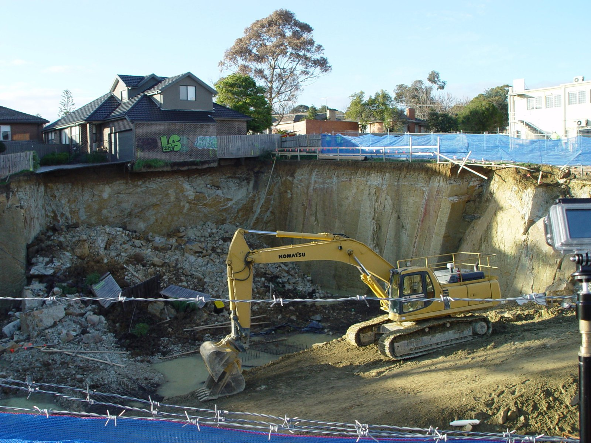 <!-- .element style="display:block; margin-left:auto; margin-right:auto; width:50%" -->

In the shallowest parts of the crust, confining pressure is low and the strength of the soil is correspondingly weak. It fails by collapsing sideways.

<small>

(See [*Homes damaged in Mount Waverley construction site collapse 'still unsafe'*](https://www.abc.net.au/news/2015-10-16/homes-still-unsafe-after-mount-waverley-pit-collapse/6858266))

</small>

<--v-->

## What is Stress ?

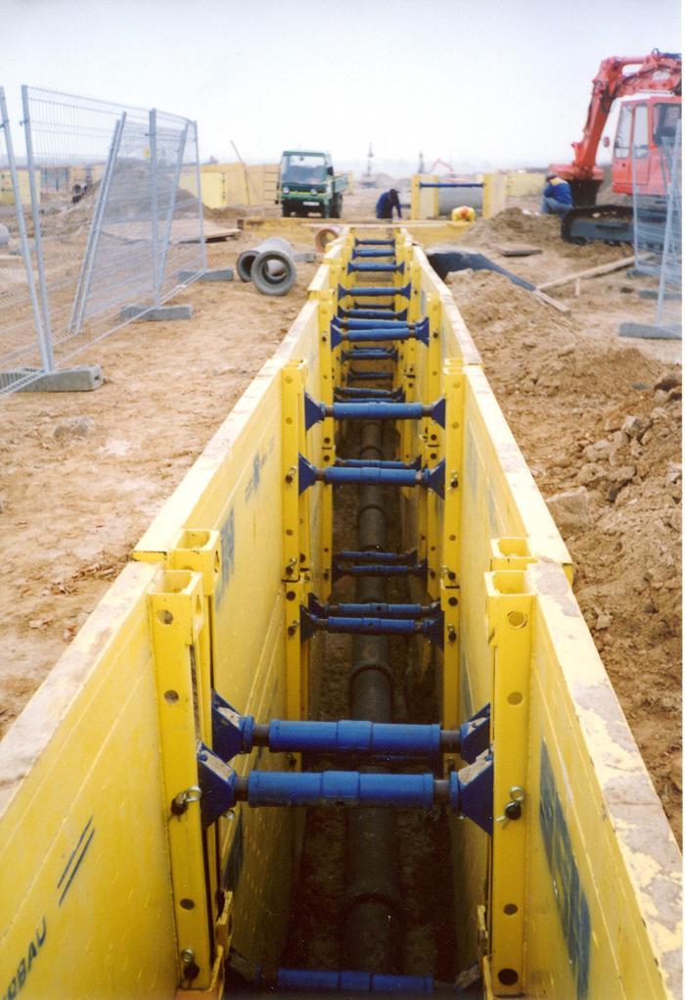 <!-- .element style="float:right; margin-left:20px; width:33%" -->

The exposed, vertical surface used to be in equilibrium with its surroundings: all forces were in balance and we can only ensure no movement takes place if we supply equivalent forces. 

Here, the most important forces are the horizontal ones that hold the walls in place. We can replace these by horizontal supports.

Please remember this if you become a paleoseismologist or an archeologist (or a builder / civil engineer), or if you are building a retaining wall on your property one day.

<small>

( See this [*wikipedia article on trench shoring*](https://en.wikipedia.org/wiki/Trench_shoring))

</small>

<--v-->

## What is Stress ?

In a deep structure, the dominant forces change and the engineering response changes accordingly.

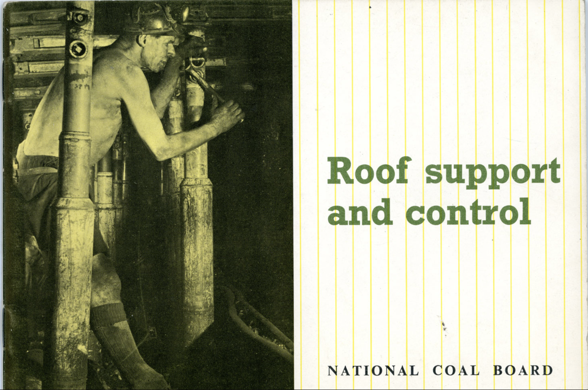
<!-- .element style="width:50%" -->

Now the dominant forces are vertical because the weight of the over-burden is so large. The first task is to support these loads when material is removed.

*Notice that the force we need to supply in a void in the ground is in a different direction for the roof than for the walls — stress has direction as well as size.*

<small>

From [Roof Support in Coal Mines](https://www.culturenlmuseums.co.uk/SIModes/Detail/14223) from the North Lanarkshire Museums collection. 

</small>
<--v-->

## What is Stress ?

Of course, the **magnitude** of those forces is also much larger and there is a limit to how deep it is possible to tunnel and still support an open void. 

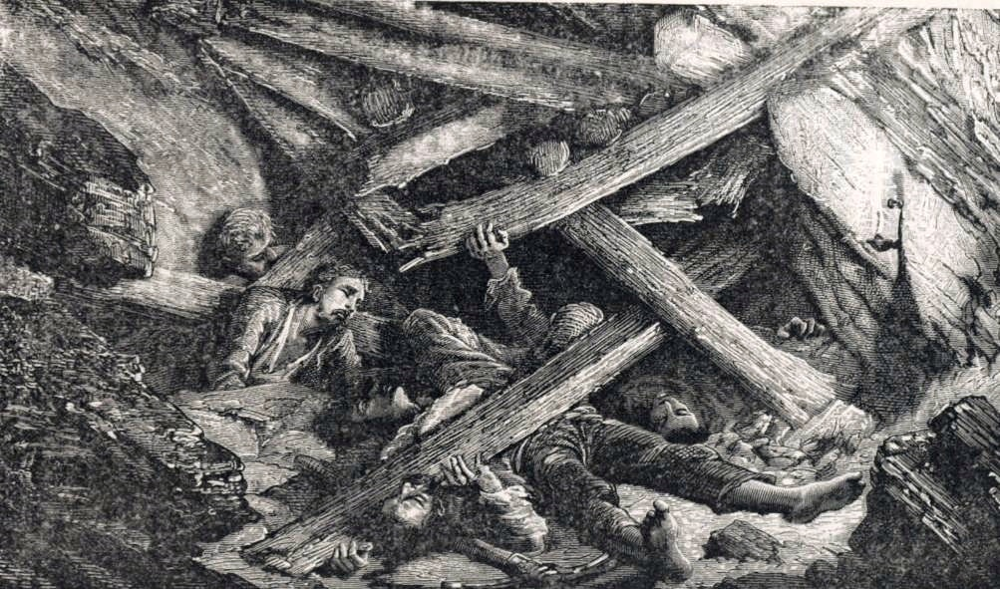
<!-- .element style="width:66%" -->

<small>

For an explanation of this image, see [https://en.wikipedia.org/wiki/Cave-in](https://en.wikipedia.org/wiki/Cave-in)

</small>

<--v-->

## How big are the stresses down there ?

Stress is force per unit area, so it has the same units as pressure: $\textrm{Pa} \equiv N / m^2$.

The simplest stress to estimate is the weight of the overburden. A column of rock of density $\rho \approx 2700 \textrm{ kg/m}^3$ pressing down under gravity gives

$$
\sigma_v = \rho g z \approx 2700 \times 9.8 \times 1000 \approx 26 \textrm{ MPa for every km of depth}
$$

Some comparisons to calibrate your intuition:

  - Atmospheric pressure is $10^5$ Pa (0.1 MPa) — one *thousandth* of the stress 1 km down.
  - The pressure at the deepest point of the ocean (~11 km of water) is about 110 MPa — matched by just ~4 km of rock.
  - At the base of the crust (~40 km) the vertical stress exceeds **1 GPa** — comparable to the strength of engineering steel.

*The tectonic (horizontal) stresses are differences on top of this enormous background — and it is the differences that break rocks.*

<small>

→ A worked version of this calculation opens the [Module 3 stress lecture](Module-iii-lecture1-Theory-draft.reveal.html).

</small>

<--o-->

## Stress has Orientation

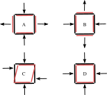  <!-- .element style="float:right;width:49%%" -->

The stress has a distinct orientation as well as magnitude. Here are 
some examples that we will commonly encounter in tectonics

A. Pure shear with the most compressional direction vertical. Typical of a region undergoing extensional deformation.

B. Pure shear with the most compressional direction horizontal. Typical of a region undergoing compressional deformation.

C. Simple shear (e.g. a zone of strike-slip deformation viewed from above)

D. Pressure (increase)

<--v-->

## Principal Stresses

At any point in a stressed material there is one special set of three, mutually perpendicular directions in which all the shear stresses vanish and only pushes (or pulls) remain. These are the **principal directions**, and the corresponding stresses — $\sigma_1 \ge \sigma_2 \ge \sigma_3$ — are the **principal stresses**.

 
<!-- .element style="width:40%" -->

The orientation and relative size of the principal stresses is the single most useful description of the stress state in tectonics — it is the main tool we will use in Module 2. Finding these directions in general takes some machinery that we develop in [the theory module](Module-iii-lecture1-Theory-draft.reveal.html).

<small>

The diagram above is found in Kaliakin, V. N. (2017). Stresses, Strains, and Elastic Response of Soils. In Soil Mechanics (pp. 131–203). Elsevier. https://doi.org/10.1016/B978-0-12-804491-9.00004-5

</small>

<--v-->

## Principal Stresses & Tectonics

The surface of the Earth is a **free surface**. That is, it is not confined by stresses but evolves to an equilibrium where there are no resulting stresses. There can be no shear stresses.

 

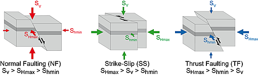 <!-- .element style="width:80%" -->

This means that one principal stress has to be normal to the Earth's surface (close to vertical) and two tangential to the surface (horizontal). 

The orientation of the principal stresses dictates the fault orientation most likely to form and also controls which faults are likely to be the first to slip (orientation, weakness).

Broadly, we can categorize the regional stress field by the orientation of the principal stress and hence the tectonic regime.

<--v-->

## Principal Stresses & Tectonics

Faults form and are most likely to slip when they are oriented at a shallow angle to the 
most compressive principal stress direction. 

 

 <!-- .element style="width:80%" -->

This minimises the normal stress on the faults and maximizes the shear stress. This angle is dictated by the 
friction coefficient. 

$$
\tan 2\theta = \mp \frac{1}{\mu}
$$

For typical rock friction, $\mu \approx 0.6$, this gives $\theta \approx 30°$ — which is why fresh normal faults dip at about 60°, and thrusts at about 30°. *(Where this expression comes from is a Module 3 story — the Mohr circle.)*

<--v-->

## Will the fault slip ?

Remarkably, the friction on rock surfaces barely depends on the rock type. Byerlee measured it for a huge range of rocks:

$$
\tau \approx 0.6 \, \sigma_n
$$

A fault needs the shear stress on it to reach roughly 60% of the normal stress squeezing it shut. Let's put numbers on that for a fault at 5 km depth:

  - Normal stress (roughly the overburden): $\sigma_n \approx 26 \times 5 \approx 130$ MPa
  - Shear stress needed to slip: $\tau \approx 0.6 \times 130 \approx 80$ MPa

Compare that with the stress *released* by earthquakes — typical stress drops are only **1–10 MPa**. Faults sit close to the limit, and small changes (a neighbouring earthquake, fluid pressure in the fault zone) can be enough to tip them.

*Water in the pore space pushes back against the confining stress and lowers the effective normal stress — a preview of a theme that returns in Modules 3 and 4.*

<small>

Byerlee, J. (1978). Friction of rocks. Pure and Applied Geophysics, 116, 615–626.

</small>

<--v-->

## Watching stress choose the faults

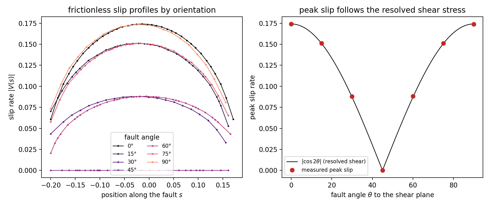 <!-- .element style="display:block; margin-left:auto; margin-right:auto; width:62%" -->

A numerical experiment: identical (frictionless) faults at a sweep of orientations, in the same driving stress. The slip each one takes follows the **resolved shear stress** on it — largest where the fault is well oriented, and *exactly zero* where the resolved shear vanishes.

The stress field does not care where the faults are; the faults can only use the shear the stress field resolves onto them. Orientation is destiny.

<small>

Computed with Underworld3 (split-node faults) — Moresi.

</small>

<--v-->

## One earthquake loads the next

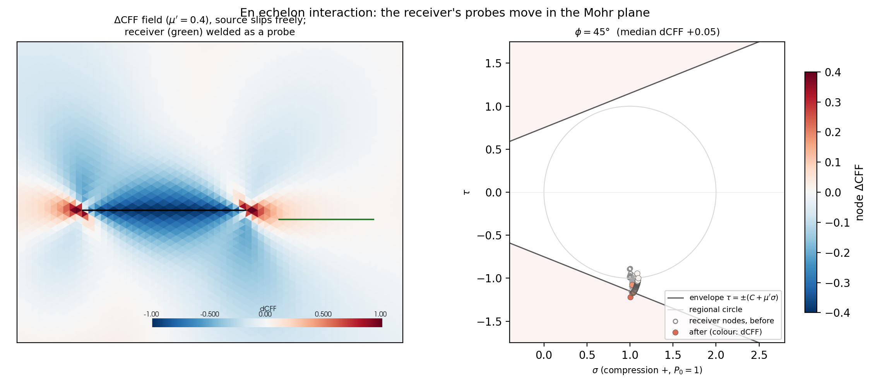 <!-- .element style="display:block; margin-left:auto; margin-right:auto; width:62%" -->

Remember that faults sit close to failure, so *small* changes matter. Here one fault slips, and the stress change is felt by its neighbour: the near end is pushed **towards** failure while the far end retreats from it.

This is the mechanism behind earthquake sequences and aftershock patterns — each event redraws the map of which faults are next.

<small>

Change in Coulomb failure stress from a single slip event; red = loaded towards failure. Underworld3 computation (Moresi). These are quasi-static solutions — the same mathematics as incompressible elasticity — with no depth, gravity or postseismic processes.

</small>

<--v-->

## Putting it together: southern California

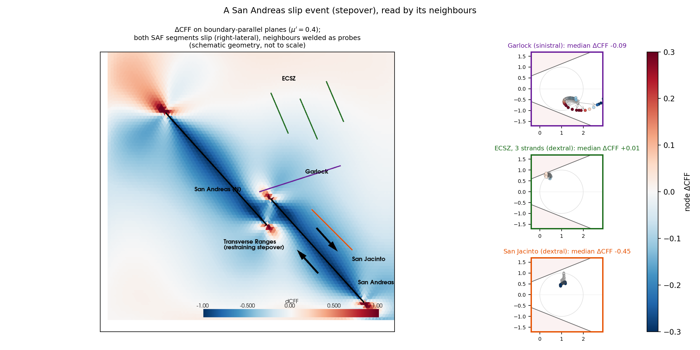 <!-- .element style="display:block; margin-left:auto; margin-right:auto; width:58%" -->

The same ideas at plate-boundary scale: a schematic San Andreas system, driven by the plate motion. Slip on the main strands transfers stress to the faults around them — some are loaded, some relaxed, purely by geometry and orientation.

*Everything on this slide follows from the concepts of this lecture: principal stresses, resolved shear, friction, and faults sitting near failure.*

<small>

Underworld3 computation (Moresi). We return to this style of analysis quantitatively in Modules 3 and 4.

</small>

<--v-->

## Global Stress Revisited

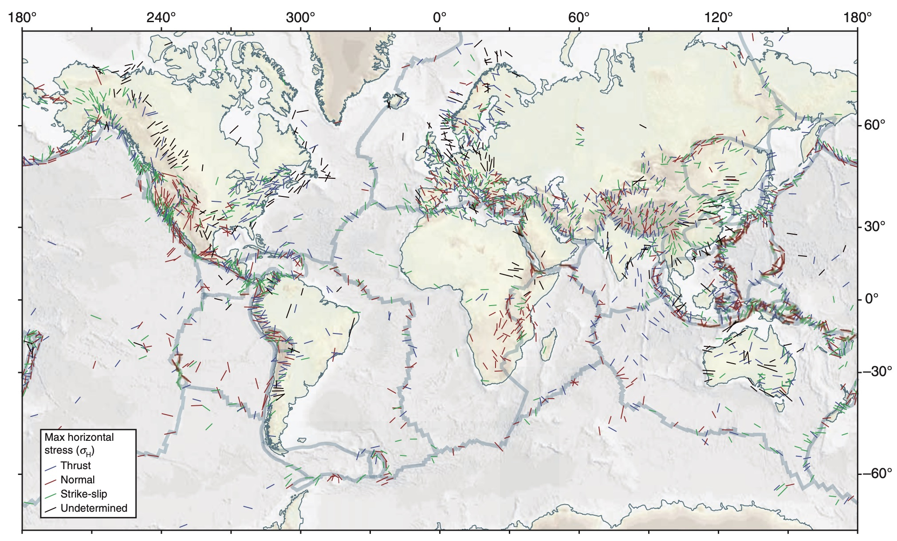 <!-- .element style="float:right; margin-top:50px;margin-bottom:50px; width:50%; margin-left:50px" -->

The World Stress Map (WSM) 2016 displays the contemporary crustal stress orientation in the upper 40 km based on the WSM database release 2016. Lines show the orientation of maximum horizontal stress. 

The colours indicate whether stresses are:

  - Normal faulting ($\sigma_1$ vertical )
  - Strike slip ($\sigma_2$ vertical)
  - Thrust faulting ($\sigma_3$ vertical )

<--v-->  

## Australian Stress Field

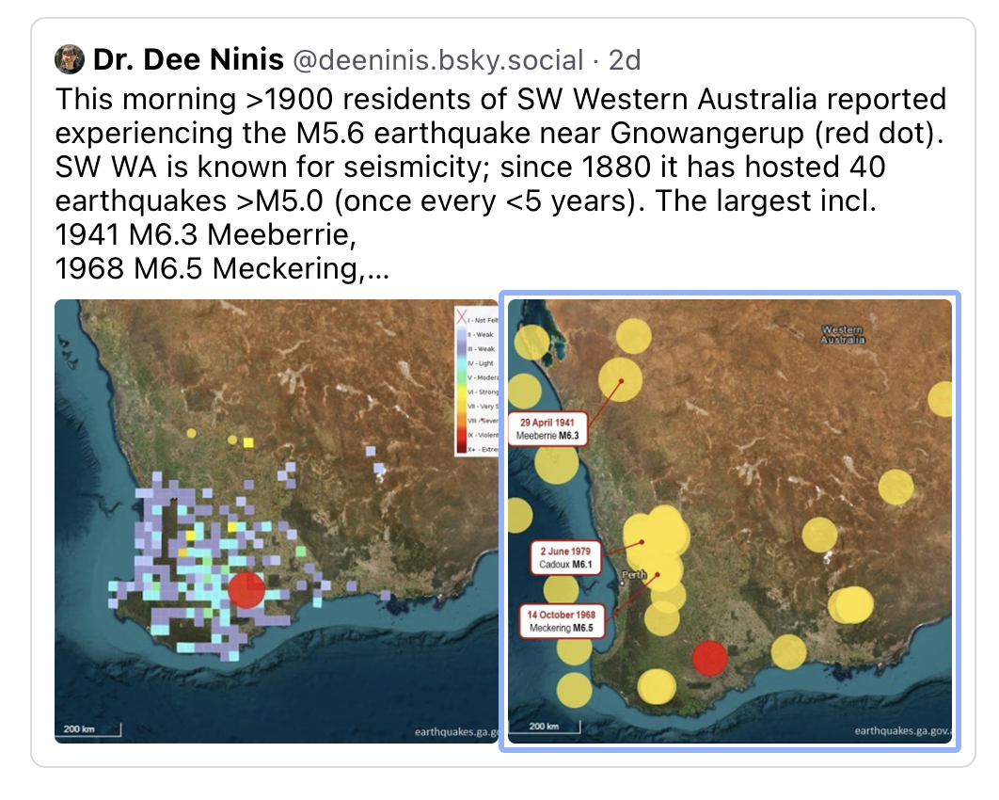 <!-- .element style="height:400px" -->
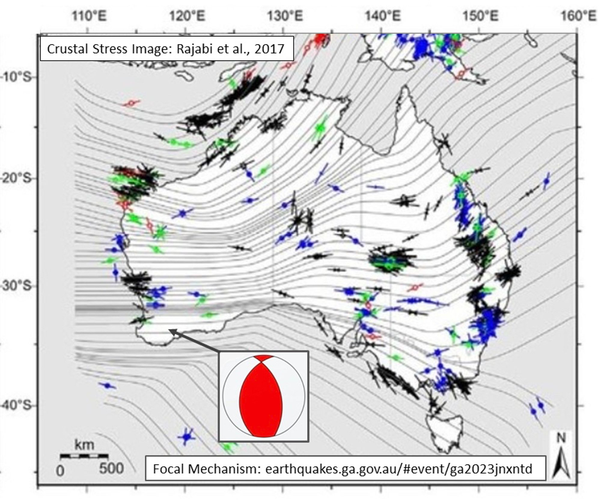 <!-- .element style="height:400px" -->

Analysis of the M5.6 WA earthquake, August 2023 in the light of the Australian stress field (trajectories)

<--o-->

## What is Strain ?

Strain is the relative change in length/shape of a material as a result of deformation. It has no
units as it is a relative measure (but often expressed in terms of % strain)

  <!-- .element style="float:right;width:35%" -->

In one dimension, this is simple to express:

$$
\varepsilon = \frac{\delta L}{L_0}
$$

Like stress, strain has orientation as well as magnitude — the same diagram we used for stress orientations describes the tendency of an (isotropic) material to deform in response. And, like stress, there are principal strain directions.

The formal treatment (the strain tensor and its properties) is developed in [Module 3](Module-iii-lecture2-Theory-draft.reveal.html) — for Module 2 the geometric idea is what matters.

<--o-->

## What is Strain-Rate ? 

The strain-rate is a measure of the rate of change of strain with time (of course it is !). Because strain has no units, strain-rate has units of $\textrm{s}^{-1}$.

Deformation-rates in tectonics are slow almost beyond imagination. Consider a plate boundary zone 500 km across, with one side moving at 5 cm/yr relative to the other:

$$
\dot\varepsilon \approx \frac{0.05 \; \textrm{m/yr}}{500 \times 10^3 \; \textrm{m}} \approx \frac{10^{-7}}{3 \times 10^{7} \textrm{s}} \approx 3 \times 10^{-15} \; \textrm{s}^{-1}
$$

That is the *fast* end: plate boundary zones deform at $10^{-15}$ to $10^{-14} \; \textrm{s}^{-1}$, while plate interiors are a thousand times slower still. (Handy coincidence to remember: one year is very nearly $\pi \times 10^7$ seconds.)

These are the numbers that make geology patient: at $10^{-15}\;\textrm{s}^{-1}$, doubling the length of a region takes tens of millions of years.

<small>

The strain-rate tensor, velocity gradients and vorticity are developed in [Module 3](Module-iii-lecture2-Theory-draft.reveal.html).

</small>

<--o-->

## Rheology

Rheology is the study of how materials deform / flow in response to stresses. We do not know *a priori* how a material will behave when stressed and how this will change with temperature and pressure. We can make some educated guesses but there are empirical coefficients that we have to measure.

  - When a material deforms as an elastic medium, there is a relationship between stress and strain 
    and elastic "constants" such as shear / bulk modulus.

  - When a fault slides under shear stress, there is a frictional relationship that describes when sliding begins 

  - When a material deforms as a viscous fluid, there is a relationship between stress and strain-rate and the viscosity and bulk viscosity are the relevant coefficients. 

The same rock can do all three — which one dominates depends on temperature, pressure, and how fast you push it. That competition is the story of this final section.

<--v-->

## Rheology: Elasticity

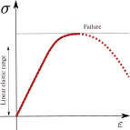 <!-- .element style="width:35%;float:right;margin-left:40px;" -->

The one dimensional elastic response to stress is the classical Hooke's law for an extending spring. This is typically a linear response but if the stress is too high, permanent deformation or failure may occur.

Elastic deformation is **recoverable** — remove the stress and the material springs back. This is how rocks store the energy that earthquakes release.

<--v-->

## Rheology: Viscosity

  <!-- .element style="height:250px;" -->
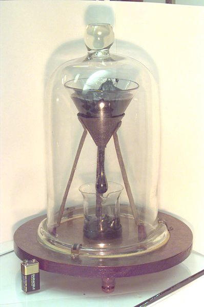 <!-- .element style="height:250px;" -->

**Viscosity** is a measure of the resistance of a fluid to deform under shear stress. It is commonly perceived as "thickness", or resistance to flow. Viscosity describes a fluid's internal resistance to flow and may be thought of as a measure of fluid friction. Water is runny, having a lower viscosity, while honey is "thick" having a higher viscosity. The symbol we typically use for viscosity is $\eta$ (sometimes $\mu$ but we often use that for elastic shear modulus !)

*The right image is from the University of Queensland [Pitch Drop Experiment](https://smp.uq.edu.au/pitch-drop-experiment)*

<--v-->

## Rheology: Viscosity

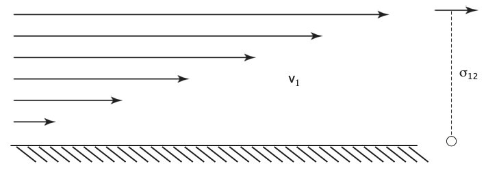 <!-- .element style="width:35%; float:right; padding-left:30px; " -->

Viscous deformation is an irreversible *flow* that occurs in response to an applied shear stress. 
The stress is found to depend on the strength of the shearing *velocity gradient*.

$$
  \tau_{ij} = \eta D_{ij}
$$  
<!-- .element style="width:60%;" -->

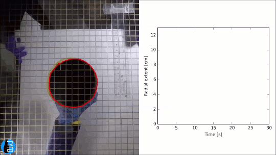 <!-- .element style="width:35%; float:right; padding-left:30px;" -->

Think of this as the stress that resists the shear deformation, i.e. how hard it is to stir the fluid. This is much harder if the fluid is **more viscous**. 
Or think of it as how fast the fluid responds to a given force (e.g. gravity) so a viscous gravity current will spread **more slowly** if the viscosity is high.

Viscosity only opposes the formation of velocity gradients; not a driving force, only a resistance.

Rocks can be viscous without being liquid — they flow slowly, in the solid state, by the migration of crystal defects. The mantle behaves this way over geological time.

<--v-->

## Rheology: Plasticity

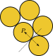 <!-- .element style="height:250px;" -->
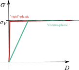 <!-- .element style="height:250px;margin-left:60px;" -->

Granular materials exhibit "frictional" behaviour. The contacts between grains are locked when the frictional stress ($\tau_Y \approx \mu P$ ) is stronger than any shear stresses. After this, the material will begin to deform and the stresses will be **limited** by the frictional strength. 

Rocks with multiple faults in them can start to look like granular materials in which the stress is limited by the strength of whichever faults are sliding in the given conditions. If there are very many faults, then the resulting rheological law is likely to be isotropic.

<small>

The constitutive laws behind these behaviours (elastic moduli, power-law creep, plastic yield) are developed in [Module 3](Module-iii-lecture3-Theory-draft.reveal.html).

</small>

<--o--> 

## Rock Deformation Map

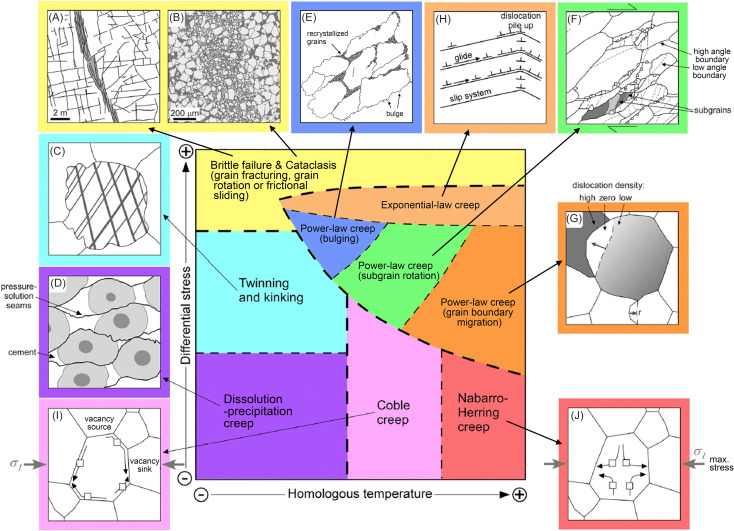 <!-- .element style="margin-right:5px; height:300px" -->
       <!-- .element style="margin-left:5px;  height:300px" -->

Rock deformation maps show how temperature and the magnitude of the differential stress influence how rocks deform. We expect to see far more "creep" dominated deformation in the deep (high pressure, high temperature) parts of the planet and more fracture dominated deformation in the shallow (cooler, lower pressure) parts of the lithosphere. 

<small>

Gomez-Rivas, E., Butler, R. W. H., Healy, D., & Alsop, I. (2020). From hot to cold - The temperature dependence on rock deformation processes: An introduction. Journal of Structural Geology, 132, 103977. https://doi.org/10/gk6kn4

</small>

<--o-->

## The Brittle-Ductile Transition 

Pressure and temperature increasing with depth lead to a well defined increase in
strength with depth initially (pressure effect, fault strength) 
followed by a loss of strength at depth due to increasing temperature promoting creep.

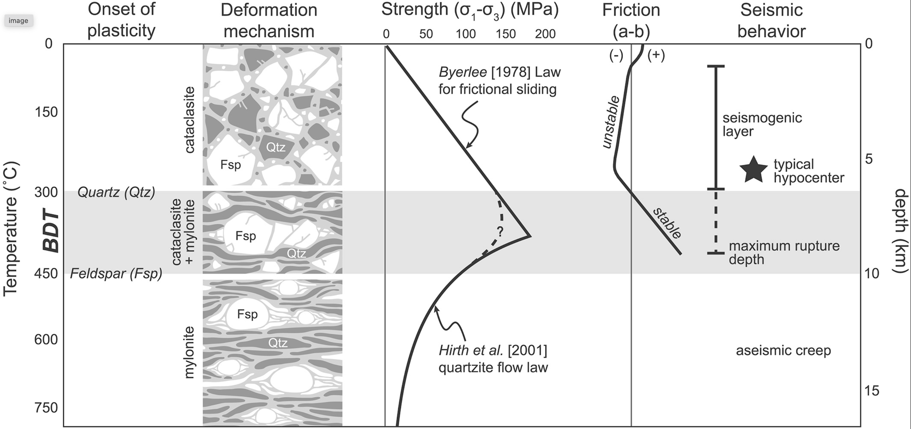 <!-- .element style="width:66%" -->

This is why faulting and earthquakes are concentrated in the upper crust, while the deeper lithosphere deforms by flow — the theme that Module 2 (structures) and Module 3 (mechanics) take up from here.

<small>

Nevitt, J. M., Warren, J. M., & Pollard, D. D. (2017). Testing constitutive equations for brittle‐ductile deformation associated with faulting in granitic rock. Journal of Geophysical Research: Solid Earth, 122(8), 6269–6293. https://doi.org/10/gbxsbc

</small>

<--o-->
