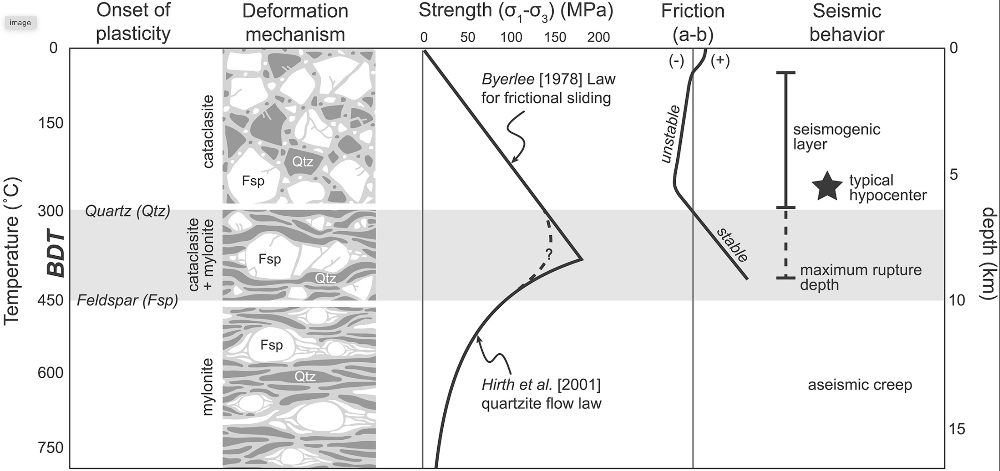

# EMSC 3002

## Module 1.3 - Stress, Strain and Strength

  - **Louis Moresi** (convenor)
  - Romain Beucher (lecturer)
  - Chengxin Jiang (lecturer)
  - Stephen Cox (curriculum advisor)

Australian National University

_**NB:** the course materials provided by the authors are open source under a creative commons licence.  We acknowledge the contribution of the community in providing other materials and we endeavour to provide the correct attribution and citation. Please contact louis.moresi@anu.edu.au for updates and corrections._

<--o-->

## About this section

This section covers some of the concepts that we will deal with in considerable detail in Module 3 of the course. You will need to understand the basics of stress, strain, strain-rate as well as elastic, viscous and plastic deformation in order to appreciate the way tectonic stresses produce structures in the Earth.

You also need familiarity with the variety of structures in the Earth before you can appreaciate how stresses and constitutive properties of rocks play out under different situations. 

This will be a brief introduction and we will return to details once you have completed Module 2.

<--o-->

## What is Stress ?

Consider what happens when we build an underground structure - a basement, a trench, a tunnel or a mine. What is the most important thing we have to do to remain safe ? 

 <!-- .element style="display:block; margin-left:auto; margin-right:auto; width:50%" -->

In the shallowest parts of the crust, confining pressure is low and the strength of the soil is correspondingly weak. It fails by collapsing sideways.

<small>

(See [*Homes damaged in Mount Waverley construction site collapse 'still unsafe'*](https://www.abc.net.au/news/2015-10-16/homes-still-unsafe-after-mount-waverley-pit-collapse/6858266))

</small>

<--v-->

## What is Stress ?

 <!-- .element style="float:right; margin-left:20px; width:33%" -->

The exposed, vertical surface used to be in equilibrium with its surroundings: all forces were in balance and we can only ensure no movement takes place if we supply equivalent forces. 

Here, the most important forces are the horizontal ones that hold the walls in place. We can replace these by horizontal supports.

Please remember this if you become a paleoseismologist or an archeologist (or a builder / civil engineer), or if you are building a retaining wall on your property one day.

<small>

( See this [*wikipedia article on trench shoring*](https://en.wikipedia.org/wiki/Trench_shoring))

</small>

<--v-->

## What is Stress ?

In a deep structure, the dominant forces change and the engineering response changes accordingly.

<!-- .element style="width:50%" -->

Now the dominant forces are vertical because the weight of the over-burden is so large. The first task is to support these loads when material is removed.

<small>

From [Roof Support in Coal Mines](https://www.culturenlmuseums.co.uk/SIModes/Detail/14223) from the North Lanarkshire Museums collection. 

</small>
<--v-->

## What is Stress ?

Of course, the **magnitude** of those forces is also much larger and there is a limit to how deep it is possible to tunnel and still support an open void. 

<!-- .element style="width:66%" -->

<small>

For an explanation of this image, see [https://en.wikipedia.org/wiki/Cave-in](https://en.wikipedia.org/wiki/Cave-in)

</small>

<--o-->

## The Stress Tensor

  <!-- .element style="float:right;width:49%%" -->

The stress has a distinct orientation as well as magnitude. Here are 
some examples that we will commonly encounter in tectonics

A. Pure shear with the most compressional direction vertical. Typical of a region undergoing extensional deformation.

B. Pure shear with the most compressional direction horizontal. Typical of a region undergoing compressional deformation.

C. Simple shear (e.g. a zone of strike-slip deformation viewed from above)

D. Pressure (increase)

<--v-->

## The Stress Tensor

If we cut out a plane through a material that is under stress, then there is a **traction vector** (a force) on this plane that results from the unbalanced stresses and *the vector changes with the orientation of the plane*. 

  <!-- .element style="float:right;width:49%%" -->

In fact, this is enough to define the stress tensor.

$$ T_i = \sum_{j} \sigma_{ij} \times n_j = \boldsymbol{\sigma} \cdot \mathbf{n} $$

where $\left\\{ n \right\\}$ is the vector normal to the plane.

Here is a way to think about it: *In general, the force that we need to balance in a void in the ground will be in a different direction for the roof from the walls*

Pressures are stresses (forces acting per area of a surface) and so stresses have the same units: $\textrm{Pa} \equiv N / m^2 $

<--v-->

## The Stress Tensor

The complexity we have seen reflects the fact that **stress is a tensor quantity**. 

$$ \mathbf{\sigma} = 
\begin{bmatrix}
\sigma_{xx} & \sigma_{xy} & \sigma_{xz} \\\\
\sigma_{yx} & \sigma_{yy} & \sigma_{yz} \\\\
\sigma_{zx} & \sigma_{zy} & \sigma_{zz} 
\end{bmatrix} $$

The stress tensor is **symmetric**. i.e. $\sigma_{xy} = \sigma_{yx}$ 

It has a **volumetric** component (pressure) that is independent of the orientation and a **deviatoric** component (the shear stresses) that is not.

We can rotate the coordinates (equivalent to adjusting our point of view) and in one specific orientation, the shear stresses all vanish. This coordinate system defines the principal stresses.

<--o-->

## Principal Stresses

The stress tensor has **principal directions** which define a special orientation in which the shear stresses all vanish (this is a property of tensor quantities in general - they can be diagonalised). 

 
<!-- .element style="width:40%" -->

This will be very helpful in understanding tectonic stresses, however, it may be hard to find what these directions are. This is something we address in our theory module.

<small>

The diagram above is found in Kaliakin, V. N. (2017). Stresses, Strains, and Elastic Response of Soils. In Soil Mechanics (pp. 131–203). Elsevier. https://doi.org/10.1016/B978-0-12-804491-9.00004-5

</small>

<--v-->

## Principal Stresses & Tectonics

The surface of the Earth is a **free surface**. That is, it is not confined by stresses but evolves to an equilibrium where there are no resulting stresses. There can be no shear stresses.

 

 <!-- .element style="width:80%" -->

This means that one principal stress has to be normal to the Earth's surface (close to vertical) and two tangential to the surface (horizontal). 

The orientation of the principal stresses dictates the fault orientation most likely to form and also controls which faults are likely to be the first to slip (orientation, weakness).

Broadly, we can categorize the regional stress field by the orientation of the principal stress and hence the tectonic regime.

<--v-->

## Global Stress Revisited

 <!-- .element style="float:right; margin-top:50px;margin-bottom:50px; width:50%; margin-left:50px" -->

The World Stress Map (WSM) 2016 displays the contemporary crustal stress orientation in the upper 40 km based on the WSM database release 2016. Lines show the orientation of maximum horizontal stress. 

The colours indicate whether stresses are:

  - Normal faulting ($\sigma_1$ vertical )
  - Strike slip ($\sigma_2$ vertical)
  - Thrust faulting ($\sigma_3$ vertical )

<--o-->

<--o-->

<--o-->

<--o-->

<--o-->

<--o-->
At
<--o-->

## What is Strain ?

<--o-->

## What is Strain-Rate ? 

<--v-->

<--v-->

## Global Seismicity

The magnitude of the stress is related to the rate of seismic energy release because this is a measure of those places which are under enough stress for the lithosphere to "break".

<video autoplay controls width="75%">
    <source src="movies/GlobalEQCumulative.m4v"
            type="video/mp4">

    Sorry, your browser doesn't support embedded videos.
</video>

Usually this takes the form of a fault that already exists sliding because the shear stresses are large compared to the confining pressure.

<--v-->

## Global Strain rate

 <!-- .element style="float:right; margin-top:50px;margin-bottom:50px; width:50%; margin-left:50px" -->

<!-- .element stoyle="width:60%" -->

The strain rate is a measure of how fast deformation is taking place. Strain rate is a measure of the rate of change of length (units are $s^{-1}$) *and* it is a tensor: there are multiple components that represent normal and shear strains. The measure shown here is an average (the second invariant).

The rate of deformation is related to two things: the stress applied and the strength of the material. 

<small>

Kreemer, C., Blewitt, G., & Klein, E. C. (2014). A geodetic plate motion and Global Strain Rate Model. Geochemistry, Geophysics, Geosystems, 15(10), 3849–3889. https://doi.org/10/f6p92p

</small>

<--v-->

Kostrov summation connects seismic moment release and strain rate

<--o-->

## Rock Deformation Map

 <!-- .element style="display:block; margin-left:auto; margin-right:auto; width:50%" -->

Rock deformation map that shows how temperature and the magnitude of the differential stress (shear stress compared to confining pressure) influence how rocks deform.

<small>

Gomez-Rivas, E., Butler, R. W. H., Healy, D., & Alsop, I. (2020). From hot to cold - The temperature dependence on rock deformation processes: An introduction. Journal of Structural Geology, 132, 103977. https://doi.org/10/gk6kn4

</small>

<--v-->

## Rock Deformation Map

 <!-- .element style="margin-right:5px; height:300px" -->
       <!-- .element style="margin-left:5px;  height:300px" -->

We expect to see far more "creep" dominated deformation in the deep (high pressure, high temperature) parts of the planet and more fracture dominated deformation in the shallow (cooler, lower pressure) parts of the lithosphere. 

## Rock Rheology

(Also see Magali's survey of the topic)

Connection between strain-rate / strain and the applied stress

Tensor relationship (Cijkl) & explanation

<--o--> 

## The Brittle-Ductile Transition 

Pressure and temperature increasing with depth lead to a well defined increase in
strength with depth initially (pressure effect, fault strength) 
followed by a loss of strength at depth due to increasing temperature promoting creep.

 <!-- .element style="width:66%" -->

<small>

Nevitt, J. M., Warren, J. M., & Pollard, D. D. (2017). Testing constitutive equations for brittle‐ductile deformation associated with faulting in granitic rock. Journal of Geophysical Research: Solid Earth, 122(8), 6269–6293. https://doi.org/10/gbxsbc

</small>

<--v-->

## The Brittle-Ductile Transition 

The classic work on the deformation of crustal rocks is Byerlee's paper of 1968. *"... at low confining presure, many rocks are brittle. That is, when differential stress is suffiently high, a fault is formed and, after faulting, the compressive stress is decreased. At high confining pressure, the same rocks may be ductile."* 

 <!-- .element style="width:66%" -->

<small>

Byerlee, J. D. (1968). Brittle-ductile transition in rocks. Journal of Geophysical Research, 73(14), 4741–4750. https://doi.org/10/dtqwmx

</small>

<--o-->

## The Mohr Circle

<--o-->

<!-- 
## Measurements of stress

(stress map again ...)
 -->

<--o-->
## Anderson Faulting Theory

