<!-- source: EMSC3002_pt_rules.pptx slide 1 · template: T0-title-or-other -->
## Putting plate kinematics to good use

Louis Moresi louis.moresi@anu.edu.au

<--o-->

<!-- source: EMSC3002_pt_rules.pptx slide 2 · template: T6-two-image -->
## What are the rules ?

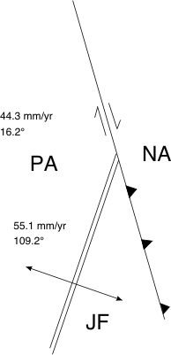

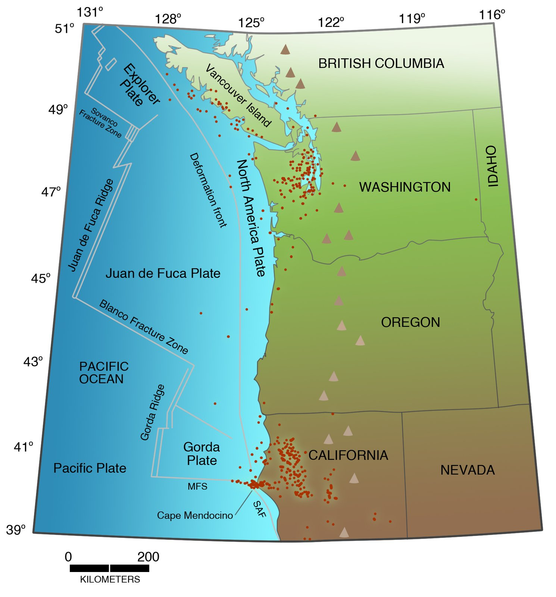

<--o-->

<!-- source: EMSC3002_pt_rules.pptx slide 3 · template: T6-two-image -->
## Triple junctions

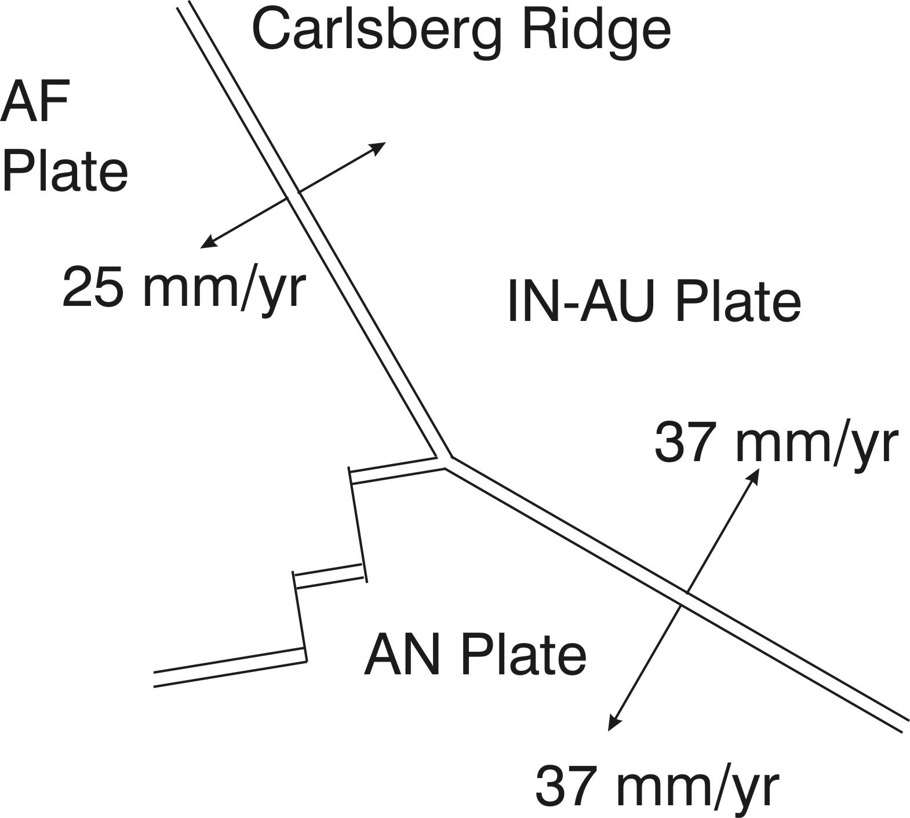

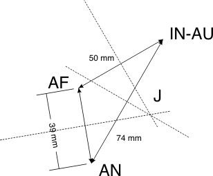

<--o-->

<!-- source: EMSC3002_pt_rules.pptx slide 4 · template: T5-figure-focus -->
## Triple junction rules can be complicated !
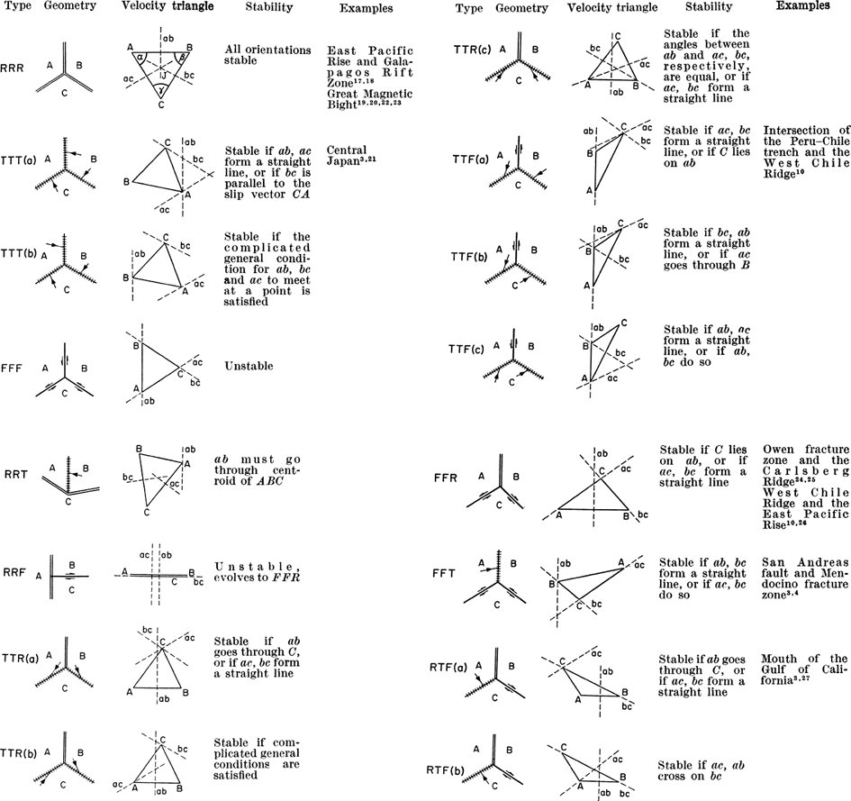 <!-- .element class="r-stretch" -->

McKenzie & Parker 1967

<--o-->

<!-- source: EMSC3002_pt_rules.pptx slide 5 · template: T3-text-and-image -->
## Reconstructing past plates / boundaries

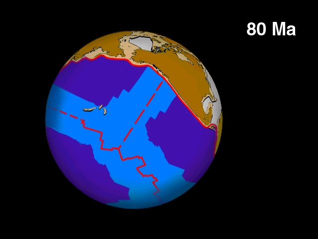

Tanya Atwater

<--o-->

<!-- source: EMSC3002_pt_rules.pptx slide 6 · template: T3-text-and-image -->
## Reconstructing past reconfigurations

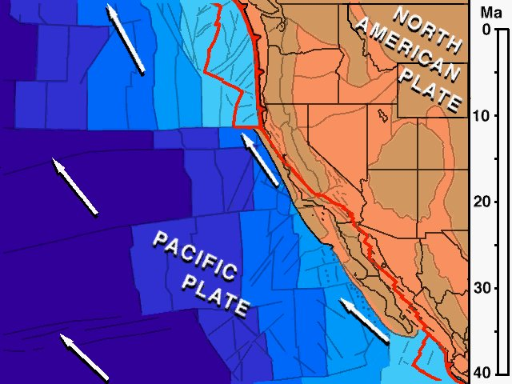

How do we know there was a Farallon plate ?
When does the San Andreas fault system appear ?

<--o-->

<!-- source: EMSC3002_pt_rules.pptx slide 7 · template: T3-text-and-image -->
## The Farallon slab

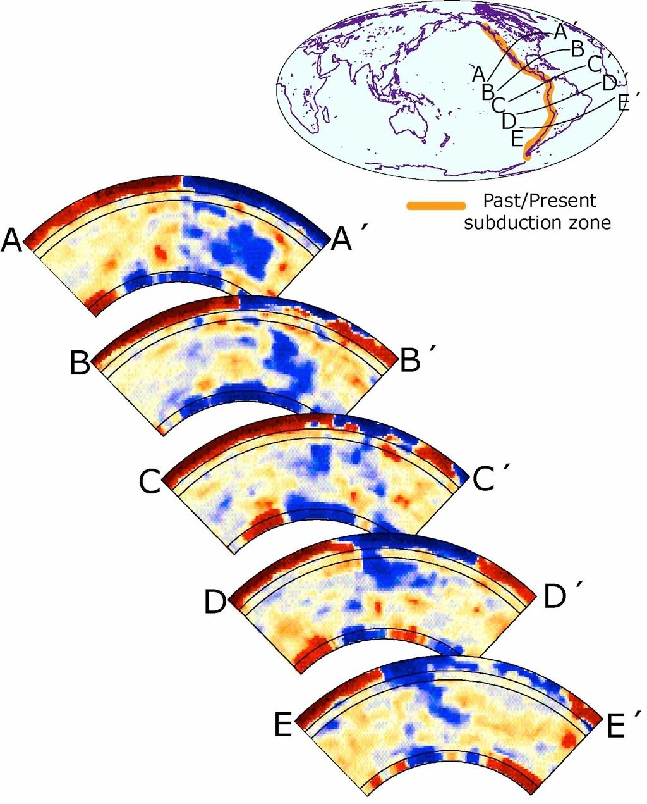

- Still very obvious in tomographic images
- Clearly detached from surface where  mid-ocean ridge was subducted

<--o-->

<!-- source: EMSC3002_pt_rules.pptx slide 8 · template: T6-two-image -->
## Plate boundary effects in the continent

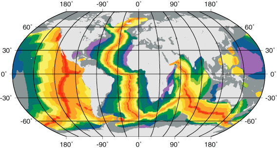

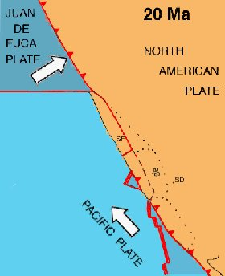

<--o-->

<!-- source: EMSC3002_pt_rules.pptx slide 9 · template: T6-two-image -->
## Basin and range

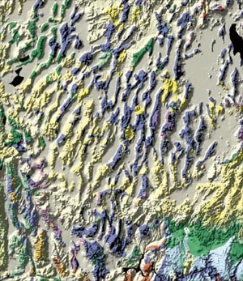

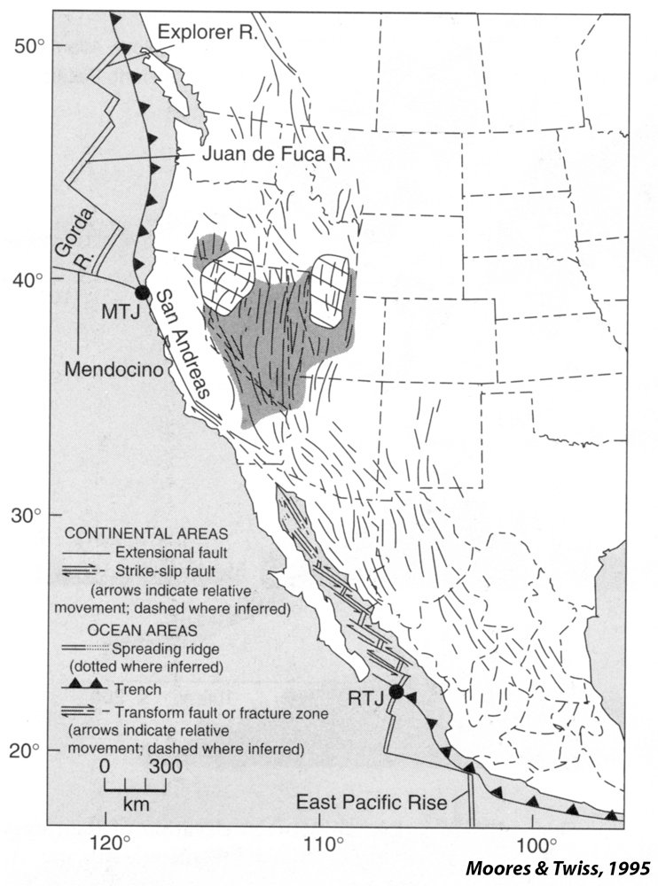

<--o-->

<!-- source: EMSC3002_pt_rules.pptx slide 10 · template: T3-text-and-image -->
## Lava Lake Tectonics

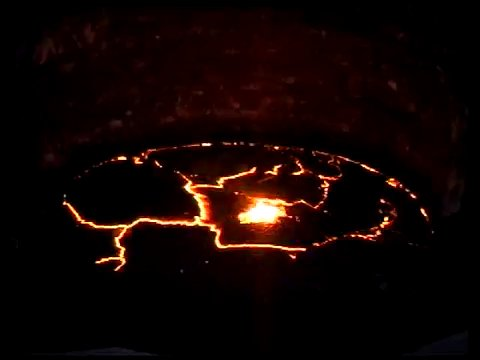

- Note how spreading centres move across the lake as spreading progresses
- Different rates for different plates, rearrangements.

<--o-->

<!-- source: EMSC3002_pt_rules.pptx slide 11 · template: T3-text-and-image -->
## How do we evolve plate boundaries ?

- The “rules” of plate kinematics work well for oceanic plate boundaries under most circumstances. To apply them we need to look at:
- Relative nature of plate motion
- Addition of plate motion vectors
- Hotspot tracks
- Triple junctions & stability criteria

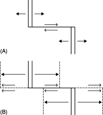

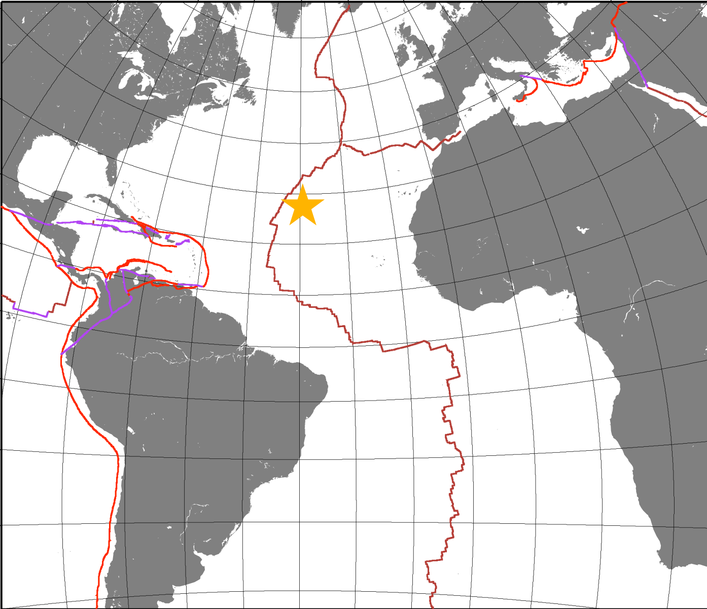

<--o-->

<!-- source: EMSC3002_pt_rules.pptx slide 12 · template: T3-text-and-image -->
## Relative velocities

**A**

**B**

**A**

**B**

**A**

**B**

Today

Some time later...

<--o-->

<!-- source: EMSC3002_pt_rules.pptx slide 13 · template: T3-text-and-image -->
## Relative velocities

**A**

**B**

**A**

**B**

**C**

**C**

<--o-->

<!-- source: EMSC3002_pt_rules.pptx slide 14 · template: T3-text-and-image -->
## Detour — vectors

y

- Have magnitude and direction
- Examples:
- Velocity (speed in given direction)
- Acceleration
- Displacement (offset and direction)
- Described in terms of
- Length and Direction (r,θ)
- Cartesian offset (x,y)
- Think of giving someone directions by compass bearing “to get to the pub from here, walk one hundred metres in a roughly north-easterly direction ...”

θ

r

x

<--o-->

<!-- source: EMSC3002_pt_rules.pptx slide 15 · template: T3-text-and-image -->
## Detour — vector addition

To add vectors we can think again of “adding” compass bearings
“To get to the pub (without falling in the lake) walk 80 metres North and then 60 metres East ... “

Destination

Starting point

<--o-->

<!-- source: EMSC3002_pt_rules.pptx slide 16 · template: T3-text-and-image -->
## Non-orthogonal boundaries

**C**

**A**

**B**

<--o-->

<!-- source: EMSC3002_pt_rules.pptx slide 17 · template: T3-text-and-image -->
## Plate circuits

C · D

Generalize the previous example — no matter what the plate boundary types ...

**A**

**B**

**E**

<--o-->

<!-- source: EMSC3002_pt_rules.pptx slide 18 · template: T3-text-and-image -->
## Motions on a sphere

- So far we have looked at everything as though it were happening on a flat Earth ... This is not the case, and on a plate scale, the curvature cannot be ignored.
- Consequences:
- The (relative) motion of plates is described by rotation pole and angular velocity
- Transform faults lie along small circles relative to this pole
- The velocity (magnitude & direction) of points on a plate varies systematically over the plate
- To describe plate motions and do reconstructions we need to understand how to move plates on the surface of a sphere. We also need to understand how to do this quantitatively.

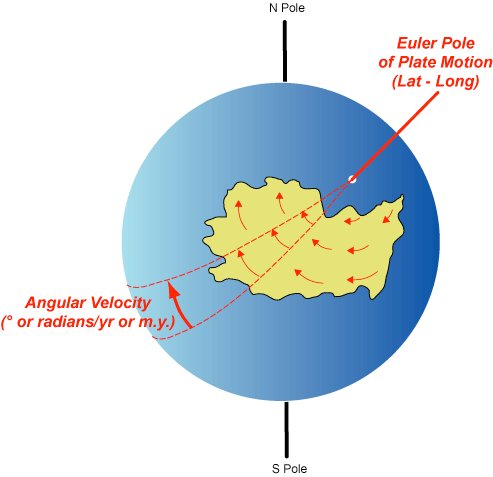

<--o-->

<!-- source: EMSC3002_pt_rules.pptx slide 19 · template: T5-figure-focus -->
## Pacific / North America Rotation Pole
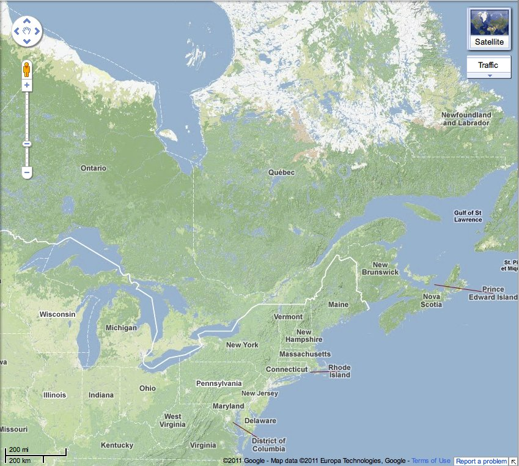 <!-- .element class="r-stretch" -->

<--o-->

<!-- source: EMSC3002_pt_rules.pptx slide 20 · template: T1-prose -->
## Patterns of magnetic stripes
- Coming soon !!
- Transforms & fracture zones
- Triple junctions
- Propagators !!

<--o-->

<!-- source: EMSC3002_pt_rules.pptx slide 21 · template: T1-prose -->
## Transform faults v. Fracture zones
**A**

**A**

**B**

**B**

Ridge

<--o-->

<!-- source: EMSC3002_pt_rules.pptx slide 22 · template: T5-figure-focus -->
## Plate motions on a sphere
 <!-- .element class="r-stretch" -->

Spreading · Subduction

<--o-->

<!-- source: EMSC3002_pt_rules.pptx slide 23 · template: T5-figure-focus -->
## Plate motions on a sphere
 <!-- .element class="r-stretch" -->

Spreading · Subduction

<--o-->

<!-- source: EMSC3002_pt_rules.pptx slide 24 · template: T5-figure-focus -->
## North America / Pacific elevation
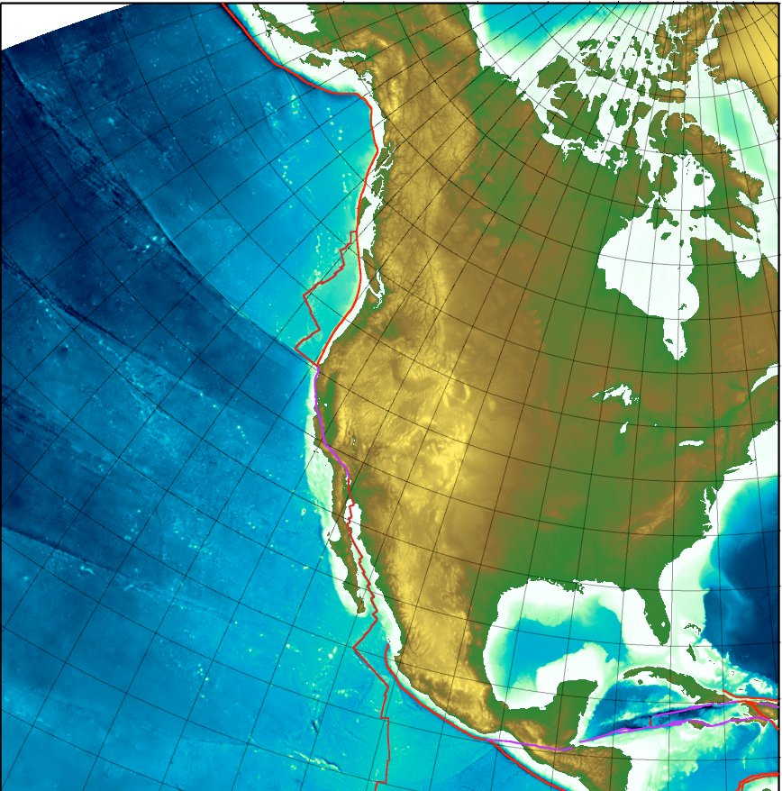 <!-- .element class="r-stretch" -->

<--o-->

<!-- source: EMSC3002_pt_rules.pptx slide 25 · template: T5-figure-focus -->
## Pacific / North America Rotation Pole
 <!-- .element class="r-stretch" -->

<--o-->

<!-- source: EMSC3002_pt_rules.pptx slide 26 · template: T5-figure-focus -->
## Pacific age grid
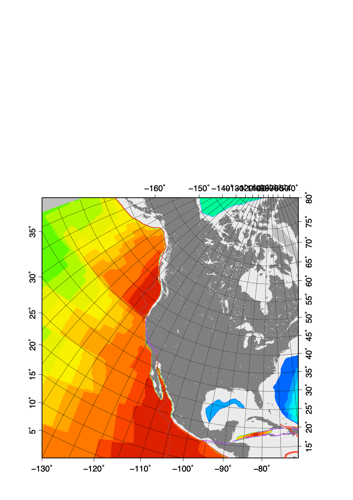 <!-- .element class="r-stretch" -->

<--o-->

<!-- source: EMSC3002_pt_rules.pptx slide 27 · template: T3-text-and-image -->

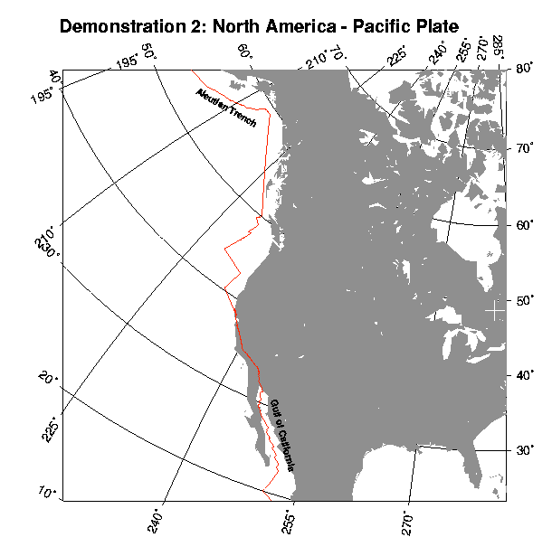

Rotation Pole

<--o-->

<!-- source: EMSC3002_pt_rules.pptx slide 28 · template: T4-full-figure -->
<!-- .slide: data-background="Module-i-PlateKinematics-extracted/slide028_img1.jpg" -->

<--o-->

<!-- source: EMSC3002_pt_rules.pptx slide 29 · template: T4-full-figure -->
<!-- .slide: data-background="Module-i-PlateKinematics-extracted/slide029_img1.jpg" -->

<--o-->

<!-- source: EMSC3002_pt_rules.pptx slide 30 · template: T4-full-figure -->
<!-- .slide: data-background="Module-i-PlateKinematics-extracted/slide030_img1.jpg" -->

<--o-->

<!-- source: EMSC3002_pt_rules.pptx slide 31 · template: T4-full-figure -->
<!-- .slide: data-background="Module-i-PlateKinematics-extracted/slide031_img1.jpg" -->

<--o-->

<!-- source: EMSC3002_pt_rules.pptx slide 32 · template: T4-full-figure -->
<!-- .slide: data-background="Module-i-PlateKinematics-extracted/slide032_img1.jpg" -->

<--o-->

<!-- source: EMSC3002_pt_rules.pptx slide 33 · template: T4-full-figure -->
<!-- .slide: data-background="Module-i-PlateKinematics-extracted/slide033_img1.jpg" -->

<--o-->

<!-- source: EMSC3002_pt_rules.pptx slide 34 · template: T4-full-figure -->
<!-- .slide: data-background="Module-i-PlateKinematics-extracted/slide034_img4.png" -->

<--o-->

<!-- source: EMSC3002_pt_rules.pptx slide 35 · template: T5-figure-focus -->
## Africa / South America elevation
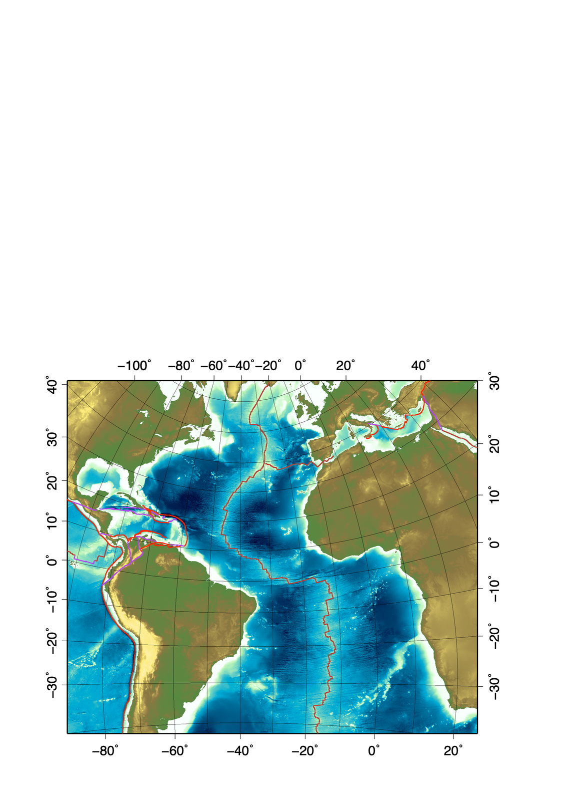 <!-- .element class="r-stretch" -->

<--o-->

<!-- source: EMSC3002_pt_rules.pptx slide 36 · template: T5-figure-focus -->
## Atlantic age grid
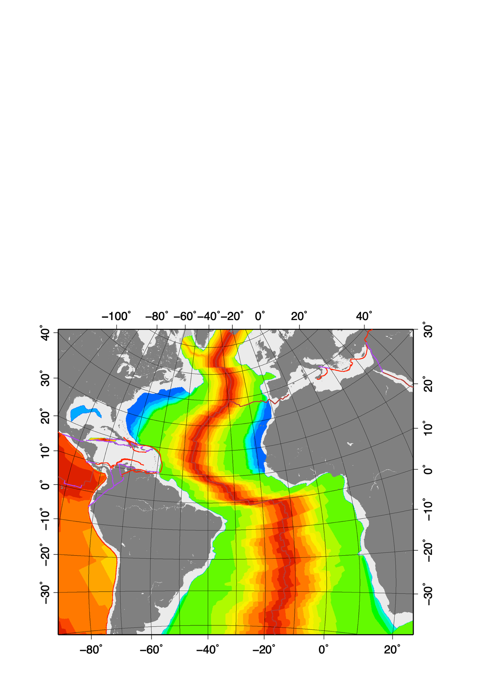 <!-- .element class="r-stretch" -->

<--o-->

<!-- source: EMSC3002_pt_rules.pptx slide 37 · template: T4-full-figure -->
<!-- .slide: data-background="Module-i-PlateKinematics-extracted/slide037_img1.png" -->

<--o-->

<!-- source: EMSC3002_pt_rules.pptx slide 38 · template: T4-full-figure -->
<!-- .slide: data-background="Module-i-PlateKinematics-extracted/slide038_img1.png" -->

<--o-->

<!-- source: EMSC3002_pt_rules.pptx slide 39 · template: T4-full-figure -->
<!-- .slide: data-background="Module-i-PlateKinematics-extracted/slide039_img1.png" -->

<--o-->

<!-- source: EMSC3002_pt_rules.pptx slide 40 · template: T4-full-figure -->
<!-- .slide: data-background="Module-i-PlateKinematics-extracted/slide040_img1.png" -->

<--o-->

<!-- source: EMSC3002_pt_rules.pptx slide 41 · template: T4-full-figure -->
<!-- .slide: data-background="Module-i-PlateKinematics-extracted/slide041_img1.png" -->

<--o-->

<!-- source: EMSC3002_pt_rules.pptx slide 42 · template: T4-full-figure -->
<!-- .slide: data-background="Module-i-PlateKinematics-extracted/slide042_img2.png" -->

<--o-->

<!-- source: EMSC3002_pt_rules.pptx slide 43 · template: T4-full-figure -->
<!-- .slide: data-background="Module-i-PlateKinematics-extracted/slide043_img2.png" -->

<--o-->

<!-- source: EMSC3002_pt_rules.pptx slide 44 · template: T4-full-figure -->
<!-- .slide: data-background="Module-i-PlateKinematics-extracted/slide044_img2.png" -->
