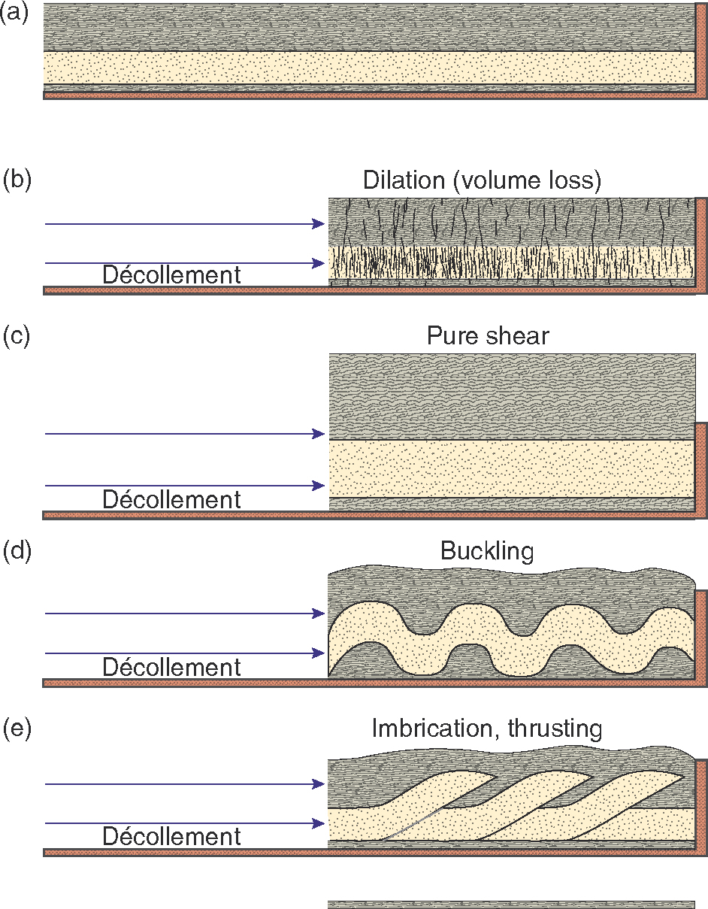

# EMSC 3002

## Contractional regimes

  - Louis Moresi (convenor)
  - **Romain Beucher** (lecturer)
  - Chengxin Jiang (lecturer)
  - Stephen Cox (curriculum advisor)

Australian National University

_**NB:** the course materials provided by the authors are open source under a creative commons licence. 
We acknowledge the contribution of the community in providing other materials and we endeavour to 
provide the correct attribution and citation. Please contact louis.moresi@anu.edu.au for updates and 
corrections._

<--o-->

## Resources

1.
2.
3.

<--o-->

## Intended learning outcomes

<--o-->
## Contractional Structures

**Contractional structures occur in any tectonic regime, but they are more common along convergent boundaries.**

Understanding contractional structures is important for understanding formation of mountain belts in general, but also for improved oil and gas exploration methods, because many world's oil ressources are located in fold and thrust belts.

<--o-->

## Contractional Structures

**Contractional deformation structures when rocks are shortened by tectonic or gravitational forces**

We find contractional faults and folds in:

- All parts of collisional zones.
- Accretionary prisms associated with subduction zones.
- In gravitationally instable structures such as deltas and continental-margin sediments resting on weak mud or salt.

<--o-->

## Contractional Structures

**Shortening can be accomodated in different ways**

- Volume loss and formation of dissolution seams (pressure solution, e.g. stylolites), compaction etc.
- Pure shear deformation where horizontal shortenning is compensated by vertical thickening ansd where layers maintain their orientations.
- Buckling of layers (folding).
- Contractional faults and related folds structures.

 <!-- .element style="float: right" width="90%" -->

<--o-->

<!-- .slide: data-background="Figures-Structural-Geology-And-Crustal-Deformation/ContractionalStructures/ThrustFault.jpg" -->

<--o-->

## Thrust Faults

A **thrust** is a low angle fault or shear-zone where the hnaging wall has been transported over the footwall

Thrusts faults bring older rocks on top of youger rocks, and rocks of higher metamorphic grade on top of rocks of lower metamorphic grade.

*Stratigraphy and Metamorphic grade can both be used to map thrusts... Stratigraphic control is particularly important*

<--o-->

## Ramps, Thrusts and folds

<--o-->

## Orogenic Wedges
