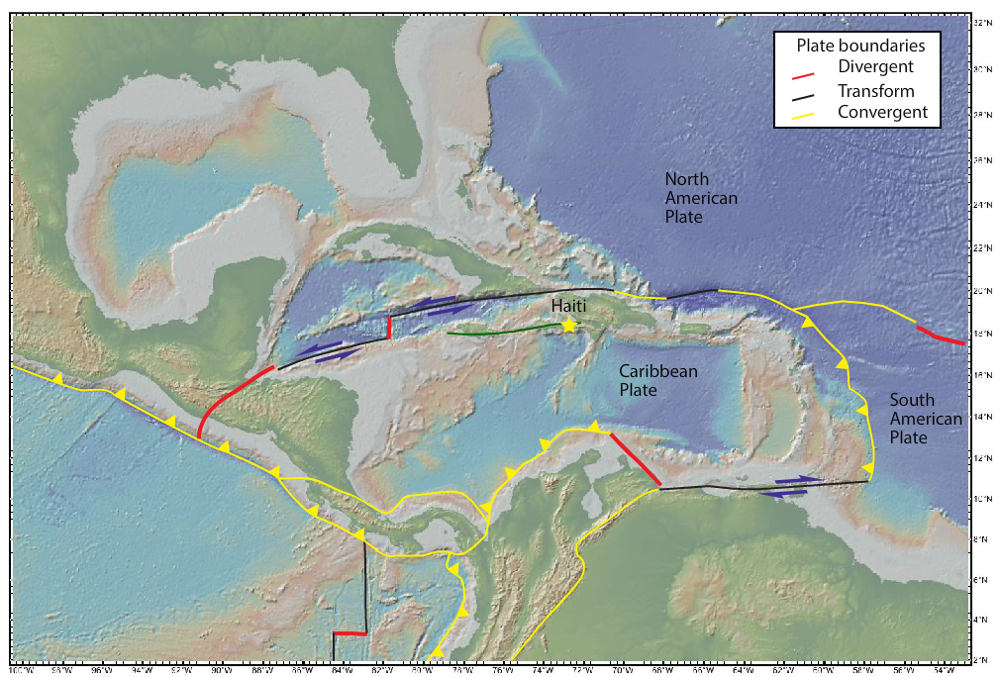
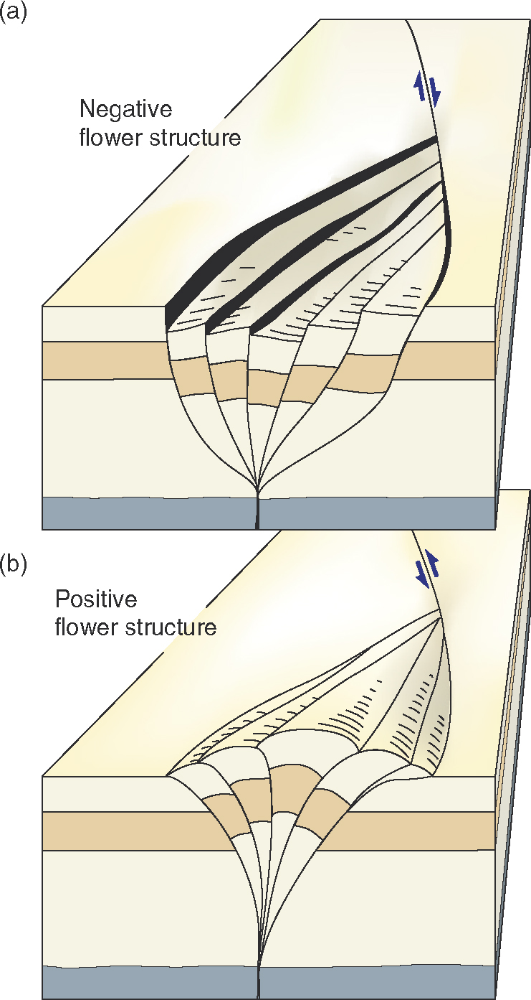
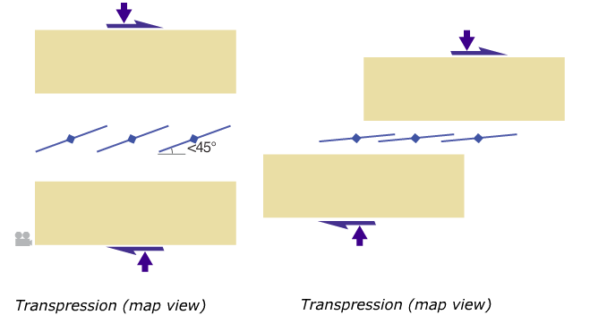

# EMSC 3002

## Strike-slip, transpression and transtension

  - Louis Moresi (convenor)
  - **Romain Beucher** (lecturer)
  - Chengxin Jiang (lecturer)
  - Stephen Cox (curriculum advisor)

Australian National University

_**NB:** the course materials provided by the authors are open source under a creative commons licence. 
We acknowledge the contribution of the community in providing other materials and we endeavour to 
provide the correct attribution and citation. Please contact louis.moresi@anu.edu.au for updates and 
corrections._

<--o-->

## Resources

1. **Fossen, H, 2011.** *Structural Geology.* Cambridge University Press, 2nd Edition.
1. **McClay, K.R. 1991.** *The Mapping of Geological Structures.* John Wiley & Sons.
1. **Park, R.G., 1995.** *Foundations of Structural Geology.* Blackie & Sons Ltd.
1. **Davis, G.H. and Reynolds, S.J., 1996.** *Structural Geology of Rocks and Regions.* 2nd Edition, John Wiley & Sons.
<!-- 1. **Hatcher, R.D., 1990.** *Structural Geology - Principles, Concepts, and Problems*, 2nd Edition, Prentice-Hall -->
<!-- 1. **Ramsay, J.G. and Huber, M.I. 1983.** *Modern Structural Geology. Volume 1: Strain Analysis.* Academic Press. -->
<!-- 1. **Ramsay, J.G. and Huber, M.I. 1987.** *Modern Structural Geology. Volume 2: Folds and Fractures.* Academic Press. -->

<--o-->

## Intended learning outcomes

The students will learn about the structural style of trike-slip, transpression and transtension regimes.

<--o-->
## Strike-slip faults

Strike-slip faults have been studied for more than 100 years. They received attention as they are often associated to
devastating earthquakes (e.g. North Anatolian Fault in Turkey, San-Andres fault in California.)
In this lecture we will look at the differents types of strike-slip faults, their formation and tectonic settings.
We will look at **transpression** and **transtension** deformations that link strike-slip, extensional and contractional regimes.

<--o-->
## Definition

A **strike-slip** fault is a fault where the displacement vector is approximately horizontal.
The 2 blocks moves sideways.

 <!-- .element style="width:90%" -->

<--o-->
## Characteristics of Strike-slip faults

- Commonly strep structures but they don't have to be
- No vertical motions
- Can accumulate more displacements than other faults
- Can be longer than other faults.
- Can form plate boundaries
- Can transect the entire crust
- Occur in all tectonic regimes
- Some can cause repeated large earthquakes.

*Railroad workers in Turkey after the 17 August 1999 earthquake. Right-lateral offset*.

 <!-- .element style="width:90%" -->

<--o-->
## Three fundamental types of faults

1. Transfer faults: transfer displacement from one structure to another.
1. Transform faults: mid-ocean transfer faults that segment or offset the mid-ocean rift axes.
1. Transcurrent faults: regional strike-slip faults. They usually have free tips and are able to grow freely.

<--o-->

## Transfer faults

- A strike-slip transfer fault transfers slip from one structure to another.
- The linked structures can be any types of fault (reverse, normal, oblique), extension fractures or folds.
- On a large scale, transfer faults may segment extensional basins or rifts.
- As a rift develops and develop oceanic crust, the transfer faults develop into **transform faults** along the rift axis.

Transfer faults are also sometimes called **tear faults**

*Example of transfer fault, Utah, Photo Haakon Fossen*

 <!-- .element style="width:90%" -->

<--o-->

## Transfer faults in extensional regimes

**Transfer faults** are known to tranmsfer displacement between large-scale structures in continental rifts.

In the figure, a steep transfer faults link to oppositely-dipping half grabens. 
The two normal faults could dip in the same direction.
The transfer faults does not need to be perfectly strike-slip, it could also show a component of normal displacement depending on the orientation of the fault relative to the direction of extension, or on the geometry of the normal faults at depth. 
The normal faults must flatten out at depth to create a perfect strike-slip[ tranfer fault.

 <!-- .element style="width:90%" -->

<--o-->
## Transfer faults in contractional regime

Transfer of displacement between thrusts or reverse faults is seen in many thrust and nappe regions.

 <!-- .element style="width:90%" -->

<--o-->
## Transfer faults in contractional regime

On a larger scale, transfer structures may be wide fault zones or shear zones rather than distinct faults.
A crustal scale example is the flanking shear zones of the India-Asia collision zone.

 <!-- .element style="width:90%" -->

<--o-->
## Transform faults
### Ridge-Ridge

**Transform faults** are a special type of **transfer faults** that separate mid-ocean ridges into segments.
They are bound by the ridge segments and only extend beyond the ridges as passive (dead) faults.

The figure illustrate the kinematics.

 <!-- .element style="width:90%" -->

<--o-->
## Transform faults
### Ridge-Ridge

**Transform faults** are a special type of **transfer faults** that separate mid-ocean ridges into segments.
They are bound by the ridge segments and only extend beyond the ridges as passive (dead) faults.

*A perspective view of a transform fault along the East Pacific Rise. The north Americam plate is to the right (East) and the Pacific plate is to the left (West) Marine Geoscience Data System*

 <!-- .element style="width:90%" -->

<--o-->
## Transform faults
### Ridge-Ridge

**Transform faults** occur along the oceanic ridges. They have varying length and extend into inactive fractures zones.

 <!-- .element style="width:90%" -->

<--o-->
## Transform faults
### Fracture zones

Oceanic fracture zones initial during riftiong and continental break-up so the longer the spreading history, the longer the fracture zones.
The transform fault, the active part of the fault, tend to retain a fixed length over time.

The longest fracture zones are found in the Pacific ocean. Significant parts of their length have been subducted under the North-American Plate.

 <!-- .element style="width:90%" -->

<--o-->
## Transform faults
### Magnetic Anomalies

Oceanic Fracture Zones are as old as the crust they occur in, increasing in age away from the ridge.

The fact that fracture zones are inactive fault is evident from the way they offset magnetic anomalies and isochrons (line of constant age).
The fault have more or less constant offset along them which is unusual for faults.

 <!-- .element style="width:90%" -->

<--o-->
## Transcurrent faults
### Definition

A **transcurrent fault** is not bound and controlled by extension or contraction structures.
It is free to grow and develop according to the regional stress field and rock properties.

In practice, **transcurrent faults** occur in continental crust.
In practice, **strike-slip fault** and **transcurrent fault** are synonymous.

*Transcurrent fault, East of Las Vegas.*

 <!-- .element style="width:90%" -->

<--o-->
## Transcurrent faults
### Definition

A **transcurrent fault** is not bound and controlled by extension or contraction structures.
It is free to grow and develop according to the regional stress field and rock properties.

In practice, **transcurrent faults** occur in continental crust.
In practice, **strike-slip fault** and **transcurrent fault** are synonymous.

*Transcurrent Fault on Mars, NASA*

 <!-- .element style="width:90%" -->

<--o-->
## Transcurrent faults
### Example: Haiti

The magnitude 7 Earthquake in Haiti on 12 January 2010 killed 200000-300000 people.

It occured on a strike-slip fault that runs parallel to the transform plate margin north of Haiti (approx 200km south).

This left-lateral fault shows that a plate margin is generally more complex than a single fault.
It can be regarded as a transcurrent strike-slip fault that has formed in the side-wall to the transform plate-boundary-forming fault. 

 <!-- .element style="width:90%" -->

<--o-->
## Transcurrent faults
### Example: Haiti

The magnitude 7 Earthquake in Haiti on 12 January 2010 killed 200000-300000 people.

It occured on a strike-slip fault that runs parallel to the transform plate margin north of Haiti (approx 200km south).

This left-lateral fault shows that a plate margin is generally more complex than a single fault.
It can be regarded as a transcurrent strike-slip fault that has formed in the side-wall to the transform plate-boundary-forming fault. 

 <!-- .element style="width:90%" -->

<--o-->
## Transcurrent faults
### Example: Himalaya

Transcurrent faults with fre tips occur within continental plates, but may as in the Haitian case be associated with plate boundaries.

The Tibetan plateau of the Himalayas and the areas north of it are influenced by the stress from the India-Asia convergente plate boundary.
The stresses generate a number of transcurrent faults.

 <!-- .element style="width:90%" -->

<--o-->
## Transcurrent faults
### Conjugate sets

**Transcurrent fulats** may come in conjugate sets, two differenty oriented faults active at the same time, under the same regional stress field.

This pattern is well illustrated in the Tibetan plateau, causing lateral extrusion of heated orogenic crust in reaction to the movement of the rigid Indian continent into Asia

 <!-- .element style="width:90%" -->

<--o-->
## Transcurrent faults
### Conjugate sets

Tapponnier et al. (1986) modeled the pattern of strike-slip faults north of India using a rigid indenter forced into layered plasticine.

 <!-- .element style="width:90%" -->

<--o-->
## Transcurrent faults
### Conjugate sets

Tapponnier et al. (1986) modeled the pattern of strike-slip faults north of India using a rigid indenter forced into layered plasticine.

 <!-- .element style="width:90%" -->

<--o-->
## Initiation of transcurrent faults

**Strike slip** faults initiate like any other fault. They occur by linkage of early small structures, notably R and P shear.

They can also initiate by reactivation of joints or preexisting faults. They may grow by linkage of such structures.

 <!-- .element style="width:90%" -->

<--o-->
## Initiation of transcurrent faults

**Strike slip** faults initiate like any other fault. They occur by linkage of early small structures, notably R and P shear.

They can also initiate by reactivation of joints or preexisting faults. They may grow by linkage of such structures.

 <!-- .element style="width:90%" -->

<--o-->
## Initiation of transcurrent faults

**Strike slip** faults initiate like any other fault. They occur by linkage of early small structures, notably R and P shear.

They can also initiate by reactivation of joints or preexisting faults. They may grow by linkage of such structures.

 <!-- .element style="width:90%" -->

<--o-->
## Fault Bends and Stepovers

**Strike slip** faults tend to be straight but they can show geometric irregularities that are significant enough to cause kinematic complications.

Map view irregularities are important, they can generate space problems that in turn create wider zones of deformation or damage.

The reason for such irregularities may be growth by fault segment linkage, and a history of soft-linked to hard-linked fault segment...
The result may be a bend or kink.

There are 2 types of fault bends or stepovers:

- Restraining bends (contractional)
- Releasing bends (extensional)

 <!-- .element style="width:90%" -->

<--o-->
## Fault Bends and Stepovers
### Restraining bends

Step-overs and bends along strike-slip faluts (in map view), generate local pockets of extension or contraction, depending on the fault geometry and sense of slip.

**Restraining bends** are location where local contraction occurs in response to fault bend or stepover.

A variety of contractional structures can occur... stylolites, folds, reverse faults, thrusts.. even small mountain ranges is the region is large enough.

 <!-- .element style="width:90%" -->

<--o-->
## Fault Bends and Stepovers
### Restraining bends

Modeling of stepover structure by McClay and Bonora (2001).

Two offset fault segment exist in the underlying basement and the sediment cover (sand) above deforms in response to sinistral strike-slip motion.

The positive contractional structure is known as a **pop-up structure**.

Large scale natural pop-up structures would be eroded and form mountains.

 <!-- .element style="width:90%" -->

<--o-->
## Flower structures

**Flower structure** is a name used to describe cross-section images of strike-slip zones that show upward widening.
Those structures are well developed across many stepovers / fault bends.

- **Positive flower structures** have positive relief, involve horizontal shortening and are found in restraining bends. They are associated with reverse fault offsets.
- **Negative flower structures** have negative relief (basins) and form in releasing bends. They are associated with normal faults offsets.

Upward widening of strike-slip zones are related to strike-slip reactivation of basement faults in stiff basement rocks. Widening is favored in weak sediments where the realtive strength of fault rocks and sediments is relatively small.

 <!-- .element style="width:90%" -->

<--o-->
## Flower structures

Upward widening of strike-slip zones are related to strike-slip reactivation of basement faults in stiff basement rocks. Widening is favored in weak sediments where the realtive strength of fault rocks and sediments is relatively small.

*Section through restraining bend produced in sandbox experiment. McClay and Bonora (2001)*

 <!-- .element style="width:90%" -->

<--o-->
## Releasing Bends

**Releasing bends** are fult bends where local extension occurs.
They form where strike-slip fault segments overlap and connect during accumulation of slip.
This leads to a structural low or **pull-apart** basin such as the dead-sea in the Middle East or the Death Valley in California

 <!-- .element style="width:90%" -->

<--o-->
## Transpression and Transtension

When a strike-slip fault zone or shear zone diverts from simple shear we get **transpression** or **transtension**.

- **Transpression** means that the side walls converge.
- **Transtension** implies that the side walls diverge.

 <!-- .element style="width:90%" -->

<--o-->
## Transpression and Transtension

**Transpression** (*transtension*) is the simulatenous conmbination of strike-slip or simple-shear motion along a structure and shortening (*extension*) perpendicular to it.

 <!-- .element style="width:90%" -->

<--o-->
## Transpression and Transtension

**Transpression** (*transtension*) is the simulatenous conmbination of strike-slip or simple-shear motion along a structure and shortening (*extension*) perpendicular to it.

 <!-- .element style="width:90%" -->

<--o-->
## Transpression and Transtension

**Transpression** (*transtension*) is the simulatenous conmbination of strike-slip or simple-shear motion along a structure and shortening (*extension*) perpendicular to it.

 <!-- .element style="width:90%" -->

<--o-->
## Transpression and Transtension
### Seismic

While pure strike-slip zones in horizontally layered units can be difficult to detect from seismic data, adding some shortening or extension creates more easily visible vertical offset of reflectors.

Note that transpression and transtension can occur locally in restraining bends/stepovers or it can occur along the full length of a fault or shear zone.

*Seismic image of a positive flower structure in Ardmore Basin, Oklahoma. A flower structure is an expression of local or regional transpression.*

 <!-- .element style="width:90%" -->

<--o-->
## Transpression and Transtension
### Folding

Folds can form in strike-slip zones where layers are subhorizontal.

This requires that the deformation is distributed through a zone with a combination of (brittle) faults and (ductile) folds, i.e. a brittle-ductile shear zone.

 <!-- .element style="width:90%" -->

<--o-->
## Transpression and Transtension
### Folding

If the zone is simple shear, folds initiate at (or close) to 45 degrees and rotate toward the shear zone.

It is the noncoaxial nature of simple shear that makes the folds axes rotate.

 <!-- .element style="width:90%" -->

<--o-->
## Transpression and Transtension
### Folding

**Transpression** involves a component of shortening.

This influences the initial orientation of fold hinges. They become closer to the zone by an amount function of the amount of shortening relative to the amount of simple shear.
(depends on $W_k$)

The hinges rotate toward parallelism withing the zone.

 <!-- .element style="width:90%" -->

<--o-->
## Transpression and Transtension
### Folding

**Transtension** produces folds whose hinges initiate at angles greater than 45 degrees.

How they rotate depends on $W_k$. For low $W_k$, the folds may actually rotate backward.

Observation of folds can give important information about the type of deformation ($W_k$)

 <!-- .element style="width:90%" -->

<--o-->
## Strain Partitioning

Strain in collision zones can be partitioned into a strike-slip component and a zone of perpendicular shortening component expressed by folds, reverse faults and thrusts.

This often occur along destructive plate boundaries where strain partition within accretionary wedges.

 <!-- .element style="width:90%" -->

<--o-->
## Strain Partitioning

In general, the lateral simple shear component tends to localize into faults.
The pure shear component is more distributed between or around faults.
This gives pure shear dominated domains between strike-slip faults.

 <!-- .element style="width:90%" -->

<--o-->
## The San Andres Fault System

The San Andreas fault is a transform fault between the North American Plate and the Pacific Plate.

It is not a typical transform fault.: it transfers displacement form a spreading ridge (The East Pacific Rise) to another strike-slip transform (The Mendocino Fracture Zone).

This causes to have variable slip along strike.

 <!-- .element style="width:90%" -->

<--o-->
## The San Andres Fault System

The San Andreas fault occurs in an atypical oceanic crust that is rather a series of accreted island arcs.

Th SAF is associated with other subparallel faults and the transform plate boundary is rather a wide fault system.

 <!-- .element style="width:90%" -->

<--o-->
## The San Andres Fault System
### Facts

- 1200-1300 km long
- 300-550 km offset
- 30 Myr old
- Modern SAF approx 5 Myr old.
- Slip rate: 20-35 mm/yr
- Forms plate boundary, Pacific-N American plates
- Slightly transpressive

 <!-- .element style="width:90%" -->

<--o-->
## The San Andres Fault System
### Facts

- Transform fault
- Associated with major Earthquakes
- Contains central aseismically creeping section
- 1906 San Fracnisco (M 8.7) most famous quake.
- Large Earthquake recurrence interval: 150 years
- Last large quake on southern segment: 1857
- Southern segment overdue for large quake...

 <!-- .element style="width:90%" -->

<--o-->
## The San Andres Fault System
### History

 <!-- .element style="width:90%" -->

<--o-->
## The San Andres Fault System
### Partitioning

The depth and geometry of the SAF at depth is unknown. It is thought to be connected with reverse faults and thrusts to the west, and ductile plastic deformation that extends into the mantle.

 <!-- .element style="width:90%" -->

<--o-->
## The San Andres Fault System
### Stream offsets

 <!-- .element style="width:90%" -->

The SAF exhibits multiple evidence that allow for slip-sense determination.

- Offset of stream channels.
- Transpressional and transtensional features.

<--o-->

# Summary

The 3 main types of strike-slip faults:

1. Transfer
1. Transform
1. Transcurrent

- Strike-slip fault tend to be steep and straight in map view, then can be 100s of km long.
- Bends along faults create contractional structures (at restraining bends) or extensional structures (at releasing bends).
- Plate bounding strike-slip faults are associated with large Earthquakes.
- Strike-slip faults taht deviate from perfect fault parallel displacement are transpressional (compression) or transtensional (extension).
- Transpression / Transtension is sometimes partitioned into domains of fault-perpendicular shortening/extension along or between strike-slip fault. This is known as strain partitioning.