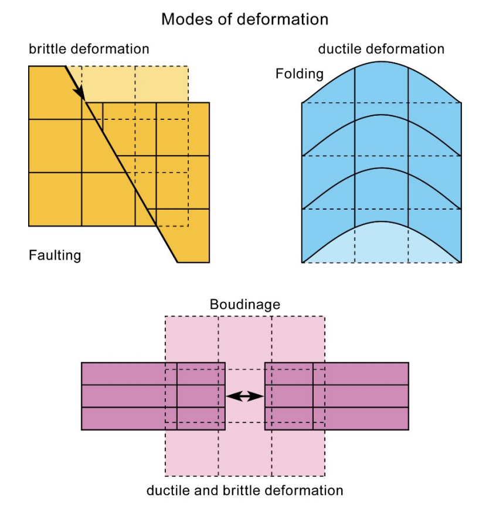
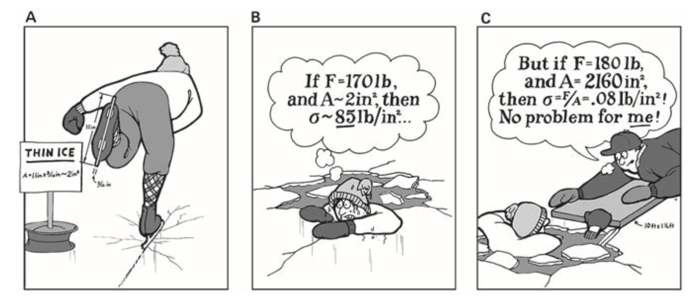
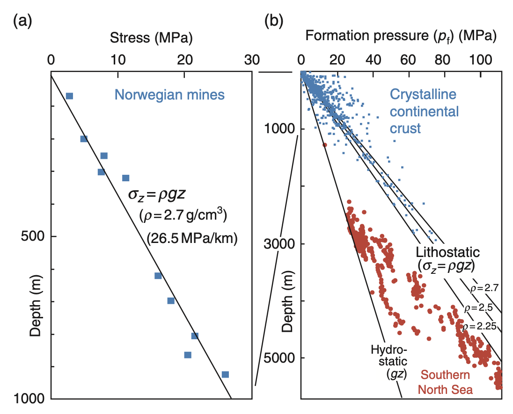
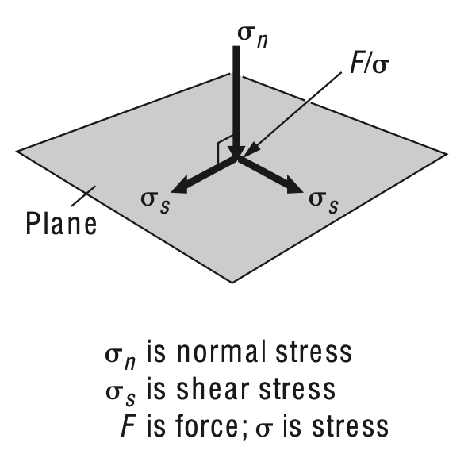
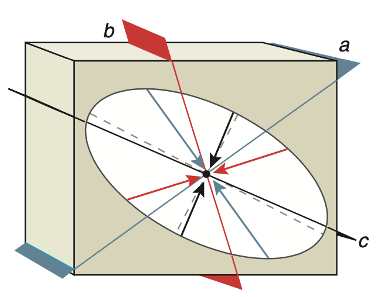
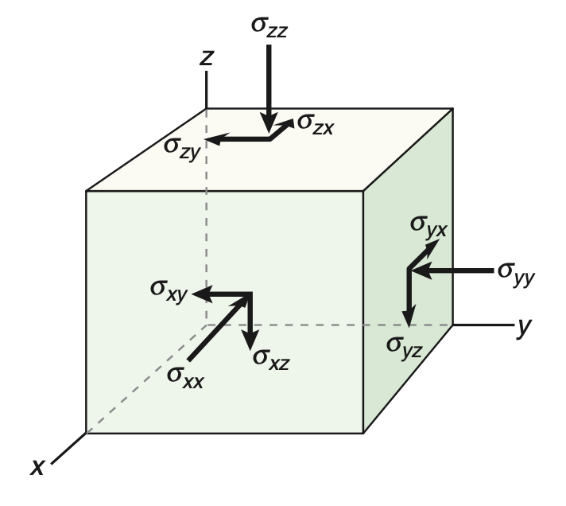

<!-- source: Lecture1_Stress.pptx slide 1 · template: T-title -->
# EMSC 3002

## Module3.1 - Stress

  - Louis Moresi (convenor)
  - Chengxin Jiang (lecturer)
  - Romain Beucher (former lecturer)
  - Stephen Cox (curriculum advisor)

Australian National University

_**NB:** the course materials provided by the authors are open source under a creative commons licence. We acknowledge the contribution of the community in providing other materials and we endeavour to provide the correct attribution and citation. Please contact louis.moresi@anu.edu.au for updates and corrections._

<--o-->

<!-- source: Lecture1_Stress.pptx slide 2 · template: T-resources -->
## Resources

1. Fossen, H, 2011. Structural Geology. Cambridge University Press, 2nd Edition. E-learning modules.
1. van der Pluijm, B.A. and Marshak, S., 2003. Earth Structure: an introduction to structural geology and tectonics. W. W. Norton & Company, Ltd.
1. Davis, G.H. and Reynolds, S.J., 1996. Structural Geology of Rocks and Regions. 2nd Edition, John Wiley & Sons.
1. Park, R.G., 1995. Foundations of Structural Geology. Blackie & Sons Ltd.

<--o-->

<!-- ILO placeholder — not in the pptx; fill in -->
## Intended learning outcomes

<!-- TODO: add the intended learning outcomes for this module -->

<--o-->

<!-- source: Lecture1_Stress.pptx slide 3 · template: T4-full-figure -->
<!-- .slide: data-background="Module-iii-Theory/Lecture1-extracted/slide003_img1.png" -->

<--o-->

<!-- source: Lecture1_Stress.pptx slide 4 · template: T5-figure-focus -->
## Faults
 <!-- .element class="r-stretch" -->

FOLDS · Fossen, 2010

<--o-->

<!-- source: Lecture1_Stress.pptx slide 5 · template: T3-text-and-image -->
## Deformation and Stress

Structural geology is concerned with the permanent deformation that produces structures such as folds and faults in rocks.
If a rock fails by fracturing and loses cohesion, it is brittle.
If the rock deforms without losing cohesion and retains intricate shapes when forces stop acting, the rock displays a permanent strain and is ductile.
All results of applied stress → Dynamic analysis.

Source: Prof. Jean-Pierre Bug (JPB), ETH

<--o-->

<!-- source: Lecture1_Stress.pptx slide 6 · template: T3-text-and-image -->
## Importance of Knowing Stress State

Image: M. S. Paterson

- Predicting when, where and how a failure happens (with detailed knowledge of other physical properties, such as composition, temperature etc).
- Geotechnical engineering, e.g., building tunnels and highways
- Earthquake hazards …

ANU Tunnel

<--o-->

<!-- source: Lecture1_Stress.pptx slide 7 · template: T3-text-and-image -->
## Body and Surface Forces

Body force: a force that acts throughout the volume of a body, e.g., gravity force, electro-magnetic force etc.
Surface force: acts across an internal or external surface element in a material body.

Body force

Surface force

<--o-->

<!-- source: Lecture1_Stress.pptx slide 8 · template: T3-text-and-image -->
## Stress

Stress arises from a force applied to a given area
Stress = Force/Area (N/m2 = Pa)
Mechanical properties of a material are expressed in terms of the three independent, physical dimensions, length [L], mass [M], and time [T].

- Other useful stress units:
- 1 Pa = 1 N/m2 = 1 kg/(ms2)
- 1 bar = 105 Pa = 0.1 MPa ≈ 1 atmosphere
- 1 kbar = 1000 bar = 108 Pa = 100 MPa
- = 0.1 GPa
- Sign convention.

Positive

Negative

Davis and Reynolds, 2011

<--o-->

<!-- source: Lecture1_Stress.pptx slide 9 · template: T1-prose -->
## Stress Inside the Earth
**D-DIA**

Diamond-anvil cells

<--o-->

<!-- source: Lecture1_Stress.pptx slide 10 · template: T3-text-and-image -->
## Stress Inside the Earth

D-DIA · Diamond-anvil cells · Fossen, 2010

&nbsp;

<--o-->

<!-- source: Lecture1_Stress.pptx slide 11 · template: T3-text-and-image -->
## Stress State in 2D

Fossen, 2010

Like force, stress is also a vector quantity → magnitude and direction.
An oblique force (F) acting on a small area may be resolved into a normal stress (sn) and a shear stress (ss).
Shear stress and normal stress vary as a function of plane orientation.
Stress ellipse (including its orientation) describes everything about 2D stress state

Two-dimensional illustration of stress at a point.

<--o-->

<!-- source: Lecture1_Stress.pptx slide 12 · template: T3-text-and-image -->
## Stress State in 3D

**Z**

[x0, y0, z0]

**Y**

**X**

A vector in 3D space

The stress components acting on the faces of a small cube

Fossen, 2010

<--o-->

<!-- source: Lecture1_Stress.pptx slide 13 · template: T3-text-and-image -->
## Stress on a Plane via Stress Tensor

The stress components acting on the faces of a small cube

Fossen, 2010

<--o-->

<!-- source: Lecture1_Stress.pptx slide 14 · template: T3-text-and-image -->
## Example: Computing Traction Vector

Wikipedia · 4x2 · 2x3 · C · 4x3

N (y)

E (x)

Fault

