<!-- DO NOT REGENERATE: converted from Lecture1_Stress.pptx (2026-07), then hand-edited.
     This markdown is now the source of truth; re-running the pptx converter
     would overwrite that work. See tools/pptx2reveal/README.md. -->

<!-- source: Lecture1_Stress.pptx slide 1 · template: T-title -->
# EMSC 3002

## Module3.1 - Stress

  - Louis Moresi (convenor)
  - Chengxin Jiang (lecturer)
  - Romain Beucher (former lecturer)
  - Stephen Cox (curriculum advisor)

Australian National University

_**NB:** the course materials provided by the authors are open source under a creative commons licence. We acknowledge the contribution of the community in providing other materials and we endeavour to provide the correct attribution and citation. Please contact louis.moresi@anu.edu.au for updates and corrections._

<small>Reading these on your own? Press **O** for the overview, and **&darr;** as well as **&rarr;** &mdash; some slides sit below this one. <a href="../lecture-1-introduction/#navigating-the-slides" target="_blank" rel="noopener">How to navigate the slides</a></small>

<--o-->

<!-- source: Lecture1_Stress.pptx slide 2 · template: T-resources -->
## Resources

1. Fossen, H, 2011. Structural Geology. Cambridge University Press, 2nd Edition. E-learning modules.
1. van der Pluijm, B.A. and Marshak, S., 2003. Earth Structure: an introduction to structural geology and tectonics. W. W. Norton & Company, Ltd.
1. Davis, G.H. and Reynolds, S.J., 1996. Structural Geology of Rocks and Regions. 2nd Edition, John Wiley & Sons.
1. Park, R.G., 1995. Foundations of Structural Geology. Blackie & Sons Ltd.

<--o-->

<!-- ILO placeholder — not in the pptx; fill in -->
## What you will learn in this module

- Build on general concepts of force / stress
- Express the stress state in 2D / 3D
- Compute traction on a plane
- Derivation and use of the Mohr Circle
- How we measure stresses in the Earth

<--o-->

<!-- source: Lecture1_Stress.pptx slides 3-4 · template: T4-full-figure (screenshot of the original slide) -->
<!-- .slide: data-background="Module-iii-Theory/faults-and-folds.jpg" data-background-size="contain" data-background-color="#ffffff" -->

<--o-->

<!-- source: Lecture1_Stress.pptx slide 5 · template: T3-text-and-image -->
## Deformation and Stress

- Structural geology is concerned with the permanent deformation that produces structures such as folds and faults in rocks.
- If a rock fails by fracturing and loses cohesion, it is brittle.
- If the rock deforms without losing cohesion and retains intricate shapes when forces stop acting, the rock displays a permanent strain and is ductile.
- All results of applied stress → Dynamic analysis.

<small>*↩ You first met stress, strain & rheology in [Module 1.3 — Stress, Strain & Strength](Module-i-GlobalTectonics-3.reveal.html).*</small>

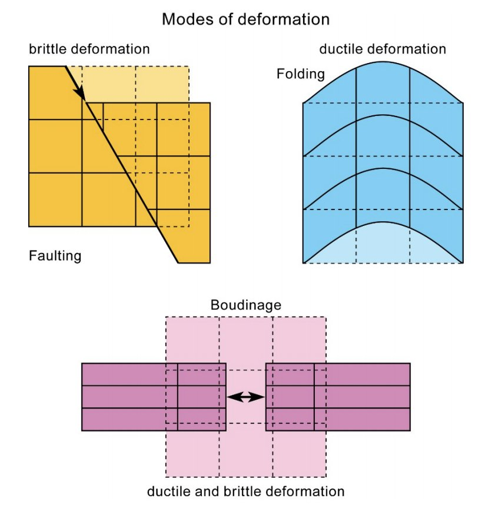

Source: Prof. Jean-Pierre Bug (JPB), ETH

<--o-->

<!-- source: Lecture1_Stress.pptx slide 6 · template: T3-text-and-image -->
## Importance of Knowing Stress State

- Predicting when, where and how a failure happens (with detailed knowledge of other physical properties, such as composition, temperature etc).
- Geotechnical engineering, e.g., building tunnels and highways
- Earthquake hazards …

 <!-- .element style="max-height:380px;" -->

ANU Tunnel

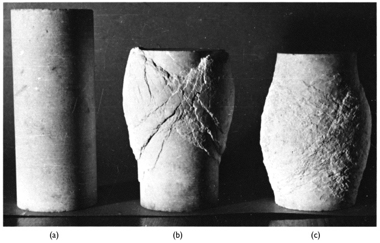 <!-- .element style="max-height:380px;" -->

Image: Prof. M. S. Paterson

<--o-->

<!-- source: Lecture1_Stress.pptx slide 7 · template: T3-text-and-image (apples replaced by authored figure) -->
## Body and Surface Forces

 <!-- .element style="width:89%;" -->

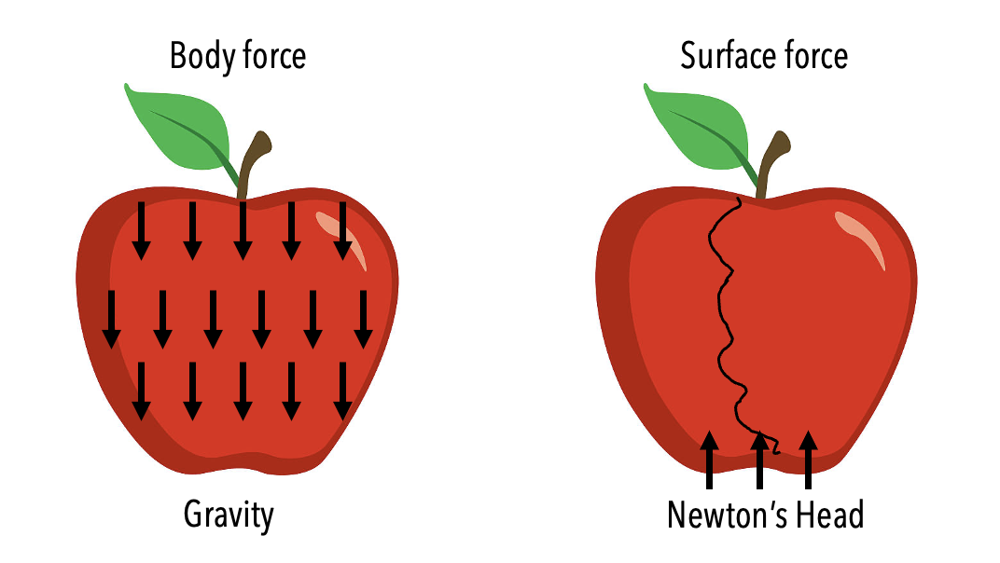

- Body force: a force that acts throughout the volume of a body, e.g., gravity force, electro-magnetic force etc.
- Surface force: acts across an internal or external surface element in a material body.

<--o-->

<!-- source: Lecture1_Stress.pptx slide 8 · template: T3-text-and-image -->
## Stress

- Stress arises from a force applied to a given area
- Stress = Force/Area (N/m2 = Pa)
- Mechanical properties of a material are expressed in terms of the three independent, physical dimensions, length [L], mass [M], and time [T].

- Other useful stress units:
- 1 Pa = 1 N/m2 = 1 kg/(ms2)
- 1 bar = 105 Pa = 0.1 MPa ≈ 1 atmosphere
- 1 kbar = 1000 bar = 108 Pa = 100 MPa = 0.1 GPa

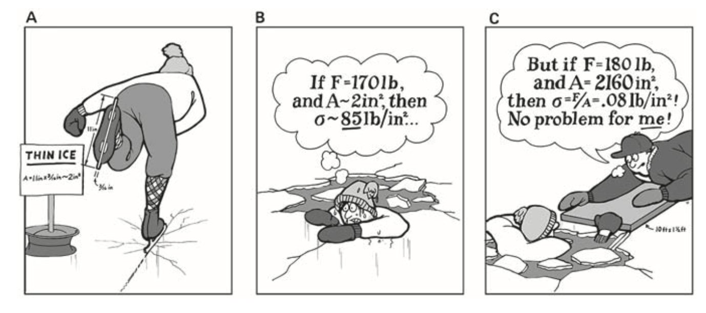

Davis and Reynolds, 2011

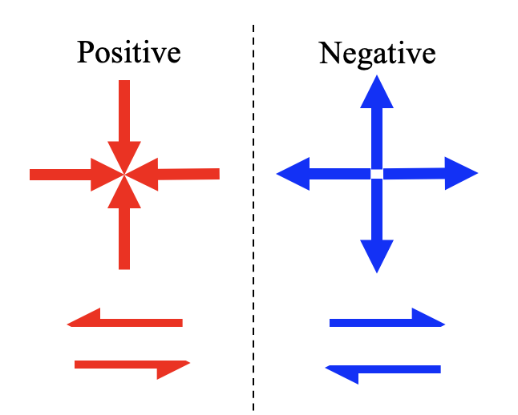 <!-- .element style="max-height:260px;" -->

<--o-->

<!-- source: Lecture1_Stress.pptx slide 9 · template: T1-prose -->
## Stress Inside the Earth

We know Stress = Force/Area (N / m2  $\equiv$ Pa)

Assuming continental rocks have an average density $\rho$ of $2.7\times 10^3$ kg/m$^3$, estimate the pressure/stress at 1 km depth.

 - Gravity Force G = $mg$= $\rho V g$ = $\rho (zA)g$
 - where $g$ gravitational acceleration (9.8 m/s2); $z$ depth (1 km); A contact area.
 - Then, stress = G/A = $\rho z g$ = 2.7 $\times 10^3 \times 9.8 \times 1000 \approx$ 26.5 MPa

<--o-->

<!-- source: Lecture1_Stress.pptx slide 10 · template: T4-full-figure (bullets deduplicated against previous slide) -->
## Stress Inside the Earth

Stress = = G/A = $\rho z g$ = 2.7 $\times 10^3 \times 9.8 \times 1000 \approx$ 26.5 MPa

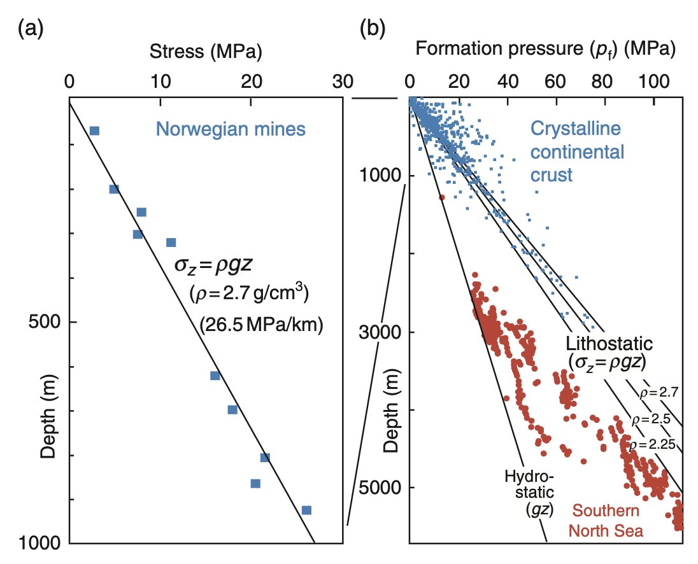 <!-- .element style="max-height:420px;" -->

Fossen, 2010

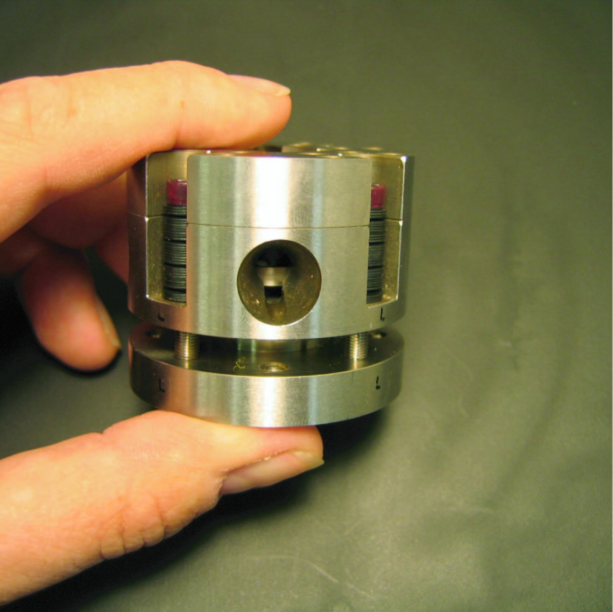 <!-- .element style="max-height:420px;" -->

D-DIA

 <!-- .element style="max-height:420px;" -->

Diamond-anvil cell

<--o-->

<!-- source: Lecture1_Stress.pptx slide 11 · template: T3-text-and-image -->
## Stress State in 2D

- Like force, stress is also a vector quantity → magnitude and direction.
- An oblique force (F) acting on a small area may be resolved into a normal stress (sn) and a shear stress (ss).
- Shear stress and normal stress vary as a function of plane orientation.
- Stress ellipse (including its orientation) describes everything about 2D stress state

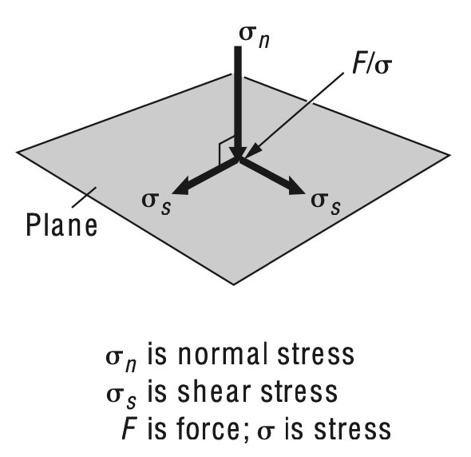 <!-- .element style="max-height:380px;" -->

Fossen, 2010

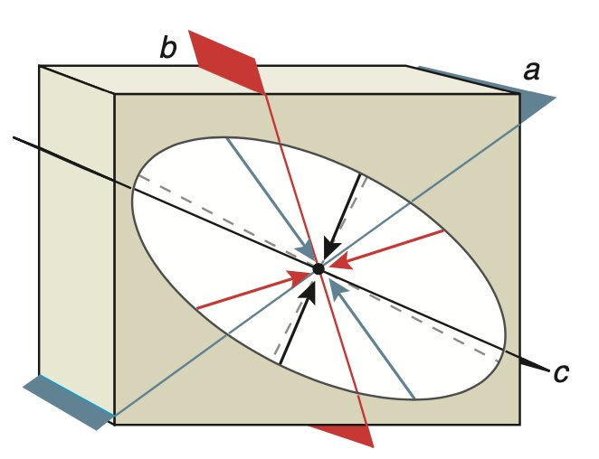 <!-- .element style="max-height:380px;" -->

Two-dimensional illustration of stress at a point · Fossen, 2010

<--o-->

<!-- source: Lecture1_Stress.pptx slide 12 · template: T3-text-and-image -->
## Stress State in 3D

We need three orthogonal surfaces to describe a complete state of force at any point (for a continuous medium).
- The complete stress state is described by three 3-component vectors ⇒ tensor.

$$
\sigma =\left[ \begin{matrix} \sigma_{xx} & \sigma_{xy} & \sigma_{xz} \cr \sigma_{yx} & \sigma_{yy} & \sigma_{yz} \cr \sigma_{zx} & \sigma_{zy} & \sigma_{zz} \end{matrix} \right] =\left[ \begin{matrix} \vec{T}_x \cr \vec{T}_y \cr \vec{T}_z \end{matrix} \right]
$$

The stress tensor is symmetric as no net rotation from shear stresses. It now becomes: 
 
$$\left[ \begin{matrix} \sigma_{xx} & \sigma_{xy} & \sigma_{xz} \cr \sigma_{xy} & \sigma_{yy} & \sigma_{yz} \cr \sigma_{xz} & \sigma_{yz} & \sigma_{zz} \end{matrix} \right]$$

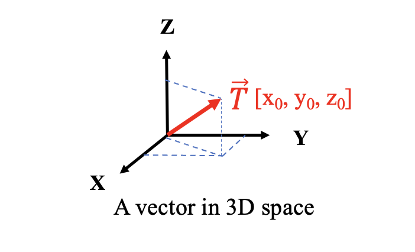 <!-- .element style="max-height:280px;" -->

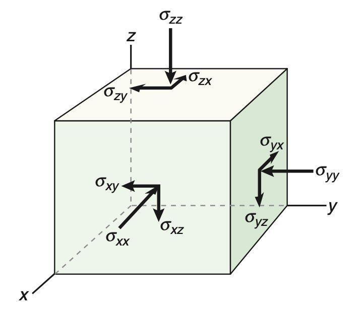 <!-- .element style="max-height:340px;" -->

The stress components acting on the faces of a small cube · Fossen, 2010

<--o-->

<!-- source: Lecture1_Stress.pptx slide 13 · template: T3-text-and-image -->
## Stress on a Plane via Stress Tensor

The stress tensor describes the most general case.

$$\sigma =\left[ \begin{matrix} \sigma_{xx} & \sigma_{xy} & \sigma_{xz} \cr \sigma_{yx} & \sigma_{yy} & \sigma_{yz} \cr \sigma_{zx} & \sigma_{zy} & \sigma_{zz} \end{matrix} \right]  = \left[ \begin{matrix} \vec{T}_x \cr \vec{T}_y \cr \vec{T}_z \end{matrix} \right]$$

If we cut out a plane through a material that is under stress, then there is a traction vector (a force) on this plane that results from the unbalanced stresses.

The traction can be computed using the stress tensor ($\vec{n}$ is the unit vector normal to the plane):
 
$$
\vec{T}_i = \sum_{j} \sigma_{ij} \, n_j = \sigma ∙ \vec{n}
$$

The stress components acting on the faces of a small cube

$\vec{n}$ · Fossen, 2010

<--o-->

<!-- source: Lecture1_Stress.pptx slide 14 · template: T3-text-and-image (fault diagram restored from original slide) -->
## Example: Computing Traction Vector

Suppose we are given the below horizontal components of the stress tensor:

$$\sigma =\left[ \begin{matrix} \sigma_{xx} & \sigma_{xy} \cr \sigma_{yx} & \sigma_{yy} \end{matrix} \right] = \left[ \begin{matrix} -40 & -10 \cr -10 & -60 \end{matrix} \right] \textrm{MPa}$$

Assuming this is a 2D problem, let us compute the forces acting across a fault oriented at 45º from the east direction.

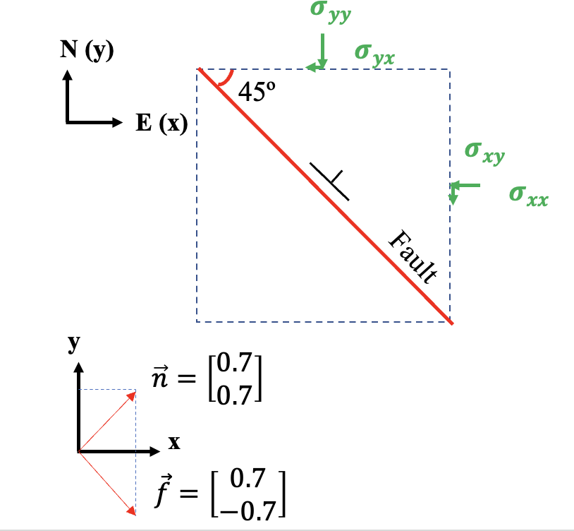 <!-- .element style="max-height:560px;" -->

<--v-->

<!-- source: Lecture1_Stress.pptx slide 14 · matrix-multiplication review, split onto a vertical slide -->
## Example: Computing Traction Vector

Suppose we are given the below horizontal components of the stress tensor:

$$\sigma =\left[ \begin{matrix} \sigma_{xx} & \sigma_{xy} \cr \sigma_{yx} & \sigma_{yy} \end{matrix} \right] = \left[ \begin{matrix} -40 & -10 \cr -10 & -60 \end{matrix} \right] \textrm {MPa}$$

Assuming this is a 2D problem, let us compute the forces acting across a fault oriented at 45º from the east direction.

### Review on matrix multiplication.

The special case of dot product of two vectors:

$$ A = [ 1 5 ] \; B = [2 3] \; \; A \cdot B = 1 \ times 2 + 5 \times 3 = 17 $$

or 

$$ \begin{matrix} 1 & 5 \end{matrix} \cdot  \begin{matrix} 2 \cr 3 \end{matrix}  = [ 17 ] $$

Wikipedia

<--v-->

<!-- source: Lecture1_Stress.pptx slide 16 · template: T3-text-and-image (fault diagram restored; pptx slide 15, a progressive-reveal duplicate, folded in) -->
## Example: Computing Traction Vector

Suppose we are given the components of the stress tensor:
$$\sigma =\left[ \begin{matrix} \sigma_{xx} & \sigma_{xy} \cr \sigma_{yx} & \sigma_{yy} \end{matrix} \right]$ = $\left[ \begin{matrix} -40 & -10 \cr -10 & -60 \end{matrix} \right] \textrm{ MPa }$$

Assuming this is a 2D problem, let us compute the forces acting across a fault oriented at 45º from the east direction. The (unit) normal for this fault is $\left[ 1/\surd{2} 1/\surd{2} \right] \approx [ 0.7 0.7]$ 

The formula to find the traction vector is $\vec{T}_i=\sigma \cdot \vec{n}$

Perform matrix multiplication:

$$\vec{T}=\left[ \begin{matrix} -40 & -10 \cr -10 & -60 \end{matrix} \right]\left[ \begin{matrix} 0.7 \cr 0.7 \end{matrix} \right] = \left[ \begin{matrix} -35 \cr -49 \end{matrix} \right] \textrm{MPa}$$

Projecting the vector along the fault plane to find the normal component $\vec{T}∙\vec{n}$ (-58.8 MPa) and shear component $\vec{T}\cdot\vec{f}$ (9.8 MPa).

 <!-- .element style="max-height:560px;" -->

<--o-->

<!-- source: Lecture1_Stress.pptx slide 17 · replaced by the clearer Module 1.3 slide (2026-08) -->
## Principal Stresses

At any point in a stressed material there is one special set of three, mutually perpendicular directions in which all the shear stresses vanish and only pushes (or pulls) remain. These are the **principal directions**, and the corresponding stresses — $\sigma_1 \ge \sigma_2 \ge \sigma_3$ — are the **principal stresses**.

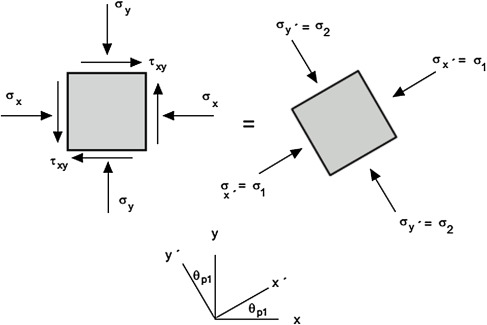 
<!-- .element style="width:40%" -->

The orientation and relative size of the principal stresses is the single most useful description of the stress state in tectonics. Finding these directions is a standard property of tensor quantities — diagonalisation:

$$\left[ \begin{matrix} \sigma_{xx} & \sigma_{xy} & \sigma_{xz} \cr \sigma_{xy} & \sigma_{yy} & \sigma_{yz} \cr \sigma_{xz} & \sigma_{yz} & \sigma_{zz} \end{matrix} \right] \quad \Rightarrow \quad \left[ \begin{matrix} \sigma_1 & 0 & 0 \cr 0 & \sigma_2 & 0 \cr 0 & 0 & \sigma_3 \end{matrix} \right]$$

<small>

The diagram above is found in Kaliakin, V. N. (2017). Stresses, Strains, and Elastic Response of Soils. In Soil Mechanics (pp. 131–203). Elsevier. https://doi.org/10.1016/B978-0-12-804491-9.00004-5

</small>

<--o-->

<!-- source: Lecture1_Stress.pptx slide 18 · template: T1-prose -->
## Deviatoric Stress and Mean Stress

Stress has a volumetric component (pressure) that is independent of the orientation and a deviatoric component (the shear stresses) that is changes with viewpoint.

Mathematically, $\left[ \begin{matrix} \sigma_{11} & \sigma_{12} & \sigma_{13} \cr \sigma_{21} & \sigma_{22} & \sigma_{23} \cr \sigma_{31} & \sigma_{32} & \sigma_{33} \end{matrix} \right]$ (total stress tensor)   =
- $\left[ \begin{matrix} \sigma_m & 0 & 0 \cr 0 & \sigma_m & 0 \cr 0 & 0 & \sigma_m \end{matrix} \right]$   +   $\left[ \begin{matrix} \sigma_{11}-\sigma_m & \sigma_{12} & \sigma_{13} \cr \sigma_{21} & \sigma_{22}-\sigma_m & \sigma_{23} \cr \sigma_{31} & \sigma_{32} & \sigma_{33}-\sigma_m \end{matrix} \right]$
- (mean stress tensor) 	 (deviatoric stress tensor)
- $\sigma_m$ = ($\sigma_{11}$+ $\sigma_{22}$+ $\sigma_{33}$)/3 is the mean stress or hydrostatic stress.
- In real life, the deviatoric (anisotropic) part is what actually causes distortion.

<--o-->

<!-- source: Lecture1_Stress.pptx slide 19 · template: T3-text-and-image -->
## Scalar, Vector & Tensor

- Scalar: a quantity with magnitude only (i.e. a real number, such as for mass, temperature, time).
- Vector: a geometrical object with magnitude and one direction (e.g. force, velocity, acceleration).
- Tensor (second-order): a mathematical structure with magnitude and two directions (two vectors), one (a unit vector) specifying a plane of action (e.g. permeability, strain, stress).
- Advanced: Scalar is regarded as a zero-order tensor; vector as first-order tensor. Gradient of a scalar field is a vector field; divergent of a vector field is a scalar field.

Right Temperature field is a scalar (above); Temperature _gradient_ field is
a vector (below)

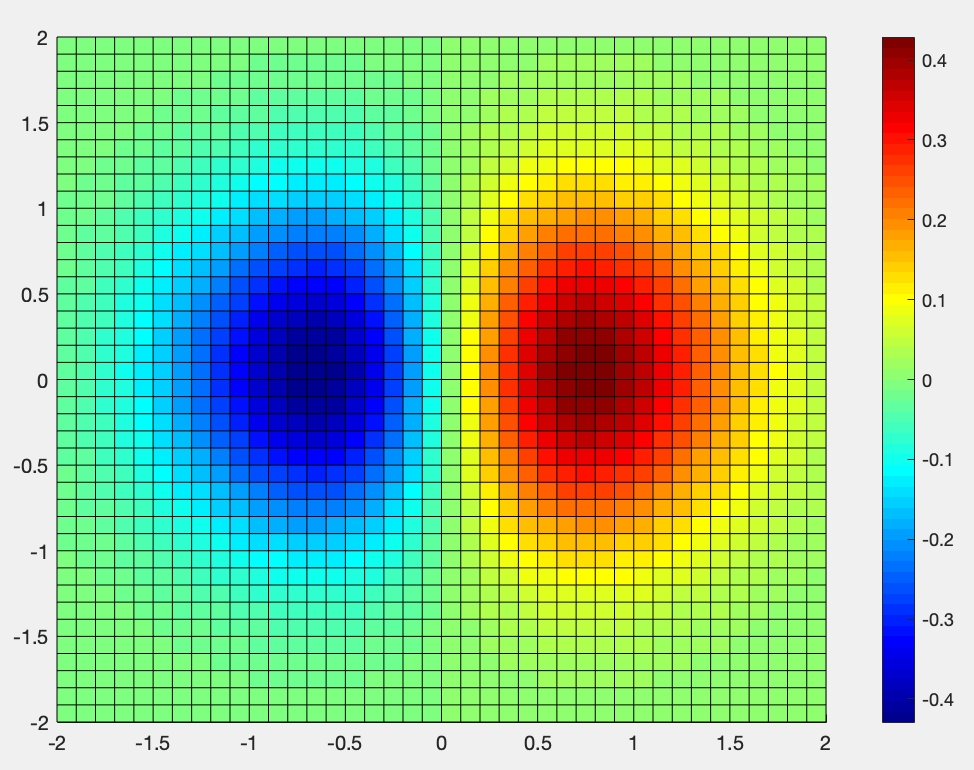 <!-- .element style="width:82%;" -->

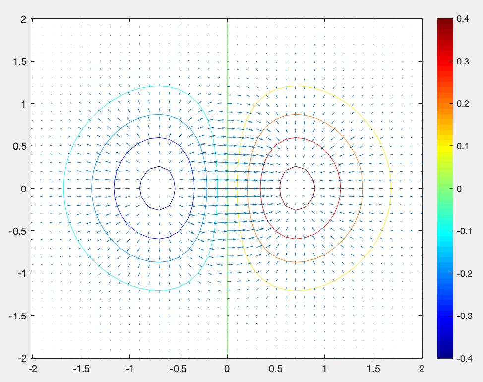 <!-- .element style="width:82%;" -->

<--o-->

<!-- source: Lecture1_Stress.pptx slide 20 · template: T1-prose -->
## Invariants of the Tensor (advanced)

Tensors have a number of invariants: properties that are _inherent_ and do not change with the coordinate system.

The principal invariants are given by:
- I1 = $\sigma_1 + \sigma_2$+ $\sigma_3$
- I2 = $\sigma_1\sigma_2 + \sigma_1\sigma_3$ +$\sigma_2\sigma_3$
- I3 = $\sigma_1\sigma_2\sigma_3$

The notion of main invariants:
- J1 = $\sigma_1 + \sigma_2$+ $\sigma_3$ = I1
- J2 = ${\sigma} _ {1}^{2} +{\sigma} _ {2}^{2}$  + ${\sigma} _ {3}^{2}$= ${I} _ {1}^{2}$-2I2
- J3 =${\sigma} _ {1}^{3} +{\sigma} _ {2}^{3}$ + ${\sigma} _ {3}^{3} =$ ${I} _ {1}^{3}$-3I1I2+3I3

The mean stress is known as the first invariant of the stress tensor.
The second invariant plays the role of the magnitude of the deviatoric part of the tensor and that is why it is used when plotting the world strain rate map.

<--o-->

<!-- source: Lecture1_Stress.pptx slide 22 · template: T3-text-and-image -->
## Summary 

- Stress = Force/Area (N/m2 = Pa)
- Stress state in 2D/3D
- Principle stress (eigenvalues/eigenvectors)
- Calculate traction/stress along a surface given a stress matrix: $\vec{T}_i=\sigma \cdot \vec{n}$

<!-- Screenshot image here -->

Screenshot

<--o-->

<!-- source: Lecture1_Stress.pptx slide 23 · template: T3-text-and-image -->
## Review of Matrix Multiplication

 <!-- .element style="width:75%;" -->

Wikipedia · 2x3 · C · 4x3 · 4x2

- Calculate traction/stress along a surface given a stress matrix

$\vec{T}_i=\sigma ∙\vec{n}$

What is $\vec{T}_i$?

$$\vec{n}=\left[ \begin{matrix} 2 \cr -5 \cr 6 \end{matrix} \right]$$

$$\sigma =\left[ \begin{matrix} 3 & 4 & -2 \cr 4 & 10 & 6 \cr -2 & 6 & 5 \end{matrix} \right]$$

$$\vec{n}=\left[ \begin{matrix} 3 \cr 8 \cr -2 \end{matrix} \right]$$

$$\sigma =\left[ \begin{matrix} 8 & 4 & 7 \cr 4 & -5 & 6 \cr 7 & 6 & 14 \end{matrix} \right]$$

$$\sigma =\left[ \begin{matrix} -4 & 3 \cr 3 & 8 \end{matrix} \right]$$

$$\vec{n}=\left[ \begin{matrix} 3 \cr -5 \end{matrix} \right]$$

<--o-->

<!-- source: Lecture1_Stress.pptx slide 24 · template: T3-text-and-image -->
## Review of Matrix Multiplication

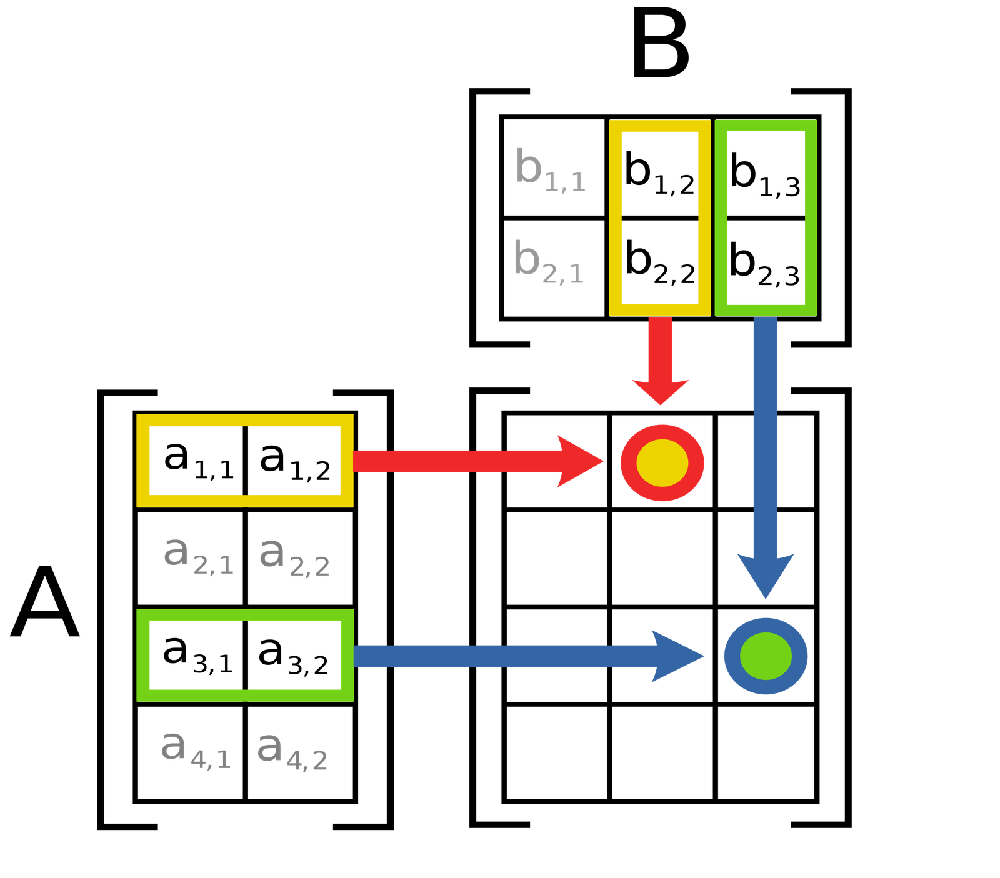 <!-- .element style="width:75%;" -->

Wikipedia · 2x3 · C · 4x3 · 4x2

- Calculate traction/stress along a surface given a stress matrix

$\vec{T}_i=\sigma ∙\vec{n}$

$$\vec{n}=\left[ \begin{matrix} 2 \cr -5 \cr 6 \end{matrix} \right]$$

$$\sigma =\left[ \begin{matrix} 3 & 4 & -2 \cr 4 & 10 & 6 \cr -2 & 6 & 5 \end{matrix} \right]$$

$$\vec{T}=\left[ \begin{matrix} -26 \cr -6 \cr -4 \end{matrix} \right]$$

$$\vec{n}=\left[ \begin{matrix} 3 \cr 8 \cr -2 \end{matrix} \right]$$

$$\sigma =\left[ \begin{matrix} 8 & 4 & 7 \cr 4 & -5 & 6 \cr 7 & 6 & 14 \end{matrix} \right]$$

$$\vec{T}=\left[ \begin{matrix} 42 \cr -40 \cr 41 \end{matrix} \right]$$

$$\sigma =\left[ \begin{matrix} -4 & 3 \cr 3 & 8 \end{matrix} \right]$$

$$\vec{n}=\left[ \begin{matrix} 3 \cr -5 \end{matrix} \right]$$

$$\vec{T}=\left[ \begin{matrix} -27 \cr -31 \end{matrix} \right]$$

<--o-->

<!-- source: Lecture1_Stress.pptx slide 25 · template: T3-text-and-image -->
## Deriving Some Stress Relationships

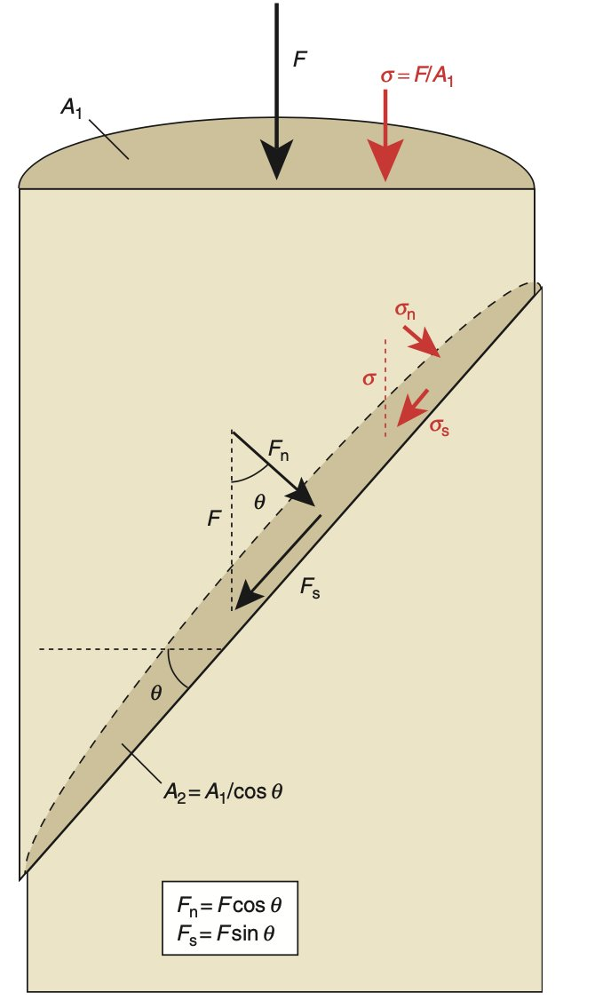 <!-- .element style="width:70%;" -->

Fossen, 2010 · $\theta$

- How normal / shear stress vary with the plane orientation it acting upon.
- Starting with uniaxial compression.
- Prior knowledge
- Stress = Force/Area
- Trigonometric functions

$\sin \theta = \frac{AC}{AB}$

$\cos \theta = \frac{BC}{AB}$

**A**

$\tan \theta = \frac{AC}{BC}$

$${\sigma} _ {n}=\frac{{F} _ {n}}{{A} _ {2}}=\frac{F\cos\theta}{{A} _ {2}}= \frac{F\cos^2\theta}{{A} _ {1}}$$

$\theta$

**C**

**B**

$=\sigma \cos^2\theta$

$${\sigma} _ {s}=\frac{{F} _ {s}}{{A} _ {2}}=\frac{F\sin\theta}{{A} _ {2}}=\frac{F\sin\theta \cos \theta}{{A} _ {1}}$$

= $\sigma \sin \theta \cos \theta =\sigma /2\sin 2\theta$

Note:
Ellipsoid is useful in some case if you want to know the traction vector directly. But in more occasions, we want to know both the normal and shear stress acting along a surface. 
For uniaxial compression, we only have the normal force applied along the main axis of the cylinder. You can regard the resulted stress as sigma 1. We derive the trigonometric expressions for the normal and shear stress here. 
A force vector F acting on a surface can be decomposed into a normal (Fn) and a shear (Fs) component by simple vector addition. The stress vector s cannot be decomposed in this way, because it depends on the area across which the force acts. 
Recall some trigonometric functions for a right-angled triangle [opposite/hypotenuse/adjacent].  
Before we put the normal and shear stress together, let’s look at how they vary with the theta angle individually.

<--o-->

<!-- source: Lecture1_Stress.pptx slide 26 · template: T3-text-and-image -->
## Stress State at An Internal Surface

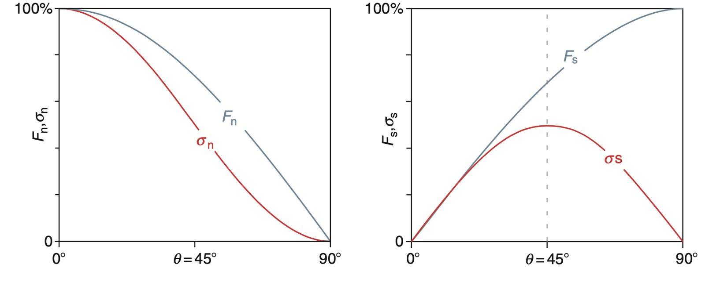

Fossen, 2010

- Shear and normal stress show different pattens of change as a function of the orientation of the plane.
- Stress and force behave differently. Note that the shear stress is at its maximum at 45º to the surface while maximum normal force is obtained parallel to the surface.

$\sigma$

$\theta$

$$\frac{\sigma \sin 2\theta}{2}=\sigma \sin \theta \cos \theta$$
Fs = F $\sin \theta$

${\sigma} _ {n}=\sigma \cos^2\theta$
Fn = F $\cos \theta$

<--o-->

<!-- source: Lecture1_Stress.pptx slide 27 · template: T3-text-and-image -->
## Deriving the Mohr Circle

Double-Angle Identities
sin(2$\theta$) = 2 sin($\theta$) cos($\theta$)
cos(2$\theta$) = cos2($\theta$) – sin2($\theta$) = 2 cos2($\theta$) – 1
Pythagorean identity
cos2($\theta$) + sin2($\theta$) = 1

- With the two basic formulas:
- We want to see how ${\sigma} _ {n}$ and ${\sigma} _ {s}$ vary with $\theta$ simultaneously.
- This looks like the equation of a circle in x-y coordinate system. The center has a coordinate of ($\frac{\sigma}{2}$, 0) and a radius of $\sigma$/2.
- First derived by Karl Culmann (1821-1881) in 19th century.

${\sigma} _ {n}=\sigma \cos^2\theta$
${\sigma} _ {s}=$ $\frac{\sigma \sin 2\theta}{2}$

y

**${X}^{2}$ + ${Y}^{2}$ = ${R}^{2}$**

$${\sigma} _ {n}=\sigma \cos^2\theta = \sigma (\cos 2\theta +1)/2$$
$\cos 2\theta$ = ${2(\sigma} _ {n}$- $\sigma$/2)/ $\sigma$
$\sin 2\theta$ = 2${\sigma} _ {s}$/ $\sigma$
${{(\sigma} _ {n}- \sigma /2)}^{2}$ + ${{\sigma} _ {s}}^{2}$ = ${\sigma}^{2}$/4

(0, 0)

x

**$R$**

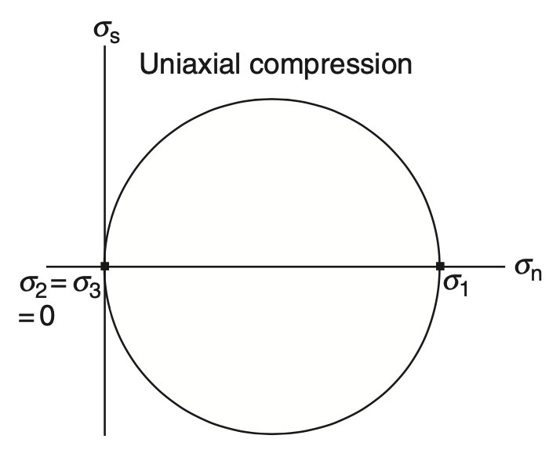 <!-- .element style="width:53%;" -->

Note:
Published a book on graphical methods in engineering in 1865.

<--o-->

<!-- source: Lecture1_Stress.pptx slide 28 · template: T3-text-and-image -->
## The Mohr Circle

- German civil engineer, Christian Otto Mohr (1835-1918) expand into both 2D and 3D stresses and developed a failure criterion.
- The Mohr circle describes the normal and shear stress acting on planes of all possible orientations through a point in the rock.
- The center has a coordinate of ($\frac{\sigma_1+\sigma_3}{2}$, 0) and a radius of$\frac{\sigma_1-\sigma_3}{2}$.
- Differential stress is $\sigma_1-\sigma_3$ and is important in fracture mechanics.

 <!-- .element style="width:47%;" -->

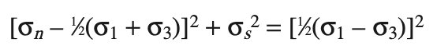

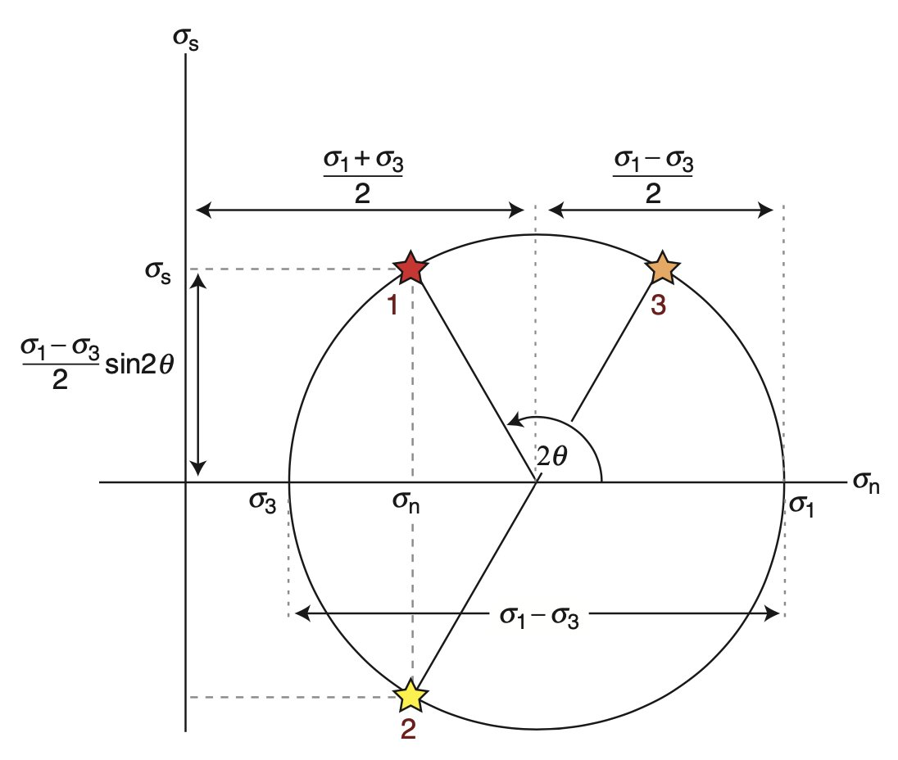

Christian Otto Mohr · Fossen, 2010

Note:
Mohr builds upon Karl’s previous work and expand into 2D and 3D. There are complex derivation processed involved into 3D stresses. But a simple to work it out is to look at the three orthogonal principal plane. Here is the formula for the plane along the sigma 1 and sigma 3. If you convert the mathematically language into graphical view, you will get the typical Mohr circle, which looks like pretty much the one we have derived. Along this x axis, you have the sigma 1 and sigma 3, so the intermediate sigma 2 is lying between the two points.

<--o-->

<!-- source: Lecture1_Stress.pptx slide 29 · template: T3-text-and-image -->
## Mohr Circle & the Angle ⍬

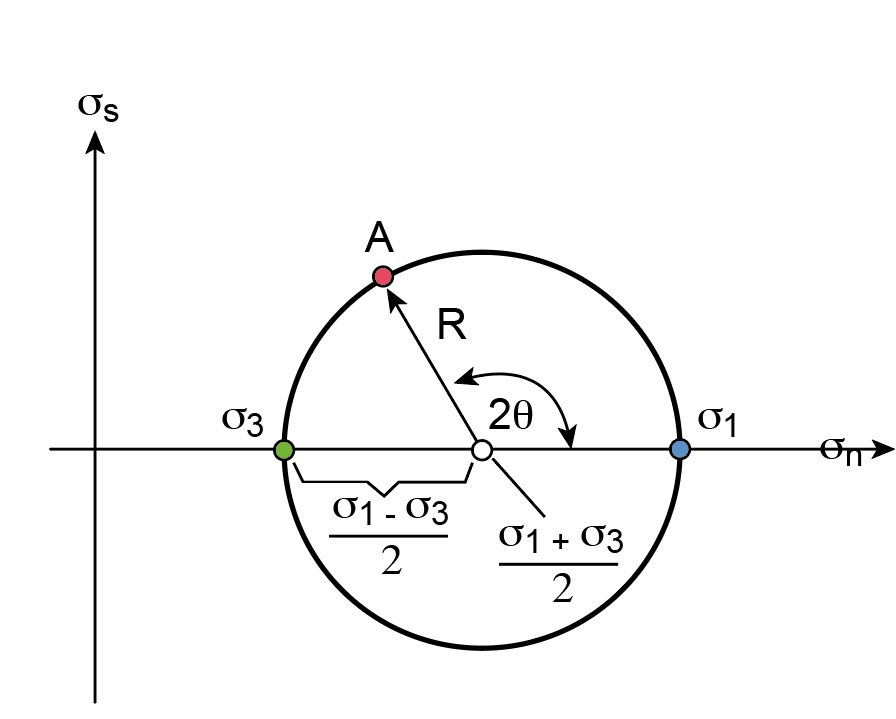 <!-- .element style="width:87%;" -->

$\sigma_1$ · $\theta$ · $\sigma_3$ · $\sigma_1$ · $\theta$ · $\sigma_3$

- Note the angle is 2$\theta$ in the Mohr circle space compared to $\theta$ in the real space.
- During derivation, we define the angle as plane dipping angle in the uniaxial case, but essentially this $\theta$ represents the angle between minimum principal stress direction and that plane.

${\sigma} _ {n}=\sigma (\cos 2\theta +1)/2$
${\sigma} _ {s}=$ $\frac{\sigma \sin 2\theta}{2}$

$\sigma_1$

$\sigma_3$

$\theta$

<--v-->

## The Mohr Circle, Measured

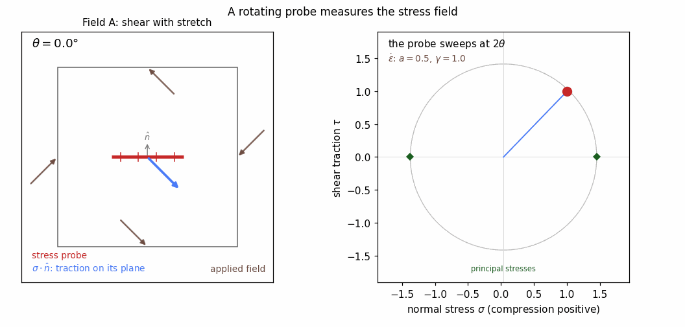 <!-- .element style="display:block; margin-left:auto; margin-right:auto; width:66%" -->

A numerical experiment: a welded fault is rotated through every orientation in a fixed stress field, and the (normal, shear) traction it measures is plotted. The points trace out the Mohr circle — and the traction snaps to the fault normal exactly at the principal orientations.

The circle is not a construction trick: it is what a stress *probe* actually measures as its orientation sweeps. Watch the $2\theta$ rule happen — and watch the principal axes appear on the model, found by the sweep rather than assumed.

<small>

Underworld3 split-node fault computation (Moresi). Fitted radius 1.411 vs the analytic $\sqrt{2}$.

</small>

<--v-->

## A different field, a different circle

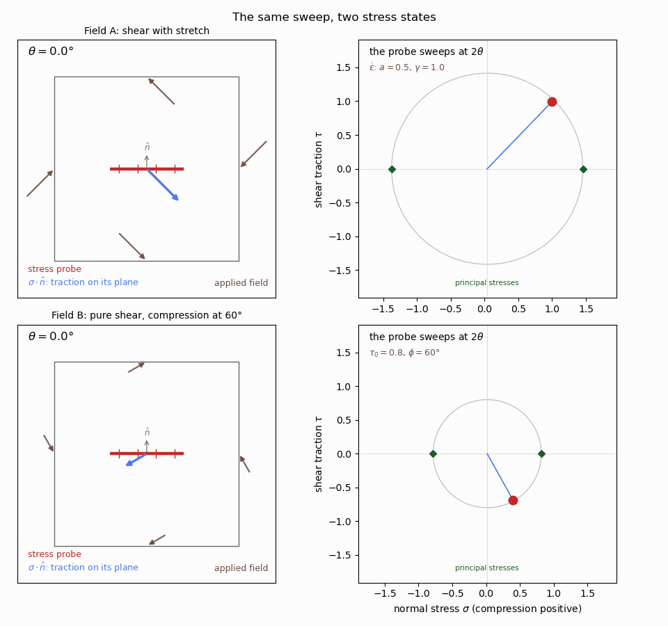 <!-- .element style="display:block; margin-left:auto; margin-right:auto; width:47%" -->

The identical experiment run in two *different* stress states, sweeping together. Below is pure shear with the compression axis at $60°$: the probe finds the principal directions at exactly $60°$ and $150°$, but the circle it builds is smaller, and turned.

Same probe, same construction, same $2\theta$ rule. Different circle.

<--v-->

## Same construction, different state

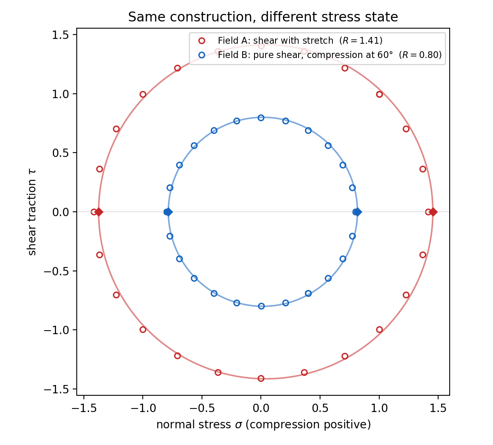 <!-- .element style="display:block; margin-left:auto; margin-right:auto; width:44%" -->

Both sweeps on one stress plane. The $2\theta$ construction is a property of *the method*; the radius and the orientation are properties of *the stress state*.

Read backwards, that is the whole point of the diagram: measure a few tractions in the field, and the circle tells you the state that produced them.

<small>

Underworld3 split-node fault computation (Moresi). Measured radii $1.41 = \sqrt{2}$ and $0.80$; each probe on the plot is a separate solve.

</small>

<--o-->

<!-- source: Lecture1_Stress.pptx slide 30 · template: T6-two-image -->
## Some 3D Stress States in Mohr Circle

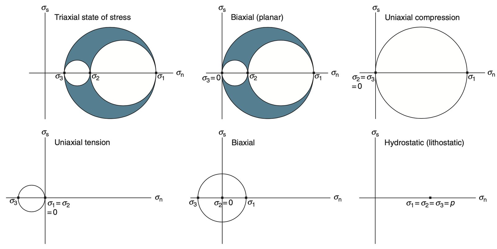

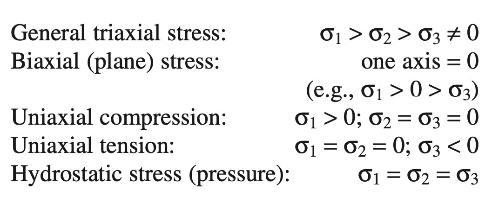

Fossen, 2010

Note:
You can also derive the similar formula along the other two principal planes, along sigma1 and sigma2 and sigma2 and sigma 3. All of them will be represented in a circle. So putting them together, you can described the more general 3D case, called triaxial state of stress.

<--o-->

<!-- source: Lecture1_Stress.pptx slide 31 · template: T3-text-and-image -->
## The Coulomb-mohr Failure Criteria

- A fracture criterion describes the critical condition at which a rock fractures.
- The Coulomb-Mohr failure criteria indicates a linear relationship between the shear stress and normal stress to initiate a shear fracture.
- They are shown as two straight lines in the Mohr circle.
- where C is the cohesive strength;
- $\phi$ is the angle of internal friction;
- $u$ is the coefficient of friction
- (0.47-0.7).

${\sigma} _ {s}=C+{\sigma} _ {n}\tan \phi =C+$ ${\sigma} _ {n}u$

$\sigma_1$

$\theta$

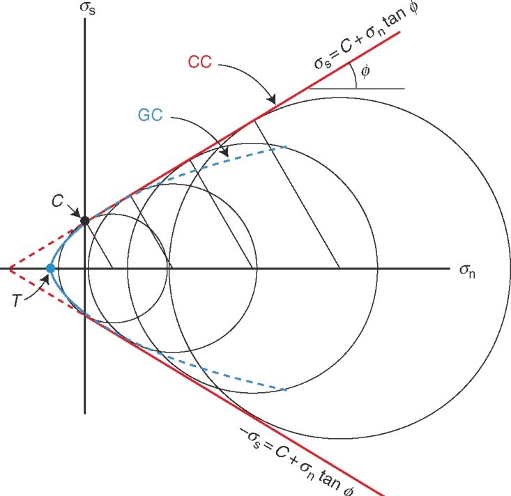 <!-- .element style="width:92%;" -->

Note:
The main application of the Mohr circle or diagram is to predict failure. One of the most popular criteria is the Coulomb-Mohr failure criteria. The critera describes the critical conditions at which a rock fractures. 
This criteria builds upon the theory firstly derived by the French physicist Charles Augustin de Coulomb in the 17th century. Mohr later developed a more generalized form in 19th century.

<--v-->

## The Envelope, Measured

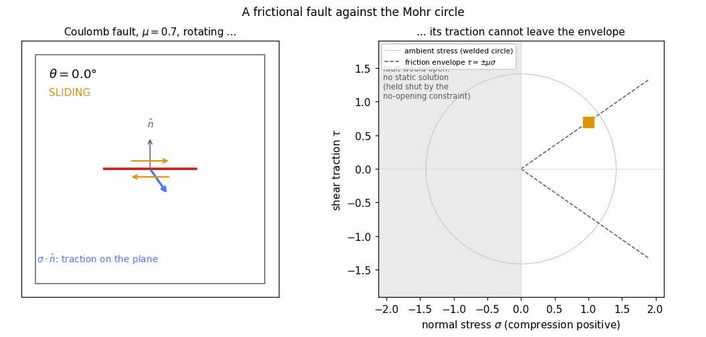 <!-- .element style="display:block; margin-left:auto; margin-right:auto; width:60%" -->

Give the rotating fault Coulomb friction and repeat the experiment: probes that stay **stuck** reproduce the circle, but probes that **slide** pin themselves to the failure envelope — the yield line truncates the circle, exactly as the theory says.

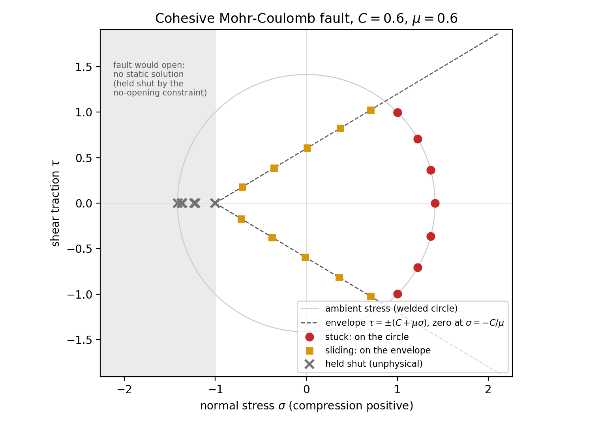 <!-- .element style="display:block; margin-left:auto; margin-right:auto; width:44%" -->

With cohesion added, the strength declines through mild tension and vanishes at $\sigma_n = -C/\mu$.

<small>

Underworld3 split-node fault computation (Moresi).

</small>

<--v-->

## The Coulomb Failure Function

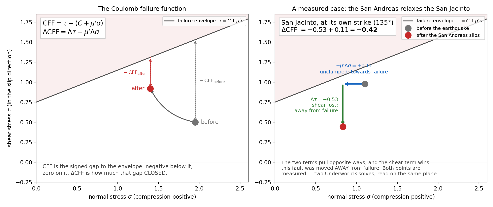 <!-- .element style="display:block; margin-left:auto; margin-right:auto; width:76%" -->

A fault fails when its stress point reaches the envelope — so measure **how far it still has to go**:

$$\mathrm{CFF} = \tau - (C + \mu' \sigma)$$

That is just the *gap* between the point and the failure line: negative below it, zero on it. Change the stress and the gap changes with it —

$$\Delta \mathrm{CFF} = \Delta \tau - \mu' \Delta \sigma$$

**Positive: the gap closed**, and the fault was brought nearer to failure. **Negative: it was pushed away**, into what is called a *stress shadow*.

<--v-->

## Two terms, and they can fight

The measured San Jacinto case on the right of that figure is a good one to hold on to, because the two terms pull in **opposite** directions:

- $\Delta \tau = -0.53$ — the San Andreas event took shear off the plane, moving it *away* from failure
- $-\mu' \Delta \sigma = +0.11$ — it also *unclamped* the plane, moving it *towards* failure

The shear term wins, so the net is $-0.42$: this fault is safer than it was. But you cannot tell that from either term alone, and the sign of the answer is not obvious before you compute it.

$\mu'$ is an **effective** friction: it bundles the real friction together with how the pore fluid responds to the squeeze. Values near $0.4$ are usual.

<--v-->

## What ΔCFF does *not* tell you

Three things to keep straight before reading any of the numbers that follow:

- It is a **change**, not a state. It says nothing about how close the fault already was. A large positive change on a fault that was nowhere near failing triggers nothing.
- It is **defined only for a stated plane and slip direction**. "Was this fault loaded?" has no answer until you say *which* fault, facing *which* way — as the next slides show, the answer can flip sign with orientation.
- The values that matter in practice are **small**. Earthquakes drop of order $1$–$10$ MPa, but triggering is observed for changes as small as $\sim 0.01$ MPa — because faults are already sitting close to failure.

*That last point is the one worth remembering: these are nudges to a system already on the edge, not shoves that break intact rock.*

<--v-->

## What failure does to its surroundings

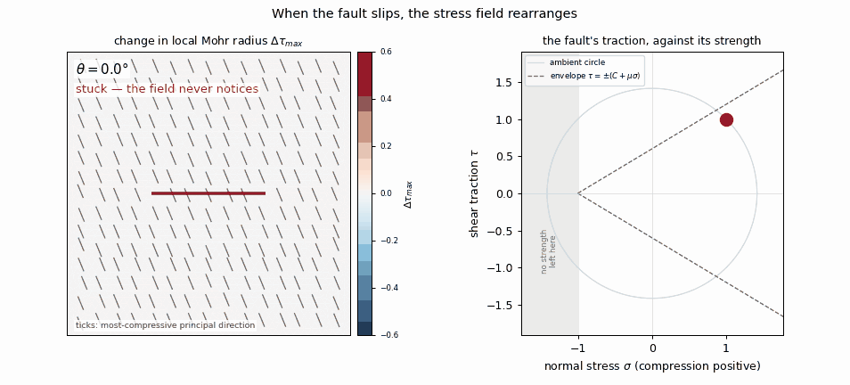 <!-- .element style="display:block; margin-left:auto; margin-right:auto; width:72%" -->

The same rotating Coulomb fault, with the stress field around it now shown. While the fault is **stuck** it is invisible: it carries the full stress and the field stays uniform. The moment it **slides**, it can no longer hold that shear — and the field reorganises around it, with lobes at the tips and the principal axes swinging to meet the weakened surface.

Failure is not just a point moving on a diagram. It rewrites the stress in the rock around it — which is why one earthquake changes the prospects of its neighbours.

<small>

Underworld3 split-node fault computation (Moresi). Colour is the change in the *local* Mohr radius $\Delta\tau_{max}$; ticks show the most-compressive principal direction. Quasi-static, incompressible — the same mathematics as elasticity at $\nu = 1/2$.

</small>

<--v-->

## Reading a real stress field: southern California

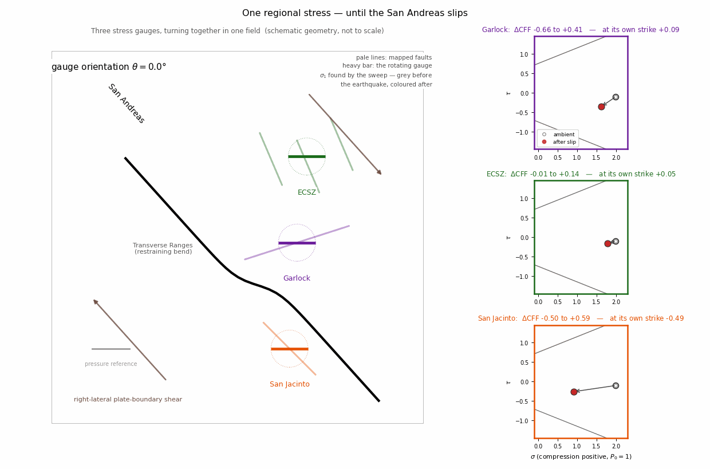 <!-- .element style="display:block; margin-left:auto; margin-right:auto; width:78%" -->

The schematic San Andreas of [Module 1.3](Module-i-GlobalTectonics-3.reveal.html), instrumented. A small welded gauge sits at each neighbouring fault zone and is rotated through every orientation — so each site builds its *own* Mohr circle, twice: before the San Andreas slips (grey) and after (red).

Before the earthquake all three circles are the **same**: one regional stress, felt everywhere. Afterwards they are not, and $\Delta$CFF is the visible motion of each circle toward or away from the envelope.

<--v-->

## It depends which way your fault faces

The measured swing in $\Delta$CFF across orientations, at each site:

| Site | $\Delta$CFF range | median |
|---|---|---|
| Garlock | $-0.64$ to $+0.54$ | $+0.01$ |
| ECSZ | $-0.01$ to $+0.15$ | $+0.08$ |
| San Jacinto | $-0.75$ to $+0.66$ | $-0.06$ |

At Garlock and San Jacinto the *same* earthquake either loads you or relaxes you — a swing of more than $1.2$ — depending on nothing but the orientation of your fault. The median is close to zero at both, and tells you almost nothing.

This is why aftershock forecasting needs the **receiver geometry**, not just the source: "was this fault brought closer to failure?" has no answer until you say which fault.

<--v-->

## Now run it backwards

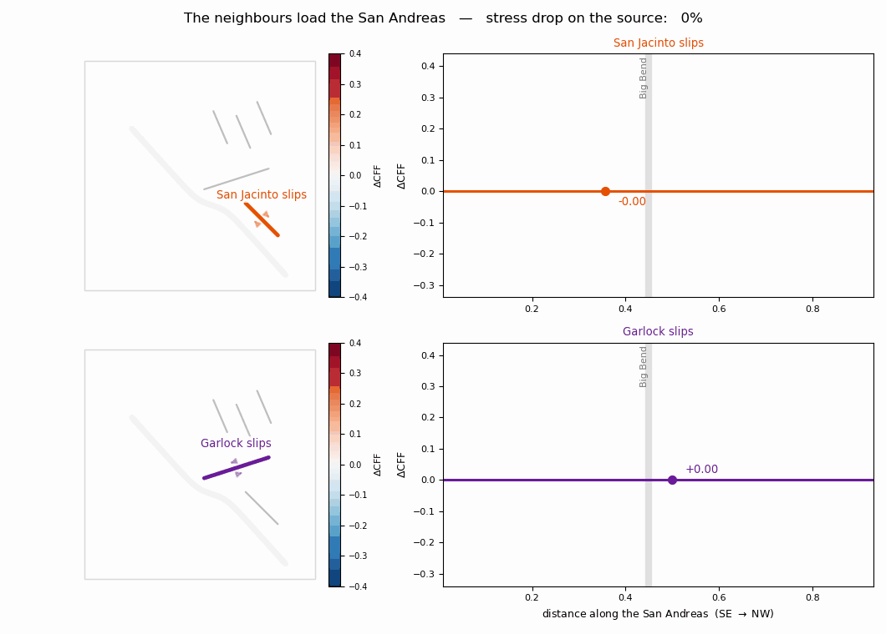 <!-- .element style="display:block; margin-left:auto; margin-right:auto; width:64%" -->

Let a *neighbour* slip instead, and read the San Andreas. The animation winds the source's stress drop up from zero — and because the mechanics are linear, every frame is an exact solution for a partial drop, not a fade between two pictures.

Both events reach the master fault, and they do **opposite** things:

- the **San Jacinto** slips right-laterally and **relaxes** the master fault, most strongly just southeast of the bend ($-0.30$);
- the **Garlock** — which resolves *left*-laterally from the kinematics alone, the sense the real Garlock has — **loads** it, and does so right at the bend ($+0.40$).

Both effects are concentrated on the **restraining bend**. Geometry decides not only where the mountains go, but where the fault is most sensitive to its neighbours.

<small>

Underworld3 (Moresi). The San Andreas is welded in every state, so it acts as a stress probe along its whole length — three solves, no sweep needed. Shear resolved on the *local* tangent at each node, since the trace is curved; the far end of the trace anchors each solve's pressure constant.

</small>

<small>

Underworld3 split-node fault computation (Moresi). $\mu' = 0.4$; the confining pressure $P_0 = 1$ and cohesion $C = 0.75$ place the envelope and do **not** enter $\Delta$CFF (both are constants under differencing). 50 solves; a far-field gauge removes each solve's pressure constant.

</small>

<--o-->

<!-- source: Lecture1_Stress.pptx slide 32 · template: T1-prose -->
## Example: Will the Fault Fail?
- The sketch shows a portion of a normal fault extends to a depth o f 5 km. Direct stress measurements at such depth indicates the stress condition on this fault plane: a normal stress ($\sigma_n$) of 300 MPa and a shear stress ($\sigma_s$) of 120 MPa.
- Question: assuming the rock materials have a coefficient of friction of 0.6, use the Coulomb-Mohr failure criteria to determine if the fault should fail.

${\sigma} _ {1}$

${\sigma} _ {s}$

${\sigma} _ {3}$

${\sigma} _ {n}$

Note:
Let us see a real example to use this criteria to predict whether a fault plane under certain stress will fail.

<--o-->

<!-- source: Lecture1_Stress.pptx slide 33 · template: T1-prose -->
## Example: Will the Fault Fail?
- The sketch shows a portion of a normal fault extends to a depth o f 5 km. Direct stress measurements at such depth indicates the stress condition on this fault plane: a normal stress ($\sigma_n$) of 300 MPa and a shear stress ($\sigma_s$) of 120 MPa.
- Question: assuming the rock materials have a coefficient of friction of 0.6, use the Coulomb-Mohr failure criteria to determine if the fault should fail.

${\sigma} _ {1}$

- Solutions:
- To predict the fault will fail or not, we just need to compare the actual shear stress along the fault plane with the critical shear stress from the failure criteria.
- Recall the Coulomb-Mohr failure criteria:
- ${\sigma} _ {s-fal}$= 0.6 $\times$ 300 + C = 180 MPa + C.
- Since the cohesive strength C is positive, ${\sigma} _ {s-fal}$ will be always larger than the actual shear stress, so it will not fail.

${\sigma} _ {s}$

${\sigma} _ {3}$

${\sigma} _ {n}$

$${\sigma} _ {s-fal}=C+{\sigma} _ {n}\tan \phi =C+$$

<--o-->

<!-- source: Lecture1_Stress.pptx slide 34 · template: T3-text-and-image -->
## Anderson’s Theory of Faulting (1905)

Fossen, 2010

- Assume no shear stress at the Earth’s surface, so one of the principal stresses must be vertical. This implies that the other two are horizontal.
- Assumptions: 1) coaxial deformational regimes (no rotation); 2) the deforming rocks must be isotropic.

$\sigma$v = $\sigma$1: normal-fault regime;
$\sigma$v = $\sigma$2: strike-slip fault regime;
$\sigma$v = $\sigma$3: thrust-fault regime;
Stereonets show fields of compression and tension.

Note:
Since we are discussing the Mohr circle and the failing criteria, let’s revisit the Anderson’s theory of faulting, which describes the various stress condition with the focal mechanism. Louis brief touched on this topic in the first module. But now we may have a bit more background knowledge to understand it.

<--o-->

<!-- source: Lecture1_Stress.pptx slide 35 · template: T3-text-and-image -->
## Implication to Normal/reverse Faulting

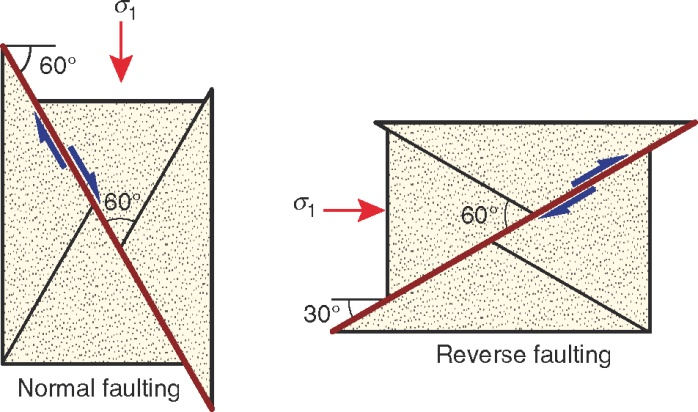

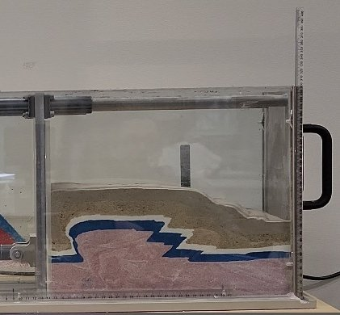

Fossen, 2011

- Based on the Coulomb-Mohr failure criteria, Anderson’s theory of faulting predicts a conjugate fault system for different stress conditions.
- The theory also predicts that normal and reverse faults dip at about 60º and 30º, respectively. In other words, one can use the dipping angle to refer stress directions.

${\sigma} _ {1}$

<--o-->

<!-- source: Lecture1_Stress.pptx slide 36 · template: T6-two-image -->
## Stress Effects from Free Surface

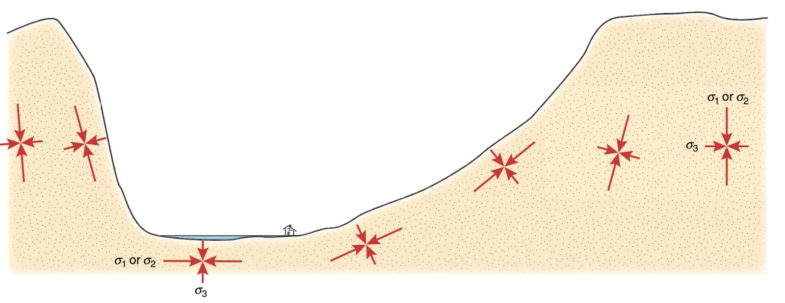

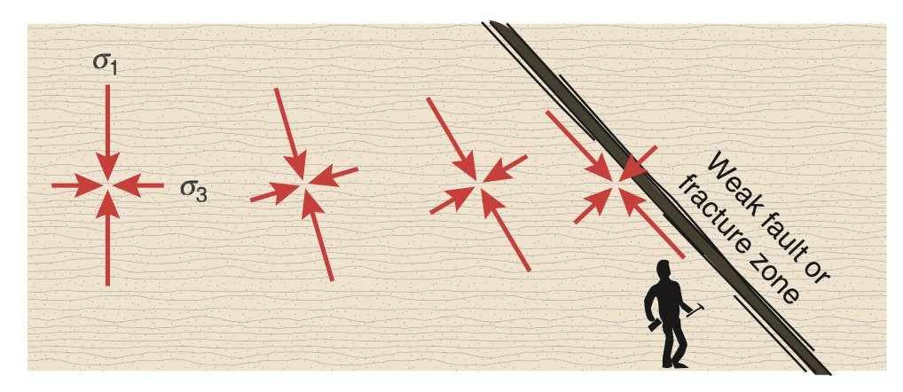

Fossen, 2010

Note:
One of the principal stresses will always be perpendicular to the free surface of the Earth, because the shear stress is zero along any free surface. Thus, a non-planar surface causes the orientation of the stresses to rotate as shown on the figure. Note that these deviations occur near the surface only. 
The structure is weaker than the surrounding rock and can support lower shear stresses than its surroundings. The situation is similar to that where an open surface exists, e.g. the free surface of the Earth

<--o-->

<!-- source: Lecture1_Stress.pptx slide 37 · template: T3-text-and-image -->
## Lithostatic and Hydrostaic Stress

- Two reference states of stress (isotropic).
- Lithostatic stress/pressure: isotropic pressure at depth in the Earth arising from the overlying rock column.
- Hydrostatic stress: Isotropic component of the stress; strictly, the pressure at the base of a water column.
- Pore fluid pressure reduces the effective stress by creating stress at grain contacts in porous rocks.
- $\hat{\sigma}= \sigma_v$– pf
- where$\hat{\sigma} \ \text{is effective stress}\ , \sigma_v$ is vertical stress and pf is fluid pressure.

Fossen, 2010

Note:
I want to talk about a few more concept before we explore how to measure the stress inside of the Earth: lithostatic stress and hydrostatic stress. I mentioned them in some of the slides without definition. 
When we normally talk about pressure, we are talking about pressure in a gas (air pressure) or a liquid (the pressure at the bottom of the ocean). In this special case there are no shear stresses, only normal stresses. Over long periods of time the deep interior of the planet behaves as a fluid, so just like in the ocean we can think about the pressure at a point inside the earth.
This lithostatic pressure can be regarded as a reference stress-state (average point of view), in which other tectonic forces are added. The normal stresses in the horizontal directions will normally not be equal to the lithostatic stress. 
Hydrostatic stress is another term often used, it also represents the isotropic component of the stress and representing the stress at the base of a water column.

<--v-->

## Depth-Dependent Strength on One Fault

 <!-- .element style="display:block; margin-left:auto; margin-right:auto; width:62%" -->

Under a hydrostatic (depth-increasing) load, a single fault is not one point in the Mohr plane — every depth along it feels a different confining stress, so the fault becomes a depth-coloured *streak* spanning a family of Mohr circles.

Shallow parts and deep parts of the same fault can be in quite different positions relative to failure.

<small>

Underworld3 split-node fault computation (Moresi).

</small>

<--o-->

<!-- source: Lecture1_Stress.pptx slide 38 · template: T3-text-and-image -->
## Pore Pressure Effect

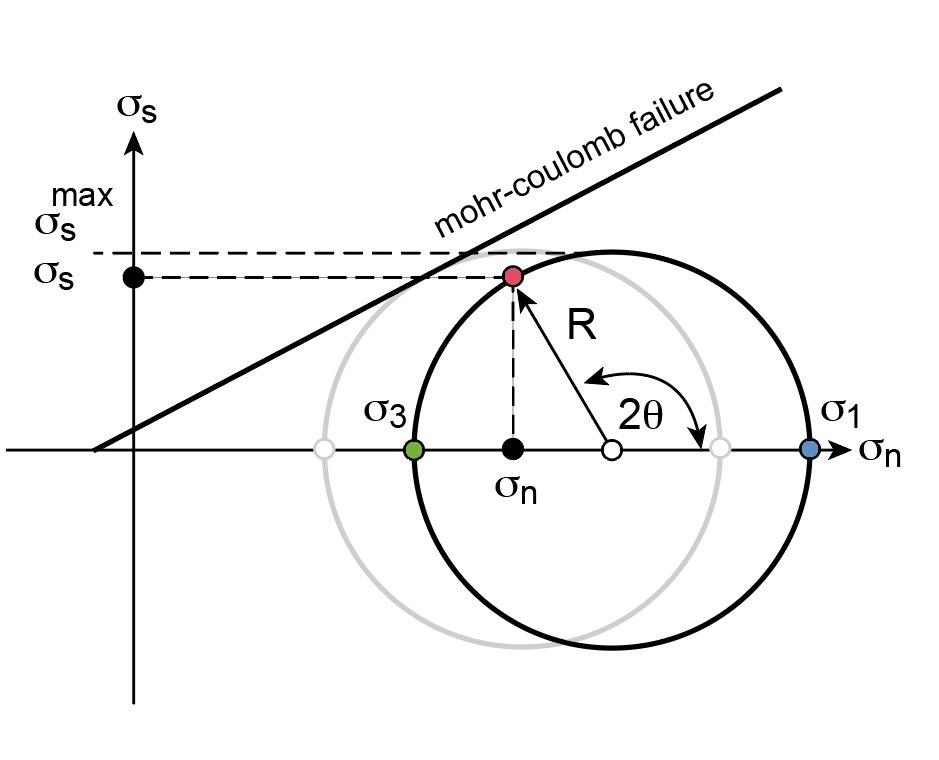 <!-- .element style="width:93%;" -->

Pf

- If the Mohr circle intersects the Mohr-Coulomb failure criteria, then the rock will fail along a fault plane of a normal direction of an angle $\theta$ to the $\sigma_1$ axis.

Figure: Roderick Brown, U Glasgow

- If the Mohr circle does not intersect the Mohr-Coulomb failure criteria, then the rock will not fail. Increasing the fluid pressure moves the circle to the left (reduces effective normal stress) and so can lead to failure.

<--o-->

<!-- source: Lecture1_Stress.pptx slide 39 · template: T3-text-and-image -->
## Summary of Previous Lecture

- Derive the Mohr circle for a uniaxial compression case.
- General form of Mohr circle for biaxial compression:
- The Coulomb-Mohr failure criteria:
- Anderson’s theory of faulting: concept & assumptions.
- Concepts of lithostatic stress/pressure and hydrostatic stress, and the effect of pore fluid pressure.

$\sigma_3$

${{(\sigma} _ {n}- \sigma /2)}^{2}$ + ${{\sigma} _ {s}}^{2}$ = ${\sigma}^{2}$/4

$\theta$

$\sigma$

$\sigma_1$

${\sigma} _ {s}=C+{\sigma} _ {n}\tan \phi =C+$ ${\sigma} _ {n}u$

$\theta$

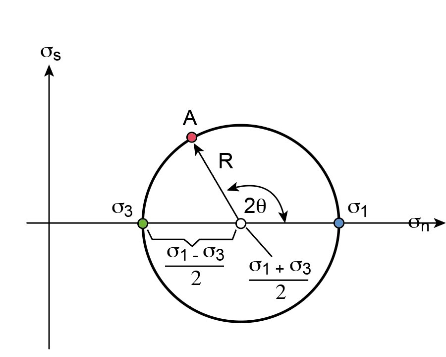 <!-- .element style="width:90%;" -->

Uniaxial compression · Biaxial compression · ${\sigma} _ {s}=C+{\sigma} _ {n}\tan \phi$

Note:
There are also other failure criteria and will be introduced when we discuss the brittle deformation after the mid-term break. 
Anderson’s theory of faulting shows three different kinds of faults arising from three different stress-states. The stress state is described by the maximum, intermediate and minimum magnitude principal stresses. You should be faimilar with the stress condition for each fault type and know the assumptions, thus limitation behind this theory. 
Two important reference stress state of lithostatic stress and hydrostatic stress. Stress is purely due to the overburden, which is continental rock and water column for them respectively.

<--o-->

<!-- source: Lecture1_Stress.pptx slide 40 · template: T3-text-and-image -->
## How We Measure Stress

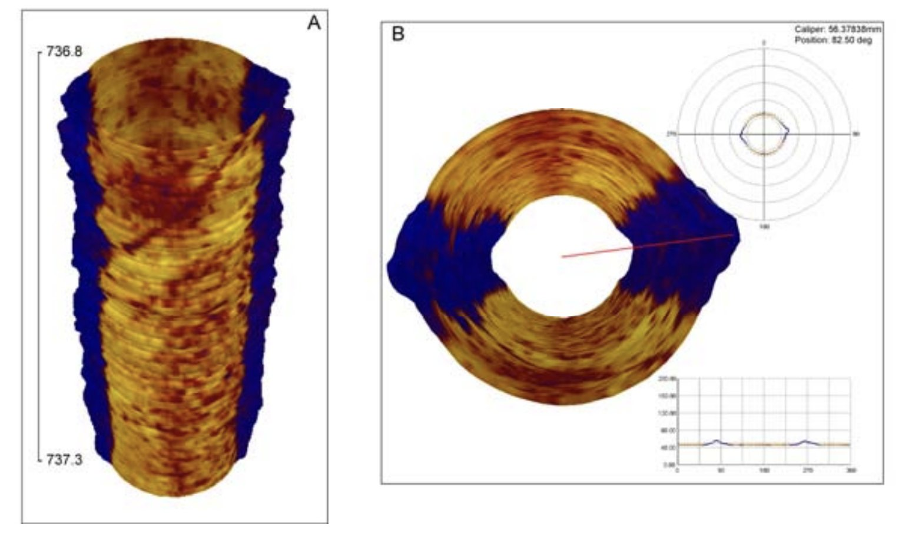

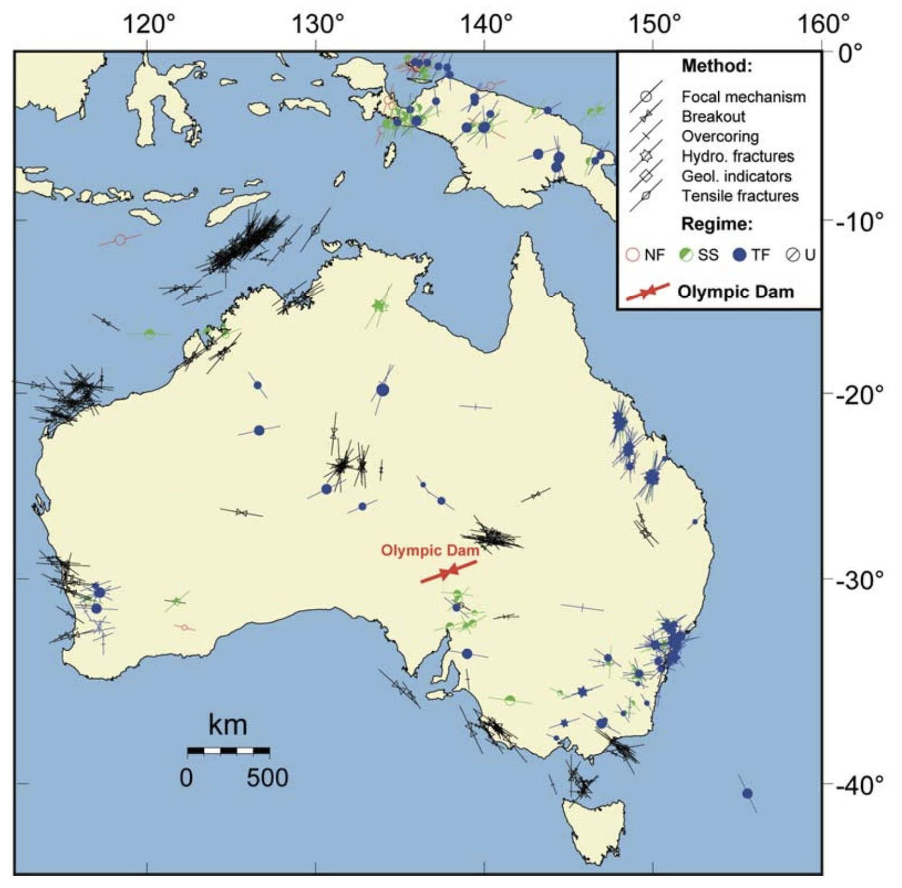

$\sigma_H$ · $\sigma_h$

- A series of methods to collect in situ stress data at the very shallow crust.
- Borehole breakout:
- Zones of failure of the wall of a well that give the borehole an irregular and typically elongated shape.
- The spalling of fragments from the wellbore occurs preferentially parallel to the minimum horizontal stress ($\sigma_h$).
- Requires numerical modelling.

The Use of Borehole Breakout for Geotechnical Investigation of an Open Pit Mine by Fowler and Weir, 2008 (link).

a 3D image of the borehole and cross-section

Note:
The figures here show a study to measure the local stress field in an Open Pit Mine with the Olympic dam deposit. They use acoustic televiewer borehole images (ATV) to construct the 3D image of the borehole. 
Samples of the core and have a good understanding of some physical parameters, including some useful moduli. Then they model the shape of the borehole breakout to produce a maximum and minimum horizontal stress that gives the best fit. 
They collected the data from 38 boreholes and average them to get the final stress direction. The overall trend of the principal stress orientation at Olympic Dam is presented on the Australian stress map and indicates a reasonable comparison with other proximal measurements (Figure 7).

<--o-->

<!-- source: Lecture1_Stress.pptx slide 41 · template: T3-text-and-image -->
## How We Measure Stress

- Overcoring:
- A strain relaxation method where a sample (core or block) is extracted from a rock unit, measured, and then released so that it can freely expand. The change in shape that occurs reflects the compressive stresses that have been released, but also depends on the rock’s elasticity.
- Geological structure:
- The orientation and pattern of recent fault scarps, fold traces, tensile fractures and volcanic vent alignments all indicate the orientation of the principal stresses.
- An example of active vertical fractures on the surface of Holocene lava flows in southeast Iceland indicate the orientation of $\sigma_h$.

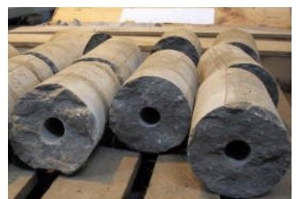 <!-- .element style="width:34%;" -->

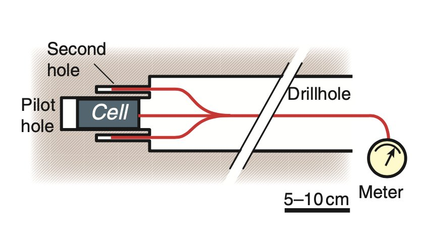

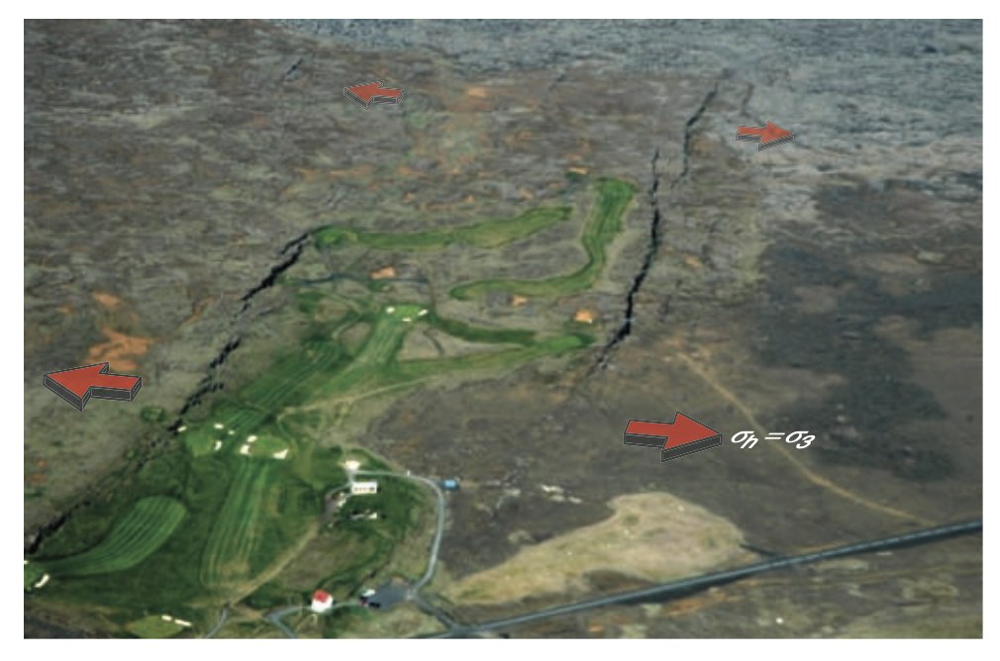

Fossen, 2010 · overcored specimen

Note:
Overcoring is another method used in a borehole setting. The main idea behind it is to isolate partially or wholly a rock sample from the stress field in the surrounding rock mass and monitor its re-equilibrium deformation response. It involves installing strain-measuring instruments bonded in a small-diameter pilot borehole drilled at the base of the large drill hole. The instrument is then overcored using a larger coring bit to effectively relieves the stress acting on the hollow rock cylinder. The induced strains are measured by the strain cell before, during, and after overcoring. The strain difference are used to back-calculate the stresses acting on the rock cylinder prior to overcoring assuming continuous, homogeneous, isotropic, and linear-elastic rock behaviour. This needs the knowledge of the elastic properties of the rock (Young's modulus and Poisson's ratio), usually determined by biaxial pressure tests on the overcored rock cylinder on-site.

<--o-->

<!-- source: Lecture1_Stress.pptx slide 42 · template: T3-text-and-image -->
## How We Measure Stress

- Hydraulic fracturing:
- The technique is frequently applied to petroleum reservoirs to increase the near-well permeability.
- Relying on the theory that pore fluid pressure reduces the effective stress by increasing the stress at grain contacts in porous rocks.

National Geographic Society

A cool video on hydraulic fracturing process

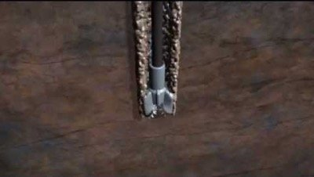

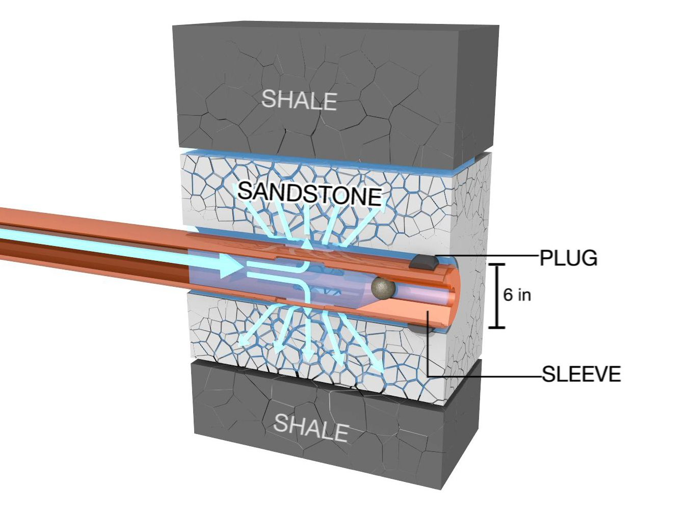

Note:
In this case the interval of the wellbore that is to be fractured is sealed off and pressure is pumped up until tensile fractures form. The pressure that is just enough to keep the fracture(s) open equals sh in the formation. Knowing the tensile strength of the rock, it is possible to calculate sH. Furthermore, the vertical stress is assumed to be a principal stress and equal to rgz. Petroleum engineers use knowledge of the stress field to plan hydrofracturing of reservoir units to take advantage of the predicted direction of fracture propagation.

<--o-->

<!-- source: Lecture1_Stress.pptx slide 43 · template: T3-text-and-image -->
## Injection Induced (?) Earthquakes

Myths and misconceptions about induced earthquakes (USGS link).

- Figure shows the M3.0+ earthquakes /year in the central and eastern United States, 1973–2020.
- The long-term rate of approximately 25 earthquakes per year increased sharply starting around 2009.
- >58 earthquakes since 2009 each year; >100 earthquakes since 2013.
- The rate peaked in 2015 with 1010 M3+ earthquakes.
- 130 M3+ earthquakes in 2019.

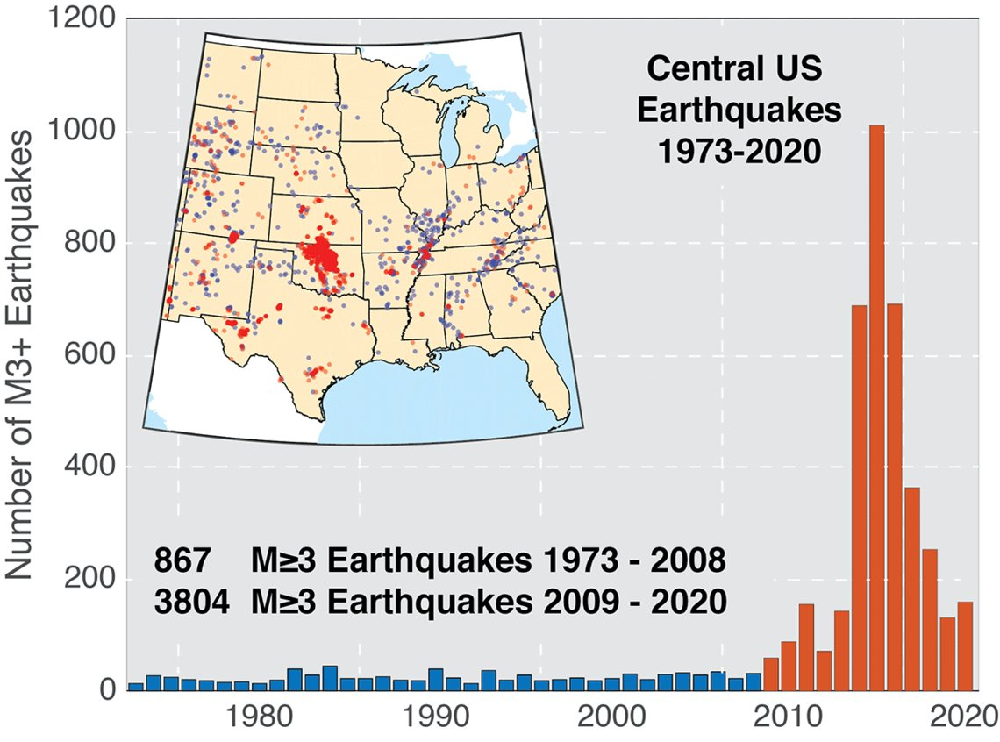

<--o-->

<!-- source: Lecture1_Stress.pptx slide 44 · template: T3-text-and-image -->
## Stress Estimates from Focal Mechanism

- The indirect method for stress estimation at depth below 4–5 km;
- The estimation is made with the assumption of Anderson’s theory of faulting;
- In many cases, the P- and T-axes do not necessarily parallel principal stress axes.
- Combining focal mechanisms of faults of different orientation helps reduce this biased assumption.

Focal mechanism

Focal sphere side-view

**P**

**T**

$\sigma_1$ or P

$\sigma_3$ or T

Yang and Hauksson, GJI, 2013
Doi: 10.1093/gji/ggt113

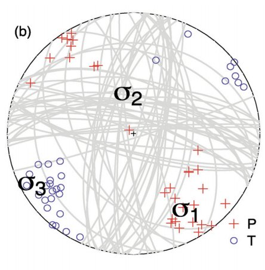 <!-- .element style="width:56%;" -->

<--o-->

<!-- source: Lecture1_Stress.pptx slide 45 · template: T3-text-and-image -->
## Stress Estimates in South California

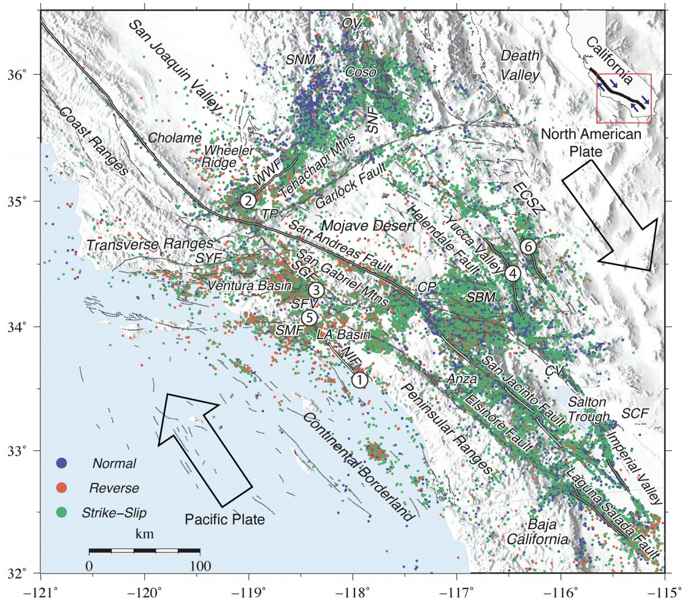

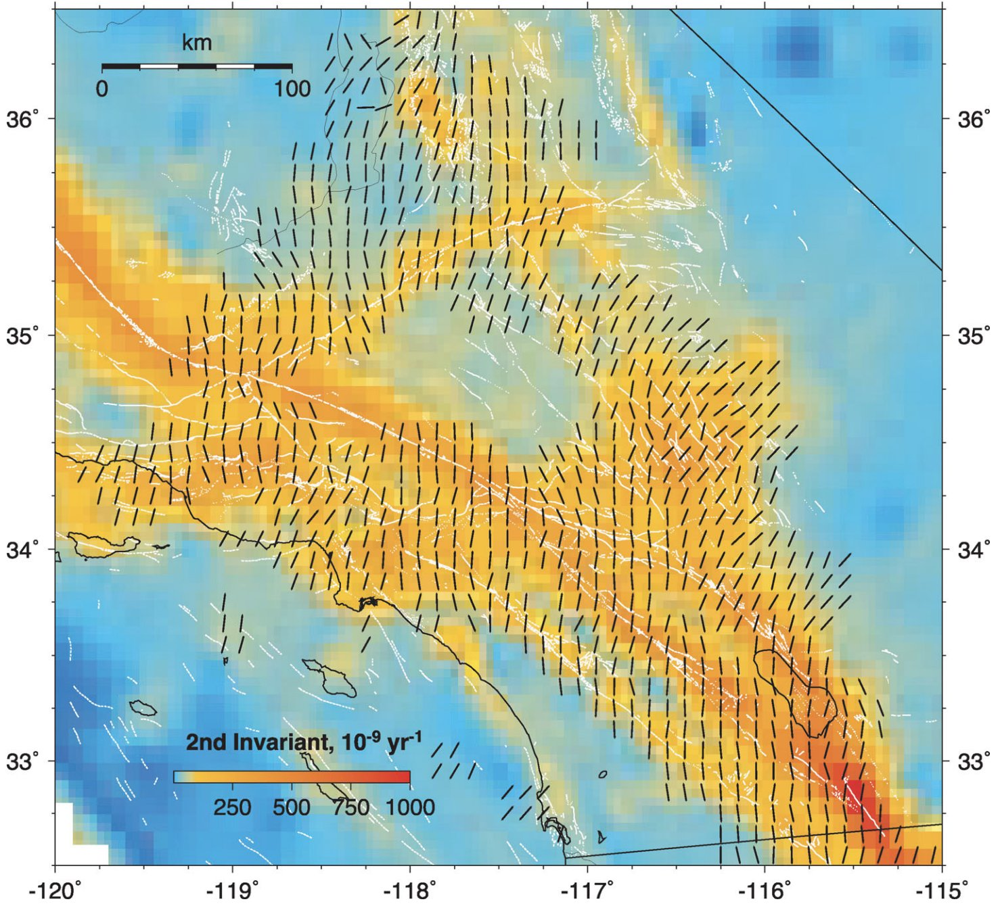

(a) · (b)

- Using 179,000 earthquake focal mechanisms between 1981-2010 (Fig. a);
- Best resolved at regions of high seismicity rates (fault zones) and sufficient data;
- Orientations of $\sigma$Hmax on the image of strain rate (Holt et al. 2010; Fig. b).
- The trend of $\sigma$Hmax exhibits significant regional and local spatial heterogeneities.

Yang and Hauksson, GJI, 2013

Note:
The location of LA, the SAF a right-lateral strike-slip fault, which is the plate boundary between Pacific and North-American plate. The fault can be well illustrated by the seismicity, indicating a very active state. The strain rate (plotted as the 2nd invariant -> indicating the shear) tells the same thing.

<--o-->

<!-- source: Lecture1_Stress.pptx slide 46 · template: T3-text-and-image -->
## Global Stress Map

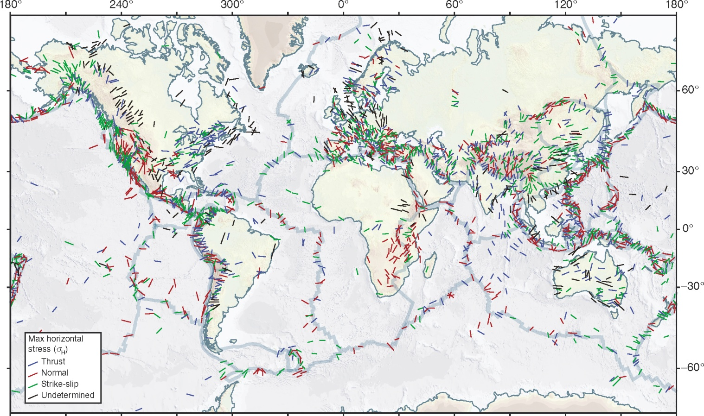

Fossen, 2010

- The World Stress Map Project is based on stress measurements from around the world from (1) earthquake focal mechanisms, (2) bore-hole breakouts and drilling-induced fractures, (3) in situ stress measurements (e.g., hydraulic fracturing) and (4) neotectonic geologic structural data (from fault-slip analysis and volcanic vent alignments).

- The correlation between the orientation of $\sigma_H$ and plate motion is obvious in many places, but with many deviations that tell us that the current stress field is influenced by many different mechanisms and sources of stress.

Note:
The data are ranked according to reliability. Focal mechanism data completely dominate the data set, particularly the deeper (4–20 km) portion of the data, and are most frequent where earthquakes are common, i.e. along plate boundaries. At shallower levels there is a dominance of data from breakouts, hydrofractures and overcoring. 
The figure shows that there are large areas of little or no stress information, onshore as well as offshore. The correlation between the orientation of sH and plate motion is also obvious many places, but with many deviations that tell us that the current stress field is influenced by many different mechanisms and sources of stress. Regardless, tectonic processes at plate margins are thought to have a significant influence on the regional stress pattern

<--o-->

<!-- source: Lecture1_Stress.pptx slide 47 · template: T3-text-and-image -->
## Major Tectonic Forces

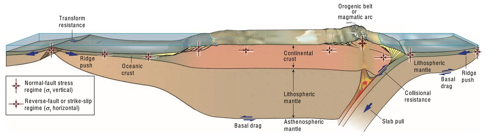

Fossen, 2010

- The maximum stress axis in continental plates is expected to be horizontal except for the upper part of rift zones (continental rift not shown), passive margins and elevated parts of orogenic belts.
- Slab pull is the gravitational pull exerted by the sinking slab on the rest of the plate.
- Ridge push is simply the push from the topographically high oceanic ridge that marks divergent plate boundaries.
- Basal drag is the frictional resistance or shear force acting at the base of the lithosphere.

Note:
In the subduction zone, the slab pull is the major thing. Louis gave a detailed overview on subduction zone stresses (W2-1), so you can revisit that materials to refresh the mind. But for the oceanic crust, there will be regions of extentional and compressional stress. Faulting happens during the bending zone of the outmost shell. Carry fluids to the deep Earth.

<--o-->

<!-- source: Lecture1_Stress.pptx slide 48 · template: T1-prose -->
## Summary
- Stress = Force/Area (N/m2 or Pa).
- Pressure gradient approximate 27 MPa / km, at least in the shallow crust.
- Concept of normal and shear stress, stress tensor, principal stress, mean stress, deviatoric stress.
- Derivation of the Mohr circle /diagram → reflect the normal and shear stress variation as a function of plane orientation.
- Use the Coulomb-Mohr failure criteria to predict when rock fails.
- Anderson’s theory of faulting: classification of tectonic stress.
- How can we get information about the stress field near the surface? Some kilometers down? Even deeper down?

<--o-->

<!-- source: Lecture1_Stress.pptx slide 49 · template: T1-prose -->
## Exercise five summary I
- Dot product of two vectors

y

- 2D stress tensor

**$T$**

Traction vector

$T$ = [a b]

$\sigma =\left[ \begin{matrix} \sigma_{xx} & \sigma_{xy} \cr \sigma_{yx} & \sigma_{yy} \end{matrix} \right]$ = $\left[ \begin{matrix} \vec{T}_x \cr \vec{T}_y \end{matrix} \right]$

(a, b)

Mathematic form

$\vec{f}$ = [1 0]

Unit vector along x axis

$\vec{f}$

x

0

(1, 0)

y

$\sigma_{yy}$

This dot product gives you the projection of T along the x axis.

$T∙$ $\vec{f}$  = [a b] $∙\left[ \begin{matrix} 1 \cr 0 \end{matrix} \right]$ = a

Graphic form

$\sigma_{yx}$

y

$\sigma_{xy}$

**$T$**

x

$\sigma_{xx}$

(a, b)

Significantly simplify the process to project a vector along a dipping surface

$\sigma_{xy}$

- Two ways to describe stress along a surface:
- Vector
- Two orthogonal components

$\vec{T}_x$

x

$\sigma_{xx}$

$\vec{f′}$

0

<--o-->

<!-- source: Lecture1_Stress.pptx slide 50 · template: T3-text-and-image -->
## Exercise five summary II

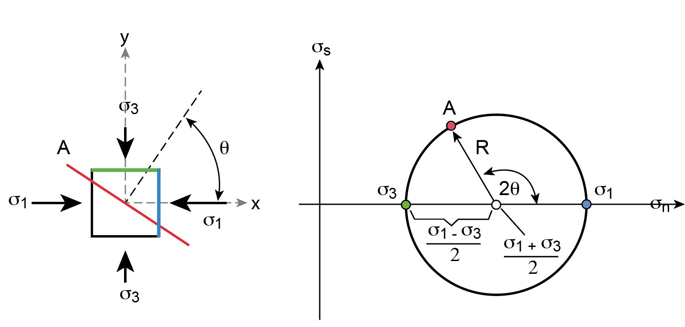

${\sigma} _ {s}=C+{\sigma} _ {n}\tan \phi$

- Mohr circle: a graphic way to show the shear and normal stress along a certain plane. Note the angle in Mohr circle space twice of that in real world.
- It provides the info of the full stress state of a plane (2D) or a body (3D).

- The Coulomb-Mohr failure criteria: represented as a straight line in the Mohr circle space. Its slope is $\tan \phi$ and the intersection with y axis is C.
- A surface will fracture when the shear stress along a surface exceeds the critical shear stress predicted from this failure criteria.

<--o-->

<!-- source: Lecture1_Stress.pptx slide 51 · template: T3-text-and-image -->
## Figures for exercise 5.

Depth [km]

Lake George fault

**E**

0

120

90

60º

5

Shear stress, $\sigma_s$ (MPa)

5 km

2 km

Figure 2.

60

30

6 km

100

150

200

50

0

Normal stress, $\sigma_n$ (MPa)

Figure 1.

Figure 3.

 <!-- .element style="width:11%;" -->

<--o-->

<!-- source: Lecture1_Stress.pptx slide 52 · template: T1-prose -->
## Figures for exercise 5.
Depth [km]

120

$\sigma_s= \sigma_n+10$

90

Lake George fault

Shear stress, $\sigma_s$ (MPa)

**E**

60

0

30

45º

-5

100

150

200

0

50

Normal stress, $\sigma_n$ (MPa)

Figure 2.

Figure 3.
