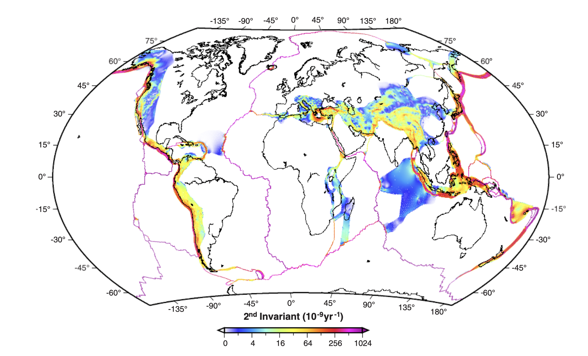

# EMSC 3002

## Module3.2 - Strain and Strain rate

  - Louis Moresi (convenor)
  - Romain Beucher (lecturer)
  - **Chengxin Jiang** (lecturer)
  - Stephen Cox (curriculum advisor)

Australian National University

_**NB:** the course materials provided by the authors are open source under a creative commons licence. 
We acknowledge the contribution of the community in providing other materials and we endeavour to 
provide the correct attribution and citation. Please contact louis.moresi@anu.edu.au for updates and 
corrections._

<--o-->

## Resources

1. **Fossen, H, 2011.** *Structural Geology.* Cambridge University Press, 2nd Edition. [E-learning modules](https://folk.uib.no/nglhe/module3/Chapt3module.html)
1. **van der Pluijm, B.A. and Marshak, S., 2003.** *Earth Strcture: an introduction to structural geology and tectonics.* W. W. Norton & Company, Ltd.
1. **Davis, G.H. and Reynolds, S.J., 1996.** *Structural Geology of Rocks and Regions.* 2nd Edition, John Wiley & Sons. 
1. **Park, R.G., 1995.** *Foundations of Structural Geology.* Blackie & Sons Ltd. 

<--o-->

## Intended learning outcomes

What you will learn about strain and strain rate.

- The meaning of kinematic analysis
- The four deformation styles
- The concept of strain and its quantification in 2D / 3D
- Strain classification via Flinn diagram
- The general methods for strain analysis
- The concept of strain rate and how we measure them

<--o-->

<!-- .slide: data-background="Figures-Theory2/slide1.png" -->

<--o-->

<!-- .slide: data-background="Figures-Theory2/slide2.png" -->

<--o-->

<!-- .slide: data-background="Figures-Theory2/slide3.png" -->

<--o-->

<!-- .slide: data-background="Figures-Theory2/slide4.png" -->

<--o-->

<!-- .slide: data-background="Figures-Theory2/slide5.png" -->

<--o-->
<!-- .slide: data-background="Figures-Theory2/slide6.png" -->

<--o-->

<!-- .slide: data-background="Figures-Theory2/slide7.png" -->

<--o-->

<!-- .slide: data-background="Figures-Theory2/slide8.png" -->

<--o-->

<!-- .slide: data-background="Figures-Theory2/slide9.png" -->

<--o-->

<!-- .slide: data-background="Figures-Theory2/slide10.png" -->

<--o-->

<!-- .slide: data-background="Figures-Theory2/slide11.png" -->

<--o-->

<!-- .slide: data-background="Figures-Theory2/slide12.png" -->

<--o-->

<!-- .slide: data-background="Figures-Theory2/slide13.png" -->

<--o-->

<!-- .slide: data-background="Figures-Theory2/slide14.png" -->

<--o-->

<!-- .slide: data-background="Figures-Theory2/slide15.png" -->

<--o-->

<!-- .slide: data-background="Figures-Theory2/slide16.png" -->

<--o-->

<!-- .slide: data-background="Figures-Theory2/slide17.png" -->

<--o-->

<!-- .slide: data-background="Figures-Theory2/slide18.png" -->

<--o-->

<!-- .slide: data-background="Figures-Theory2/slide19.png" -->

<--o-->

<!-- .slide: data-background="Figures-Theory2/slide20.png" -->

<--o-->

<!-- .slide: data-background="Figures-Theory2/slide21.png" -->

<--o-->

<!-- .slide: data-background="Figures-Theory2/slide22.png" -->

<--o-->

<!-- .slide: data-background="Figures-Theory2/slide23.png" -->

<--o-->

<!-- .slide: data-background="Figures-Theory2/slide24.png" -->

<--o-->

<!-- .slide: data-background="Figures-Theory2/slide25.png" -->

<--o-->

<!-- .slide: data-background="Figures-Theory2/slide26.png" -->

<--o-->

<!-- .slide: data-background="Figures-Theory2/slide27.png" -->

<--o-->
## Plate Boundaries

The regions of highest strain rate at the surface of the Earth are the plate boundaries.

 <!-- .element style="width:66%;" -->

The styles and patterns of deformation are very dependent on the orientation of the stresses that are acting at the boundary.

