<!-- source: Curtin-May2025-PPT.pptx slide 1 · template: T1-prose -->
## Geodynamic Modelling for Hydrogen Exploration
Louis Moresi with Seismic imaging team from ANU; MT team from University of Adelaide; geophysics team from H2Ex

Using Stress / flow analysis to help understand uncertainty & build an exploration blueprint

<small>Reading these on your own? Press **O** for the overview, and **&darr;** as well as **&rarr;** &mdash; some slides sit below this one. <a href="../lecture-1-introduction/#navigating-the-slides" target="_blank" rel="noopener">How to navigate the slides</a></small>

<--o-->

<!-- source: Curtin-May2025-PPT.pptx slide 2 · template: T3-text-and-image -->
## H2 Exploration / Storage

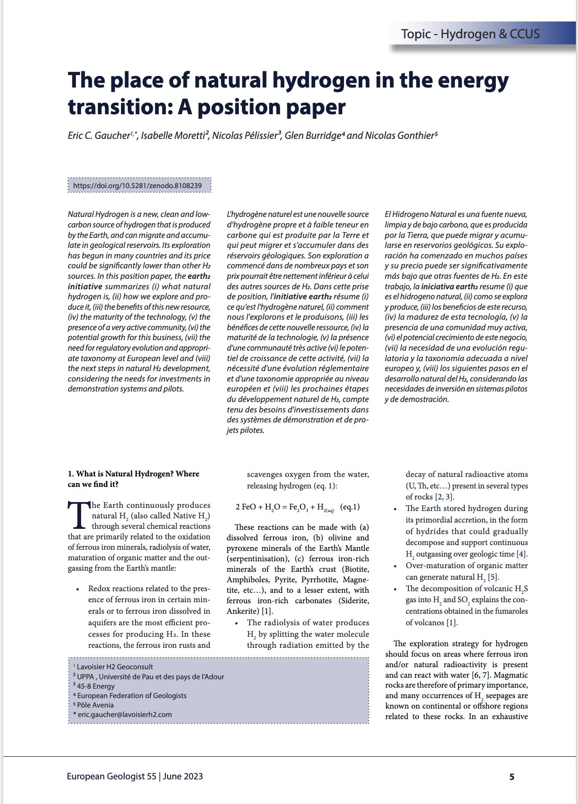
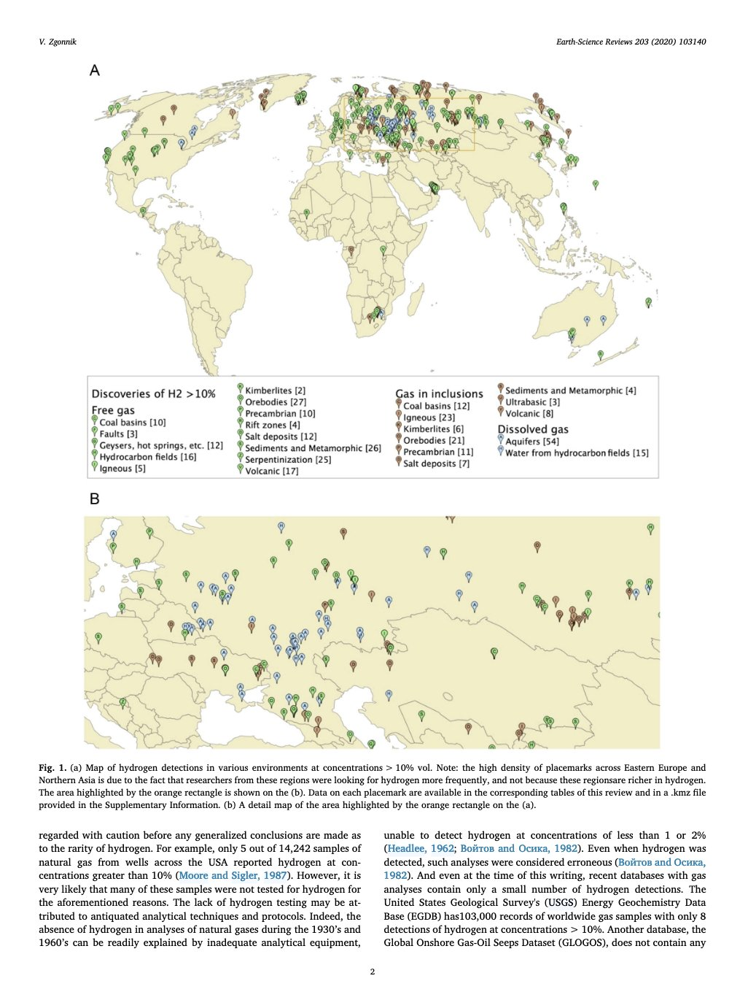

Expanding / busy field at the moment

Alternative fuel / energy storage

Sources / Prospectively

Migration / Storage

<--o-->

<!-- source: Curtin-May2025-PPT.pptx slide 3 · template: T1-prose -->
## H2 Exploration
- Sources uncertain /diverse
- Three main types of source rocks have been identified:
- Ultrabasic rocks
- Iron rich cratons
- Uranium rich rocks.
- (1 & 2) the production of H2 is linked to the oxidation of Fe(II) by H2O
- (3) H2 production from the radiolysis of H2O by natural radioactivity
- Gaucher, E. C. (2020). New Perspectives in the Industrial Exploration for Native Hydrogen. Elements, 16(1), 8–9. https://doi.org/10.2138/gselements.16.1.8

<--o-->

<!-- source: Curtin-May2025-PPT.pptx slide 4 · template: T3-text-and-image -->
## H2 Exploration

Exploration & Storage models based on hydrocarbon analogues

Boreham CJ, Edwards DS, Czado K, Rollet N, Wang L, van der Wielen S, Champion D, Blewett R, Feitz A, Henson PA (2021a) Hydrogen in Australian natural gas: occurrences, sources and resources. The APPEA Journal 61, 163–191. doi:10.1071/aj20044

Stalker Linda, Talukder Asrar, Strand Julian, Josh Matthew, Faiz Mohinudeen (2022) Gold (hydrogen) rush: risks and uncertainties in exploring for naturally occurring hydrogen. The APPEA Journal 62, 361-380. https://doi.org/10.1071/AJ21130

<--o-->

<!-- source: Curtin-May2025-PPT.pptx slide 5 · template: T3-text-and-image -->
## H2 Exploration

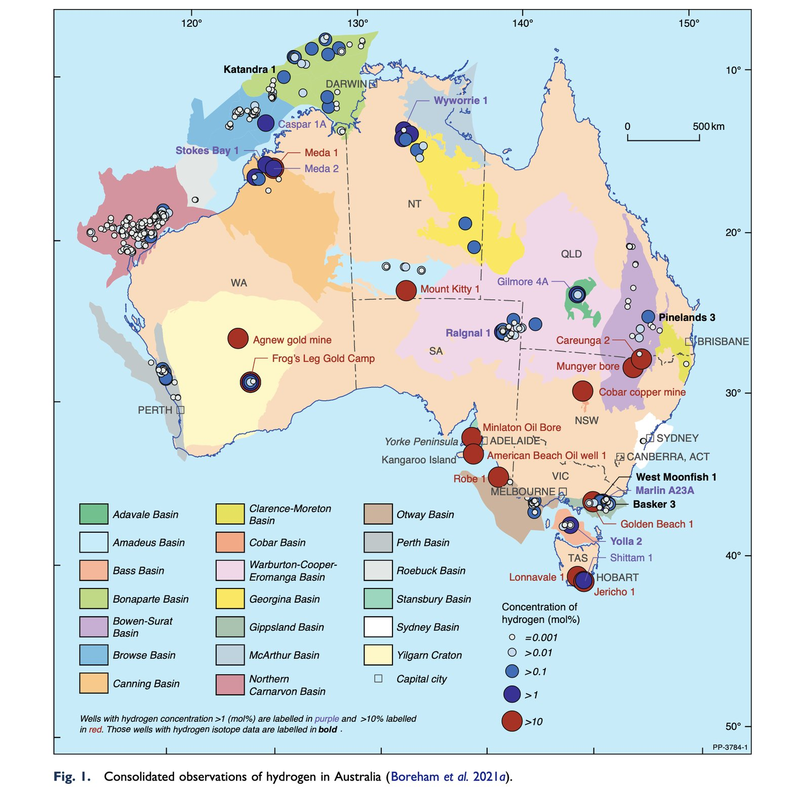
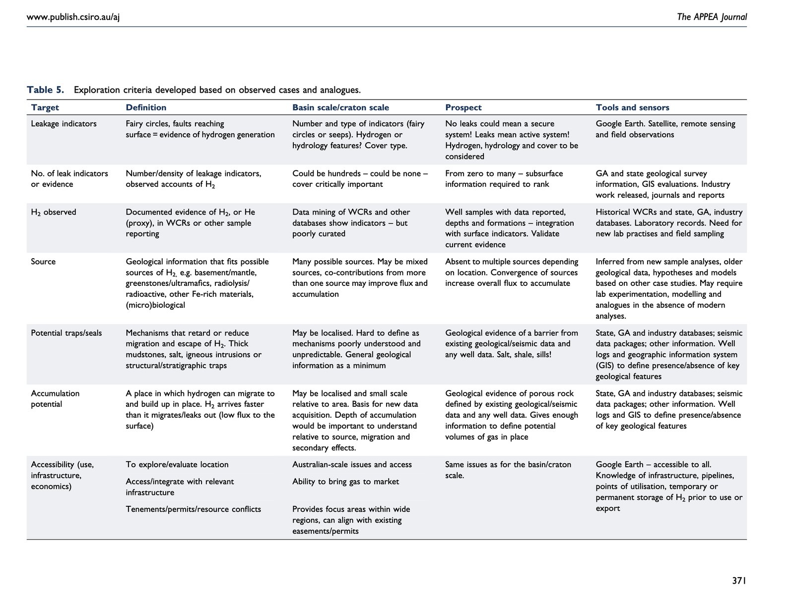

Exploration & Storage models based on hydrocarbon analogues

Boreham CJ, Edwards DS, Czado K, Rollet N, Wang L, van der Wielen S, Champion D, Blewett R, Feitz A, Henson PA (2021a) Hydrogen in Australian natural gas: occurrences, sources and resources. The APPEA Journal 61, 163–191. doi:10.1071/aj20044

Stalker Linda, Talukder Asrar, Strand Julian, Josh Matthew, Faiz Mohinudeen (2022) Gold (hydrogen) rush: risks and uncertainties in exploring for naturally occurring hydrogen. The APPEA Journal 62, 361-380. https://doi.org/10.1071/AJ21130

<--o-->

<!-- source: Curtin-May2025-PPT.pptx slide 6 · template: T3-text-and-image -->
## Concentrate on pathways for Flow

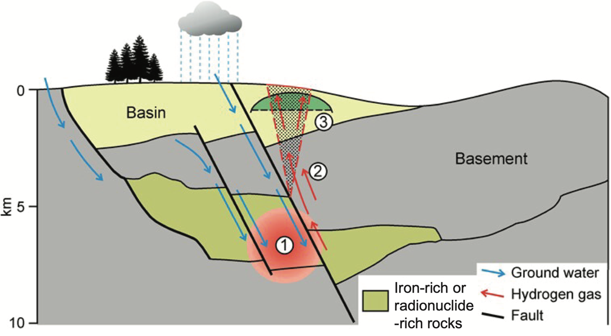
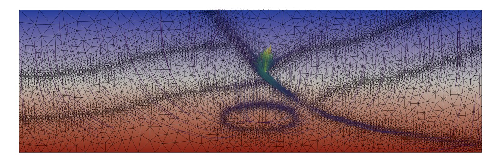
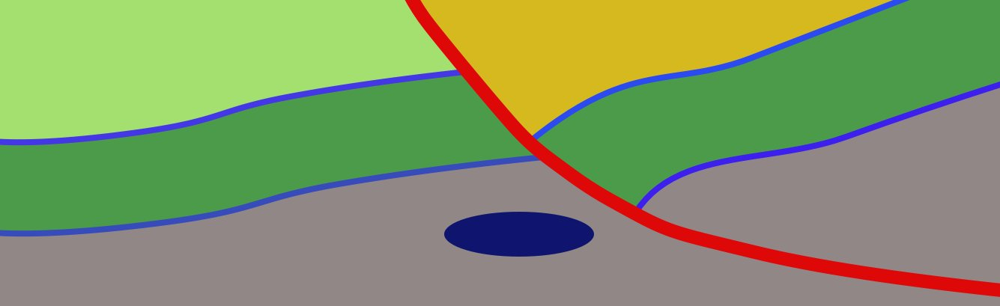

Hutchinson et al, 2024

Enhancing interpretation of geophysics  / geology with flow / stress models

Regional-scale flow for structural “optimisation”

Likely pathways, influence of structure / stress on flow paths from source regions.  Conceptual representative models in the first instance.

<--o-->

<!-- source: Curtin-May2025-PPT.pptx slide 7 · template: T3-text-and-image -->
## Concentrate on pathways for Flow

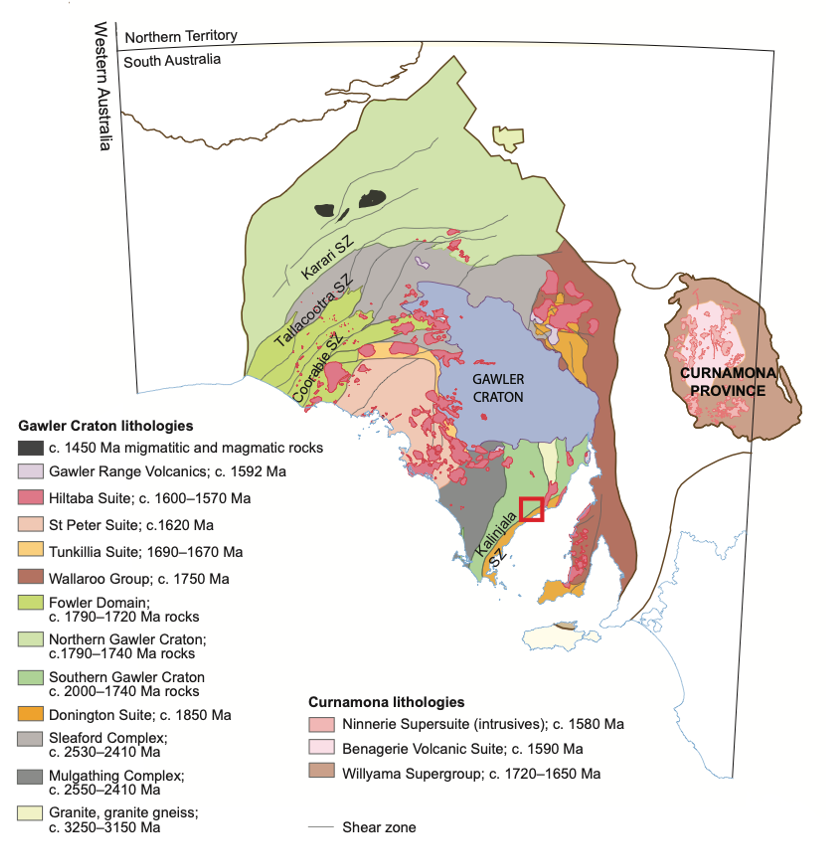
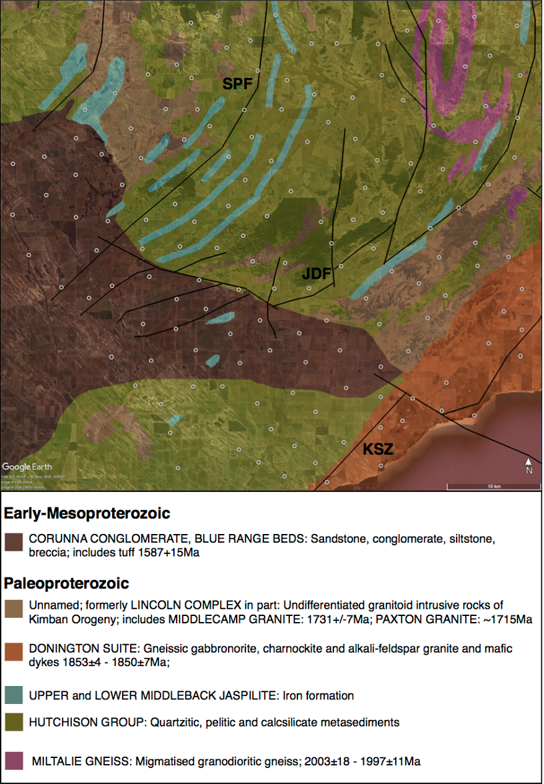
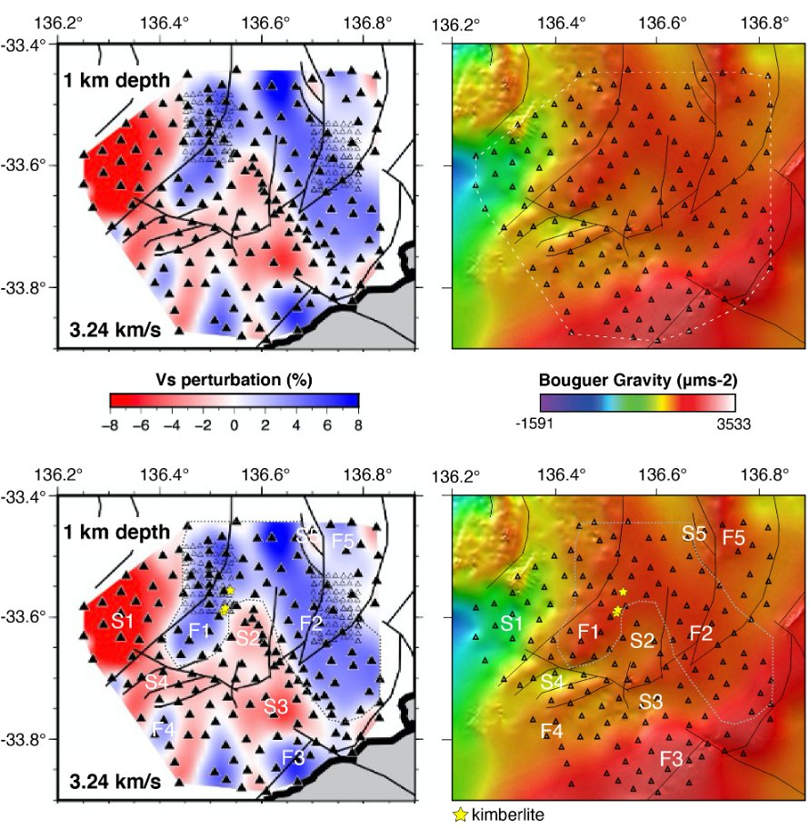

Enhancing interpretation of geophysics  / geology with flow / stress models

Geological model / tomography model imaging (ambient noise seismology / MT)

<--o-->

<!-- source: Curtin-May2025-PPT.pptx slide 8 · template: T3-text-and-image -->
## Concentrate on pathways for Flow

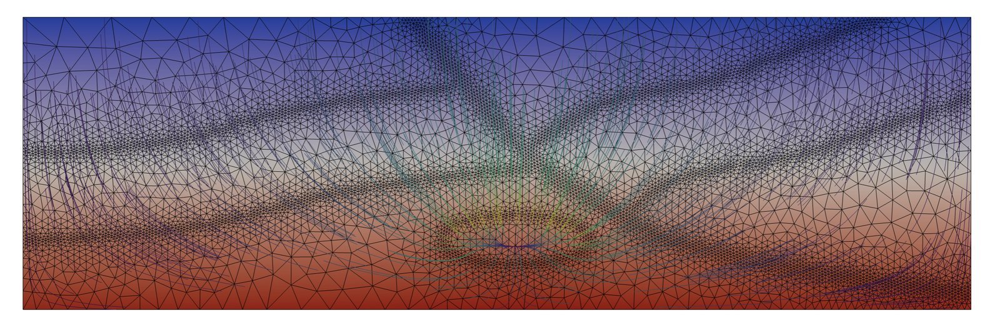
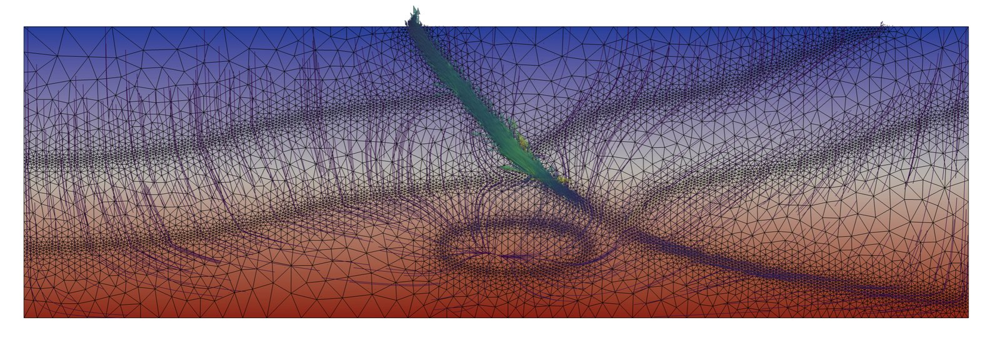
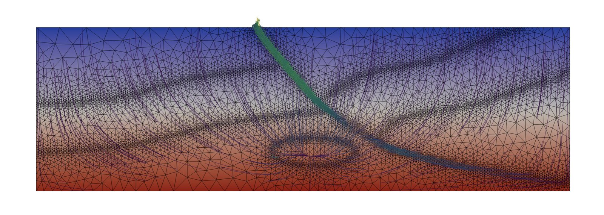

Locating preferred pathways from source regions to surface

- Fluid paths depend on
- Permeability / Porosity (infer from MT)
- Location of faults (surface mapping, geological interpretation , ANT)
- Tendency of faults to be conduits / sealed (stress-state / deformation)
- Potential location of sources (can open pathways tap sources ?)

<--o-->

<!-- source: Curtin-May2025-PPT.pptx slide 9 · template: T3-text-and-image -->
## When Might faults Be open/sealed?

When they are deforming (long-term)
Faults slip if the forces acting in the shear direction are large enough compared to the forces acting to hold them together (friction)
Stress field and also orientation of the faults dictate this.
Fault movements change the stress conditions felt by other faults.

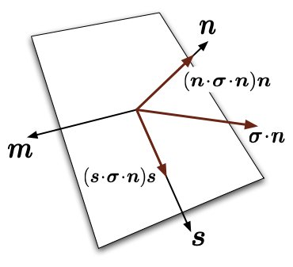

<--o-->

<!-- source: Curtin-May2025-PPT.pptx slide 10 · template: T6-two-image -->
## Stress Field

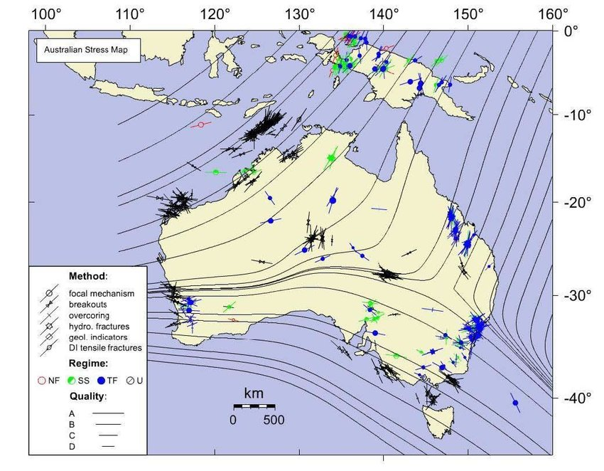

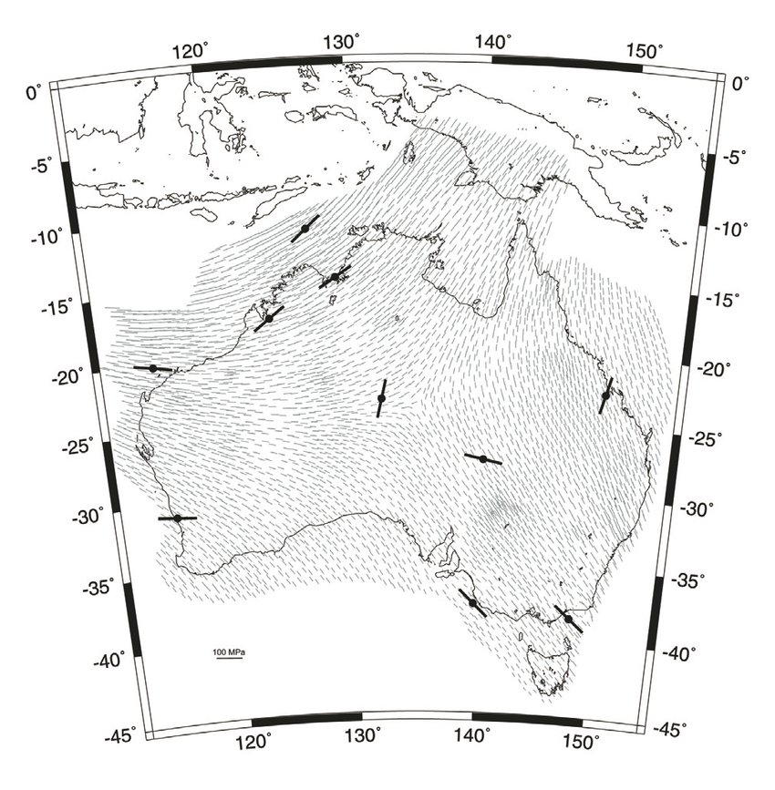

<--o-->

<!-- source: Curtin-May2025-PPT.pptx slide 11 · template: T6-two-image -->
## Underworld Geometry

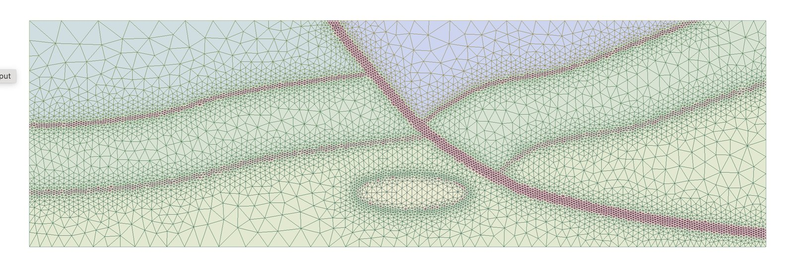

<--o-->

<!-- source: Curtin-May2025-PPT.pptx slide 12 · template: T3-text-and-image -->
## Underworld Physics

Elastic/Viscous Response to Far-field stress;
Darcy Flow (2 phase)

- — [y] Stokes (elastic / viscous)
- — [y] Anisotropy / history
- — [y] Darcy (flow rates / paths)
- — [y] Permeability fn of lithology
- — [y] Permeability fn of stress/strain-rate field
- — [y] Fault seal changes (resolved stress / strain-rate)
- — [y] Fluid pressure feedback on stress
- — [-] Forward models of geophysical observables

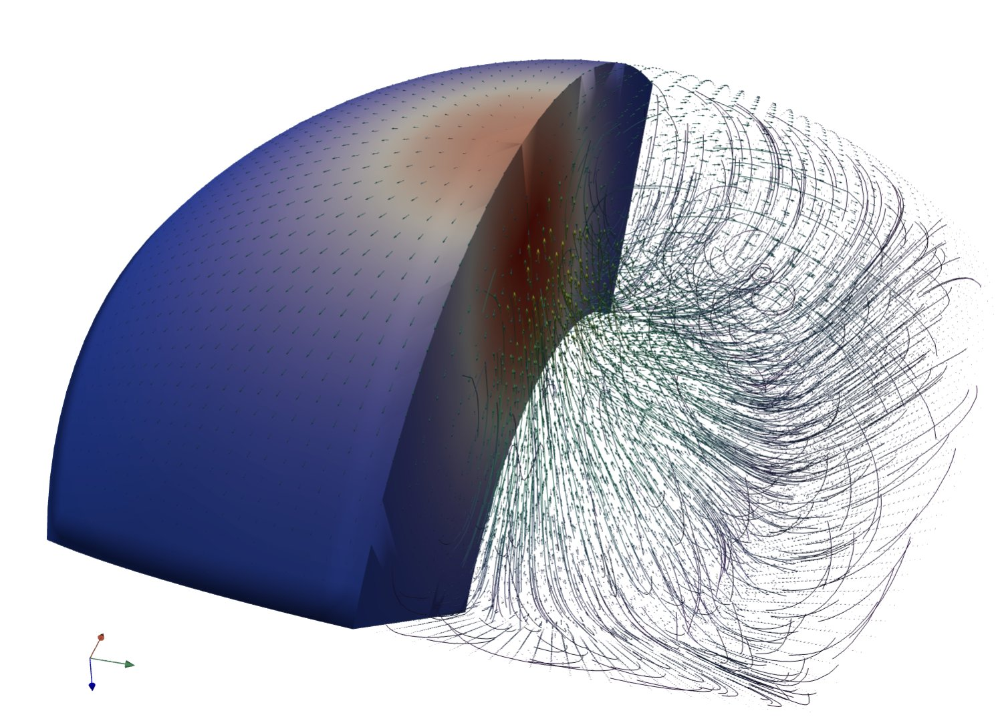
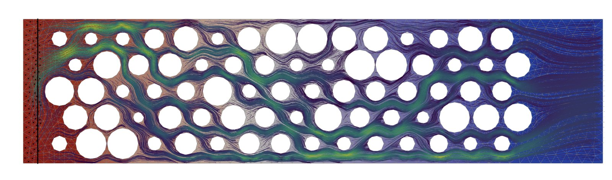
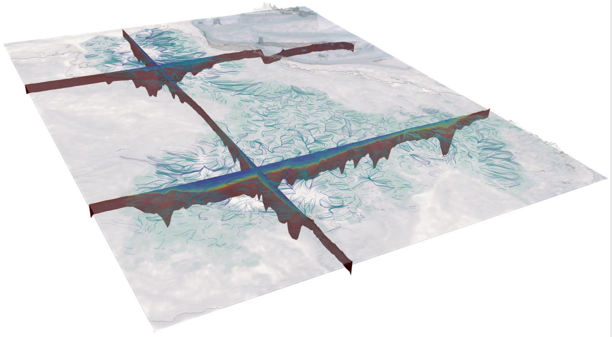

Large scale stress calculations · Grain-scale flow calculations · Regional-scale flow calculations

<--o-->

<!-- source: Curtin-May2025-PPT.pptx slide 13 · template: T6-two-image -->
## Computational Motivation — reusable modeling for geodynamicists

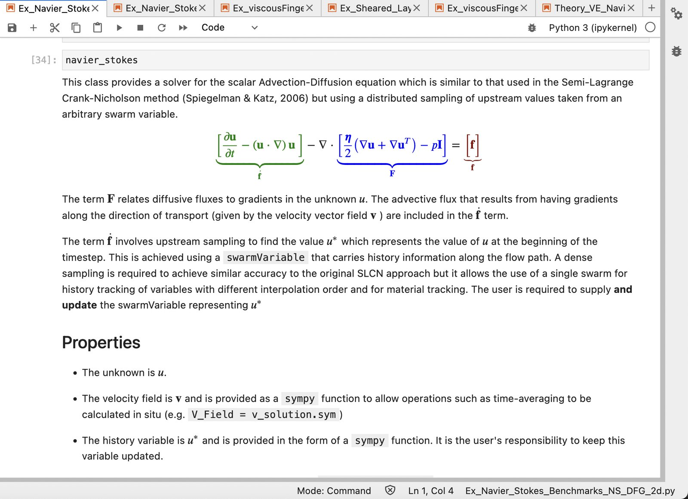

<--o-->

<!-- source: Curtin-May2025-PPT.pptx slide 14 · template: T1-prose -->
## Underworld Template problem (see any textbook)
$d\Gamma$

$\Gamma$

$$\frac{d}{dt}{\int} _ {\Omega}\rho \phi d\Omega =-{\int} _ {\Gamma}F⋅d\Gamma +{\int} _ {\Omega}\rho Hd\Omega -{\int} _ {\Gamma}\rho \phi u⋅d\Gamma$$
Rate of change of a quantity, $\phi$, is the balance between fluid transport across the boundary, $\Gamma$, of an arbitrary volume, $\Omega$, the diffusive flux, and sources within the volume
$$\int_{\Omega} [\frac{d\rho \phi}{dt}+ \nabla ⋅\rho \phi u+ \nabla ⋅F-\rho H]d\Omega =0$$

$\Omega$

$u$

<--o-->

<!-- source: Curtin-May2025-PPT.pptx slide 15 · template: T1-prose -->
## Underworld Template problem (Examples)
Heat advection / diffusion

$$\frac{d\rho \phi}{dt}+ \nabla ⋅\rho \phi u- \nabla ⋅F-\rho H=0$$

$d\Gamma$

$\Gamma$

$${{[\frac{\partial T}{\partial t}+\left( v⋅ \nabla \right)T]} _ {⏟}} _ {{f}^{\cdot}}- \nabla ⋅{{[\kappa \nabla T]} _ {⏟}} _ {F}-{{\left[ H \right]} _ {⏟}} _ {f}=0$$

Darcy flow

$\Omega$

$u$

For any physical quantity, the relationship between the flux () and the gradients is a constitutive law which is derived empirically and depends upon material properties that we need to measure.

$${{[{S} _ {s}\frac{\partial h}{\partial t}]} _ {⏟}} _ {{f}^{\cdot}}- \nabla ⋅{{[\kappa \nabla h-s]} _ {⏟}} _ {F}-{{\left[ W \right]} _ {⏟}} _ {f}=0$$

$$- \nabla ⋅{{[\frac{\eta}{2}\left( \nabla u+ \nabla {u}^{T} \right)-pI]} _ {⏟}} _ {F}-{{[\rho g]} _ {⏟}} _ {f}=0$$

Stokes flow

Navier-Stokes flow

$${{[\frac{\partial u}{\partial t}+\left( u⋅ \nabla \right)u]} _ {⏟}} _ {{f}^{\cdot}}- \nabla ⋅{{[\frac{\eta}{2}\left( \nabla u+ \nabla {u}^{T} \right)-pI]} _ {⏟}} _ {F}-{{[\rho g]} _ {⏟}} _ {f}=0$$

<--o-->

<!-- source: Curtin-May2025-PPT.pptx slide 16 · template: T6-two-image -->
## Underworld workflow

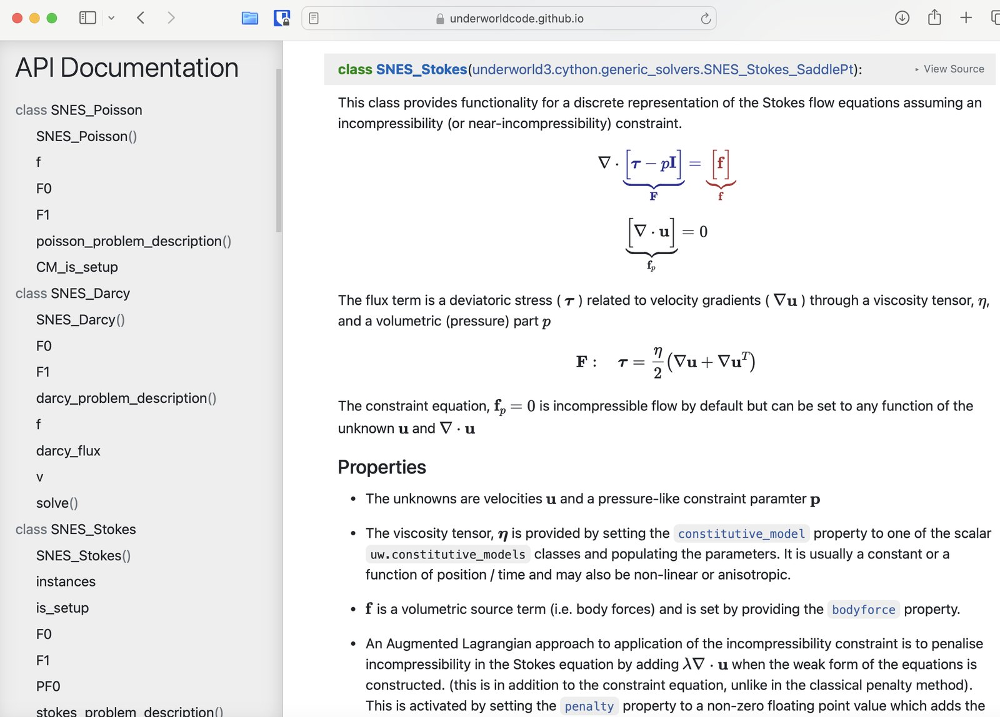

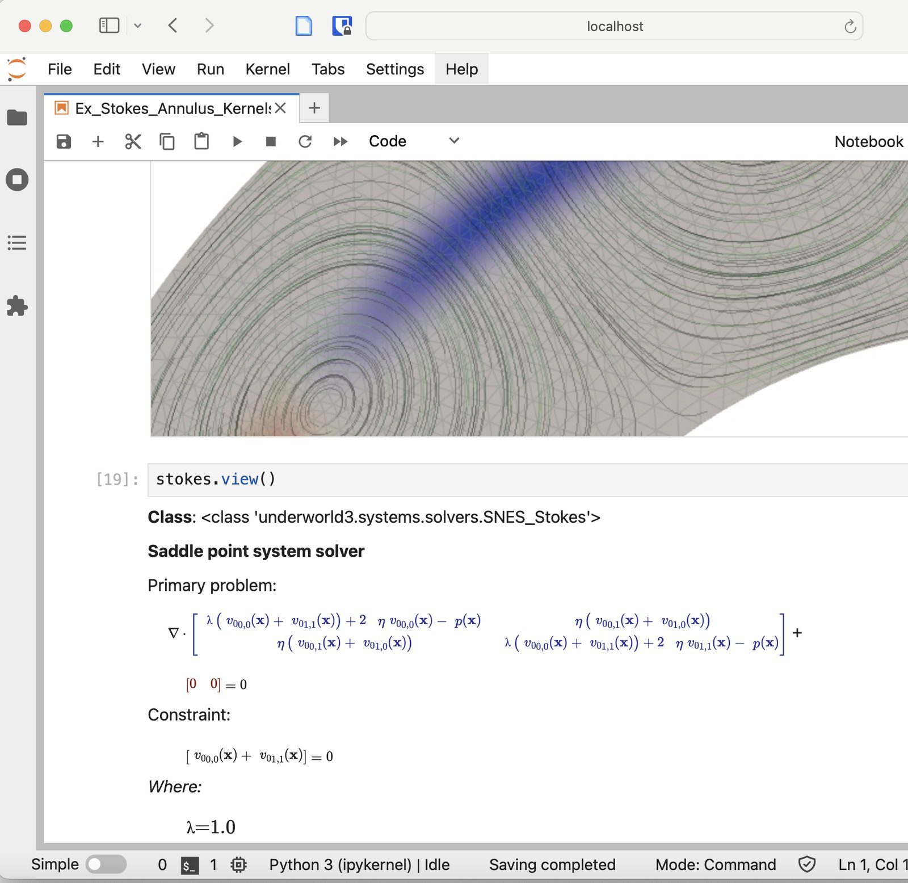

<--o-->

<!-- source: Curtin-May2025-PPT.pptx slide 17 · template: T1-prose -->
## Computational Motivation — reusable modeling for geodynamicists
Jupyter / Jupytext interactive development

GitHub
Zenodo
&c

Jupyter / Jupytext post-processing visualisation

qsub

Making extremely complex models easy enough to use and reuse (modify) that researchers in the geosciences can use them. Making these models efficient on 10s of thousands of cores.

<--o-->

<!-- source: Curtin-May2025-PPT.pptx slide 18 · template: T3-text-and-image -->
## Stress & Flow Models

Model description

Stress model: apply boundary velocity in orientation given by stress map.  Top is free to move. 200k - 400k 2nd  order simplex elements.
Faults are weak shear-zones defined by distance to an embedded surface. Each is a vertical curtain.
Flow models: Uniform source at the base, permeability by voting model: low from near-surface MT, high from near-surface MT, low from fault deformation, high from fault deformation.

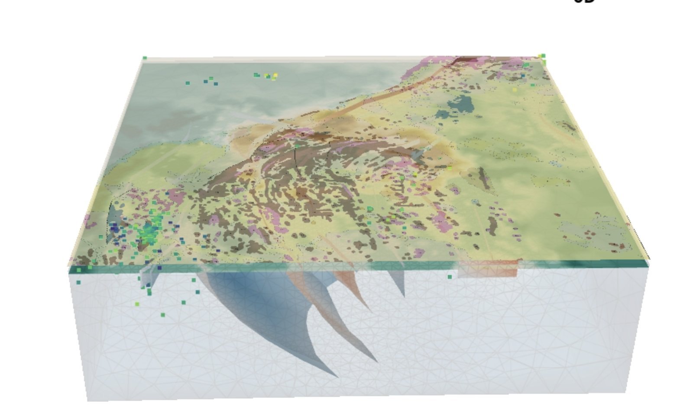

<--o-->

<!-- source: Curtin-May2025-PPT.pptx slide 19 · template: T6-two-image -->
## Progression

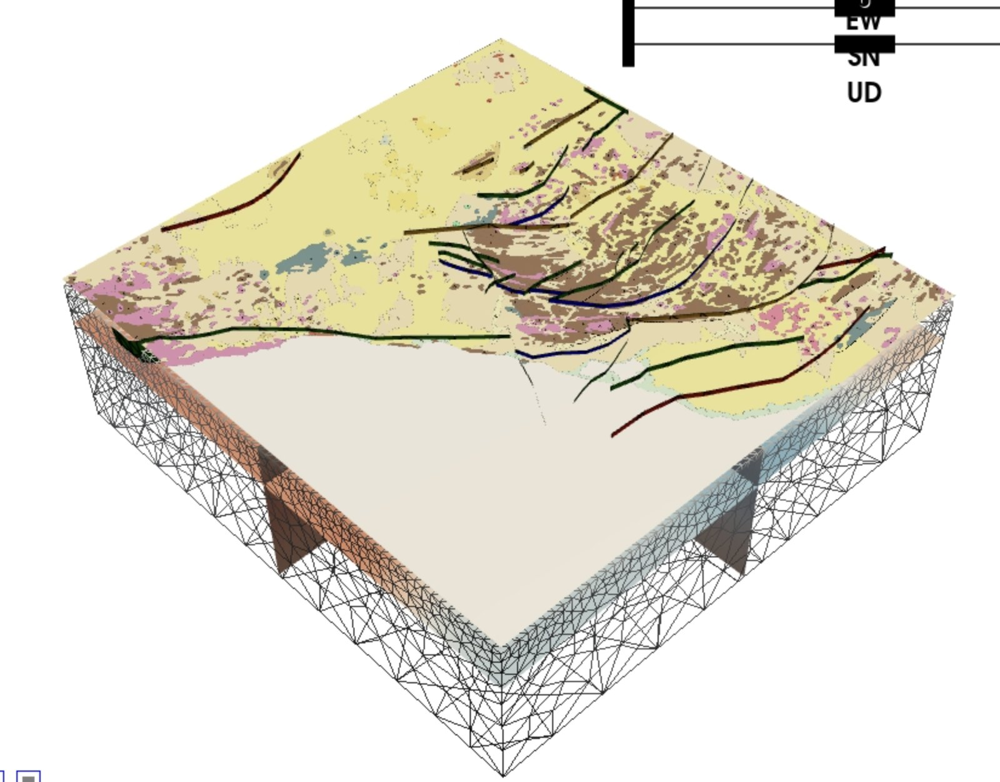

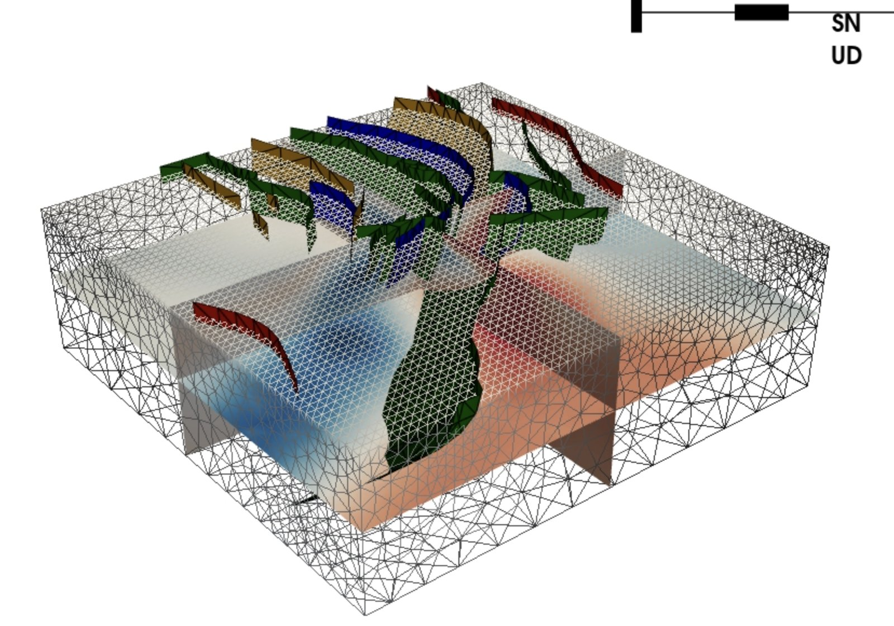

<--o-->

<!-- source: Curtin-May2025-PPT.pptx slide 20 · template: T6-two-image -->
## Progression

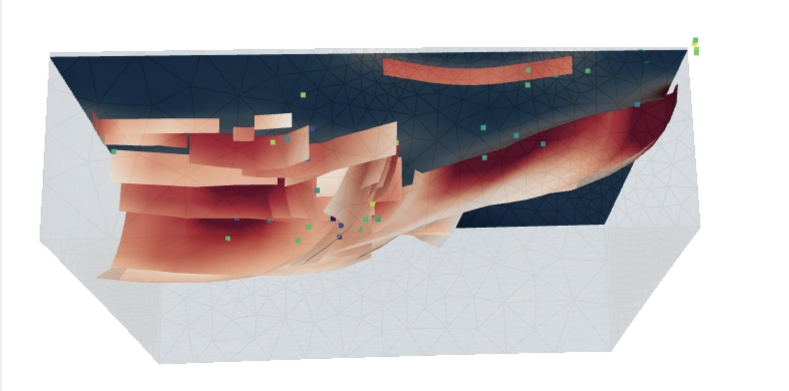

<--o-->

<!-- source: Curtin-May2025-PPT.pptx slide 21 · template: T6-two-image -->
## Progression

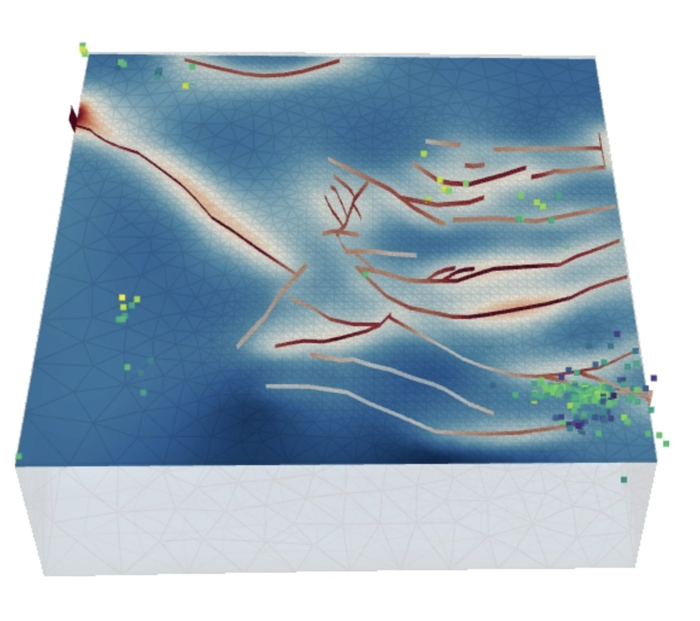

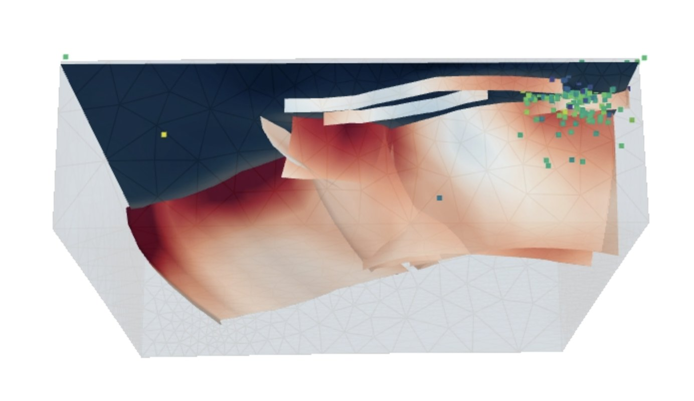

<--o-->

<!-- source: Curtin-May2025-PPT.pptx slide 22 · template: T6-two-image -->
## Progression

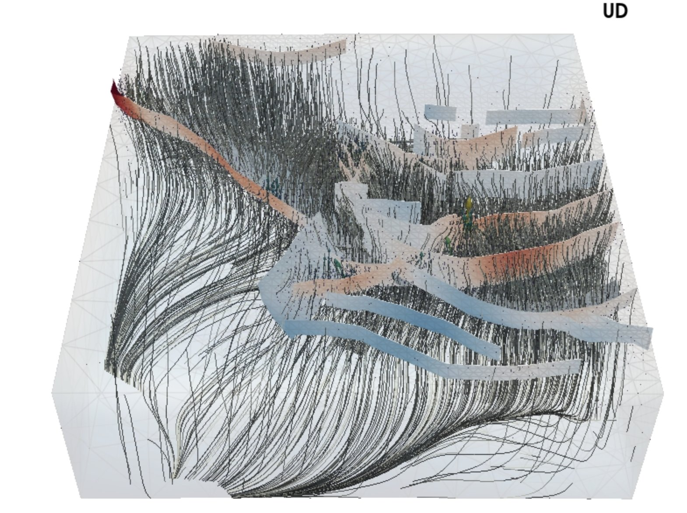

<--o-->

<!-- source: Curtin-May2025-PPT.pptx slide 23 · template: T6-two-image -->
## Progression

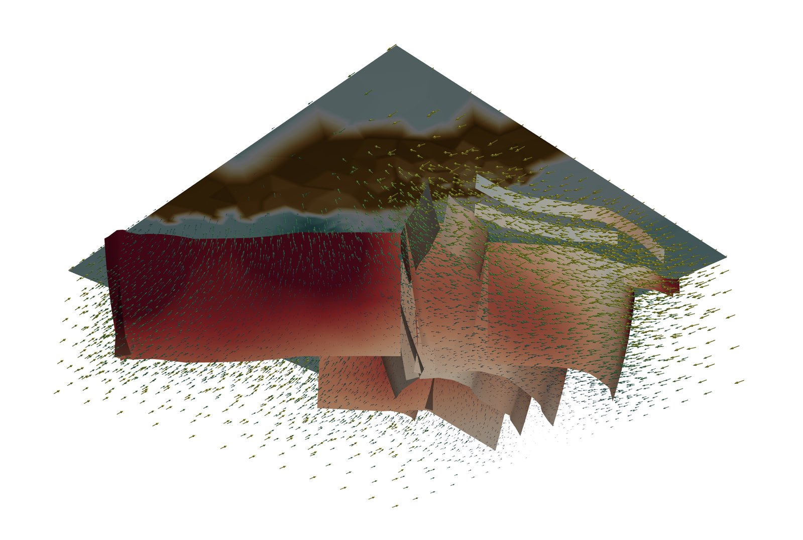

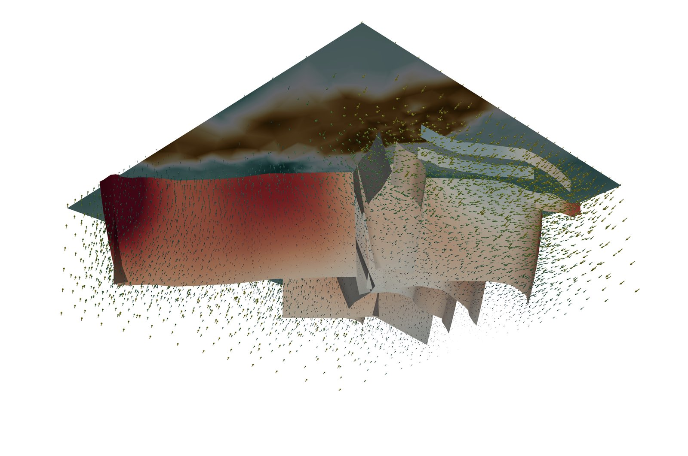

E-W stress orientation · NE-SW (30°) stress orientation

<--o-->

<!-- source: Curtin-May2025-PPT.pptx slide 24 · template: T1-prose -->
## Topological optimisation
Exploring Uncertainty

- Forward model (predict flow / stress etc) — here is a deformation model:
- $$\nabla ⋅\left[ \eta \left[ \nabla v+( \nabla v{)}^{T} \right] \right]- \nabla p+\beta (x)=0$$
- Where $\beta (x)$ is some sort of “design parameter” that controls the shape that we are going to vary. We then can solve a related problem
- $$\nabla ⋅\left[ \eta \left[ \nabla u+( \nabla u{)}^{T} \right] \right]- \nabla q+\beta (x)= \partial J/ \partial v$$
- $J$ is the optimisation “cost function” a.k.a. the misfit to the data e.g.
- $J=(v-{v} _ {0})⋅(v-{v} _ {0})$

Surface expression

Uncertainty at depth

<--o-->

<!-- source: Curtin-May2025-PPT.pptx slide 25 · template: T1-prose -->
## Topological optimisation
Exploring Uncertainty

Surface expression

Uncertainty at depth

Once we solve $v$ and $u$, we can compute things like
$\partial J/ \partial \beta$
which tells us how to adjust the design of the model ($\beta$) so that we improve the misfit to the data while moving from one valid solution of the model equations to another.
In topological optimisation, we combine $v$ and $u$ to tell us how to move the boundary of the shape described by $\beta$.
We can also see where the model does not vary when we change $\beta$ which is probably the most useful thing for us — in this we need to find other data which is sensitive to the change

<--o-->

<!-- source: Curtin-May2025-PPT.pptx slide 26 · template: T1-prose -->
## Topological optimisation
Exploring Uncertainty

Once we solve $v$ and $u$, we can compute things like
$\partial J/ \partial \beta$
which tells us how to adjust the design of the model ($\beta$) so that we improve the misfit to the data while moving from one valid solution of the model equations to another.
In topological optimisation, we combine $v$ and $u$ to tell us how to move the boundary of the shape described by $\beta$.
This probably feels a bit complicated but we can look at an example.

Surface expression

Uncertainty at depth

<--o-->

<!-- source: Curtin-May2025-PPT.pptx slide 27 · template: T3-text-and-image -->
## Topological optimisation

Engineering example

Adjust the shape of this loaded beam to minimise the weight of the component without compromising its strength.
Start from simple design and deform the circles (described by a “mask function”, $\beta$) to minimise the variation in stress (and the peak stress)

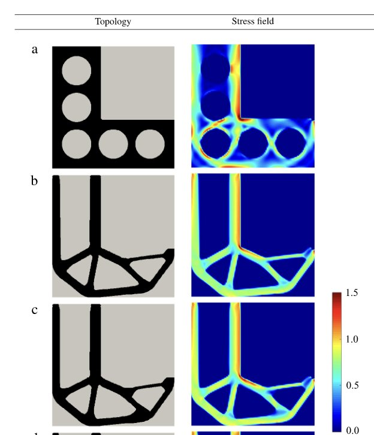

<--o-->

<!-- source: Curtin-May2025-PPT.pptx slide 28 · template: T6-two-image -->
## Topological optimisation

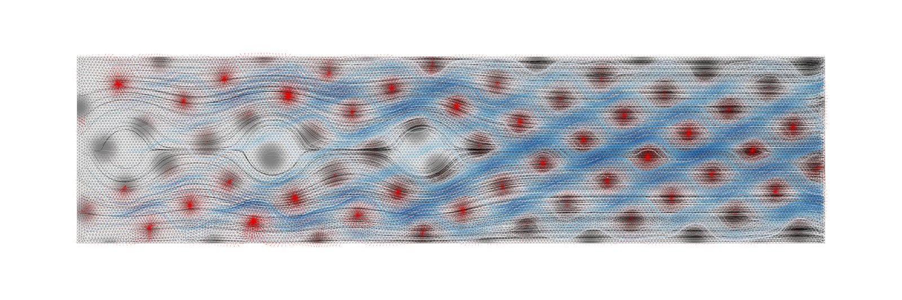

$V_{0}$ · $V_{0}$

Note:
Note: 
	- First change is to shrink the obstructions that should not be there
	- The method has trouble to remove obstructions in places there is not supposed to be any flow in the first place (the edges).

<--o-->

<!-- source: Curtin-May2025-PPT.pptx slide 29 · template: T3-text-and-image -->
## Topological optimisation

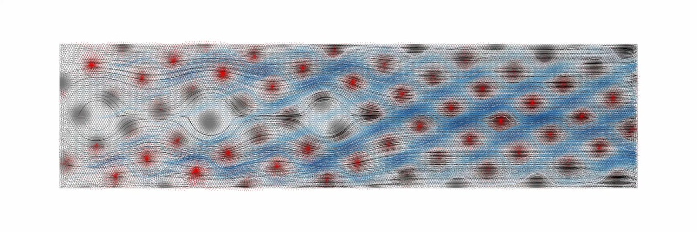
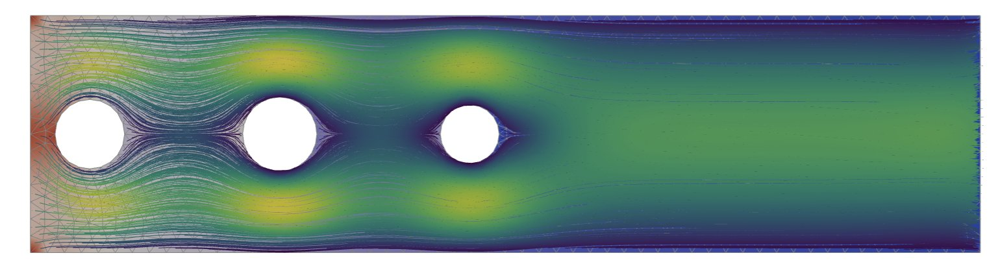

**${V}_{0}$**

**${V}_{0}$**

We evolve the interface(s) one step at a time, reducing the overall misfit. Topological optimisation perturbs the interface only if the misfit function can “see” the change

Note:
Note: only once the false obstructions are cleared away, can the method start to fill in the real ones.

<--o-->

<!-- source: Curtin-May2025-PPT.pptx slide 30 · template: T3-text-and-image -->
## Summary on pathways for Flow

Enhancing interpretation of geophysics  / geology with flow / stress models

Geological model / tomography model imaging (ambient noise seismology / MT)

<--o-->

<!-- source: Curtin-May2025-PPT.pptx slide 31 · template: T3-text-and-image -->
## Summary on pathways for Flow

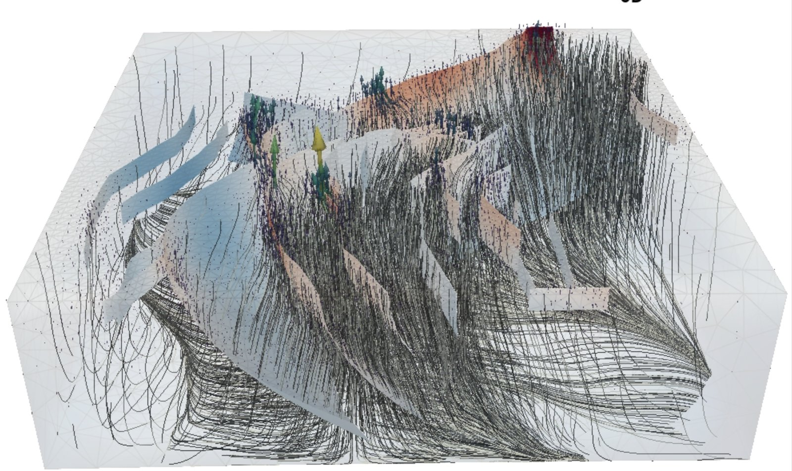

Enhancing interpretation of geophysics  / geology with flow / stress models

Flow model helps explore pathways from potential sources to traps — brings in stress field (uncertainty), 3D fault geometry (uncertainty), permeability projections (v. uncertain) …

<--o-->

<!-- source: Curtin-May2025-PPT.pptx slide 32 · template: T3-text-and-image -->
## Reproducibility & Reusability

“… if I have seen further, it is by standing on the shoulders of giants.”
Isaac Newton (1675) in a [passive- aggressive] letter to Robert Hooke

Really we are standing on the shells of others like ourselves (not giants at all). Precarious.

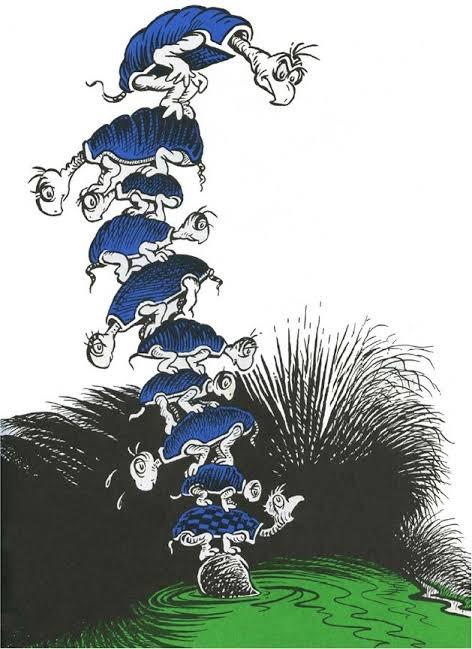

Note:
Yes, Isaac, but can’t we all contribute ?
We all know what happened to Yertle, or we can guess.

<--o-->

<!-- source: Curtin-May2025-PPT.pptx slide 33 · template: T0-title-or-other -->

<--o-->

<!-- source: Curtin-May2025-PPT.pptx slide 34 · template: T3-text-and-image -->
## Reproducibility & Reusability

You can’t be passive …

Give your code / data away !
Give out the “source code” for your papers
Give lots of simple examples as well as the clever stuff
Write good documentation
Make your software easy (for the right people) to understand
Be helpful !

<--o-->

<!-- source: Curtin-May2025-PPT.pptx slide 35 · template: T1-prose -->
## Towards Integrated Models
Discussion points !

Fault locations / orientations at depth
How to map MTT / ANT properties to permeability / porosity
How to map MTT / ANT properties to strength (e.g. basement v. basin fill) ?
What source distributions should we test ?

<--o-->

<!-- source: Curtin-May2025-PPT.pptx slide 36 · template: T1-prose -->
## Underworld + Loop3D
Import / vary fault geometry: Exploring uncertainty

Surface expression

Uncertainty at depth

Loop3D is a framework for building geological models that carry some measure of their uncertainty through a “structural” parameterisation.

<--o-->

<!-- source: Curtin-May2025-PPT.pptx slide 37 · template: T6-two-image -->
## Underworld + Loop3D

<--o-->

<!-- source: Curtin-May2025-PPT.pptx slide 38 · template: T1-prose -->
## Underworld + Loop3D
Import / vary fault geometry: Exploring uncertainty

Surface expression

Uncertainty at depth

Loop3D is a framework for building geological models that carry some measure of their uncertainty through a “structural” parameterisation.

<--o-->

<!-- source: Curtin-May2025-PPT.pptx slide 39 · template: T6-two-image -->
## Underworld + Loop3D

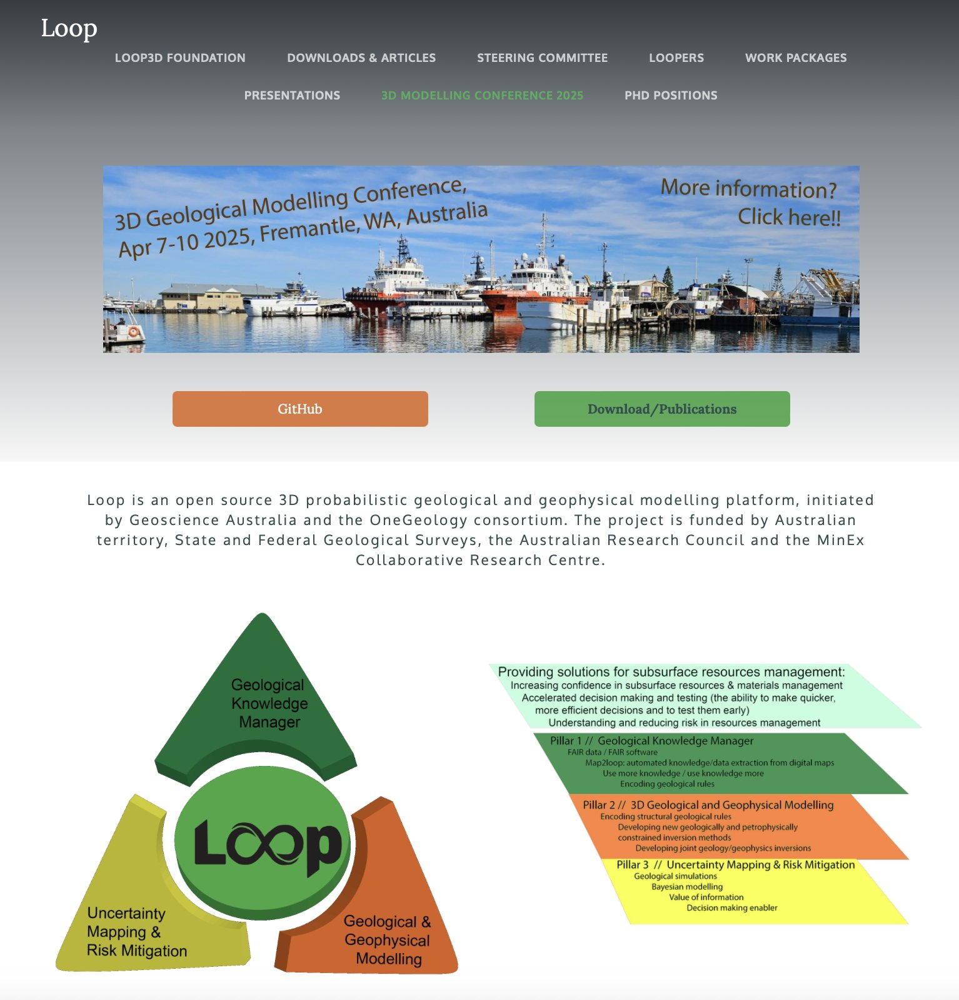

<--o-->

<!-- source: Curtin-May2025-PPT.pptx slide 40 · template: T4-full-figure -->
<!-- .slide: data-background="Module-iv-Hydrogen-extracted/slide040_img1.jpg" -->

<--o-->

<!-- source: Curtin-May2025-PPT.pptx slide 41 · template: T3-text-and-image -->
## Underworld + Loop3D

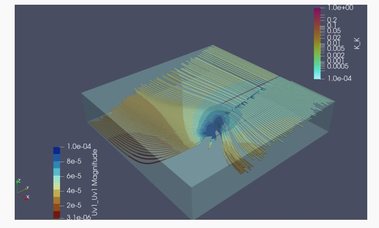
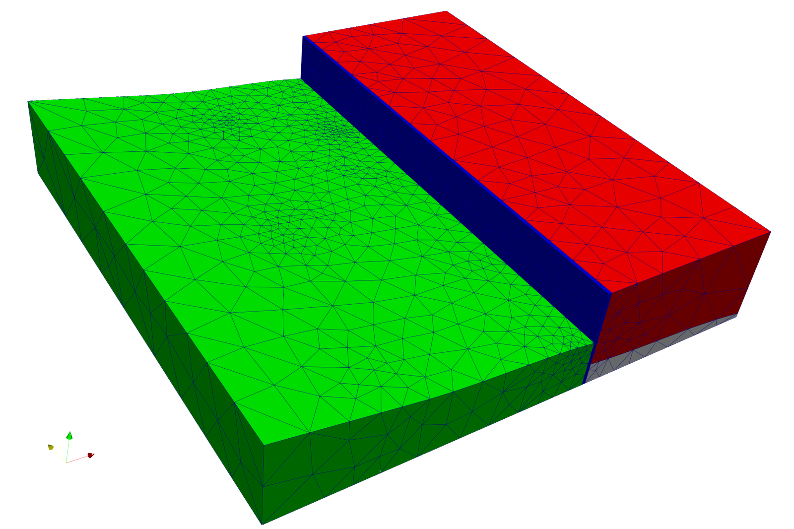
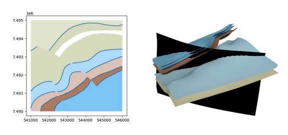

Monash / AuScope

