<!-- DO NOT REGENERATE: converted from Lecture6_Faults_Fault_Zones.pptx (2026-07), then hand-edited.
     This markdown is now the source of truth; re-running the pptx converter
     would overwrite that work. See tools/pptx2reveal/README.md. -->

<!-- source: Lecture6_Faults_Fault_Zones.pptx slide 1 · template: T-title -->
# EMSC 3002

## Module 4 - Faults and fault zones

  - Louis Moresi (convenor)
  - Chengxin Jiang (lecturer)
  - Romain Beucher (former lecturer)
  - Stephen Cox (curriculum advisor)

Australian National University

<small>Reading these on your own? Press **O** for the overview, and **&darr;** as well as **&rarr;** &mdash; some slides sit below this one. <a href="../lecture-1-introduction/#navigating-the-slides" target="_blank" rel="noopener">How to navigate the slides</a></small>

<--o-->

<!-- source: Lecture6_Faults_Fault_Zones.pptx slide 2 · template: T-resources -->
## Resources

<--o-->

<!-- ILO placeholder — not in the pptx; fill in -->
## What you will learn in this module

<!-- TODO: add what you will learn in this module -->

<--o-->

<!-- source: Lecture6_Faults_Fault_Zones.pptx slide 3 · template: T4-full-figure -->
<!-- .slide: data-background="Module-iv-Brittle-Deformation/Lecture6-extracted/slide003_img1.jpg" -->

<--o-->

<!-- source: Lecture6_Faults_Fault_Zones.pptx slide 4 · template: T6-two-image -->
## Fracture Vs. Fault

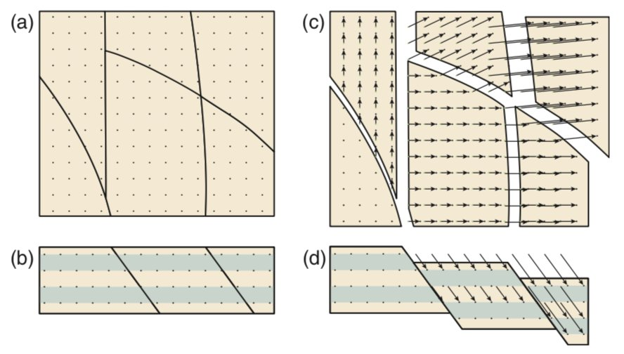 <!-- .element style="width:92%;" -->

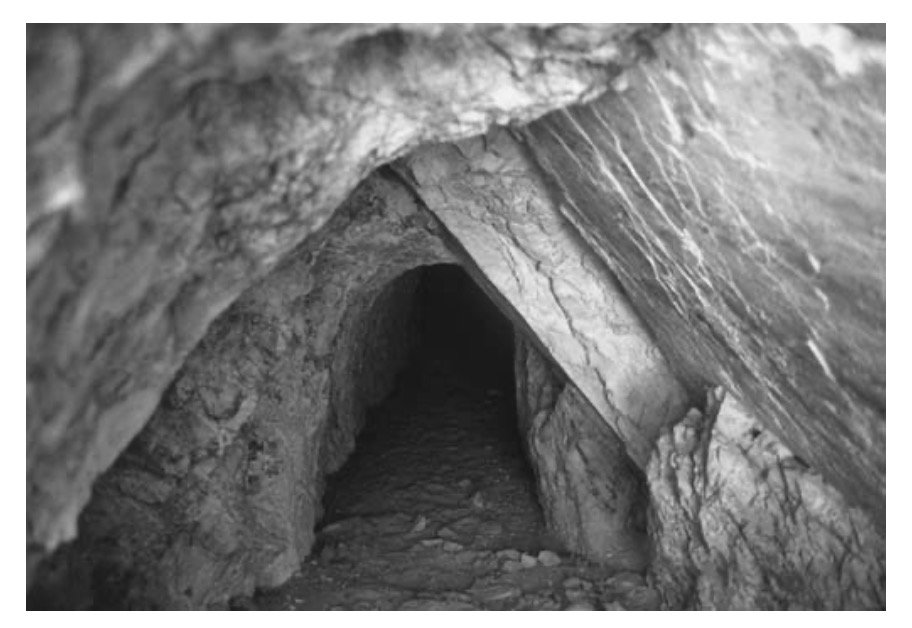 <!-- .element style="width:76%;" -->

Fossen, 2011 · Davis et al, 2012

Note:
Figure on the left: Faults appear as discontinuities on velocity or displacement field maps and profiles. The left blocks in the undeformed map (a) and profile (b) are fixed during the deformation. The result is abrupt changes in the displacement field (arrows) across faults. 

Northwest-directed photograph in the Hattie Green mine. This tunnel was “driven” along a mineralized fault zone. The smooth rock surface in the right foreground is a fault surface that dips to the right (i.e., northeastward). The straight- line trace of a second, parallel fault is quite evident right above the tunnel. Hanging wall rocks lie above the fault surface. Footwall rocks lie beneath the fault surface. Sarah Tindall showed me this mine, located in southern Utah along the East Kaibab monocline. The mine lies within the Fivemile Valley 7.5-minute topographic quadrangle.

<--o-->

<!-- source: Lecture6_Faults_Fault_Zones.pptx slide 5 · template: T3-text-and-image -->
## Faults Across Scales

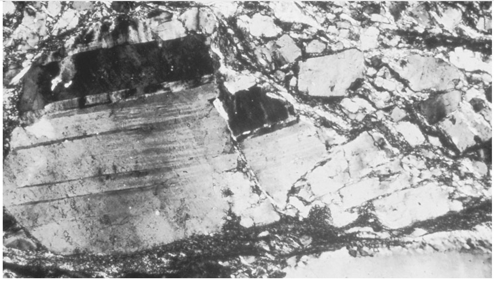

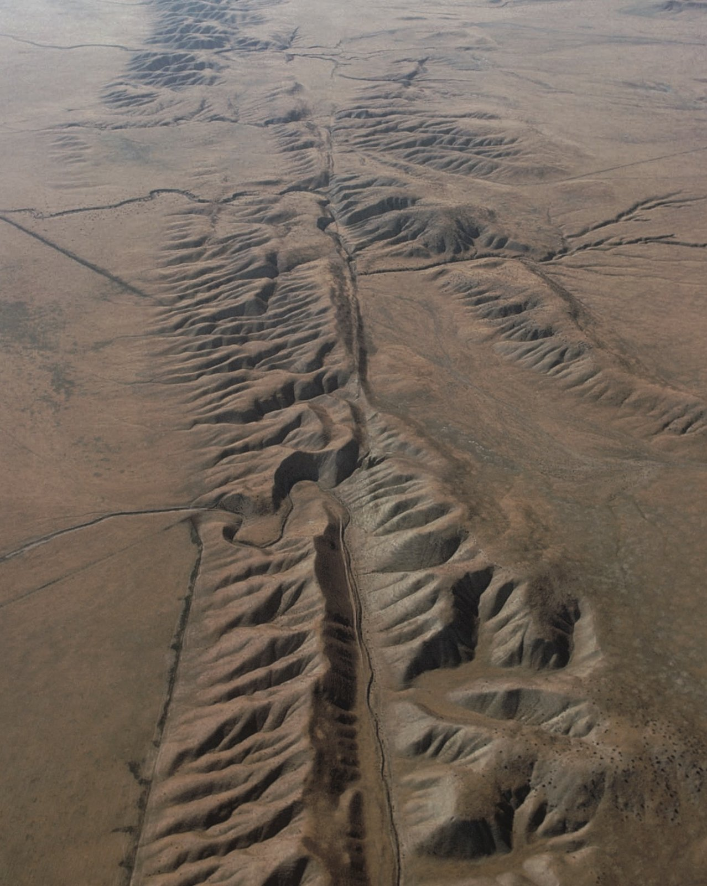

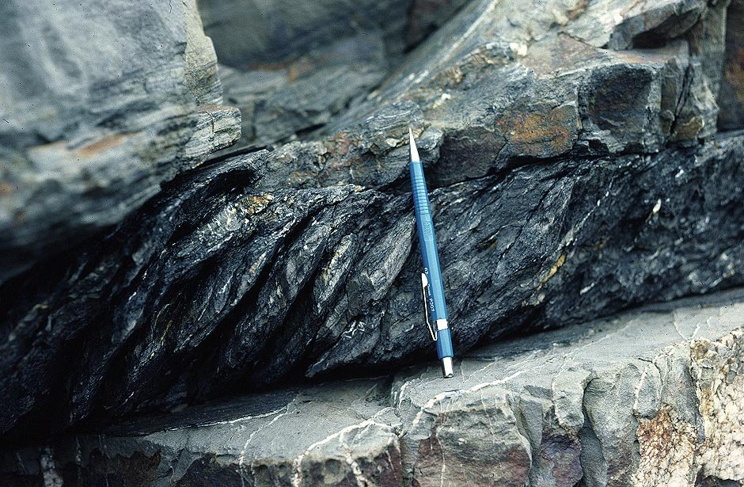

Jim Talbot · Haakon Fossen · Microscopic · Macroscopic · Mesoscopic · van der Pluijm & Marshall (2003) · 130 m offset over 3700 years

&nbsp;

Note:
Figure on the top left: Microscopic faults, showing fractured and displaced feldspar grains.
Figure on the bottom left: duplex with 8 horses, Widemouth Bay, Devon

Aerial view of the San Andreas fault in the Carrizo Plain, Central California, looking south. Note the sudden change in course of the stream channel, consistent with 130 meters of dextral (right-lateral) movement accumulated by earthquakes on this famous strike-slip fault over the last $3700 years.35N, 119.7W.

<--o-->

<!-- source: Lecture6_Faults_Fault_Zones.pptx slide 6 · template: T3-text-and-image -->
## Fault Terminology

Hanging wall – rock body above fault plane (wall)
Footwall – rock body below a fault plane
Net slip vector – connects two formerly adjacent points (strike-slip and dip-slip components)
Rake (pitch) – the angle between the strike of the slip surface and the slip vector
Throw – apparent vertical displacement; or the vertical component of dip separation.
Heave – apparent horizontal displacement; or the horizontal component of dip separation.
Ramps & flats: alternating steep and subhorizontal portions of any fault surface.

van der Pluijm & Marshall (2003)

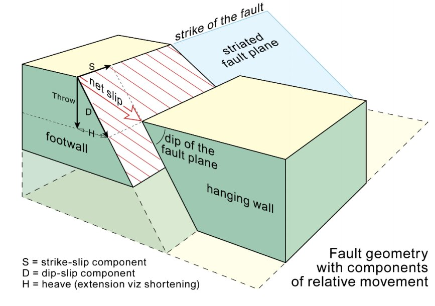

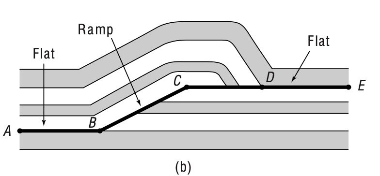

JPB (2020)

<--o-->

<!-- source: Lecture6_Faults_Fault_Zones.pptx slide 7 · template: T3-text-and-image -->
## Three Major Types of Faults

- Normal Faults: the hanging wall is lowered or downthrown relative to the footwall.
- Reverse Faults: the hanging wall is upthrown relative to the footwall.
- Strike-slip faults: movement is lateral in the horizontal plane (sinistral: left-lateral; dextral: right-lateral).

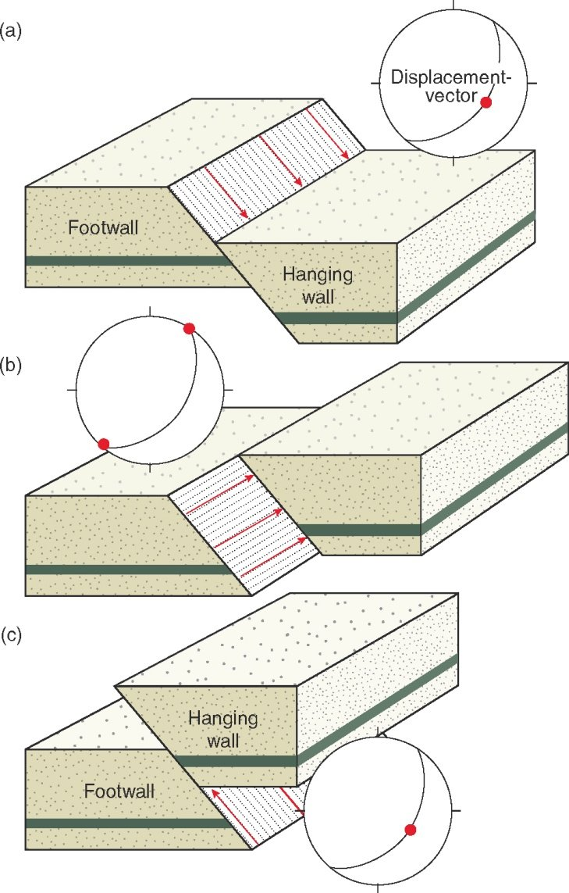 <!-- .element style="width:86%;" -->

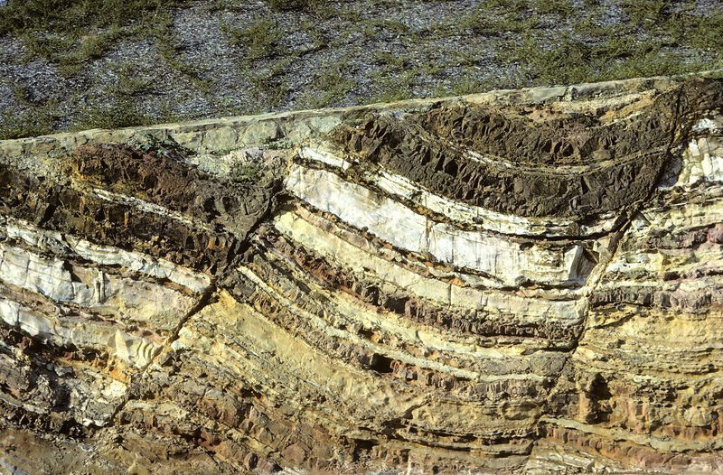

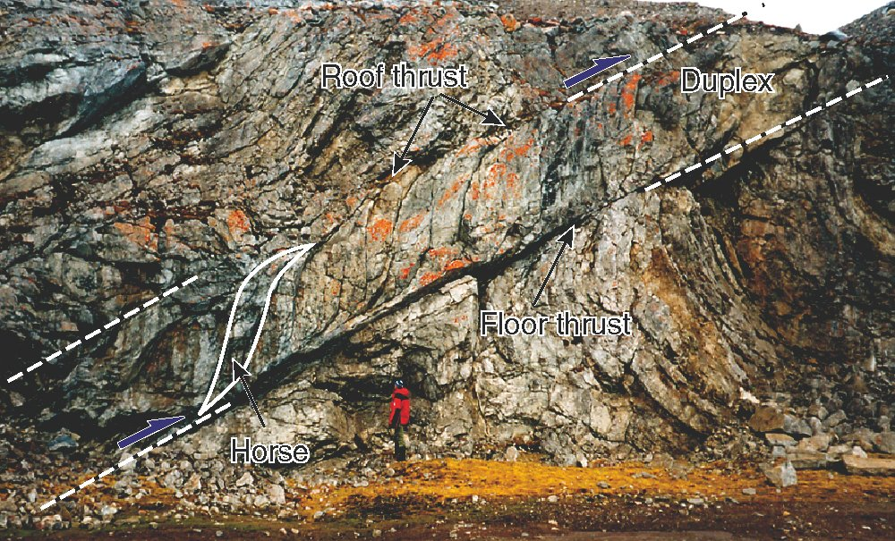

(I) · (II) · (III) · Fossen, 2011

Note:
Normal faults in Camp Hill Sandstone (middle Silurian) near the Parliament House in Canberra, Australia.
Figure on the right: Duplex structure in dolomitic sandstones, Svalbard, Photo Steffen Bergh

<--o-->

<!-- source: Lecture6_Faults_Fault_Zones.pptx slide 8 · template: T3-text-and-image -->
## 1999 MW 7.6 IZMIT, TURKEY

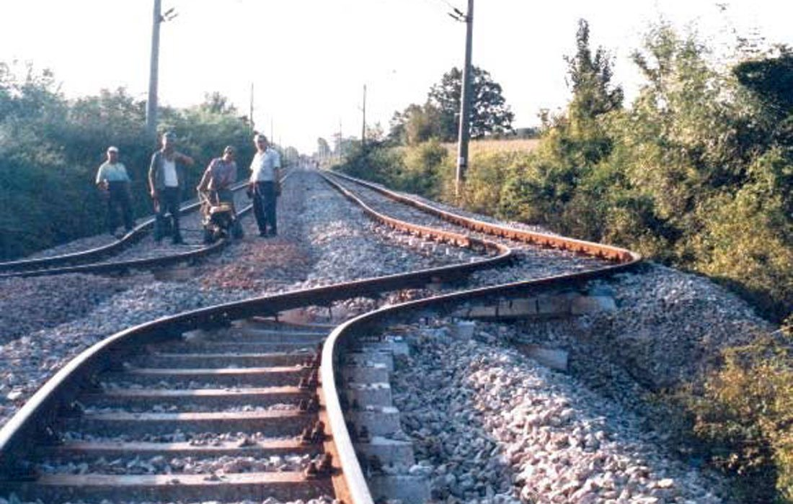

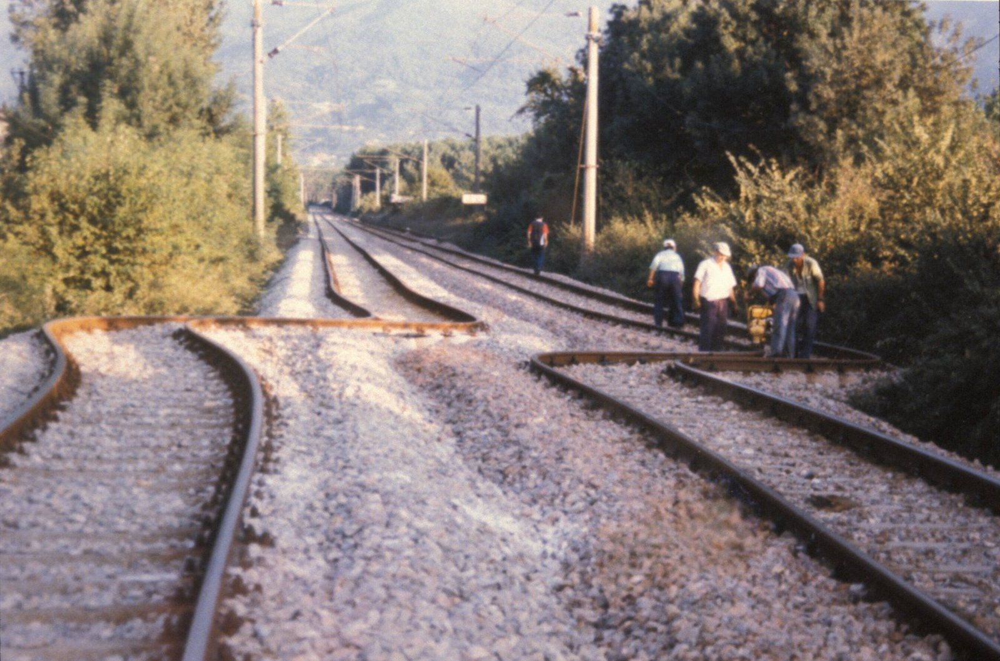

=> Displacement does not dependent on which side of the fault you are standing on

- Aug 17, 1999, in NW Turkey
- Killed >17,000 people
- It caused a 120 km surface rupture, with right lateral offsets of 1.5-5 m.

<--o-->

<!-- source: Lecture6_Faults_Fault_Zones.pptx slide 9 · template: T3-text-and-image -->
## 2010 MW 7.1 CANTERBURY, NEW ZEALAND

- Sep 4, 2010, in the Canterbury region (~40 km west of Christchurch)
- It caused about 30 km surface rupture, with a maximum slip of 5.3 m.
- The Mw 6.3 aftershock of Christchurch earthquake killed 185 people.

GNS Science

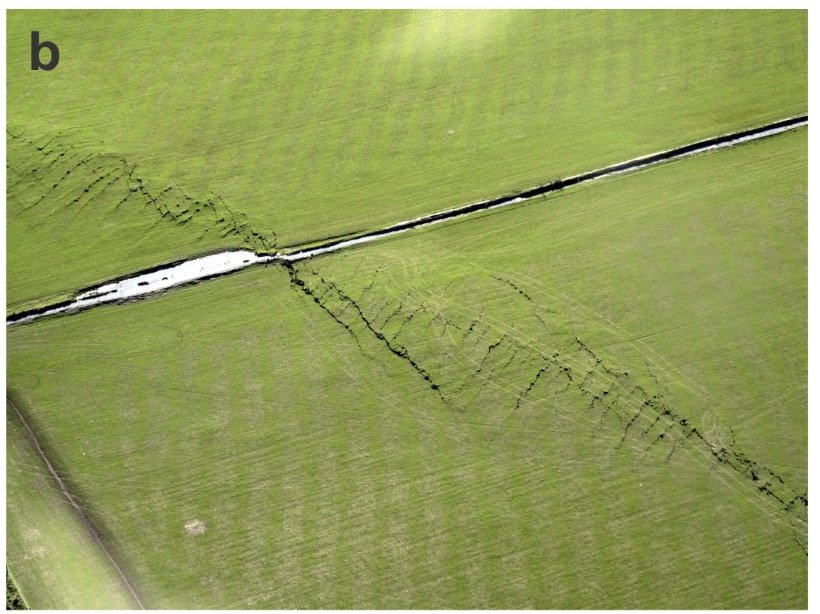

Note:
Two residents were seriously injured, one by a collapsing chimney and a second by flying glass.[6][11] One person died of a heart attack suffered during the quake, although this could not be directly linked to the earthquake.

<--o-->

<!-- source: Lecture6_Faults_Fault_Zones.pptx slide 10 · template: T3-text-and-image -->
## 2010 MW 7.1 CANTERBURY, NEW ZEALAND

- Sep 4, 2010, in the Canterbury region (~40 km west of Christchurch)
- It caused about 30 km surface rupture, with a maximum slip of 5.3 m.
- The Mw 6.3 aftershock of Christchurch earthquake killed 185 people.

R & R’ shears

GNS Science

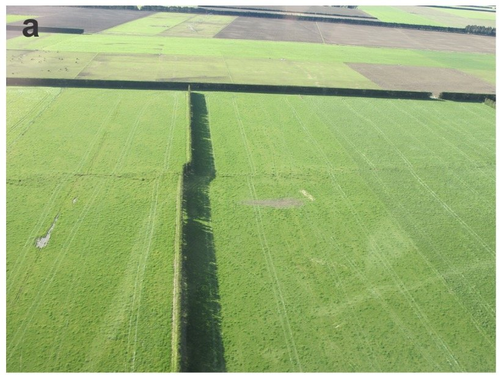

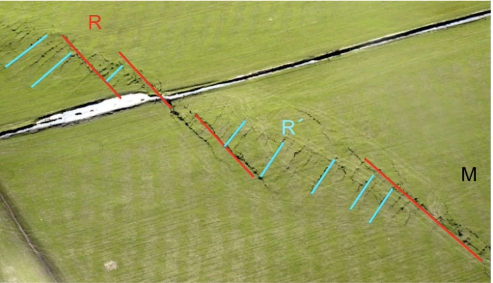

Note:
Two residents were seriously injured, one by a collapsing chimney and a second by flying glass.[6][11] One person died of a heart attack suffered during the quake, although this could not be directly linked to the earthquake.

<--o-->

<!-- source: Lecture6_Faults_Fault_Zones.pptx slide 11 · template: T6-two-image -->
## Fault Classification by Slip

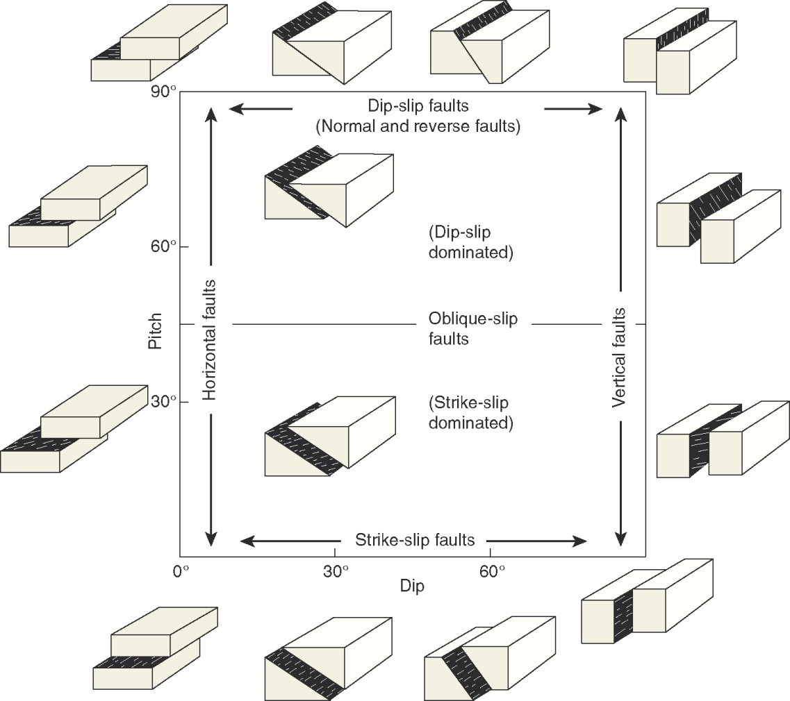

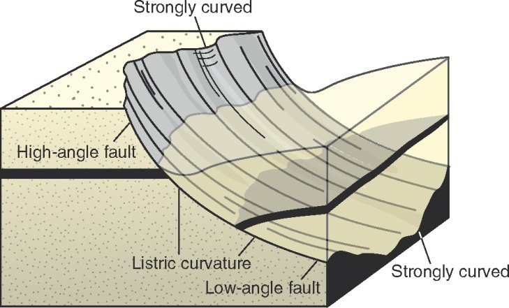 <!-- .element style="width:66%;" -->

Dip · Pitch · Fossen, 2011

Note:
The horizontal axis is the dip angle; the vertical axis is the pitch angle. The pitch is confined in  It defines a region dominant displaced as oblique-slip faults (10-80 degrees).

<--o-->

<!-- source: Lecture6_Faults_Fault_Zones.pptx slide 12 · template: T3-text-and-image -->
## Quiz:

Davis and Reynolds, (2011) · Davis et al., 2012

- What type of fault is this?
- Fault surface
- Hanging wall
- Foot wall
- What offset marker to use?

<--o-->

<!-- source: Lecture6_Faults_Fault_Zones.pptx slide 13 · template: T3-text-and-image -->
## Quiz:

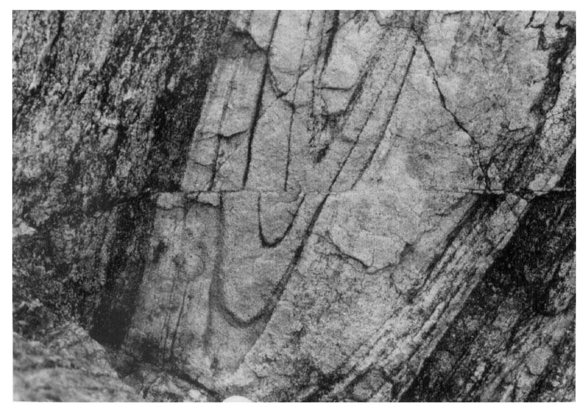

Davis and Reynolds, (2011) · Davis et al., 2012

- What type of fault is this?
- Fault surface
- Hanging wall
- Foot wall
- What offset marker to use?

Note:
Definition of Piercing point.

<--o-->

<!-- source: Lecture6_Faults_Fault_Zones.pptx slide 14 · template: T3-text-and-image -->
## Fault Separation

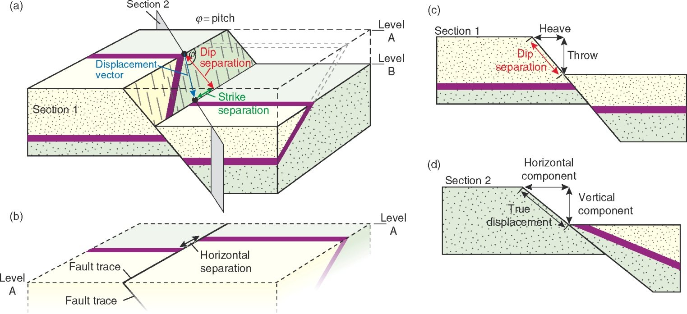

Fossen, 2011

- The interaction of structure (e.g., orientation) and topography (including expose) and by the absence of minor structures complicates the interpretation of fault slip
- Separation is the offset observed along faults in 2D views of outcrops, or geologic cross-sections. It refers only to the apparent sense and magnitude of offset along faults.

Note: fault trace = the intersection line of the fault plane and the section line/ surface

Note:
Slip is fully determined when we know for individual faults, and for the whole faulted body, the magnitude of displacement, the direction of dis- placement, and the sense of displacement. 

Difficult of find the movement in practical case: due to erosion, different angle of cross section, structural burial

<--o-->

<!-- source: Lecture6_Faults_Fault_Zones.pptx slide 15 · template: T3-text-and-image -->
## Fault Separation in 3D

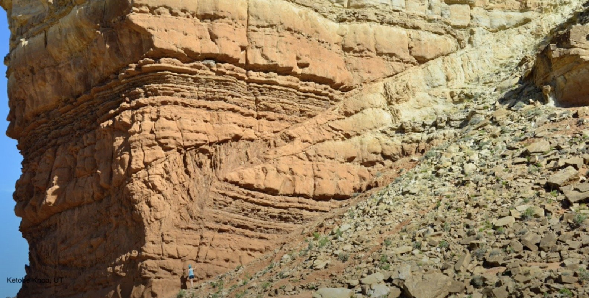

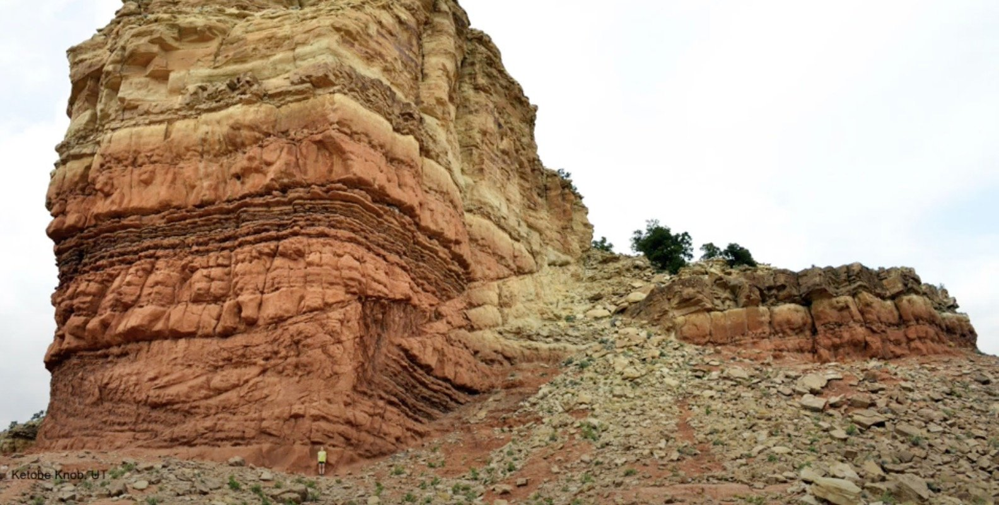

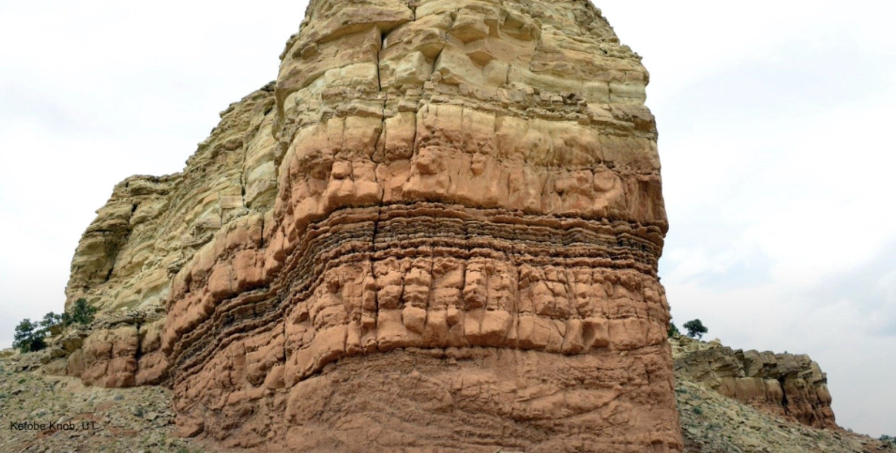

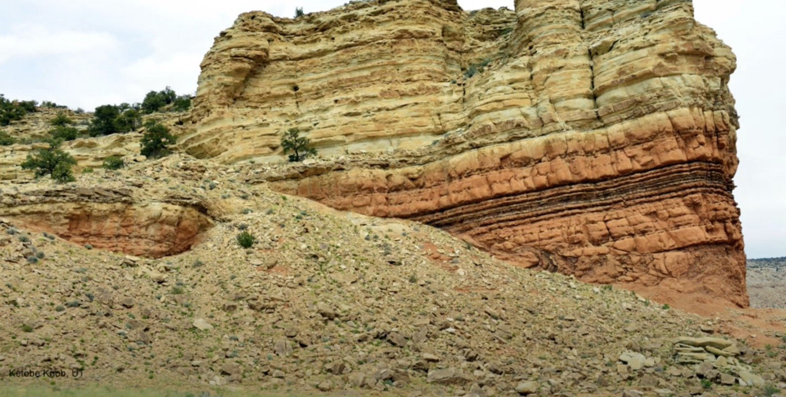

Haakon Fossen

<--o-->

<!-- source: Lecture6_Faults_Fault_Zones.pptx slide 16 · template: T3-text-and-image -->
## Fault Vs. Fault Zone

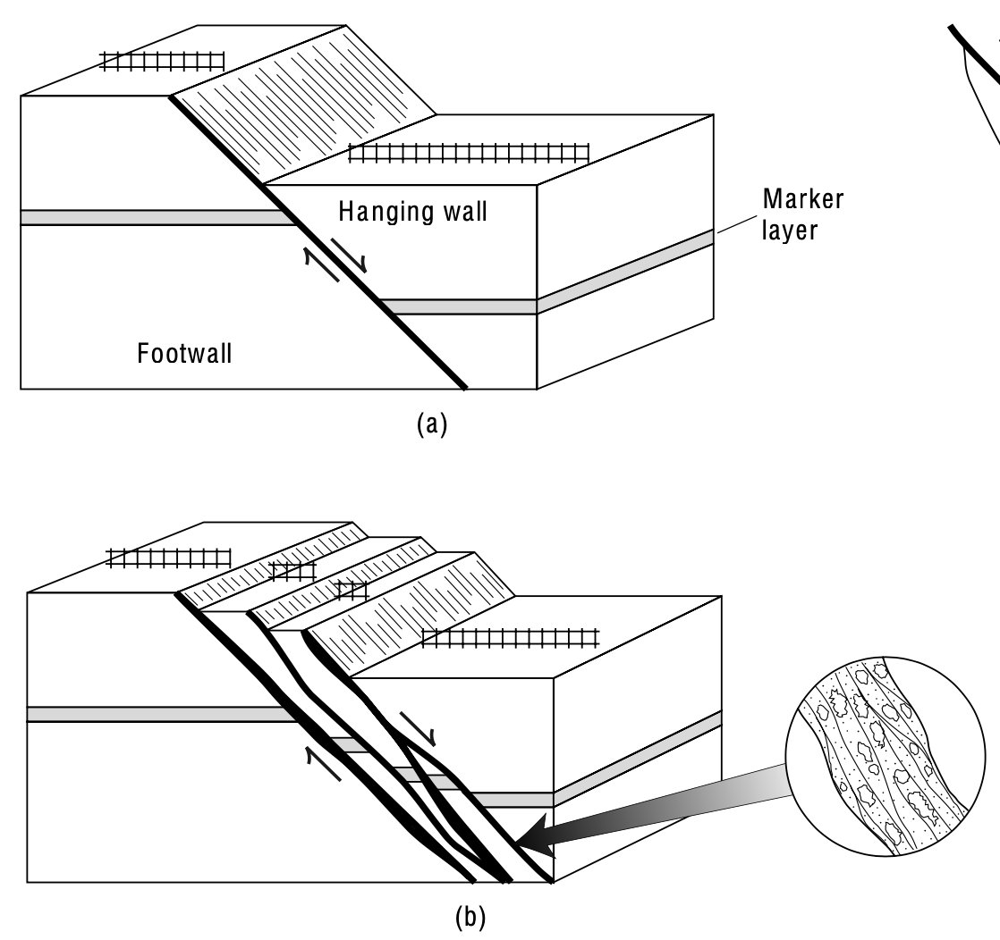

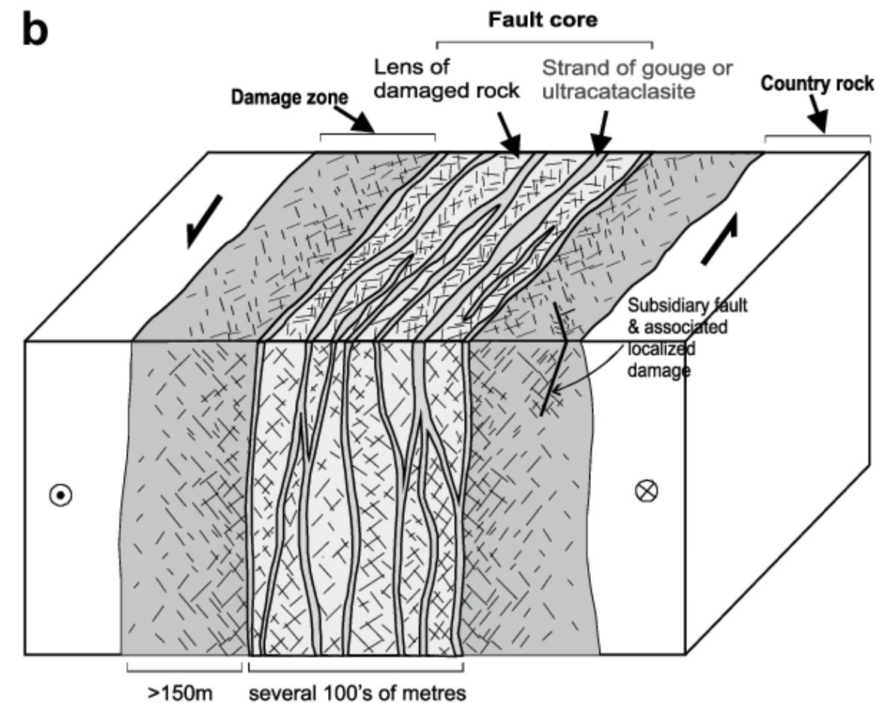

Faulkner et al. (2003)

- Fault zones consist of numerous closely spaced and subparallel fault surfaces, commonly separating masses of broken rock.
- The width of the fault zone can range from centimeters or meters in the field to the order of a kilometer.

van der Pluijm & Marshall (2003)

Note:
Carboneras fault zone, SE Spain: a complex strike-slip fault with several anastomosing slip surfaces separating “islands” of damaged wall rock

<--o-->

<!-- source: Lecture6_Faults_Fault_Zones.pptx slide 17 · template: T3-text-and-image -->
## Fault Zone

- Fault core is the central slip surface of a fault zone, and it separates from the brittlely deformed wallrock known as fault damage zone.
- The damage zone shows a density of brittle deformation higher than the background levels. Structures in this zone include deformation bands, shear fractures, tensile fractures and stylolites.
- .

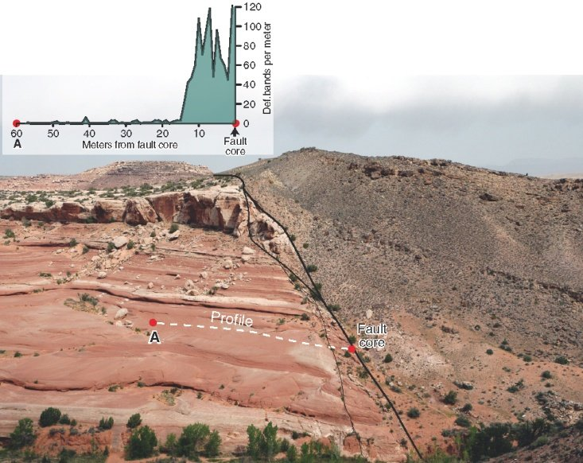 <!-- .element style="width:94%;" -->

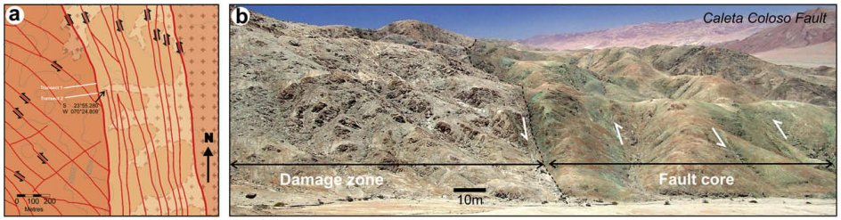

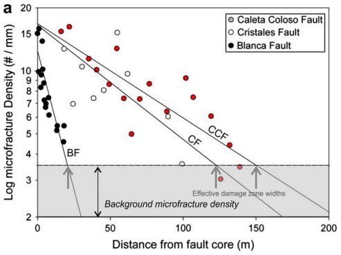

To be improved · Mitchell and Faulkner, 2009 · Fossen, 2011

Note:
Damage zone in the footwall to a normal fault with 150–200 m throw. The footwall damage zone is characterized by a frequency diagram with data collected along the profile line. A fault lens is seen in the upper part of the fault. Entrada Sandstone near Moab, Utah.

<--o-->

<!-- source: Lecture6_Faults_Fault_Zones.pptx slide 18 · template: T3-text-and-image -->
## Fault Zone Structures

- A general positive correlation between fault displacement and the thickness of both damage zone and fault core.
- A fault core has several major characteristics:
- Brittle fault rocks: when fault movements alter the original rock sufficiently it is turned into a brittle fault rock, including fault breccia, gouge, pseudotachylyte and cataclasite.
- Slickenslides and slip lineations: good indicator of shear sense
- Fault-related folding → drag

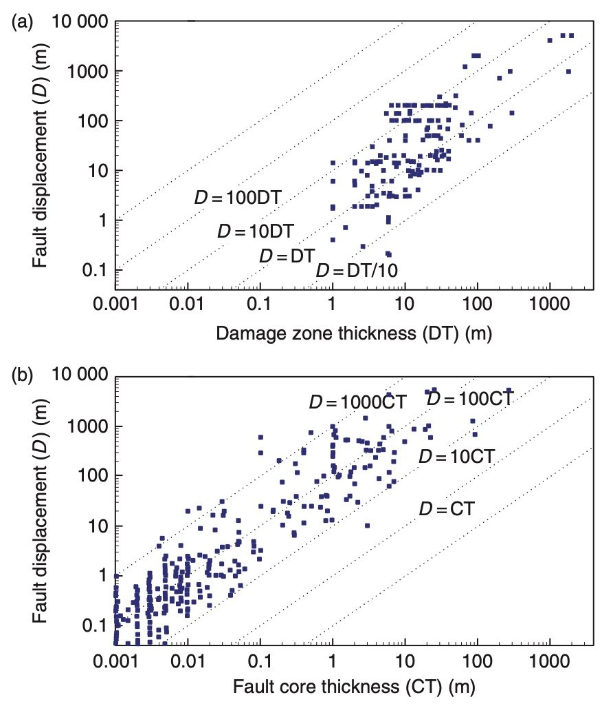

To be improved · Fossen, 2011

Note:
The ratio between fault displacement D and damage zone thickness DT is the same for any fault size, and the distance between adjacent lines in this figure represents one order of magnitude. Much of the data in Figure 8.12a plot around or above the line D=DT, meaning that the fault displacement is close to or some- what larger than the damage zone thickness, at least for faults with displacements up to 100 meters. 

A similar relationship exists between fault core thick- ness (CT) and fault displacement. This relationship is constrained by the straight lines D = 1000CT and D =10CT, meaning that the fault core is statistically around 1/100 of the fault displacement for faults with displacements up to 100 meters.

<--o-->

<!-- source: Lecture6_Faults_Fault_Zones.pptx slide 19 · template: T3-text-and-image -->
## Fault Breccia

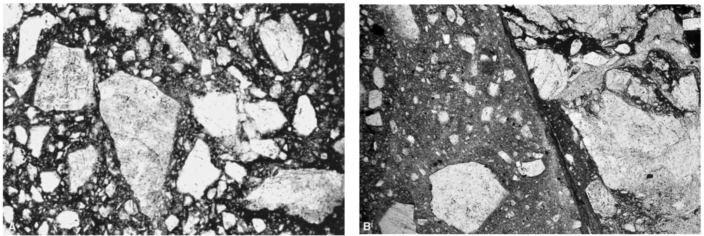

Davis et al., 2012

- It is an unconsolidated fault rock consisting of angular fragments of rock > 1mm.
- Dilation and volume increase are characteristic of brecciation, implying breccias forms in low confining pressure and/or high fluid pressure conditions.

Photomicrograph of microbreccia in granite. ~4mm wide.

Same microbreccia but with a discrete slip surface

<--o-->

<!-- source: Lecture6_Faults_Fault_Zones.pptx slide 20 · template: T6-two-image -->
## Fault Gouge

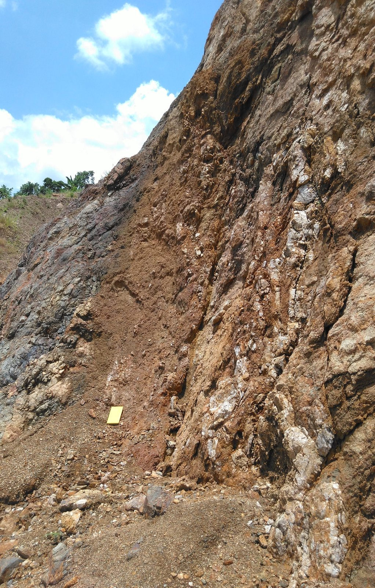 <!-- .element style="width:71%;" -->

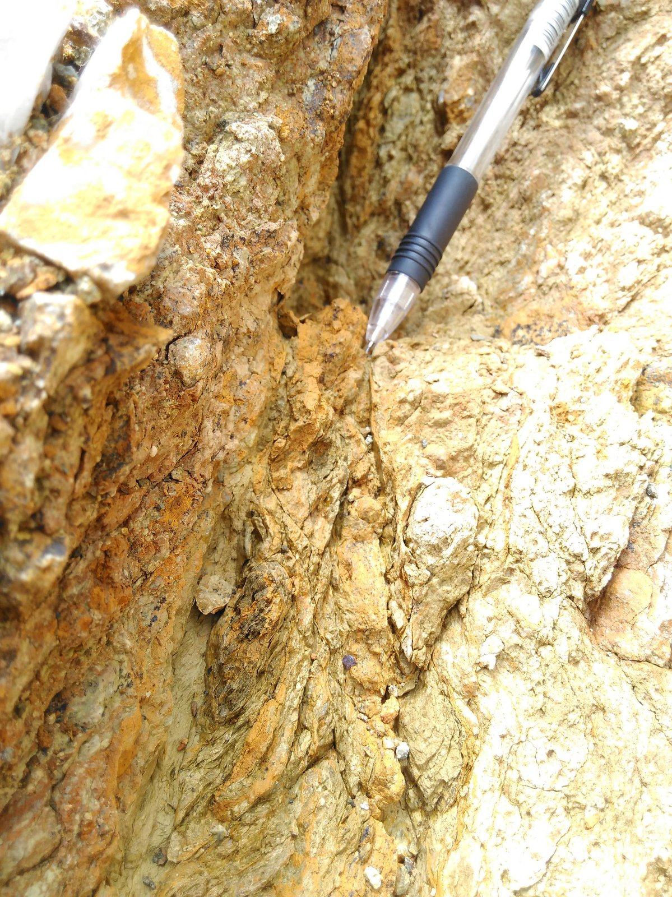 <!-- .element style="width:71%;" -->

<--o-->

<!-- source: Lecture6_Faults_Fault_Zones.pptx slide 21 · template: T3-text-and-image -->
## Fault Gouge

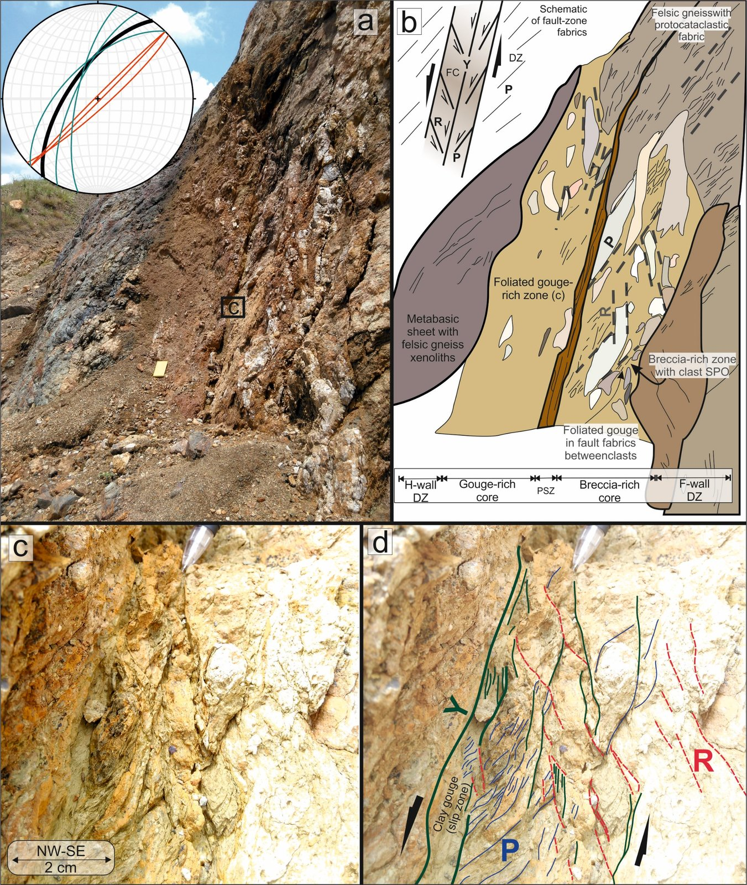 <!-- .element style="width:93%;" -->

- Much finer grains (< 1mm)
- High-angle normal fault developed along the contact between metabasic and felsic gneiss, western Uganda
- Development of foliated clay gouge in principle slip zone – no clay minerals in the protolith = fluid rock interaction in core

<--o-->

<!-- source: Lecture6_Faults_Fault_Zones.pptx slide 22 · template: T3-text-and-image -->
## Pseudotachylyte

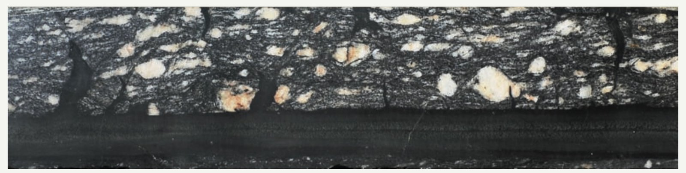

Mylonitic gneiss · Pseudotachylyte · Pseudotachylyte injection veins · Fossen, 2011

- Pseudo-, means “like”; tachylyte is a type of volcanic glass. But pseudotachylyte has nothing to do with volcanos.
- Its formation requires a powerful shock under very high-pressure conditions and an instantaneously imposed strain. The frictional heating of faulting causes the already hot rocks to melt and occurs typically deeper than 4 km.
- Pseudotachylite occurrences are in essence fossil records of deep earthquakes (Sibson, 1980).

<--o-->

<!-- source: Lecture6_Faults_Fault_Zones.pptx slide 23 · template: T3-text-and-image -->
## Cataclasites

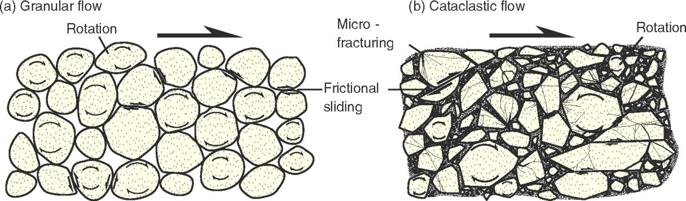

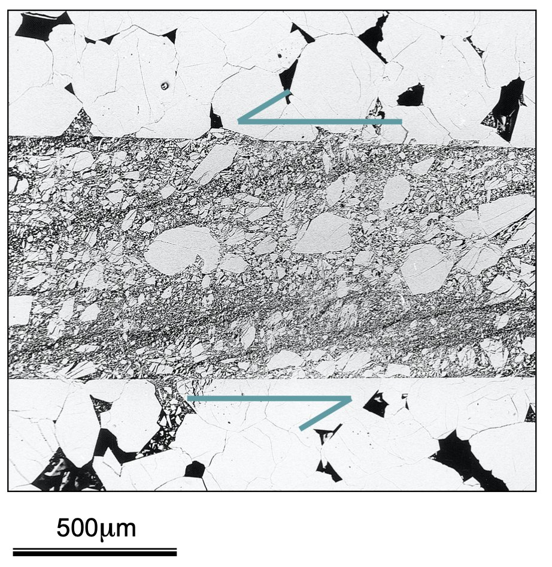

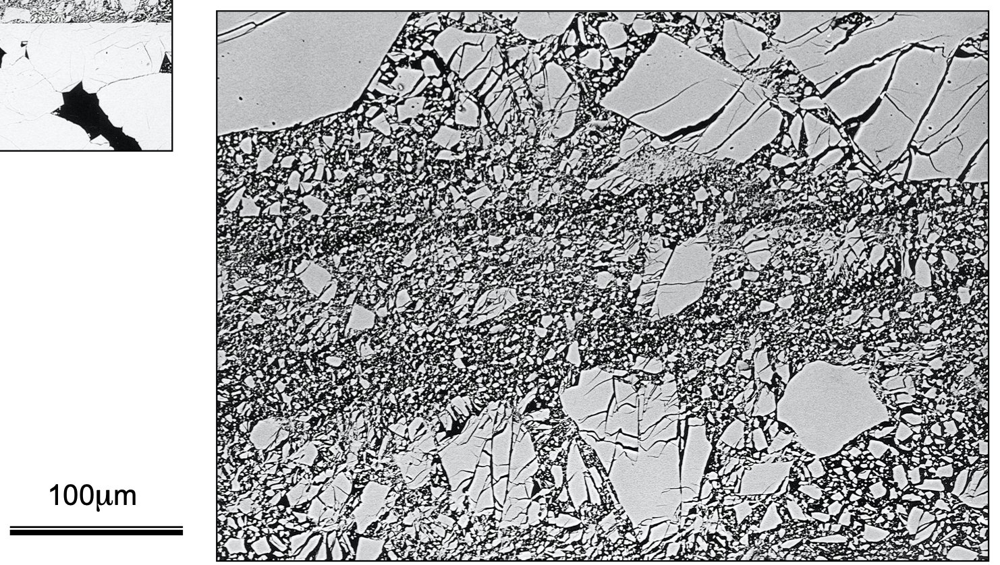

- Cataclasite are produced by faulting under conditions of higher confining pressure and temperature that reside at depths of 4 to 8 km.
- Characterized by cataclastic flow: grain fragmentation, rotation, crushing and localized shear bands.

Images: Stephen Cox

<--o-->

<!-- source: Lecture6_Faults_Fault_Zones.pptx slide 24 · template: T3-text-and-image -->
## Slickensides and Slip Lineations

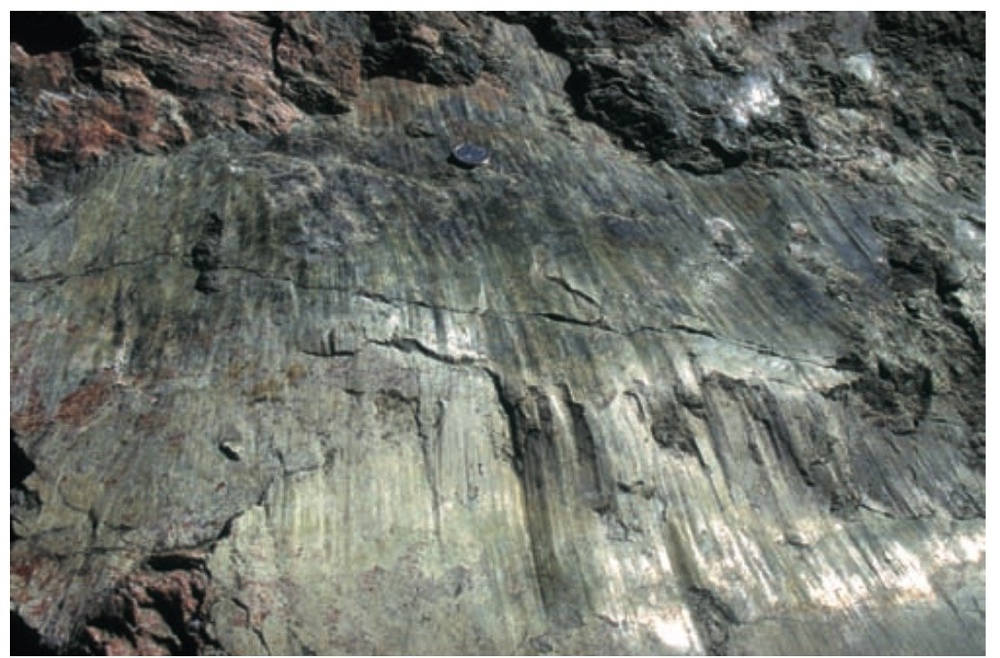

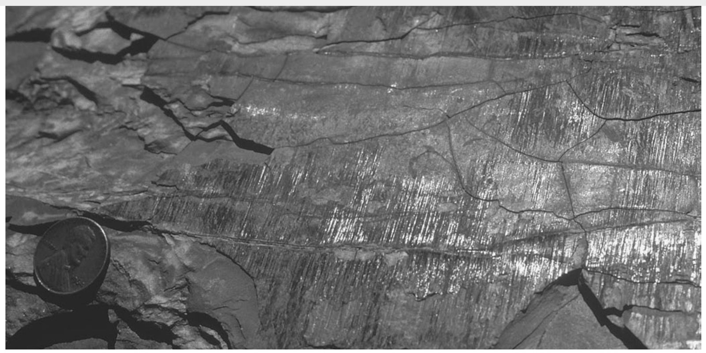

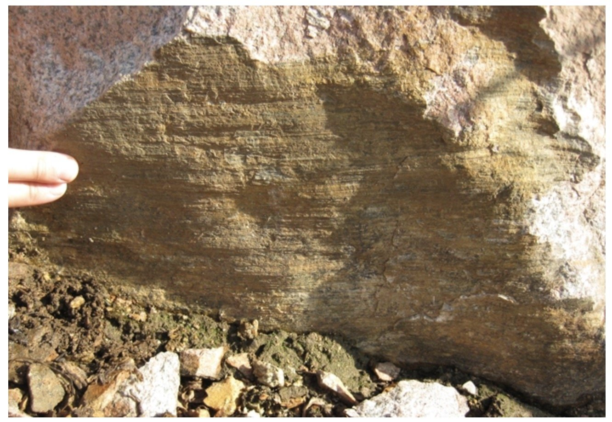

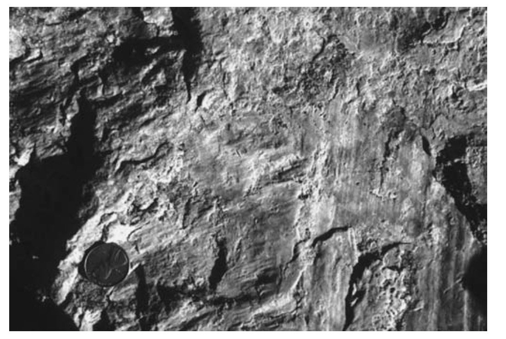

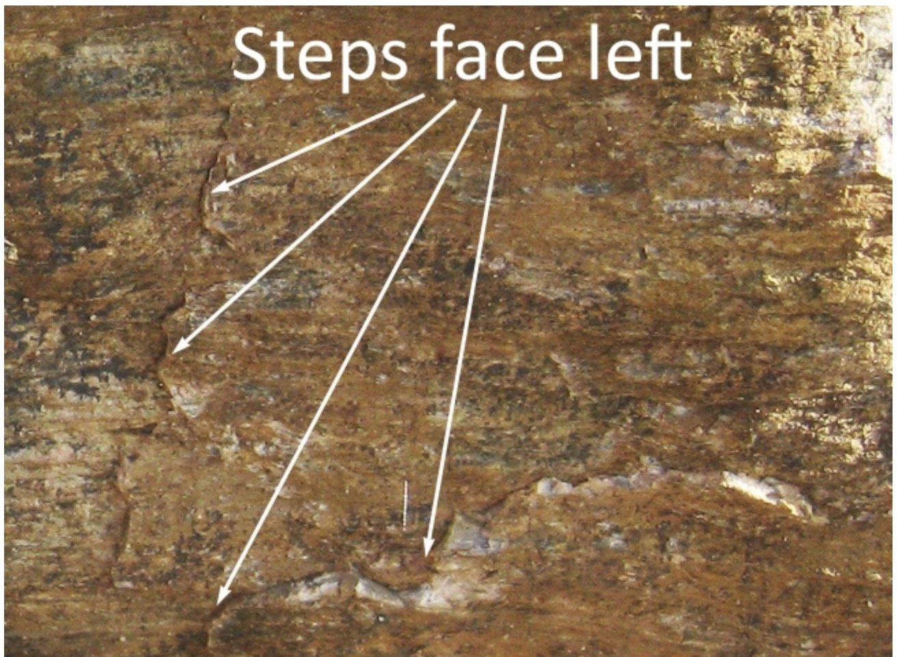

Callan Bentley, AGU blog

- Slickensides: fault surfaces being polished by the process of frictional slides (asperities break off).
- Some asperities on one wall of the fault plow into the surface of the other, creating groove lineation.
- They provide constraints on the shear sense. But “scatter” in slickenline orientations may prevent simple naming.

Epidote on a normal fault, NO

Slip fibers on a fault surface

Two distinct sets of slickenlines

Note:
Figure on the top left: Slickensides with slickenlines, formed by cataclastic shearing of epidote on a post-Caledonian normal fault in the Precambrian of West Norway. 

Superior Craton last fall, up in southern Ontario, Canada. The image shows slickenlines coated with brownish fault gouge and oxide staining, cutting through a high-potassium granite (see fresh surface at upper left).
The slickenlines are little gouged grooves where asperities (bumps) on the block of rock opposite this one ground into this rock along the fault surface as the two moved relative to one another. So did our block of granite move to the left or the right relative to the missing block? Let’s zoom in to find out. Little “steps” on the surface of the fault face to the left. If you were to run your finger over this outcrop from right to left, it would feel pretty smooth. On the other hand, running your finger over it from left to right, your fingertip would catch on those steps (and smaller, similarly-oriented steps), and the passage would feel rough and halting, if not downright painful.

Figure in the bottom left: The quartzite bedrock is part of the Tuscarora Formation (Silurian) in the Valley and Ridge Province of the Appalachian Mountains. On the basis of this outcrop as well as analysis of the fault history of the region, he concluded that the steeply raking near-vertical slickenlines were formed earliest. These were later overprinted by a younger faulting event reflected, in this outcrop, by the low-raking near-horizontal slickenlines.

<--o-->

<!-- source: Lecture6_Faults_Fault_Zones.pptx slide 25 · template: T3-text-and-image -->
## Tangent-lineation Diagrams

- This diagram provides a geometric way of extracting stress from fault slip data.
- Plotting each fault plane and its lineation, the M-plane, which contains the pole to the fault plane and the lineation, and by drawing an arrow tangent to the M-plane at this pole. The direction of the arrow reflects the movement of the footwall relative to the hanging wall.
- Combining many such measurements in a fault zone, and the resulting pattern may reveal both the orientations and the relative magnitudes of the principal stress axes.

Slip plane

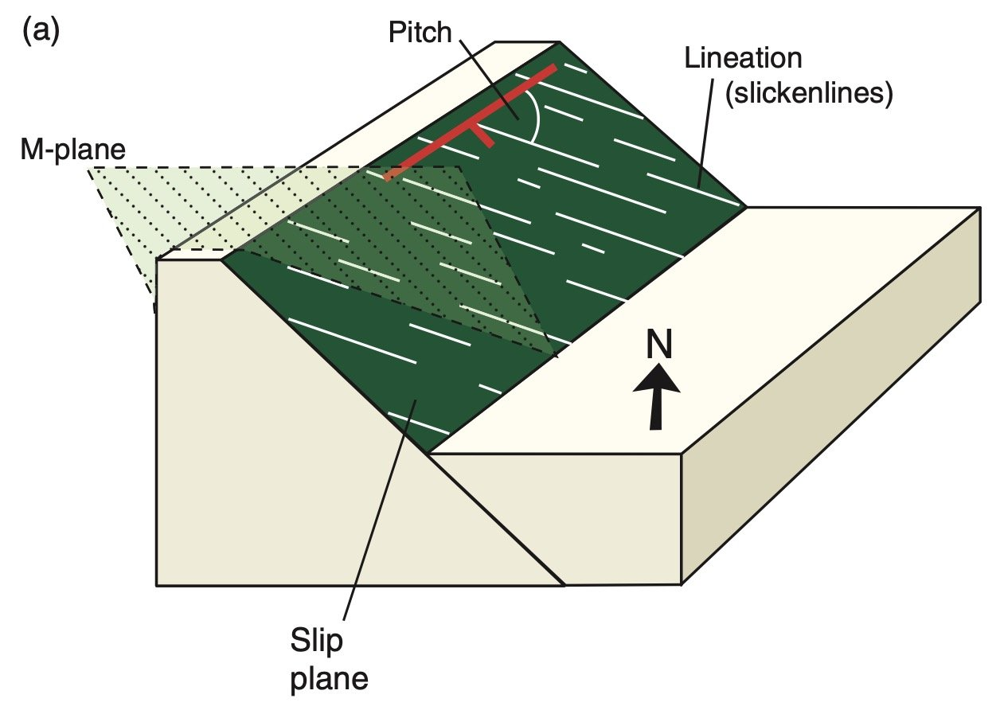

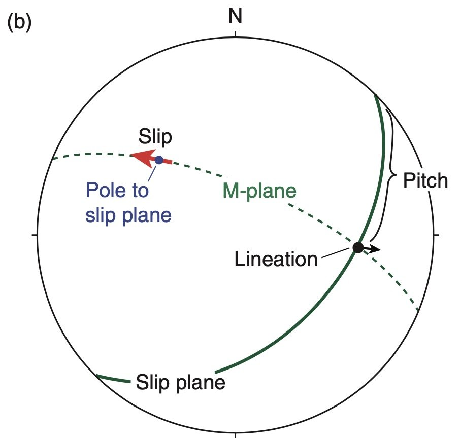 <!-- .element style="width:72%;" -->

Fossen, 2011

Note:
Schematic illustration of pitch as measured on a fault surface. (b) The pitch plotted in a stereonet (lower hemisphere, equal area). This projection also shows how the tangent-lineation is found for a known slip plane (as shown in (a)) and its lineation (striation) by plotting a plane (the movement or M-plane) that contains the lineation and the pole to the slip plane. The tangent-lineation (red arrow) is the arrow drawn tangential to the M-plane at the pole to the slip plane. Its direction describes the movement of the footwall relative to the hanging wall; in the present case a normal movement, where the footwall moves up to the west.

<--o-->

<!-- source: Lecture6_Faults_Fault_Zones.pptx slide 26 · template: T3-text-and-image -->
## Tangent-lineation Diagrams

Relative stress results from modeling

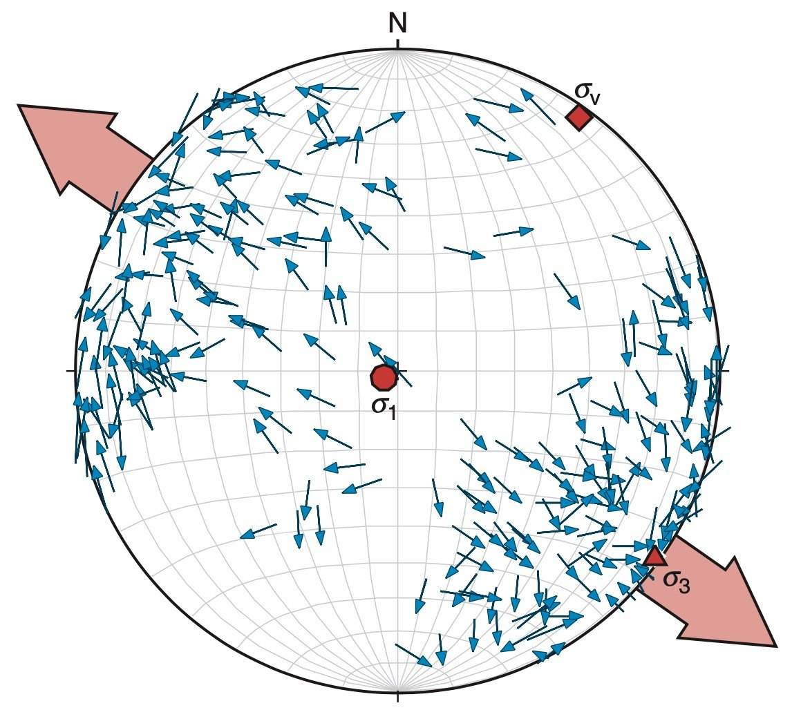

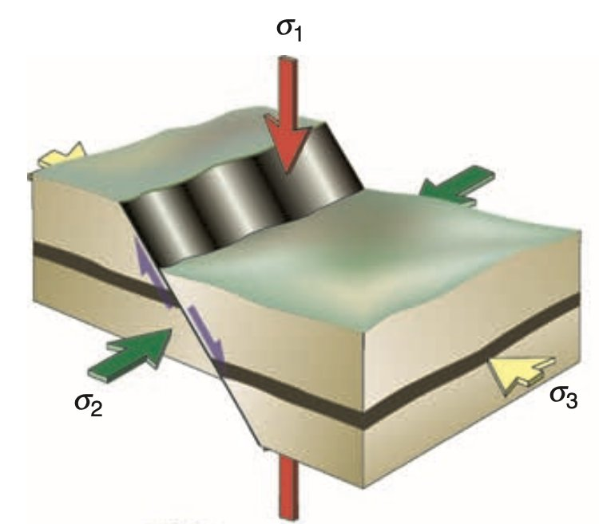 <!-- .element style="width:83%;" -->

Slip plane · Fossen, 2011

Note:
Tangent-lineation diagram for fault data from basement gneisses west of Bergen, Norway. s1 can be defined, but the f-value, which in principle is found by comparing with the next figure, is more difficult to define in this case. This is quite common and is partly due to limited variation in fault orientations.

<--o-->

<!-- source: Lecture6_Faults_Fault_Zones.pptx slide 27 · template: T3-text-and-image -->
## Fault-related Folding

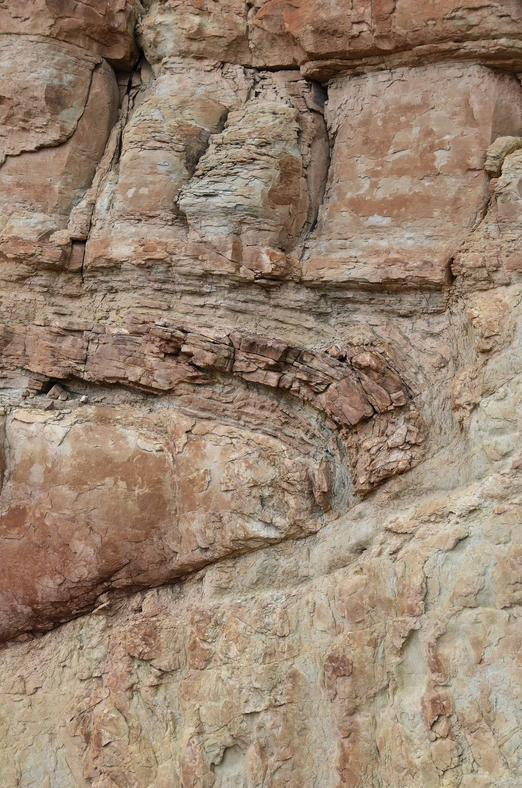

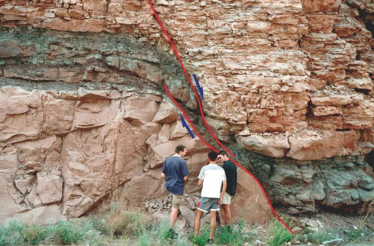

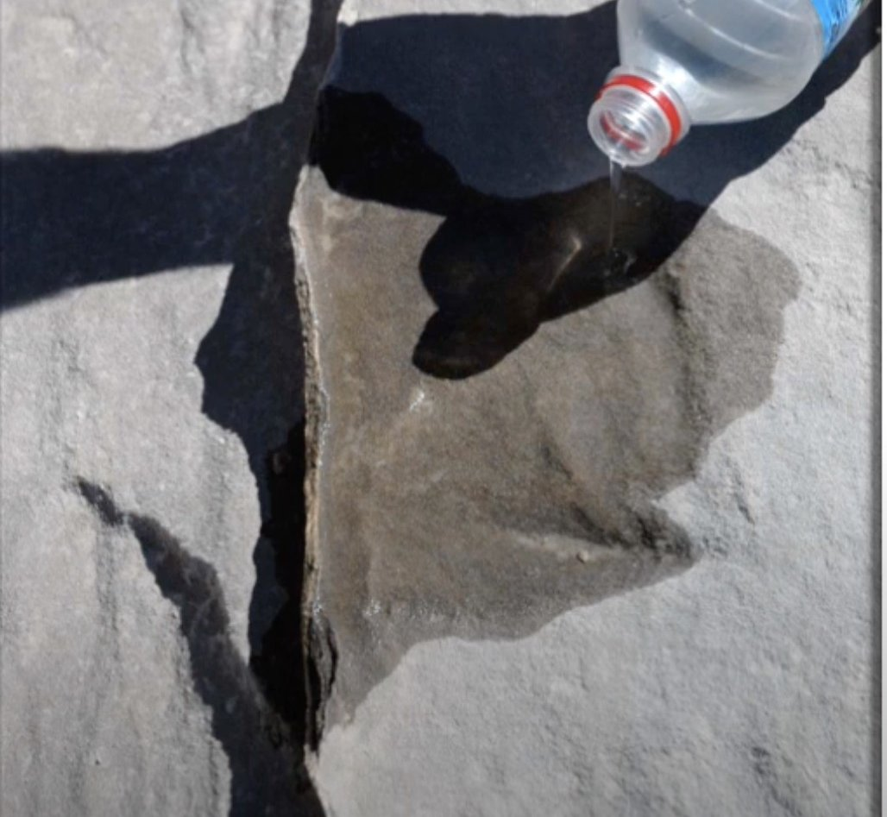

Fault · Joint · Fold · Smears · Fossen, 2011

- Drag: layers are commonly deflected (folded) around faults, particularly in faulted sedimentary rocks. It reflects the rheological difference and indicates the slip direction.
- Shale layers may be smeared out along fault during drag folding → clay smears = good fault seals → reduce permeability.

Note:
Detail of reverse fault. Note bending of hanging-wall layers (drag). If you magnify (click) and look hard you may even see a little back-thrust in the drag zone.

Typically associated with sedimentary rocks or loose sediments due to lower frictional strength.

<--o-->

<!-- source: Lecture6_Faults_Fault_Zones.pptx slide 28 · template: T3-text-and-image -->
## Recognizing and Interpreting Faults

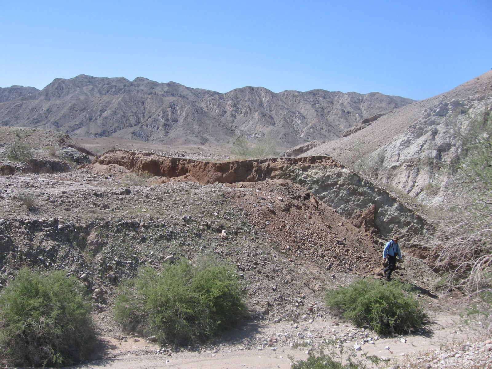

2010 El-Mayor Cucapah Earthquake

- Fault scarps are offsets or steps in the land surface that coincide with locations of faults. They often are easy to identify in areas where faulting is presently active.
- Geological processes reveal small portions of the fault systems inside the Earth.

<--o-->

<!-- source: Lecture6_Faults_Fault_Zones.pptx slide 29 · template: T6-two-image -->
## In the absence of earthquakes, geologists trench faults

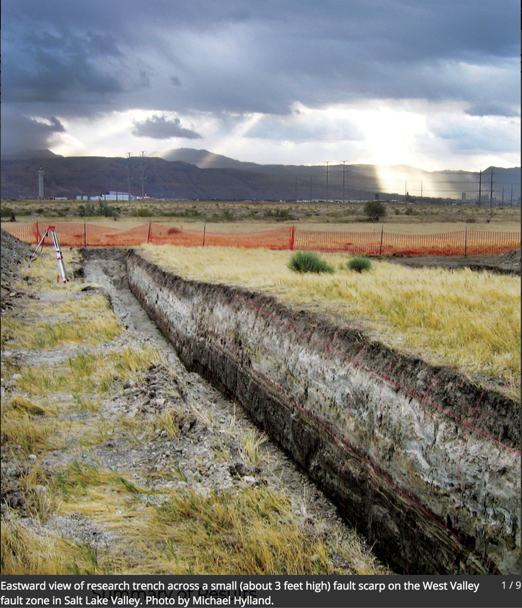

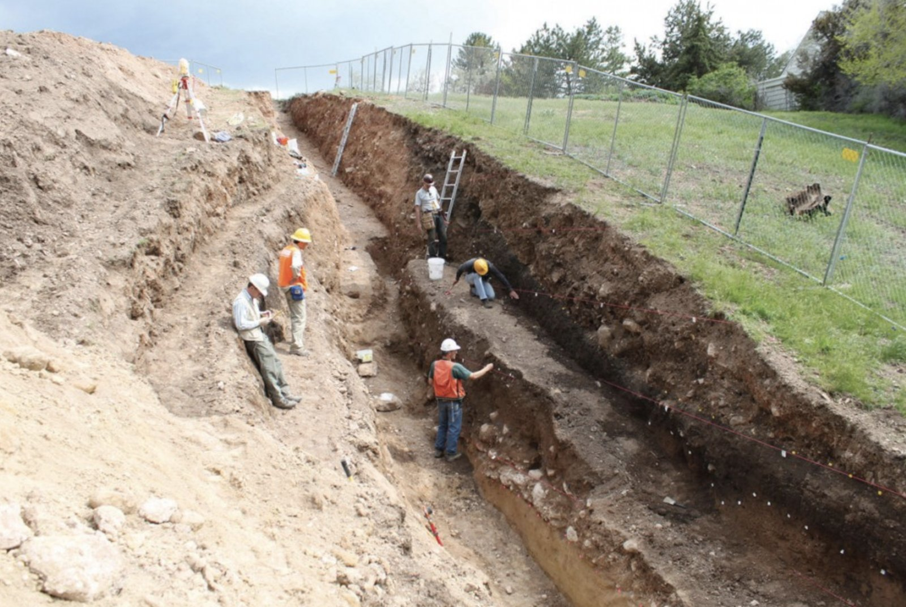

<--o-->

<!-- source: Lecture6_Faults_Fault_Zones.pptx slide 30 · template: T3-text-and-image -->
## Lake George Fault Zone

- Lake George Fault Zone is composed of west-dipping faults and is thought to have formed about 3.93 Ma ago. It is regarded as “one of Australia’s most active fault lines” by Dr Trevor Allen from GA.

Seismic reflection/refraction profiles

- It is a thrust fault with fault scarps exposed west of M25.

Lake George fault

Drill hole

**E**

0

45º

$\sigma_{yy}$

$\sigma_{yy}$

-5

$\sigma_{yx}$

$\sigma_{xy}$

$\sigma_{xx}$

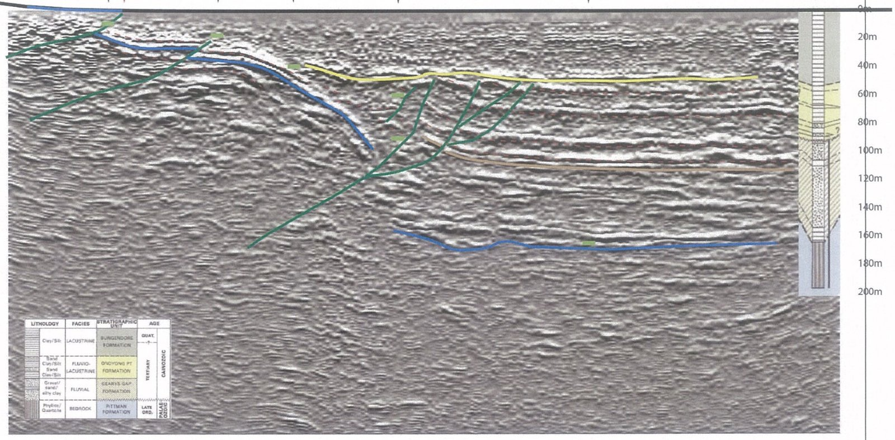

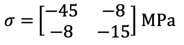 <!-- .element style="width:51%;" -->

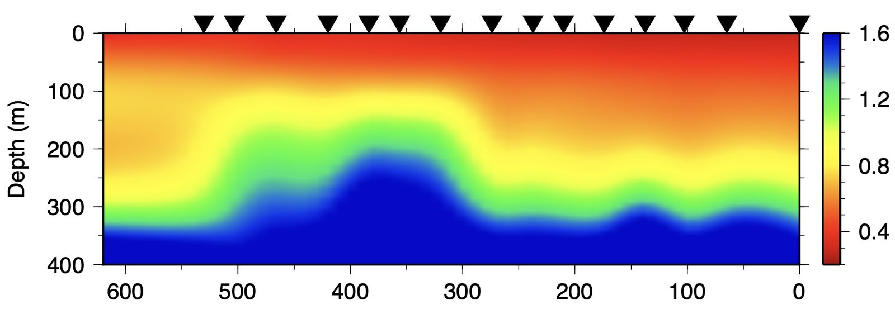

Vs [km/s] · Depth [m] · [m]

Note:
Reflectors

<--o-->

<!-- source: Lecture6_Faults_Fault_Zones.pptx slide 31 · template: T4-full-figure -->
<!-- .slide: data-background="Module-iv-Brittle-Deformation/Lecture6-extracted/slide031_img1.jpg" -->

<--o-->

<!-- source: Lecture6_Faults_Fault_Zones.pptx slide 32 · template: T3-text-and-image -->
## Slip Distribution

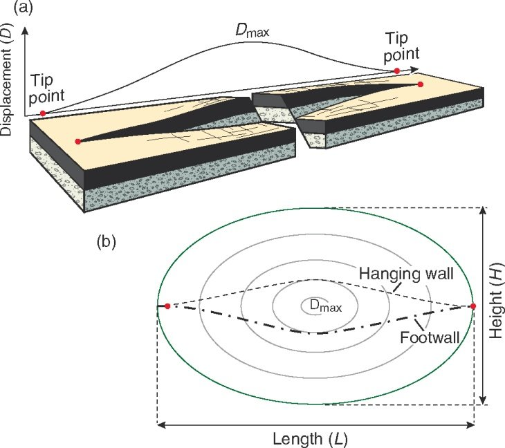

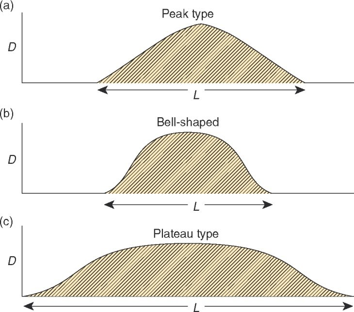

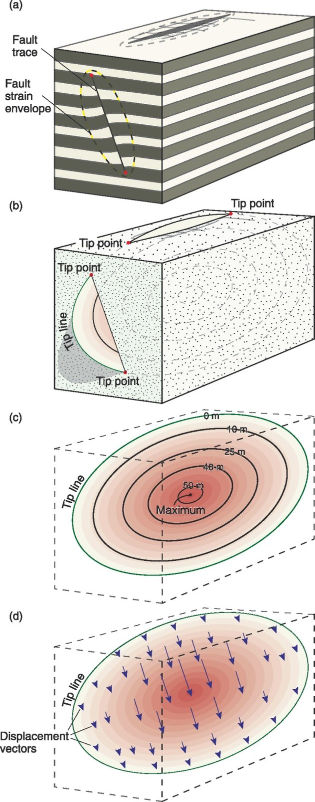 <!-- .element style="width:82%;" -->

Fossen, 2011

- Single faults generally show a gradual increase in displacement towards center.
- Not easy to get this data from the field → seismic analysis.

“Idealised” slip surface geometry and slip vector variation across fault plane

<--o-->

<!-- source: Lecture6_Faults_Fault_Zones.pptx slide 33 · template: T3-text-and-image -->
## Seismology to Measure Slip Distribution

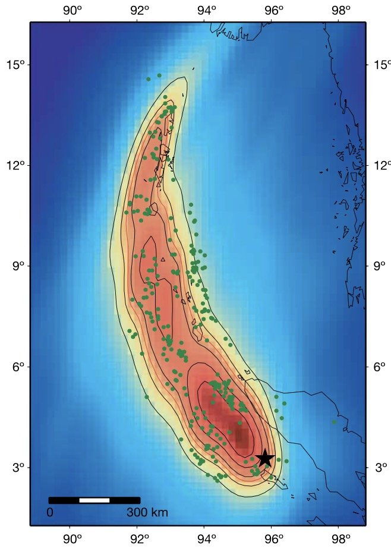 <!-- .element style="width:84%;" -->

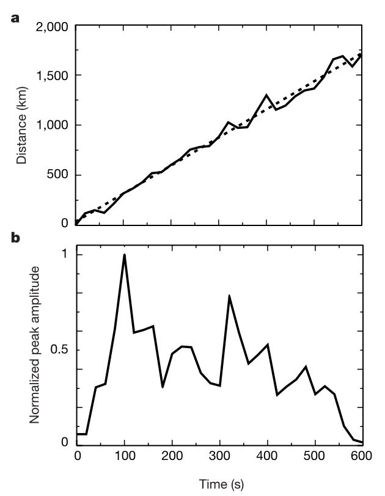

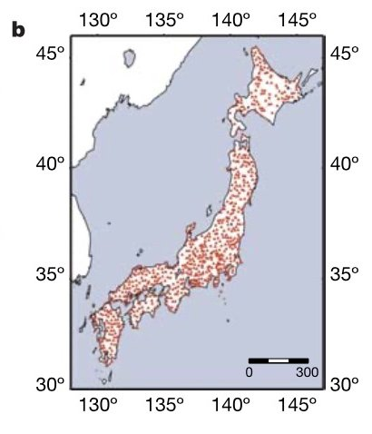

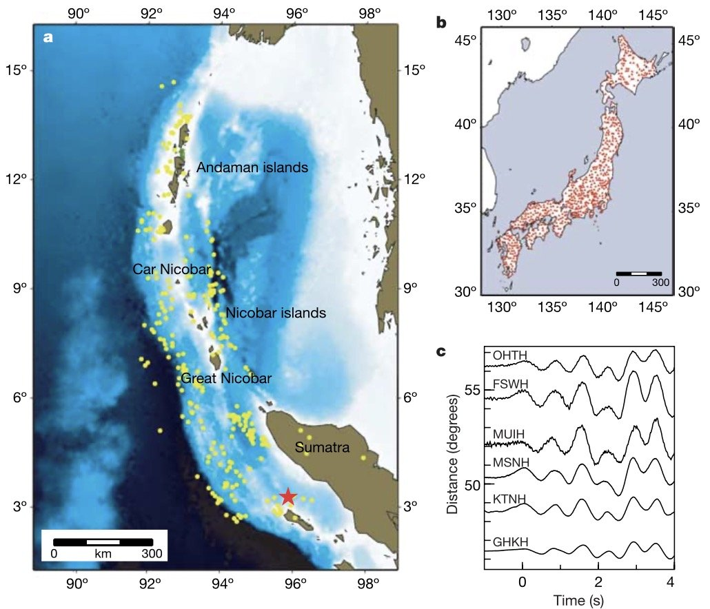

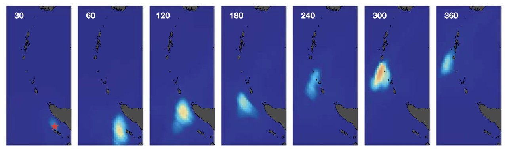

Cumulative radiated energy

- 2004 Mw9.3 Sumatra earthquake in west of Indonesia.
- The source lasts ~600 sec in duration.
- Back-projection method, like echolocation. One fault system due to many quakes.

Ishii et al., Nature 2005

Note:
Integrated seismic energy over 600s after initiation, normalized such that the maximum value is unity. The red contour, plotted at 65% of the maximum, encloses the slip area used to estimate the moment magnitude. The epicentre is shown as the black star. Note the good agreement between the 1,300-km-long rupture zone and the locations of the first month of aftershocks (dark green circles). The black contours are plotted at increments of 0.1 starting at 0.5. The image is computed and shown across the entire map, but amplitudes are very weak outside the contoured region.

<--o-->

<!-- source: Lecture6_Faults_Fault_Zones.pptx slide 34 · template: T3-text-and-image -->
## Insar to Measure Slip Distribution

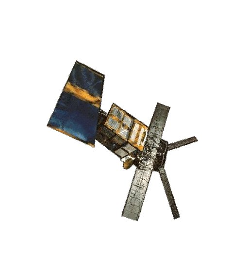 <!-- .element style="width:47%;" -->

Source: Gareth Funning

phase shift due to ground motion

- InSAR: Interferometric Synthetic Aperture Radar
- General procedure
- Satellite emits radar pulse
- Radar is backscattered
- Amplitude and phase of echo recorded at the satellite

phase=2

phase=1

phase shift varies with distance from the fault

<--o-->

<!-- source: Lecture6_Faults_Fault_Zones.pptx slide 35 · template: T3-text-and-image -->
## 2008 Wells Earthquake

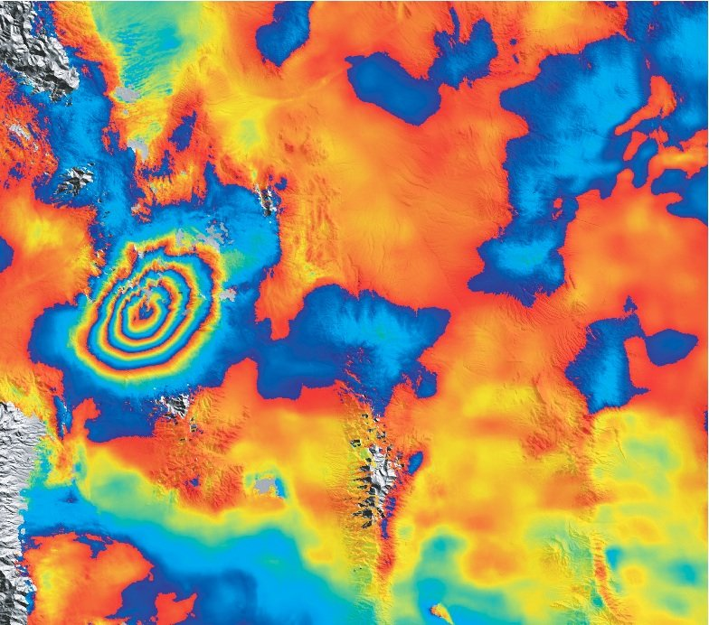

10 km · Source: Gareth Funning

- Each cycle of blue => yellow => red = 28 mm of displacement.
- That is half of the radar wavelength.
- Represented by four concentric fringes.
- ~10 cm of change across 10 km wide area

visible-earthquakes

Note:
Here is one earthquake interferogram, from the 2008 Wells, Nevada earthquake. In this case, each cycle of blue to yellow to red represents an increase in distance (a range increase) of 28 mm between the satellite and the ground. [Note that there is no standard convention for the color scheme of interferograms!]
The earthquake is represented by four concentric fringes. The whole pattern is about 10 km long and 8 km wide. Assuming that all of the line-of-sight deformation in this case represents vertical deformation, the four fringes represent a maximum of about 12 cm of subsidence of the surface, at the center of the pattern. One way of visualizing this is to imagine it raining after the earthquake. If the depression caused by the earthquake filled in with water, you would have a puddle 10 km long by 8 km wide, and 12 cm deep in the middle. If you visited the area after the earthquake, what are the chances you would recognize that as being the signature of an earthquake on the ground?  there would most likely NOT be any evidence from the surface because it is 10-12cm of change across 10 km wide area
Was there a surface rupture?
 No. We can not see any discontinuities that are associated with with quake so no surface rupture

<--o-->

<!-- source: Lecture6_Faults_Fault_Zones.pptx slide 36 · template: T3-text-and-image -->
## Fault Growth

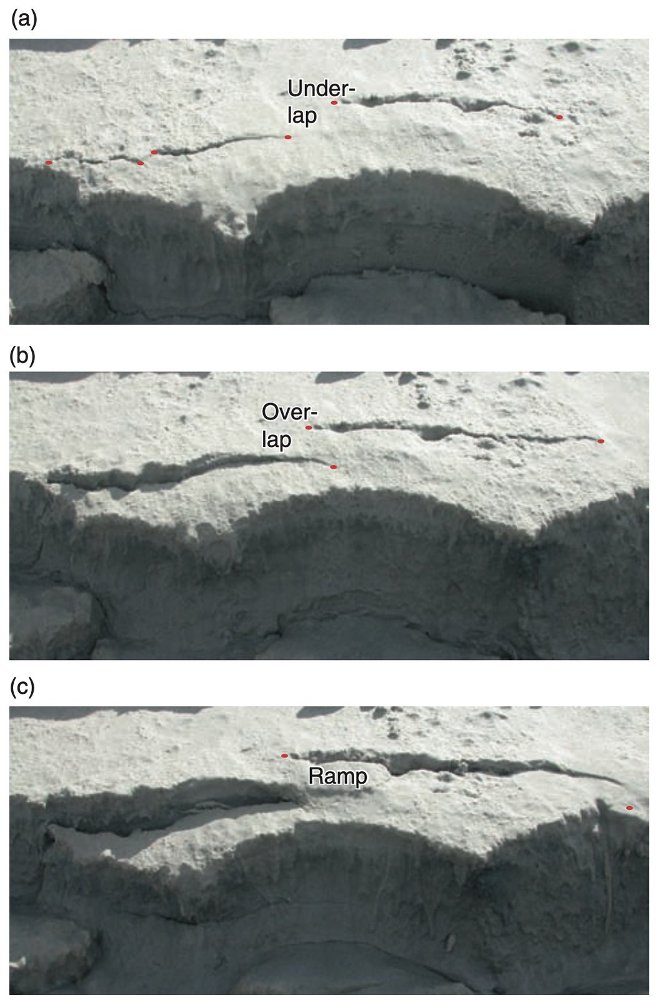 <!-- .element style="width:88%;" -->

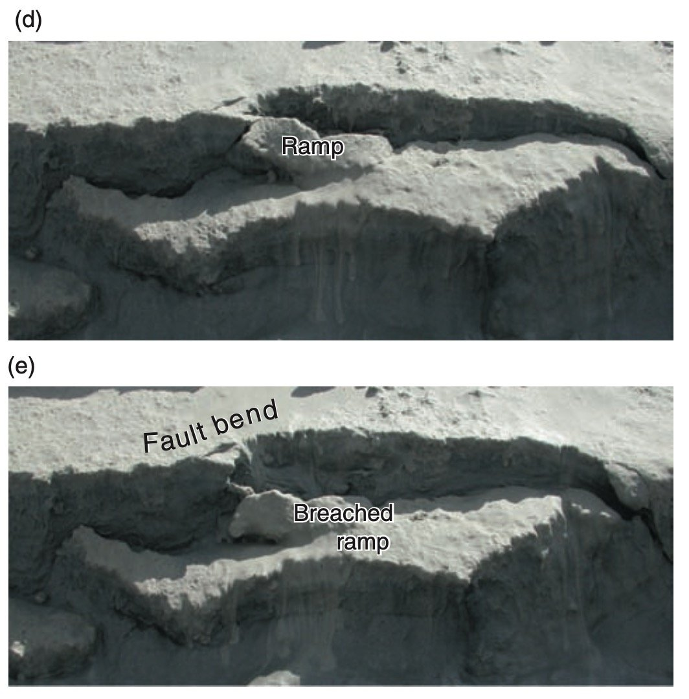

Fossen, 2011

- Before the tips have reached each other (but after their strain fields have started to interfere) the faults are said to underlap.
- Once the tips have passed each other, the faults are overlapping. Under- and overlapping faults are said to be soft linked as long as they are not in direct physical contact. The increase of local displacement gradient results in the ramp-like folds.
- Eventually the faults may link up to form a hard link.

Note:
Underlapping faults “feel” the presence of a neighboring fault tip in the sense that the energy required to keep the deformation going increases. The propagation rate of the fault tips in the area of underlap is thus reduced, which causes the local displacement gradient to increase. This makes the overlap zone folded. the folding is well expressed in the form of a ramp-like fold.

<--o-->

<!-- source: Lecture6_Faults_Fault_Zones.pptx slide 37 · template: T6-two-image -->
## Fault Growth

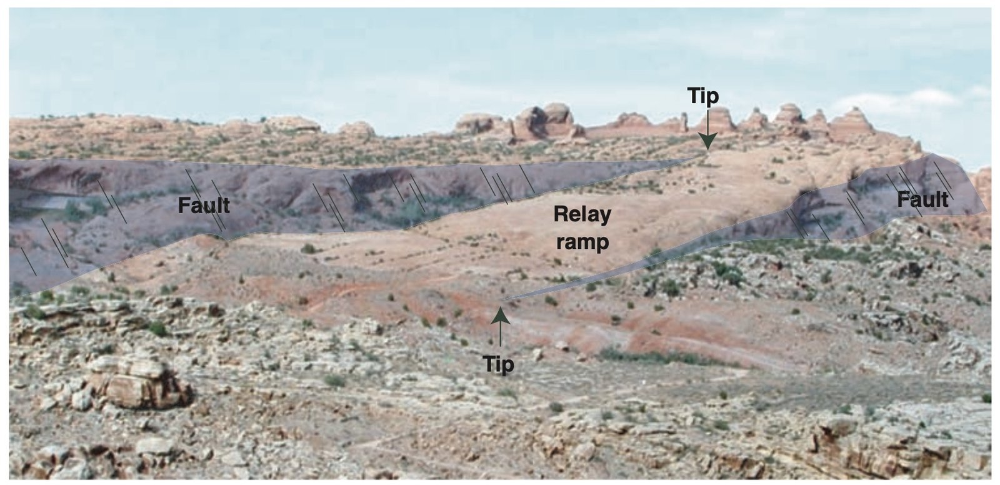

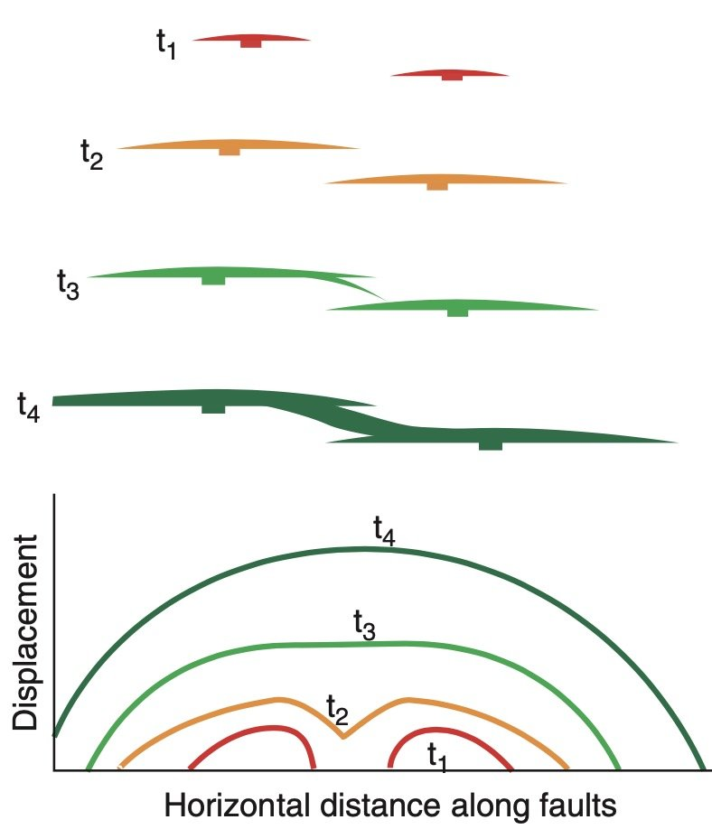 <!-- .element style="width:79%;" -->

Fossen, 2011

Note:
Illustration of the change in displacement along two faults that overlap and coalesce. The upper part shows the two segments in map view at four different stages of growth (t1–t4). The lower part shows the displacement profile at the four different stages.

<--o-->

<!-- source: Lecture6_Faults_Fault_Zones.pptx slide 38 · template: T3-text-and-image -->
## Stress Vs. Focal Mechanism

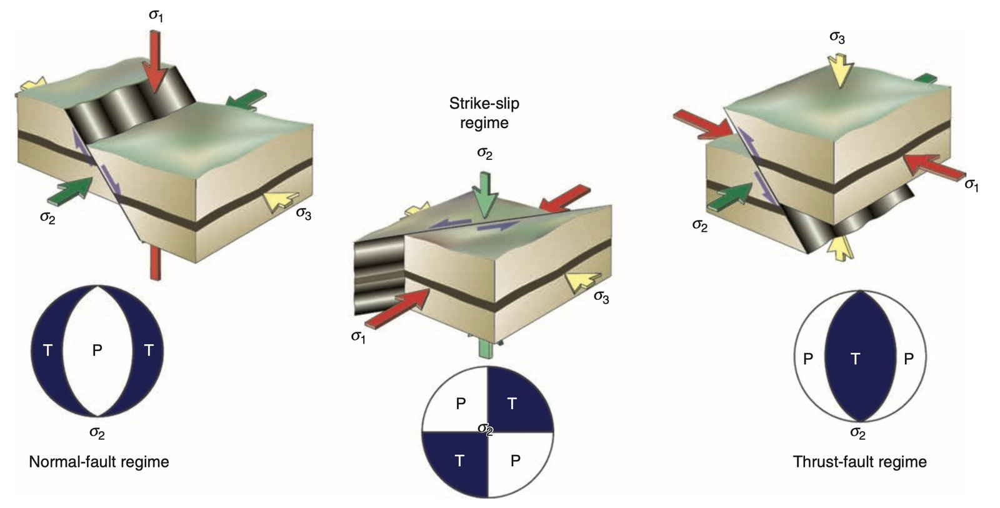

Fossen, 2011 · Nodal planes

- Assume no shear stress at the Earth’s surface, so one of the principal stresses must be vertical. This implies that the other two are horizontal.
- Other assumption of coaxial deformational regimes and $\sigma_2$ is always parallel to the line of intersection of the faults.

$\sigma$v = $\sigma$1: normal-fault;
$\sigma$v = $\sigma$2: strike-slip fault;
$\sigma$v = $\sigma$3: thrust-fault.

Focal sphere side-view

$\sigma_1$ or P

$\sigma_3$ or T

Note:
Since we are discussing the Mohr circle and the failing criteria, let’s revisit the Anderson’s theory of faulting, which describes the various stress condition with the focal mechanism. Louis brief touched on this topic in the first module. But now we may have a bit more background knowledge to understand it.

<--o-->

<!-- source: Lecture6_Faults_Fault_Zones.pptx slide 39 · template: T3-text-and-image -->
## Seismic Derivation

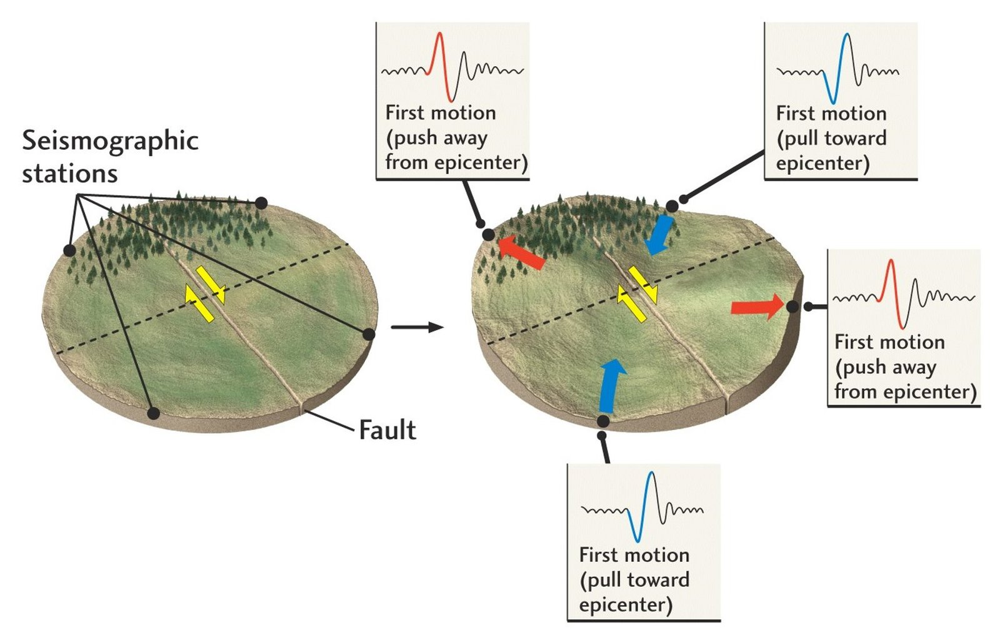

 <!-- .element style="width:60%;" -->

- Based on first motion of P wave, which is easy to identify.
- Positive pulse in region pushing away from epicenter and negative in region pulling toward epicenter.
- One can also fit the entire waveform.

Trillium 120 PA Seismometer

<--o-->

<!-- source: Lecture6_Faults_Fault_Zones.pptx slide 40 · template: T3-text-and-image -->
## Structural Geology Derivations

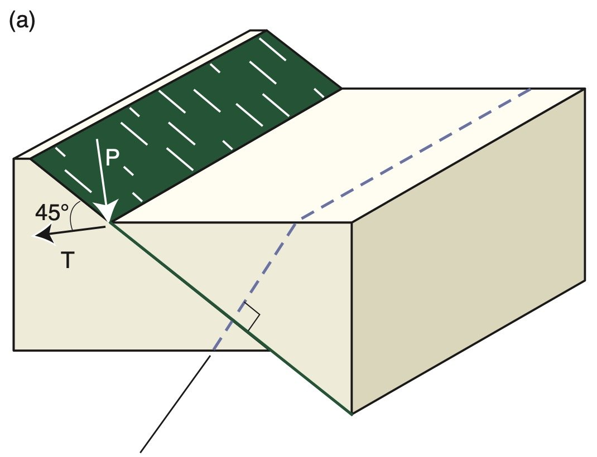 <!-- .element style="width:91%;" -->

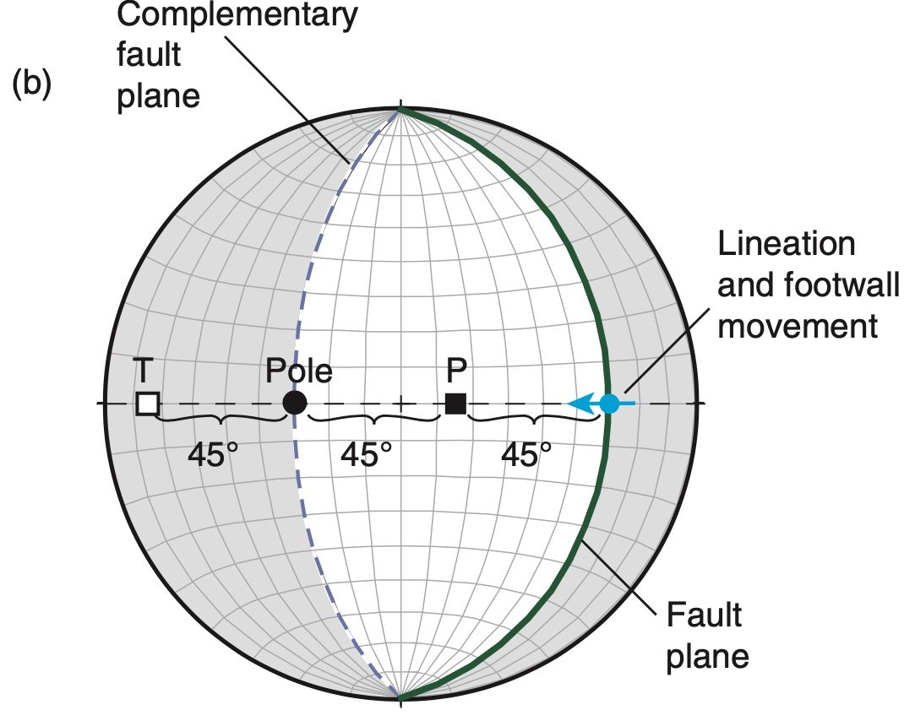

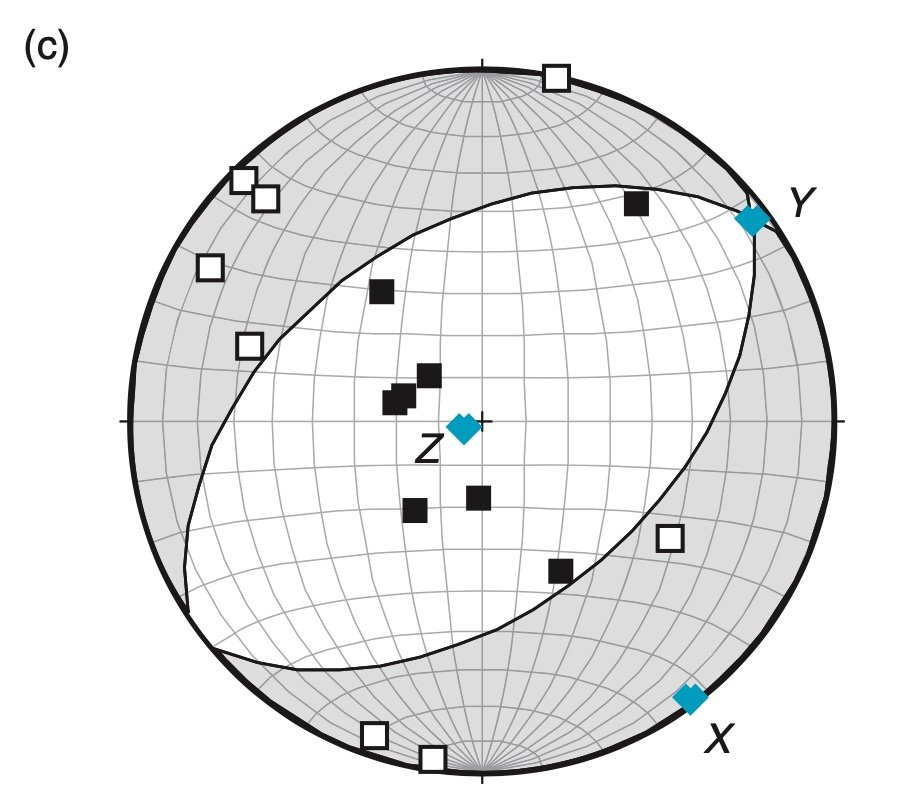

Fossen, 2011

- Kinematic analysis of fault data.
- The fault plane contains the lineation (slip direction). Then, P and T are made 45º to the fault plane. The position of T and P depends on the sense of fault movement.
- It contains no magnitude constraints, which needs to be added.

Note:
P197 of Fossen, 2011.

<--o-->

<!-- source: Lecture6_Faults_Fault_Zones.pptx slide 41 · template: T1-prose -->
## Faults and Society
- Earthquakes, the obvious one!
- Detailed structural mapping is crucial for location predictions
- Subsurface fluid storage, leakage and behaviour
- Hydrocarbon exploration  do faults seal or do they leak? Or both?
- Safe CO2 storage in the subsurface  are faults leaky? Will they reactivate under fluid pressure increase?
- Geothermal exploration and management
- Many schemes use natural fracture systems in granitic rocks
- Deep geological disposal of high level nuclear waste
- If hazardous material miraculously escaped canisters, could it migrate along fault and fracture networks to surface?

<--o-->

<!-- source: Lecture6_Faults_Fault_Zones.pptx slide 42 · template: T4-full-figure -->
<!-- .slide: data-background="Module-iv-Brittle-Deformation/Lecture6-extracted/slide042_img1.jpg" -->

<--o-->

<!-- source: Lecture6_Faults_Fault_Zones.pptx slide 43 · template: T3-text-and-image -->

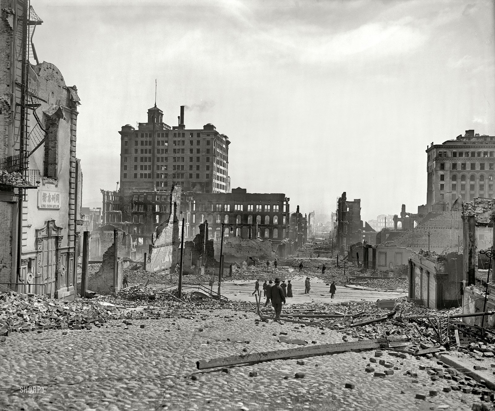

1906 MW7.9 SAN FRANCISCO EARTHQUAKE

Ground intensity not only dependent on quake magnitude, but also on the site conditions.

Note:
This is a photo taken after the 1906 earthquake. M7.8. Fault run through the city. Last large earthquake felt in the lower 48 United States.

<--o-->

<!-- source: Lecture6_Faults_Fault_Zones.pptx slide 44 · template: T3-text-and-image -->
## Global Seismicity

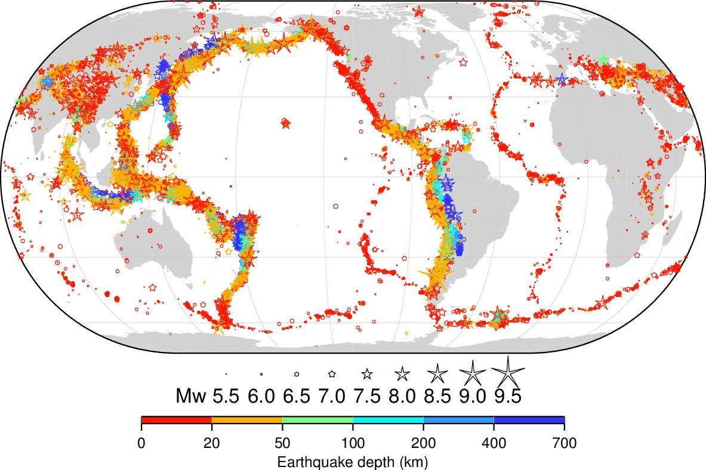

- Majority at plate boundaries: plate tectonics

- But quite some are intraplate: regional deformation

<--o-->

<!-- source: Lecture6_Faults_Fault_Zones.pptx slide 45 · template: T3-text-and-image -->
## Wadati-benioff Zone

- It is a planar zone of seismicity corresponding with the down-going slab in a subduction zone, and it can range from 10s to 100s of km.
- They can be produced by slip along the subduction thrust fault or slip on faults within the downgoing plate, as a result of bending and extension as the plate is pulled into the mantle. Fluid is crucial to reduce the effective stress.

Gavin Hayes, USGS

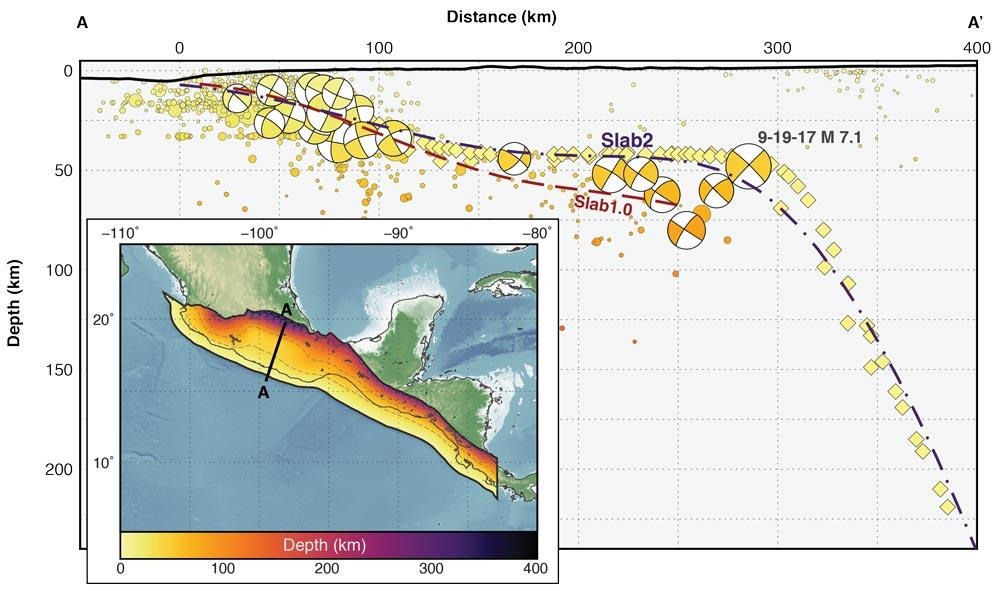

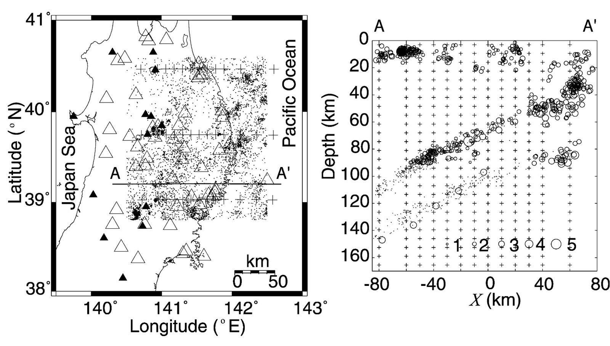

Zhang et al., Geology 2004 · Metabasalt to blueschist · Serpentine dehydration

<--o-->

<!-- source: Lecture6_Faults_Fault_Zones.pptx slide 46 · template: T3-text-and-image -->
## Seismic and Aseismic Faulting

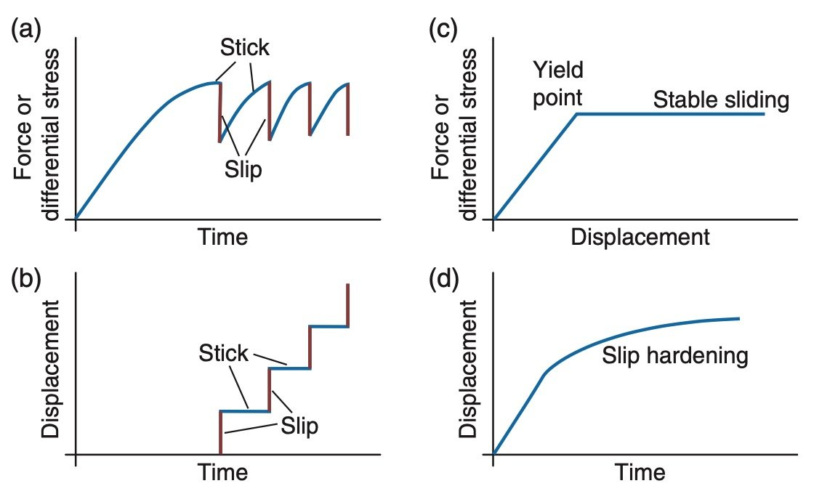

Fossen, 2011

Not all movement on active faults result in seismicity.
These do are called seismic, and these not are called aseismic (fault creeping).

- Stick-slip behavior of faults: slip accumulates at very sudden seismic slip events, separated by periods of no slip.
- During the stick phase, stress build up; while during slip phase, the fault moves and release stress.

<--o-->

<!-- source: Lecture6_Faults_Fault_Zones.pptx slide 47 · template: T3-text-and-image -->

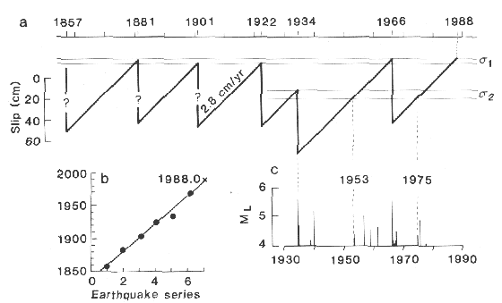

USGS Open file report Bakun 1985:
The Parkfield, California, Earthquake Prediction Experiment
Five moderate (magnitude 6) earthquakes with similar features have occurred on the Parkfield section of the San Andreas fault in central California since 1857. The next moderate Parkfield earthquake is expected to occur before 1993. The Parkfield prediction experiment is designed to monitor the details of the final stages of the earthquake preparation process; observations and reports of seismicity and aseismic slip associated with the last moderate Parkfield earthquake in 1966 constitute much of the basis of the design of the experiment.

<--o-->

<!-- source: Lecture6_Faults_Fault_Zones.pptx slide 48 · template: T3-text-and-image -->
## Earthquake did not occur until 2004 (Mw6.0)…

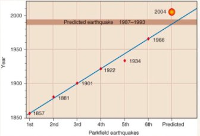

USGS Open file report Bakun 1985:
The Parkfield, California, Earthquake Prediction Experiment
Five moderate (magnitude 6) earthquakes with similar features have occurred on the Parkfield section of the San Andreas fault in central California since 1857. The next moderate Parkfield earthquake is expected to occur before 1993. The Parkfield prediction experiment is designed to monitor the details of the final stages of the earthquake preparation process; observations and reports of seismicity and aseismic slip associated with the last moderate Parkfield earthquake in 1966 constitute much of the basis of the design of the experiment.

<--o-->

<!-- source: Lecture6_Faults_Fault_Zones.pptx slide 49 · template: T3-text-and-image -->
## Different Types of Eq Magnitude

- Moment magnitude (Mw) accounts for the seismic moment (energy) radiated in an earthquake. Seismic moment can be estimated as Mo = fault area $\times$ displacement $\times$ rigidity. Then Mw can be defined as:
- ML denotes local magnitude or Richer magnitude (limited to certain frequency and distance range). Extension magnitude include body wave magnitude (Mb) and surface wave magnitude (Ms), which are equivalent to ML using certain portion energy of the signals.
- Difference between magnitude and intensity, which is a measure of the strength of shaking experienced in an earthquake.

Mw = log M0/1.5 – 10.7

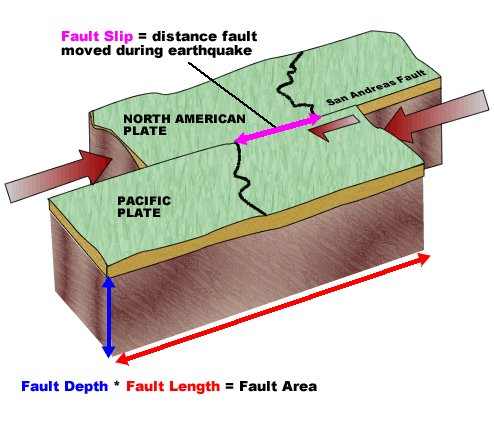

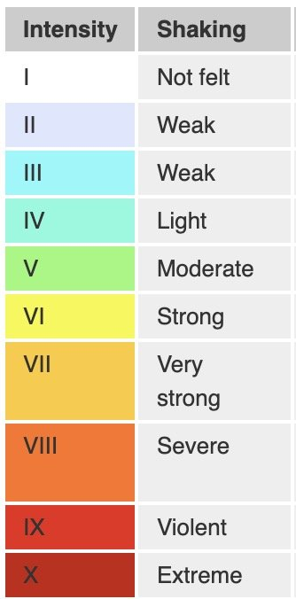 <!-- .element style="width:38%;" -->

<--o-->

<!-- source: Lecture6_Faults_Fault_Zones.pptx slide 50 · template: T3-text-and-image -->
## Earthquake Rupture Parameters

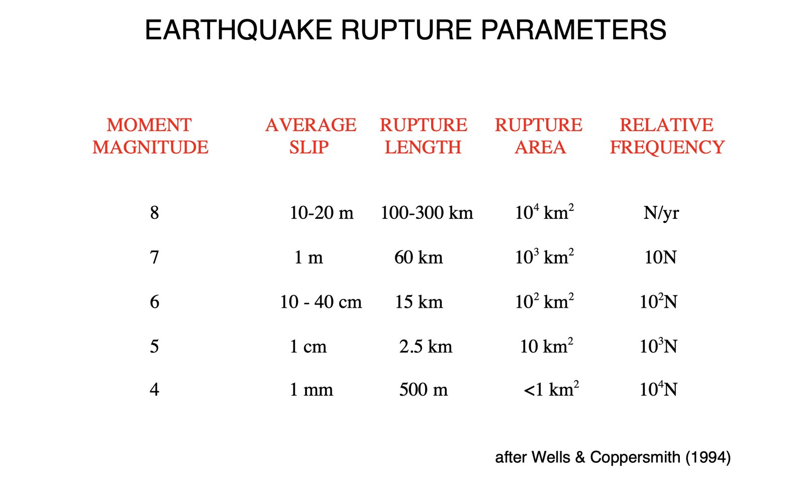

After Wells and Coppersmith (1994)

&nbsp;

<--o-->

<!-- source: Lecture6_Faults_Fault_Zones.pptx slide 51 · template: T3-text-and-image -->
## Earthquake Sequences in Time

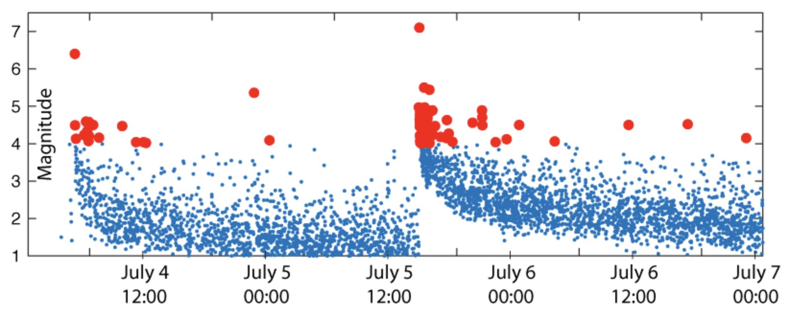

Foreshock: an earthquakes occurs before the mainshock.
Mainshock: the largest earthquake in a sequence.
Aftershock: a smaller earthquake follows the mainshock
Difference and relations?

First 3-day earthquake records for 2019 Ridgecrest earthquake (USGS).

<--o-->

<!-- source: Lecture6_Faults_Fault_Zones.pptx slide 52 · template: T3-text-and-image -->
## Features of Aftershock Sequences

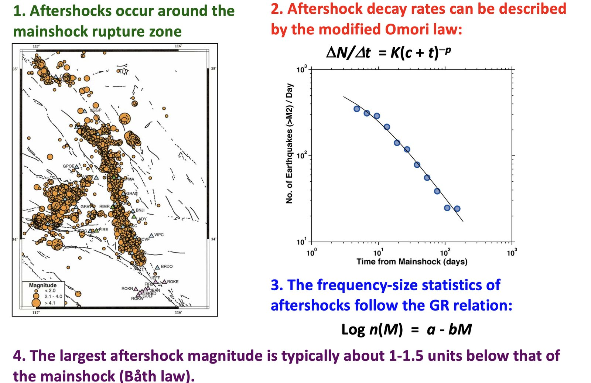

Log $N=a-bM$

1. Aftershocks occur around the mainshock rupture zone

2. Aftershock decay rates can be described by modified Omori law

3. Frequency-size statistics of aftershocks follow Gutenberg-Richter law

4. Magnitude of largest aftershock typically ~1-1.5 units below that of mainshock (Båth law).

<--o-->

<!-- source: Lecture6_Faults_Fault_Zones.pptx slide 53 · template: T3-text-and-image -->
## Two Laws for Aftershocks

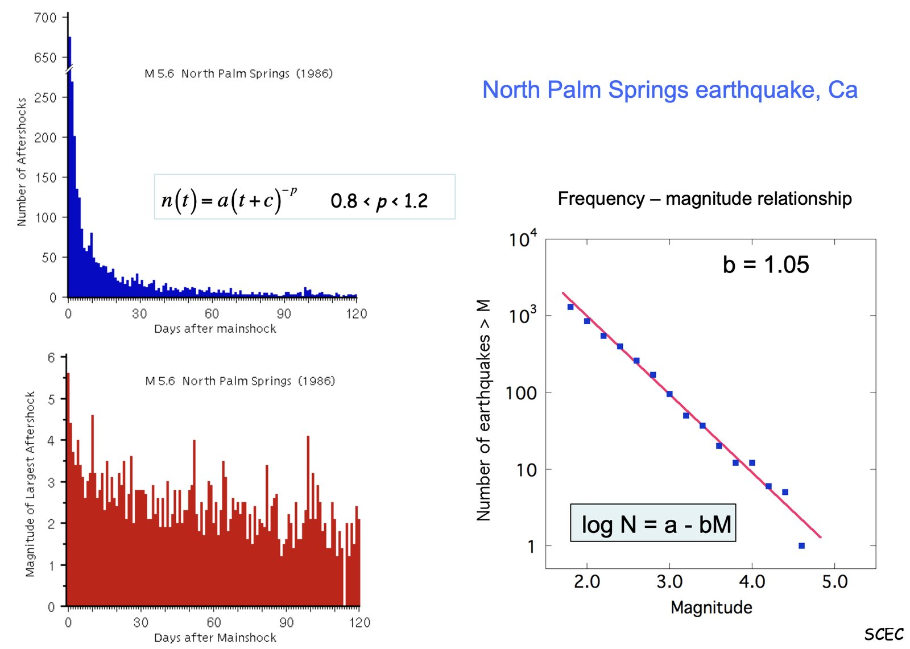

- Omori law shows the exponential decay of aftershock seismicity rate (number vs. time).
- Gutenberg-Richter law shows the frequency vs. size statistics of aftershocks.

**SCEC**

<--o-->

<!-- source: Lecture6_Faults_Fault_Zones.pptx slide 54 · template: T3-text-and-image -->
## Searching for Hidden Earthquakes

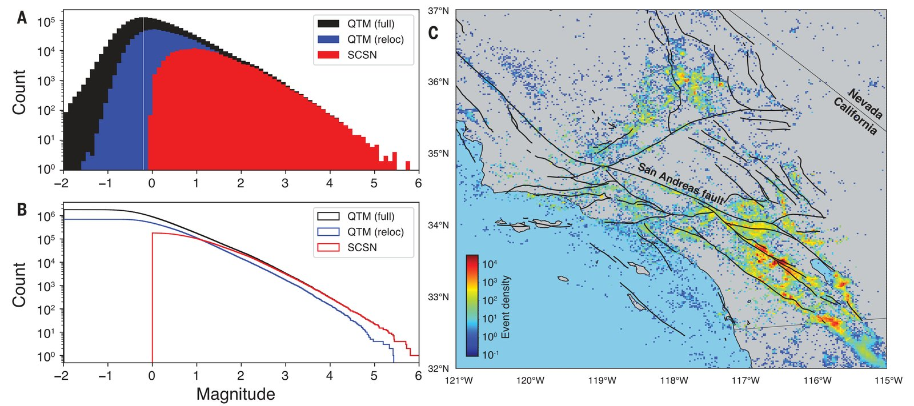

Ross et al., Science, 2020

- Gutenberg-Richter law indicates much more smaller events than larger events.
- Its identification limited by many factors such as noisy data, sparse distribution etc.

<--o-->

<!-- source: Lecture6_Faults_Fault_Zones.pptx slide 55 · template: T4-full-figure -->
<!-- .slide: data-background="Module-iv-Brittle-Deformation/Lecture6-extracted/slide055_img1.jpg" -->

<--o-->

<!-- source: Lecture6_Faults_Fault_Zones.pptx slide 56 · template: T3-text-and-image -->
## Early Warning in the Future

 <!-- .element style="width:71%;" -->

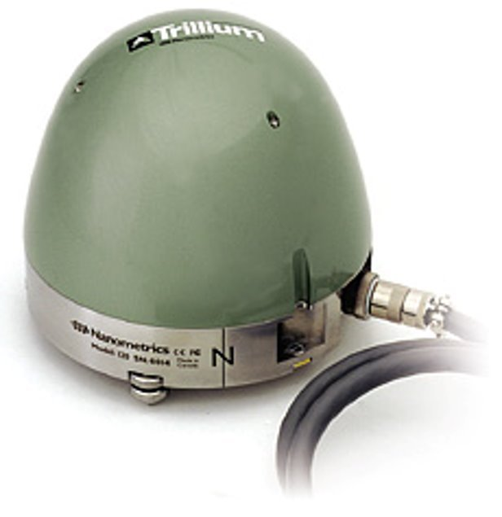

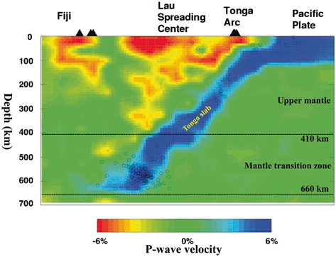

Source physics for modeling earthquakes

- Instrument availability in both space and temporal aspects.
- Understanding of the Earth’s internal structures.
- Understanding the source physics.
- Verification processes and phycological issues.

Instantaneous Data

High resolution seismic model

<--o-->

<!-- source: Lecture6_Faults_Fault_Zones.pptx slide 57 · template: T1-prose -->
## Summary
- Fault concept and terminology
- Fault types and its representation on maps
- Fault characteristics
- Fault interpretation at the surface and in the subsurface
- Fault slip and its measurements
- Relation of faulting to stress and focal mechanisms
- Earthquakes and society

<--o-->

<!-- source: Lecture6_Faults_Fault_Zones.pptx slide 58 · template: T0-title-or-other -->

<--o-->

<!-- source: Lecture6_Faults_Fault_Zones.pptx slide 59 · template: T3-text-and-image -->
## Fault Vs. Fault Zone

- Fault zones consist of numerous closely spaced and subparallel fault surfaces, commonly separating masses of broken rock.
- The width of the zone depends on the scale of observation – it ranges from centimeters or meters in the field to the order of a kilometer.

Carboneras fault zone, SE Spain

van der Pluijm & Marshall (2003)

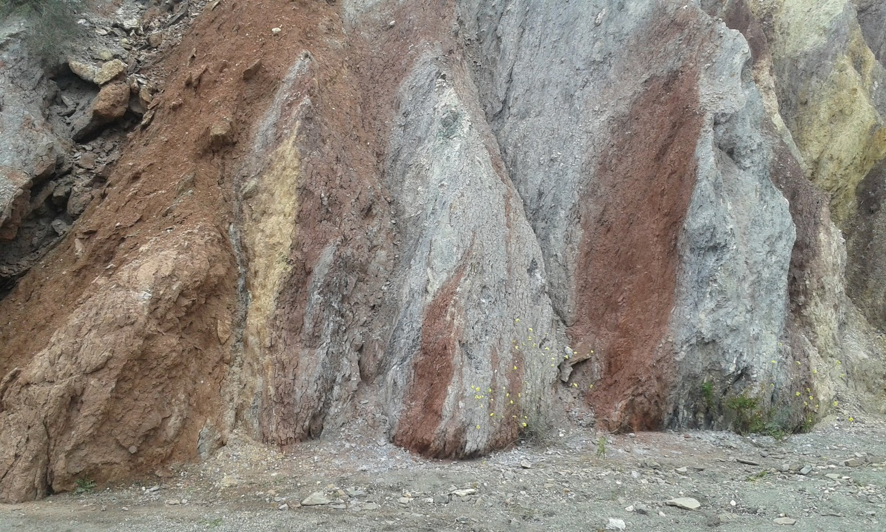

Faulkner et al. (2003)

Note:
Carboneras fault zone, SE Spain: a complex strike-slip fault with several anastomosing slip surfaces separating “islands” of damaged wall rock

<--o-->

<!-- source: Lecture6_Faults_Fault_Zones.pptx slide 60 · template: T3-text-and-image -->
## Earthquakes at Subduction Zones

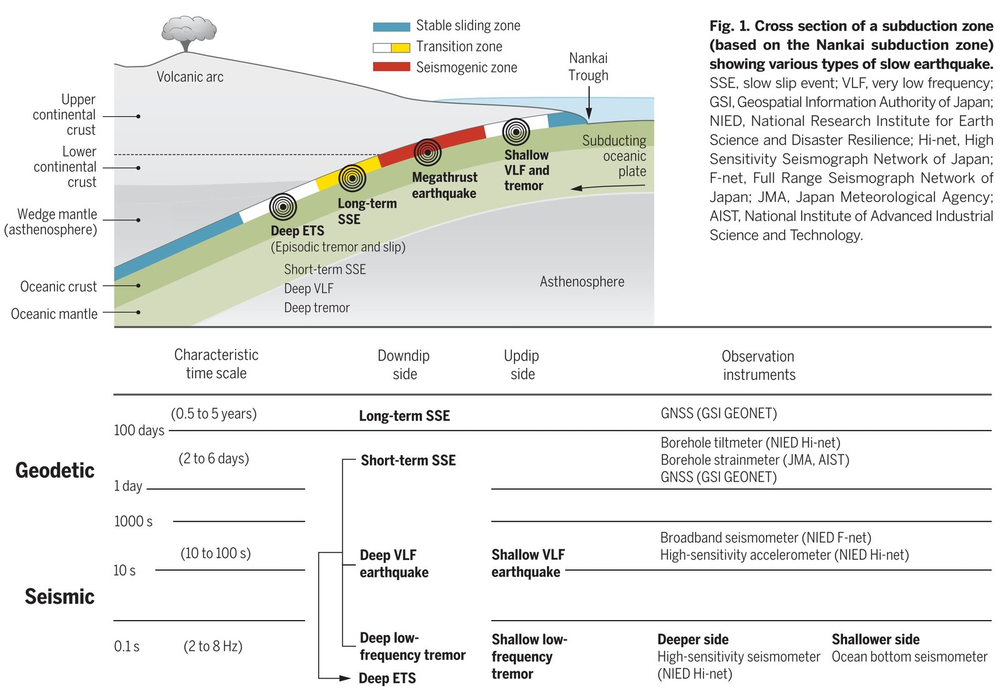

- Major earthquake types
- Megathrust earthquakes
- VLF: very low frequency
- SSE: slow slip event
- ETS: episodic tremor and slip
- Careful and precise monitoring of slow earthquakes may provide new information on the likelihood of impending huge earthquakes.

Obara & Kato, Science, 2016

Note:
Slow earthquakes may function as stress meters because of their high sensitivity to stress changes in the seismogenic zone. Episodic stress transfer to megathrust source faults leads to an increased probability of triggering huge earthquakes if the adjacent locked region is critically loaded.

<--o-->

<!-- source: Lecture6_Faults_Fault_Zones.pptx slide 61 · template: T3-text-and-image -->
## Fault Systems

- Faults often occur as groups and can be results of multiple episodes.
- Thick-skinned and thin-skinned system depending on the deformation depth.
- Cross-cutting relations and paleo-stress.

Strike-slip fault systems

van der Pluijm & Marshall (2003)

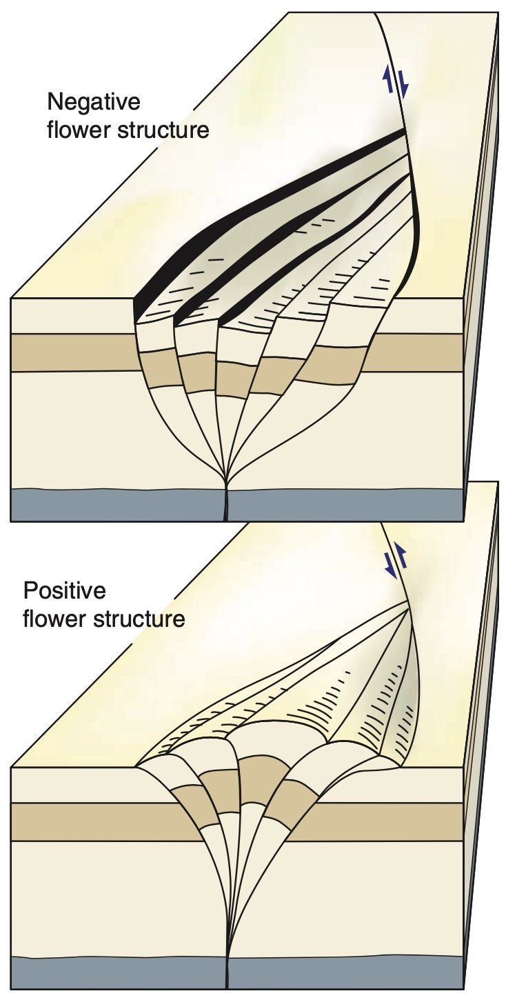 <!-- .element style="width:77%;" -->

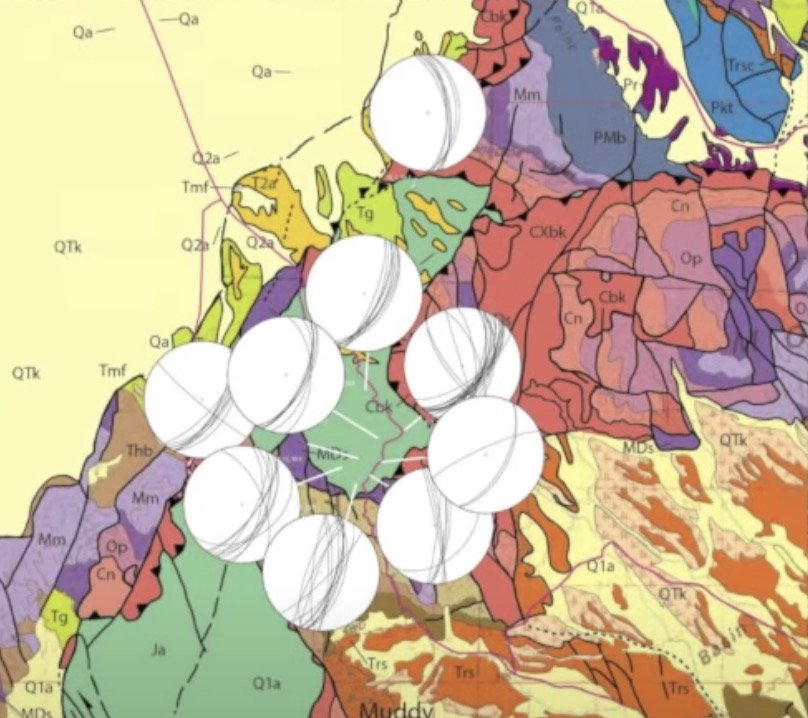

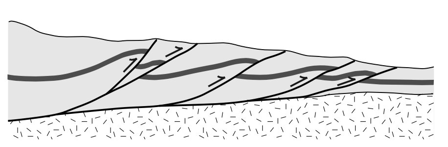

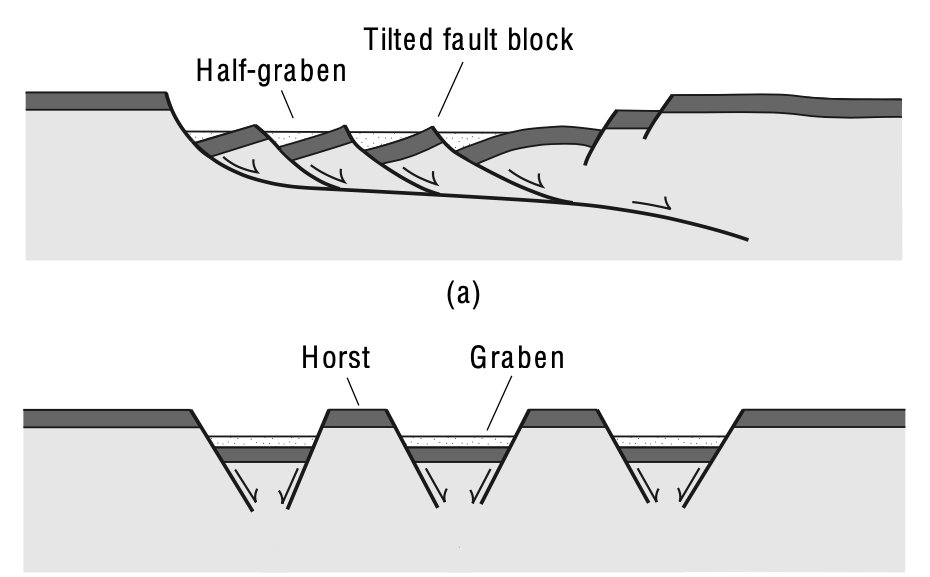

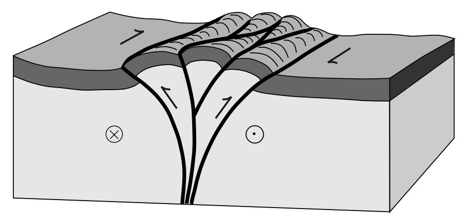

Normal fault systems · Thrust fault systems

<--o-->

<!-- source: Lecture6_Faults_Fault_Zones.pptx slide 62 · template: T3-text-and-image -->
## Anderson’s Theory of Faulting

- Faults form as Coulomb shear fractures at acute angles to σ1 and obtuse angles to σ3 (σ2 is contained within the fracture plane).
- σ1, σ2 or σ3 is vertical in the shallow Earth due to the free surface, leading to three general types of faults.
- Different stress states for the three major fault types.

III. Strike-slip fault

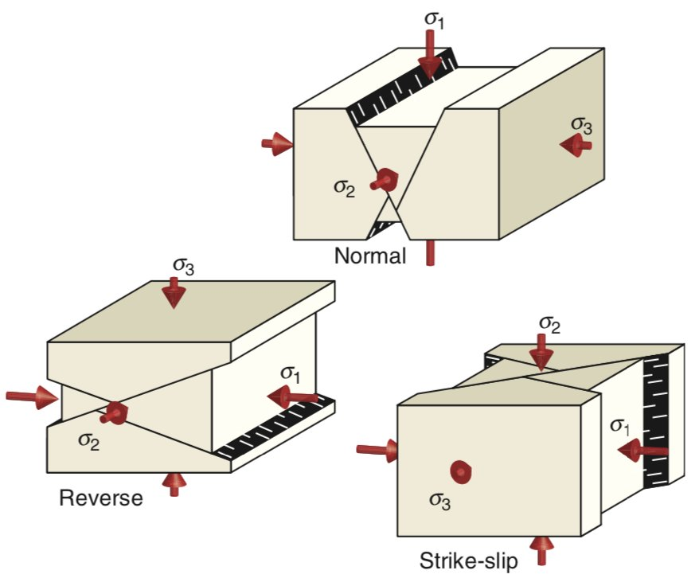

I. Normal fault · II. Thrust fault

<--o-->

<!-- source: Lecture6_Faults_Fault_Zones.pptx slide 63 · template: T3-text-and-image -->
## Earthquake Magnitude Vs. Energy

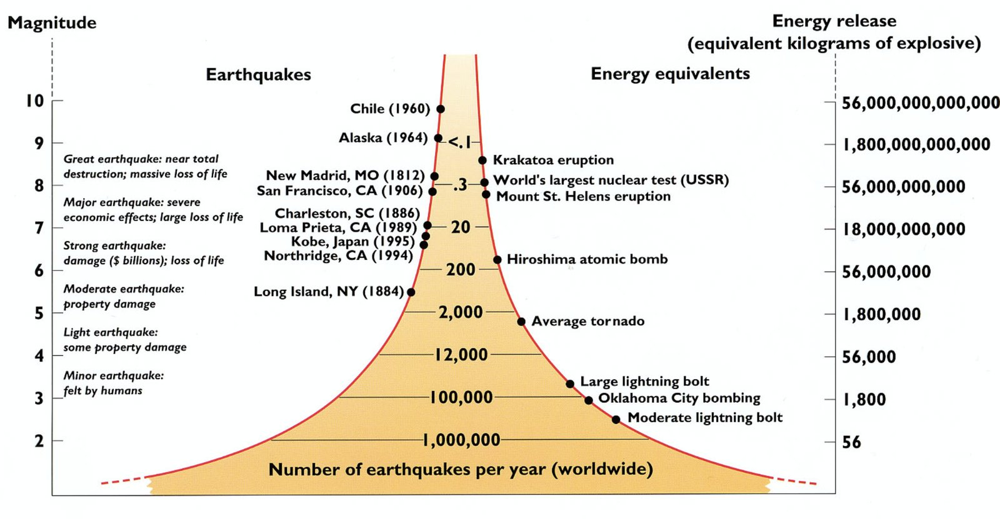

Magnitude Versus Energy · Source: IRIS

32 times of differences in energy release

<--o-->

<!-- source: Lecture6_Faults_Fault_Zones.pptx slide 64 · template: T3-text-and-image -->
## The Promise of A.i. in Eq Prediction

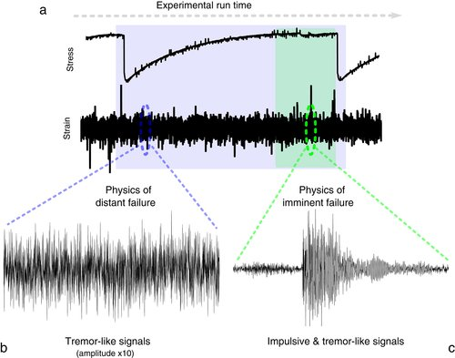

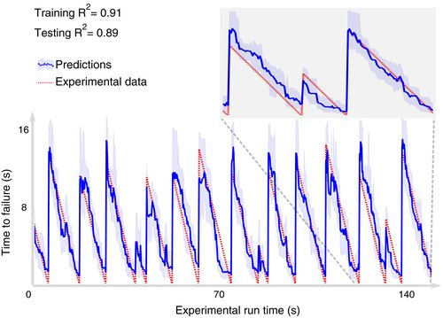

Time to failure (s)

- The community is becoming more organized and is moving toward open-data, open-source software.
- Predict the timing of the next lab-quake just listening to the ambient vibrations.

Rouet-Leduc et al, GRL 2017

<--o-->

<!-- source: Lecture6_Faults_Fault_Zones.pptx slide 65 · template: T3-text-and-image -->
## Alpine Fault

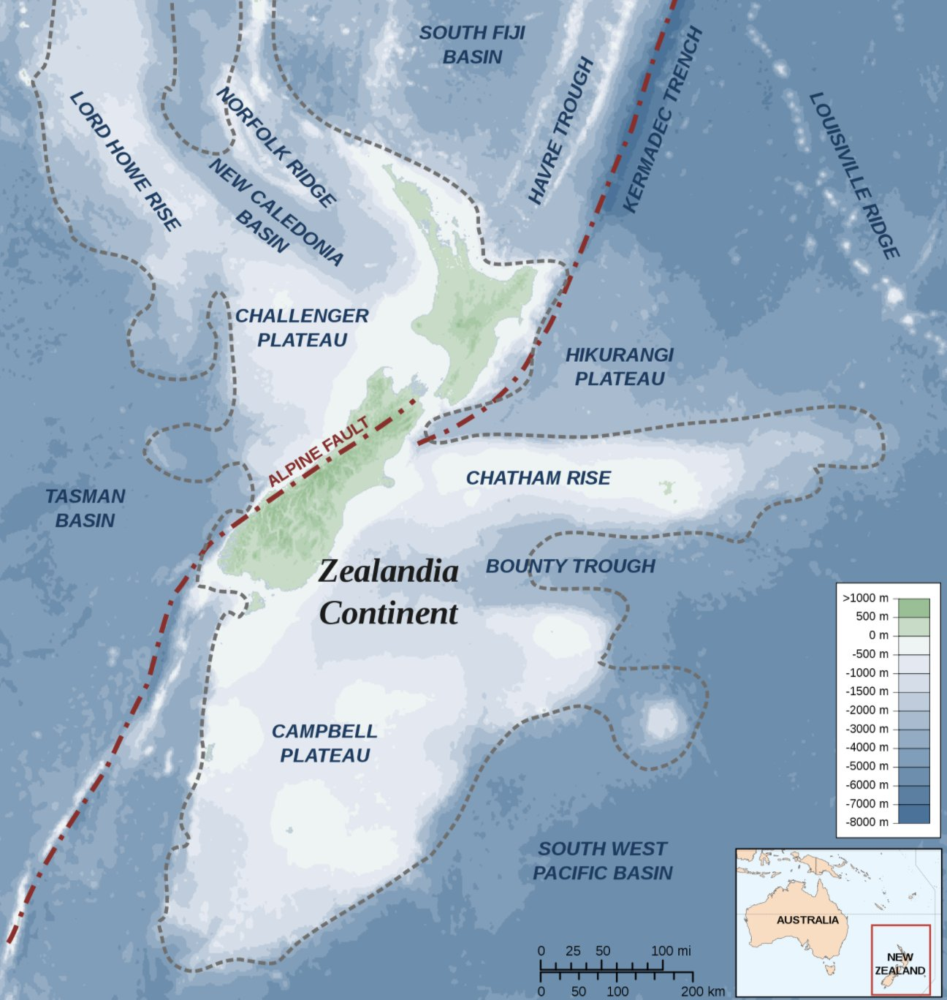

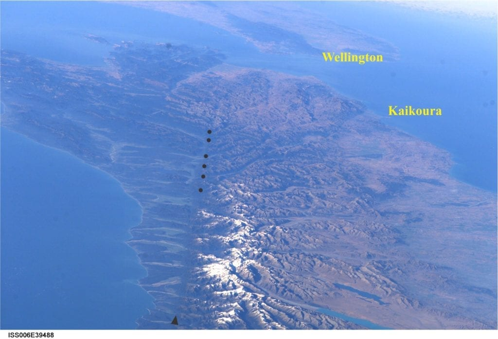

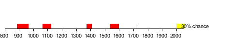

Pre-historic activity

- A strike-slip fault as the boundary between the Pacific Plate and the Indo-Australian Plate.
- Potential for future large earthquake.

Wikipedia

<--o-->

<!-- source: Lecture6_Faults_Fault_Zones.pptx slide 66 · template: T6-two-image -->
## Slip Distribution by Finite Faulting

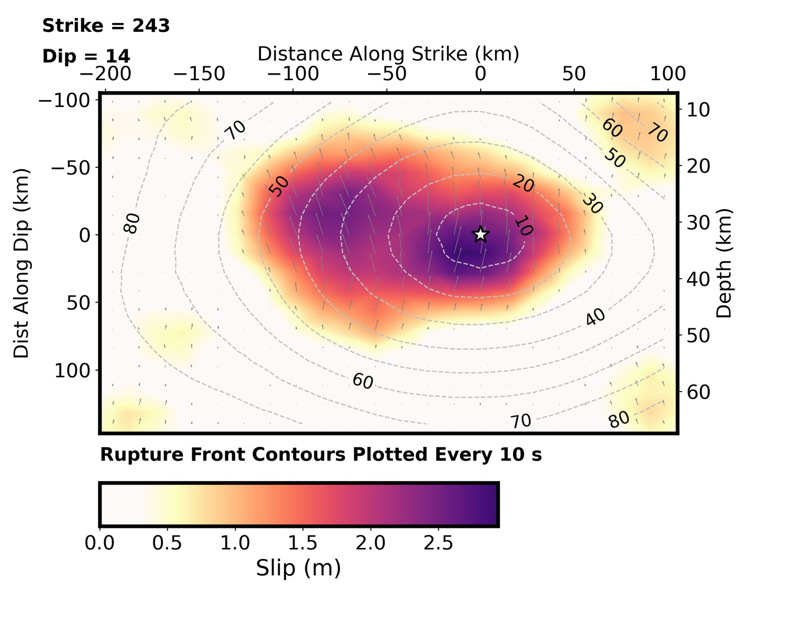

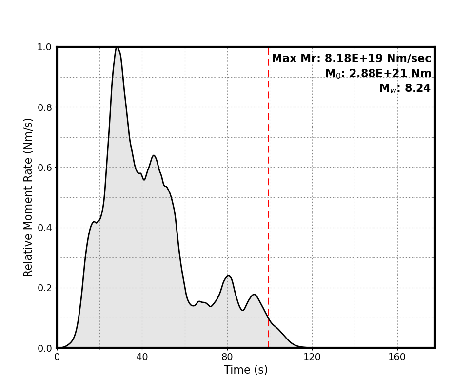 <!-- .element style="width:65%;" -->

Note:
Cross-section of slip distribution. The strike direction is indicated above each fault plane and the hypocenter location is denoted by a star. Slip amplitude is shown in color and the motion direction of the hanging wall relative to the footwall (rake angle) is indicated with arrows. Contours show the rupture initiation time in seconds.

Source time function, describing the rate of moment release with time after earthquake origin, relative to the peak moment rate (listed in the top right corner of the plot). The red dashed line represents the interpreted end of the event.
